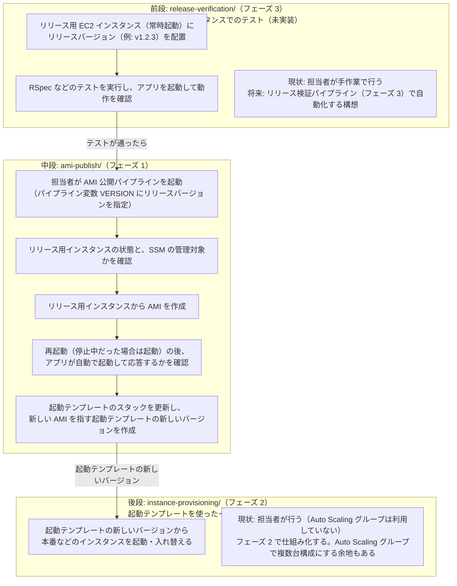

# EC2 のリリースの仕組み

Rails アプリのリリースバージョンを、常時起動のリリース用 EC2 インスタンスで確認し、AMI と起動テンプレートにして、本番などのインスタンスを構築するまでの仕組みと、その設計ドキュメント。

## 全体像

リリースの流れは 3 つの段階からなり、段階ごとにフォルダを分けて並べている。フェーズの番号は**開発の優先順位**で付けており、流れの順番とは一致しない。

| フェーズ | 段階 | フォルダ | 状態 |
|---|---|---|---|
| **フェーズ 1** | 中段: AMI と起動テンプレートの用意 | `ami-publish/` | 実装済み |
| フェーズ 2 | 後段: 起動テンプレートを使ったインスタンスの構築 | `instance-provisioning/` | 未実装 |
| フェーズ 3 | 前段: 作成元のインスタンスでのテスト（リリース検証の自動化） | `release-verification/` | 未実装 |

前段と後段は、フォルダと役割の説明だけを置いている。



| 段階 | フォルダ | 内容 | フェーズ・状態 | 担当 |
|---|---|---|---|---|
| 前段 | [`release-verification/`](./release-verification/README.md) | 作成元のリリース用インスタンスでのテスト（配置、RSpec、動作確認） | フェーズ 3。未実装（設計のみ） | 現状は担当者の手作業 |
| **中段** | [**`ami-publish/`**](./ami-publish/README.md) | **AMI と起動テンプレートの用意** | **フェーズ 1。実装済み** | **AMI 公開パイプライン** |
| 後段 | [`instance-provisioning/`](./instance-provisioning/README.md) | 起動テンプレートを使ったインスタンスの構築 | フェーズ 2。未実装 | 担当者 |

## フォルダ構成

```
docs/ec2/
├── README.md                          # このファイル（全体像とフォルダ構成）
├── CLAUDE.md                          # Claude Code 向けの作業ガイド
│
│  ── 段階ごとのフォルダ（リリースの流れの順）──
├── release-verification/              # 前段（フェーズ 3）: 作成元のリリース用インスタンスでのテスト（未実装。役割と設計への参照だけ）
├── ami-publish/                       # 中段（フェーズ 1）: AMI と起動テンプレートの用意（Go の仕組み生成ツールと Ruby の AMI 公開ツール）
├── instance-provisioning/             # 後段（フェーズ 2）: 起動テンプレートを使ったインスタンスの構築（未実装。役割と参照だけ）
│
│  ── リリースの仕組みの設計ドキュメント ──
├── ami-build-pipeline.md              # 全体の設計（リリース検証 → AMI 化 → 起動テンプレート）
├── ami-publish-development-plan.md    # 中段の開発計画（決定事項 D1〜D10 の正本）
├── ami-publish-environment-verification.md  # 中段の稼働環境での確認手順書
├── ami-publish-troubleshooting.md     # 中段のトラブルシューティング
├── ami-publish-release-instance-iam.md # 中段: リリース用インスタンス（AMI の作成元）の IAM ロールの許可と設定方法
├── ami-build-image-builder-options-memo.md       # メモ: EC2 Image Builder を使う案（未採用）
├── e2e-testing-on-codebuild-memo.md              # メモ: CodeBuild での E2E テストの構成（未決定）
├── launch-template-auto-scaling-readiness-memo.md # メモ: 起動テンプレートを後から Auto Scaling グループで使う余地
│
│  ── EC2 の運用に関する個別の設計ドキュメント ──
├── cfn-s3-userdata-provisioning.md    # CloudFormation + S3 + UserData によるファイル配備
├── letsencrypt-automation.md          # Let's Encrypt の証明書発行・初期設定の自動化
├── userdata-cfn-init-privileges.md    # 補足: UserData・cfn-init の実行権限
├── shell-environment-customization.md # 補足: bash プロンプト等のシェル環境の自動設定
├── ssm-session-manager-operations.md  # SSM Session Manager による EC2 運用
│
└── samples/
    └── nginx-passenger-rails/         # 学習用サンプル（nginx + Passenger + Rails の CloudFormation。リリースの仕組みとは無関係）
```

`*-memo.md` は、採用しなかった、または保留中の選択肢を忘れないための備忘録で、採用済みの設計ではない。
