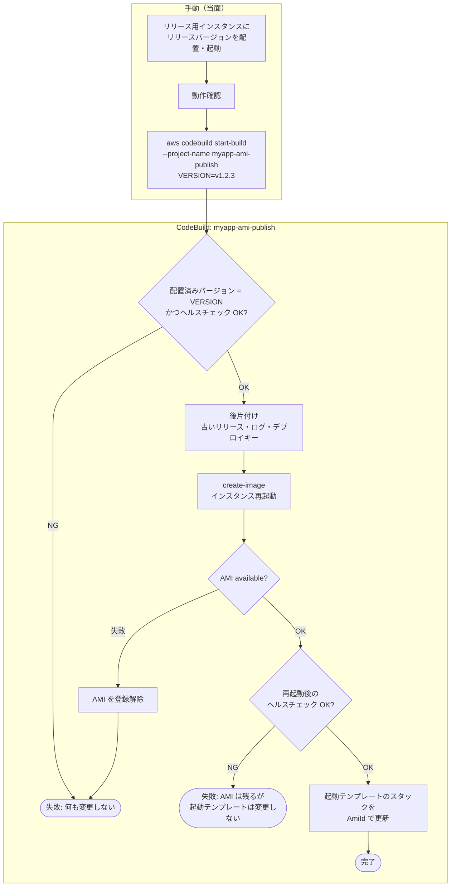
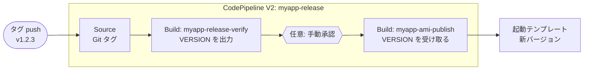
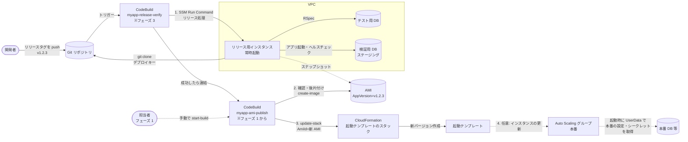
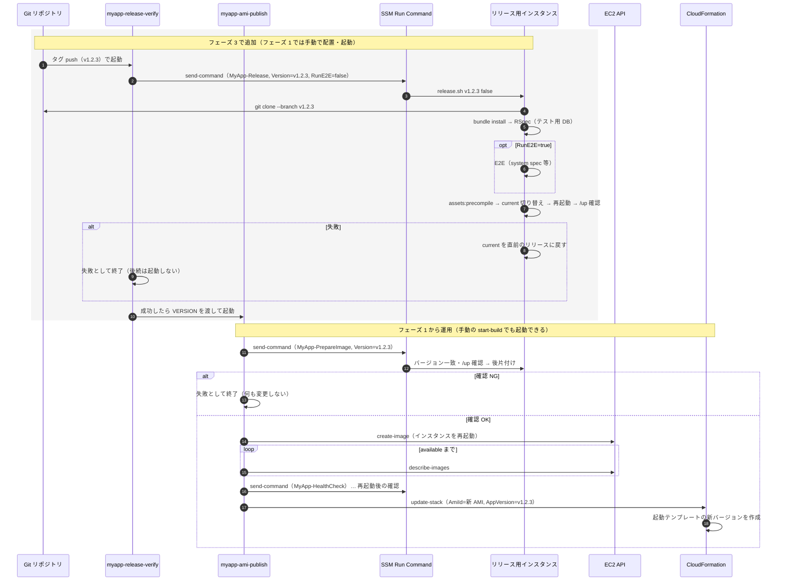
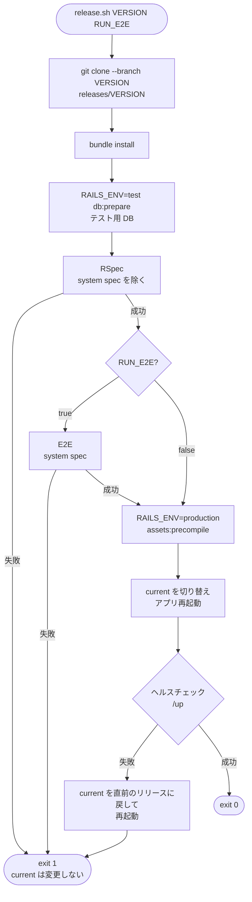

# Rails アプリのリリース検証・AMI 化・起動テンプレート更新の自動化

> スコープ: 常時起動している**リリース用インスタンス**で、リリースバージョンの Rails アプリをチェックアウトし、実環境で RSpec（任意で E2E）を通してアプリを起動したうえで、そのインスタンスから AMI を作成し、その AMI を使う起動テンプレートのバージョンを自動で用意するパイプラインの設計
>
> スコープ外: 本番 DB のマイグレーション、Auto Scaling グループの設計全般、複数アカウント・複数リージョンへの配布
>
> 関連: [EC2 へのファイル配備](./cfn-s3-userdata-provisioning.md) / [実行権限の補足](./userdata-cfn-init-privileges.md) / [SSM Session Manager による EC2 運用](./ssm-session-manager-operations.md) / [サンプル: nginx + Passenger + Rails](./samples/nginx-passenger-rails/README.md)

## 結論

**CodeBuild で実現できる。** CodeBuild はアプリのビルドやパッケージングを行わず、**オーケストレーター**としてだけ使う。

1. リリースタグの push を契機に CodeBuild が起動する。
2. CodeBuild が SSM Run Command でリリース用インスタンスにリリース処理を実行させる（チェックアウト → `bundle install` → RSpec → 任意で E2E → アセットのプリコンパイル → アプリの切り替え・再起動 → ヘルスチェック）。
3. 成功したら、CodeBuild が `ec2 create-image` でそのインスタンスから AMI を作成する。
4. CodeBuild が、起動テンプレートを管理する CloudFormation スタックを、新しい AMI ID をパラメータとして更新する。起動テンプレートに新しいバージョンが作られる（[起動テンプレートのスタック](#起動テンプレートのスタック)）。

インスタンスへの SSH も、CodeBuild の VPC 配置も不要である。ビルドとテストを同じインスタンスで行い、そのインスタンスは起動したまま次のリリースでも使い回す。

処理は 2 つの CodeBuild プロジェクトに分け、**AMI の作成と起動テンプレートの更新（手順 3・4）を先行して運用する**。リリース検証（手順 2）は後から追加して連結する（[段階的な導入](#段階的な導入)）。

| CodeBuild プロジェクト | 担当 | 導入時期 |
|---|---|---|
| `myapp-ami-publish` | AMI 作成前の最低限の確認 → 後片付け → AMI 作成 → 再起動後の確認 → 起動テンプレートのスタック更新 | **フェーズ 1（先行）** |
| `myapp-release-verify` | チェックアウト → RSpec → 任意で E2E → アプリの切り替え・起動 → ヘルスチェック | フェーズ 3（後から追加） |

この構成で特に注意すべき点は次のとおり。

| # | 注意点 | 対応 |
|---|---|---|
| 1 | **RSpec を本番 DB に向けない** | テスト用 DB を分ける。RSpec はテーブルを削除・切り詰めるため、本番や共用の DB に接続すると消える |
| 2 | **環境固有の設定・シークレットを AMI に焼き込まない** | DB 接続先や `RAILS_MASTER_KEY` は、起動テンプレートの UserData で起動時に Parameter Store / Secrets Manager から取得する |
| 3 | **AMI 作成時にインスタンスが再起動する** | リリース用インスタンスは本番トラフィックを受けない専用機にする。再起動後にアプリが自動で起動することも確認する |
| 4 | **テストの痕跡が AMI に残る** | AMI 作成前に後片付け（ログ、テストの成果物、デプロイキー等）を行う |
| 5 | **インスタンスを使い回すため、状態が蓄積する** | リリースごとのディレクトリ構成にして古いリリースを削除する。手作業の変更を禁止し、定期的にインスタンスを作り直す |
| 6 | **リリースは同時に 1 つだけ** | CodeBuild プロジェクトの同時実行数を 1 に制限する |

## 段階的な導入

### フェーズの分け方

フェーズの番号は開発の優先順位で付けている。フェーズ 1 が AMI と起動テンプレートの用意（中段）、フェーズ 2 が起動テンプレートを使ったインスタンスの構築（後段。このドキュメントの対象外）、フェーズ 3 がリリース検証の自動化（前段）。全体像は [README](./README.md#全体像)。

| フェーズ | 運用するもの | リリース用インスタンスへのアプリ配置 | AMI 作成の起動 |
|---|---|---|---|
| **フェーズ 1（先行）** | `myapp-ami-publish` のみ | 当面は手動（または既存の手順）で、チェックアウト・起動・動作確認まで済ませる | 担当者が手動で `start-build`（`VERSION` を指定） |
| フェーズ 3 | `myapp-release-verify` を追加し、`myapp-ami-publish` と連結 | `myapp-release-verify` が自動で行う | タグ push → 検証が成功したら自動で AMI 作成へ |

`myapp-ami-publish` は、フェーズ 1 でもフェーズ 3 でも**同じものをそのまま使う**。フェーズ 3 では前段を追加して連結するだけで、AMI 作成側を作り直す必要はない。

### フェーズ 1 の流れ



フェーズ 1 では自動テストが入らないため、`myapp-ami-publish` の冒頭で**最低限の確認**を行う。

- **配置済みバージョンの一致**: `current` が指すリリース（`/var/www/myapp/releases/<version>`）が、指定した `VERSION` と一致するか。取り違えたバージョンの AMI を作らないため。手動の配置でも[ディレクトリ構成](#ディレクトリ構成)に従う必要がある。
- **ヘルスチェック**: `http://localhost/up` が応答するか。
- AMI には `Verified` タグを付け、フェーズ 1 の AMI（`manual`）とフェーズ 3 の AMI（`automated`）を区別できるようにする。

### フェーズ 3 の連結



| 連結方法 | 内容 | 評価 |
|---|---|---|
| **CodePipeline V2 に 2 つの CodeBuild アクションを並べる** | Git タグをトリガーにし、`myapp-release-verify` が `exported-variables` で出力した `VERSION` を、`myapp-ami-publish` の環境変数に `#{Verify.VERSION}` で渡す。間に手動承認を挟める | **推奨**。バージョンの受け渡し、実行履歴、承認が標準機能で揃う |
| EventBridge で連結 | `myapp-release-verify` の成功イベント（CodeBuild Build State Change）をルールで拾い、`myapp-ami-publish` を起動。バージョンは SSM パラメータ（例: `/myapp/release/verified-version`）経由で渡す | CodePipeline を使わない場合。バージョンの受け渡しを自作する必要がある |

## 全体像



## 処理の流れ（フェーズ 3 完了後）



## リリース用インスタンス上の処理

### ディレクトリ構成

インスタンスを使い回すため、Capistrano と同様にリリースごとのディレクトリを作り、`current` のシンボリックリンクで切り替える。失敗時は直前のリリースにリンクを戻すだけで元に戻せる。

| パス | 内容 |
|---|---|
| `/var/www/myapp/releases/<version>/` | リリースごとのソース（`git clone --depth 1 --branch <version>`） |
| `/var/www/myapp/current` | 稼働中のリリースへのシンボリックリンク。nginx / Passenger はここを参照する |
| `/var/www/myapp/shared/bundle/` | gem のインストール先（リリース間で共有し、`bundle install` を速くする） |
| `/var/www/myapp/shared/log/` など | リリース間で共有するディレクトリ |

### リリーススクリプトの流れ



### スクリプト一覧

インスタンスの初期構築（UserData / cfn-init）で `/opt/release/` に配置しておく。SSM Run Command から root で実行され、アプリの処理は専用ユーザーに権限を下げて実行する（[実行権限の補足](./userdata-cfn-init-privileges.md)）。

| スクリプト | 呼び出し元 | フェーズ | 内容 |
|---|---|---|---|
| `prepare-image.sh <version>` | `myapp-ami-publish` | **1** | 配置済みバージョンの一致とヘルスチェックの確認、AMI 作成前の後片付け |
| `healthcheck.sh` | `myapp-ami-publish` | **1** | `/up` の応答確認（AMI 作成の再起動後に使う） |
| `release.sh <version> <run_e2e>` | `myapp-release-verify` | 3 | チェックアウト、RSpec、任意で E2E、切り替え・起動、ヘルスチェック |

### スクリプト例: prepare-image.sh / healthcheck.sh（フェーズ 1）

```bash
#!/bin/bash
# /opt/release/healthcheck.sh
set -euo pipefail
for i in $(seq 1 30); do
  curl -fsS http://localhost/up >/dev/null && exit 0
  sleep 5
done
echo "health check failed"; exit 1
```

```bash
#!/bin/bash
# /opt/release/prepare-image.sh <version>
set -euo pipefail

VERSION="$1"
APP_USER=rails
BASE=/var/www/myapp
KEEP_RELEASES=3

[[ "$VERSION" =~ ^v[0-9]+\.[0-9]+\.[0-9]+$ ]] || { echo "invalid version: $VERSION"; exit 1; }

# --- 最低限の確認: 配置済みバージョンが一致し、アプリが応答している ---
CURRENT=$(basename "$(readlink -f "$BASE/current")")
[ "$CURRENT" = "$VERSION" ] || { echo "deployed version is $CURRENT, expected $VERSION"; exit 1; }
/opt/release/healthcheck.sh

# --- AMI 作成前の後片付け ---
ls -1dt "$BASE"/releases/* | tail -n +$((KEEP_RELEASES + 1)) | xargs -r rm -rf
find "$BASE/shared/log" -type f -name '*.log' -exec truncate -s 0 {} +
rm -rf "$BASE/shared/tmp/cache" "$BASE/current/coverage" "$BASE/current/tmp/capybara"
rm -f "/home/$APP_USER/.ssh/id_deploy"
rm -f "/home/$APP_USER/.bash_history" /root/.bash_history
```

フェーズ 1 で手動配置する場合も、`/var/www/myapp/releases/<version>` と `current` のディレクトリ構成に従う。後片付けの対象は、手動の配置手順で作られるもの（手元で使った鍵、作業ファイルなど）に合わせて追加する。

### スクリプト例: release.sh（フェーズ 3）

```bash
#!/bin/bash
# /opt/release/release.sh <version> <run_e2e: true|false>
set -euo pipefail

VERSION="$1"
RUN_E2E="${2:-false}"
APP_USER=rails
BASE=/var/www/myapp
REL="$BASE/releases/$VERSION"
REPO=git@github.com:example-org/myapp.git

# バージョン文字列の検証（コマンドインジェクション対策）
[[ "$VERSION" =~ ^v[0-9]+\.[0-9]+\.[0-9]+$ ]] || { echo "invalid version: $VERSION"; exit 1; }

as_app() { runuser -l "$APP_USER" -c "cd '$REL' && $*"; }
PREV=$(readlink -f "$BASE/current" 2>/dev/null || true)

# --- デプロイキーを一時的に配置（Secrets Manager から取得） ---
install -d -m 700 -o "$APP_USER" -g "$APP_USER" "/home/$APP_USER/.ssh"
aws secretsmanager get-secret-value --secret-id myapp/deploy-key \
  --query SecretString --output text > "/home/$APP_USER/.ssh/id_deploy"
chown "$APP_USER":"$APP_USER" "/home/$APP_USER/.ssh/id_deploy"
chmod 600 "/home/$APP_USER/.ssh/id_deploy"
trap 'rm -f /home/'"$APP_USER"'/.ssh/id_deploy' EXIT

# --- チェックアウト ---
rm -rf "$REL"
runuser -l "$APP_USER" -c "GIT_SSH_COMMAND='ssh -i ~/.ssh/id_deploy -o StrictHostKeyChecking=accept-new' \
  git clone --depth 1 --branch '$VERSION' '$REPO' '$REL'"
for d in log tmp storage; do
  rm -rf "${REL:?}/$d"; ln -s "$BASE/shared/$d" "$REL/$d"
done

# --- 依存関係 ---
as_app "bundle config set --local path '$BASE/shared/bundle' && bundle install"

# --- RSpec（テスト用 DB） ---
as_app "RAILS_ENV=test bin/rails db:prepare"
as_app "RAILS_ENV=test bundle exec rspec --exclude-pattern 'spec/system/**/*_spec.rb'"

# --- 任意: E2E ---
if [ "$RUN_E2E" = "true" ]; then
  as_app "RAILS_ENV=test bundle exec rspec spec/system"
fi

# --- 本番用のアセット ---
as_app "RAILS_ENV=production SECRET_KEY_BASE_DUMMY=1 bin/rails assets:precompile"

# --- 切り替えと再起動 ---
ln -sfn "$REL" "$BASE/current"
passenger-config restart-app "$BASE/current" --ignore-app-not-running

# --- ヘルスチェック（失敗したら直前のリリースに戻す） ---
healthy=false
for i in $(seq 1 30); do
  curl -fsS http://localhost/up >/dev/null && { healthy=true; break; }
  sleep 5
done
if [ "$healthy" != true ]; then
  if [ -n "$PREV" ]; then
    ln -sfn "$PREV" "$BASE/current"
    passenger-config restart-app "$BASE/current" --ignore-app-not-running
  fi
  echo "health check failed"; exit 1
fi
```

AMI 作成前の後片付けは `release.sh` では行わず、`myapp-ami-publish` が `prepare-image.sh` で行う（フェーズ 1 と共通の処理にするため）。

補足:

- **RSpec と system spec を分けている**のは、E2E を任意にするため。system spec をブラウザで動かす場合は、インスタンスに Chrome（headless）が必要になる。
- `SECRET_KEY_BASE_DUMMY=1` は Rails 7.1 以降で、シークレットなしにアセットをプリコンパイルするための指定。本番の `RAILS_MASTER_KEY` をリリース用インスタンスに置かずに済む。
- nginx / Passenger は `root /var/www/myapp/current/public;` を参照する設定にしておく（[サンプル](./samples/nginx-passenger-rails/README.md)の nginx 設定のパスを変更したもの）。
- **本番 DB のマイグレーションはこのスクリプトでは行わない。** AMI の作成と本番へのマイグレーションは別の判断・タイミングで行う（マイグレーションは本番の入れ替え前に、後方互換を保って別途実行する）。

### SSM ドキュメントとして定義する

CodeBuild から任意のシェルコマンドを送るのではなく、パラメータ付きのカスタム SSM ドキュメントを用意し、CodeBuild にはそのドキュメントの実行だけを許可する。パラメータの `allowedPattern` で不正な値を拒否できる。

```yaml
  # --- フェーズ 1 ---
  PrepareImageDocument:
    Type: AWS::SSM::Document
    Properties:
      Name: MyApp-PrepareImage
      DocumentType: Command
      Content:
        schemaVersion: "2.2"
        description: Verify deployed version and clean up before creating an AMI
        parameters:
          Version:
            type: String
            allowedPattern: ^v[0-9]+\.[0-9]+\.[0-9]+$
        mainSteps:
          - action: aws:runShellScript
            name: prepare
            inputs:
              timeoutSeconds: "600"
              runCommand:
                - /opt/release/prepare-image.sh "{{ Version }}"

  HealthCheckDocument:
    Type: AWS::SSM::Document
    Properties:
      Name: MyApp-HealthCheck
      DocumentType: Command
      Content:
        schemaVersion: "2.2"
        description: Check that myapp responds on /up
        mainSteps:
          - action: aws:runShellScript
            name: healthcheck
            inputs:
              timeoutSeconds: "300"
              runCommand:
                - /opt/release/healthcheck.sh

  # --- フェーズ 3 ---
  ReleaseDocument:
    Type: AWS::SSM::Document
    Properties:
      Name: MyApp-Release
      DocumentType: Command
      Content:
        schemaVersion: "2.2"
        description: Checkout, test and start a release of myapp
        parameters:
          Version:
            type: String
            allowedPattern: ^v[0-9]+\.[0-9]+\.[0-9]+$
          RunE2E:
            type: String
            default: "false"
            allowedValues: ["true", "false"]
        mainSteps:
          - action: aws:runShellScript
            name: release
            inputs:
              timeoutSeconds: "7200"
              runCommand:
                - /opt/release/release.sh "{{ Version }}" "{{ RunE2E }}"
```

- `timeoutSeconds` はテスト時間に合わせる（`AWS-RunShellScript` の既定は 3600 秒）。
- Run Command の API で取得できる出力は先頭 24,000 文字までなので、RSpec のログ全体は `send-command` の `--cloud-watch-output-config` で CloudWatch Logs に送る。

## CodeBuild

### プロジェクトとトリガー

| プロジェクト | フェーズ | トリガー | ソース |
|---|---|---|---|
| `myapp-ami-publish` | **1** | フェーズ 1: 手動 `aws codebuild start-build --project-name myapp-ami-publish --environment-variables-override name=VERSION,value=v1.2.3`<br>フェーズ 3: CodePipeline から（`VERSION` を受け取る） | なし（`NO_SOURCE`、buildspec はプロジェクトに埋め込む） |
| `myapp-release-verify` | 3 | CodePipeline V2 の Git タグトリガー（`v*`） | Git リポジトリ（タグ名の取得にだけ使う） |

- どちらのプロジェクトも**同時実行数（`ConcurrentBuildLimit`）を 1 に設定**し、リリース処理・AMI 作成が重ならないようにする。
- どちらもアプリのビルドは行わず、SSM Run Command と AWS API を呼ぶだけなので、最小のコンピューティングタイプで足りる。

### buildspec: myapp-ami-publish（フェーズ 1）

```yaml
version: 0.2
env:
  variables:
    INSTANCE_ID: i-0123456789abcdef0
    LT_STACK: myapp-launch-template
    VERIFIED: manual            # フェーズ 3 の CodePipeline からは automated を渡す
phases:
  build:
    commands:
      - |
        [[ "$VERSION" =~ ^v[0-9]+\.[0-9]+\.[0-9]+$ ]] || { echo "VERSION is required (e.g. v1.2.3)"; exit 1; }
        echo "publish: $VERSION (verified: $VERIFIED)"

        # SSM コマンドを実行し、完了を待って成否を返す
        run_document() {
          local id
          id=$(aws ssm send-command --instance-ids "$INSTANCE_ID" "$@" \
            --cloud-watch-output-config "CloudWatchOutputEnabled=true,CloudWatchLogGroupName=/myapp/release" \
            --query Command.CommandId --output text)
          while :; do
            S=$(aws ssm get-command-invocation --command-id "$id" --instance-id "$INSTANCE_ID" \
              --query Status --output text 2>/dev/null || echo Pending)
            case "$S" in
              Success) return 0 ;;
              Pending|InProgress|Delayed) sleep 15 ;;
              *) echo "command $id failed: $S"; return 1 ;;
            esac
          done
        }

        # 1. 最低限の確認（配置済みバージョンの一致・ヘルスチェック）と後片付け
        run_document --document-name MyApp-PrepareImage --parameters "Version=$VERSION"

        # 2. AMI 作成（既定でインスタンスを再起動し、ファイルシステムの整合性を保つ）
        TAGS="{Key=App,Value=myapp},{Key=AppVersion,Value=$VERSION},{Key=Verified,Value=$VERIFIED}"
        AMI_ID=$(aws ec2 create-image --instance-id "$INSTANCE_ID" \
          --name "myapp-$VERSION-$(date +%Y%m%d%H%M%S)" \
          --tag-specifications "ResourceType=image,Tags=[$TAGS]" "ResourceType=snapshot,Tags=[$TAGS]" \
          --query ImageId --output text)
        while :; do
          STATE=$(aws ec2 describe-images --image-ids "$AMI_ID" --query 'Images[0].State' --output text)
          case "$STATE" in
            available) break ;;
            pending) sleep 30 ;;
            *) echo "AMI $AMI_ID: $STATE"; aws ec2 deregister-image --image-id "$AMI_ID"; exit 1 ;;
          esac
        done

        # 3. 再起動後もアプリが自動起動しているか確認
        until [ "$(aws ssm describe-instance-information \
                  --filters "Key=InstanceIds,Values=$INSTANCE_ID" \
                  --query 'InstanceInformationList[0].PingStatus' --output text)" = Online ]; do
          sleep 10
        done
        run_document --document-name MyApp-HealthCheck

        # 4. 起動テンプレートのスタックを新しい AMI で更新（テンプレート本体は変更しない）
        aws cloudformation update-stack --stack-name "$LT_STACK" \
          --use-previous-template \
          --parameters \
            ParameterKey=AmiId,ParameterValue="$AMI_ID" \
            ParameterKey=AppVersion,ParameterValue="$VERSION" \
          --capabilities CAPABILITY_IAM
        aws cloudformation wait stack-update-complete --stack-name "$LT_STACK"
        LT_VERSION=$(aws cloudformation describe-stacks --stack-name "$LT_STACK" \
          --query "Stacks[0].Outputs[?OutputKey=='LaunchTemplateVersion'].OutputValue" --output text)
        echo "AMI: $AMI_ID / launch template version: $LT_VERSION"
```

### buildspec: myapp-release-verify（フェーズ 3）

```yaml
version: 0.2
env:
  variables:
    INSTANCE_ID: i-0123456789abcdef0
    RUN_E2E: "false"
  exported-variables:
    - VERSION                   # 後段の myapp-ami-publish に #{Verify.VERSION} で渡す
phases:
  build:
    commands:
      - |
        VERSION="${VERSION:-$(git describe --tags --exact-match)}"
        [[ "$VERSION" =~ ^v[0-9]+\.[0-9]+\.[0-9]+$ ]] || { echo "invalid version: $VERSION"; exit 1; }
        echo "verify: $VERSION (e2e: $RUN_E2E)"

        CMD_ID=$(aws ssm send-command --instance-ids "$INSTANCE_ID" \
          --document-name MyApp-Release \
          --parameters "Version=$VERSION,RunE2E=$RUN_E2E" \
          --cloud-watch-output-config "CloudWatchOutputEnabled=true,CloudWatchLogGroupName=/myapp/release" \
          --query Command.CommandId --output text)
        while :; do
          S=$(aws ssm get-command-invocation --command-id "$CMD_ID" --instance-id "$INSTANCE_ID" \
            --query Status --output text 2>/dev/null || echo Pending)
          case "$S" in
            Success) break ;;
            Pending|InProgress|Delayed) sleep 15 ;;
            *) echo "release failed: $S"; exit 1 ;;
          esac
        done
```

- タグ名を `git describe` で取るため、CodePipeline のソースアクションは Git のメタデータを含む形式（CodeConnections の「完全クローン」= `CODEBUILD_CLONE_REF`）で出力する。
- CodePipeline では、`myapp-ami-publish` のアクションに環境変数 `VERSION=#{Verify.VERSION}`、`VERIFIED=automated` を渡す（`Verify` は検証アクションの変数の名前空間）。

### buildspec の補足

- `aws ssm wait command-executed` や `aws ec2 wait image-available` といった待機用のコマンドはタイムアウトが短い（それぞれ約 100 秒、約 10 分）ため、自前でループしている。CodeBuild のビルドタイムアウトは、テストと AMI 作成の合計時間に合わせて延ばす（既定 60 分）。
- 手順 3 の再起動後の確認で失敗した場合、AMI は作成済みだが起動テンプレートは更新しない。その AMI は再起動後にアプリが起動しない状態なので、調査後に登録解除する。
- 手順 4 は `--use-previous-template` で**テンプレート本体は変えず、パラメータだけを変更**する。テンプレートの変更（インスタンスタイプや UserData の修正など）は、インフラ側のレビュー・デプロイ手順で別途行う。このため CodeBuild はテンプレートファイルを持つ必要がない。
- スタックにパラメータが増えた場合は、`ParameterKey=<名前>,UsePreviousValue=true` を追加して既存の値を引き継ぐ（指定しないパラメータは既定値に戻る）。
- `aws cloudformation wait stack-update-complete` は、スタックの更新が失敗してロールバックした場合にエラーで終了するため、CodeBuild も失敗になる。

## 起動テンプレートのスタック

### なぜ AMI 作成と 1 つのテンプレートにしないのか

CloudFormation には、既存のインスタンスから AMI を作るリソースがない。Lambda を使うカスタムリソースで `CreateImage` を呼べば 1 つのテンプレートにまとめられるが、次の理由で採用しない。

| 問題 | 内容 |
|---|---|
| 待ち時間 | AMI が `available` になるまで待つ必要があるが、Lambda は最大 15 分で終了する。超える場合は非同期の待ち合わせを自作する必要がある |
| 削除時の挙動 | AMI を置き換えると CloudFormation は古いカスタムリソースを削除する。そこで AMI を消すとロールバック先がなくなるため、残す処理が必要 |
| 処理全体は結局収まらない | RSpec などのリリース処理は CloudFormation の外で行うしかなく、CodeBuild は結局必要 |
| 考え方の不一致 | CloudFormation は「あるべき状態」の宣言で、「リリースごとにその時点のインスタンスを撮る」一回限りの操作とは相性が悪い |

そこで、**AMI の作成は CodeBuild、起動テンプレートは CloudFormation** と役割を分け、AMI ID をスタックのパラメータで受け渡す。

| 利点 | 内容 |
|---|---|
| ドリフトが起きない | CLI で起動テンプレートを直接更新すると CloudFormation の定義と実態がずれるが、この構成ではすべての変更がスタック経由になる |
| 設定のレビュー | UserData（本番設定・シークレットの取得）、IAM、IMDSv2 などの起動設定をテンプレートで管理・レビューできる |
| 履歴とロールバック | スタックのイベントとパラメータに、いつどの AMI に切り替えたかが残る。前の `AmiId` でスタックを更新すれば戻せる |

### テンプレート例

```yaml
AWSTemplateFormatVersion: "2010-09-09"
Description: myapp launch template (AMI is supplied by the release pipeline)

Parameters:
  AmiId:
    Type: AWS::EC2::Image::Id
    Description: リリースパイプラインが作成した AMI
  AppVersion:
    Type: String
    Description: AMI に含まれるアプリのバージョン（記録用）
  InstanceType:
    Type: String
    Default: t3.small
  SecurityGroupId:
    Type: AWS::EC2::SecurityGroup::Id

Resources:
  AppInstanceRole:
    Type: AWS::IAM::Role
    Properties:
      AssumeRolePolicyDocument:
        Version: "2012-10-17"
        Statement:
          - Effect: Allow
            Principal: { Service: ec2.amazonaws.com }
            Action: sts:AssumeRole
      ManagedPolicyArns:
        - arn:aws:iam::aws:policy/AmazonSSMManagedInstanceCore
      Policies:
        - PolicyName: app-runtime-config
          PolicyDocument:
            Version: "2012-10-17"
            Statement:
              - Effect: Allow
                Action: secretsmanager:GetSecretValue
                Resource: !Sub arn:aws:secretsmanager:${AWS::Region}:${AWS::AccountId}:secret:myapp/production/*

  AppInstanceProfile:
    Type: AWS::IAM::InstanceProfile
    Properties:
      Roles: [!Ref AppInstanceRole]

  LaunchTemplate:
    Type: AWS::EC2::LaunchTemplate
    Properties:
      LaunchTemplateName: myapp
      VersionDescription: !Sub myapp ${AppVersion}
      LaunchTemplateData:
        ImageId: !Ref AmiId
        InstanceType: !Ref InstanceType
        IamInstanceProfile: { Arn: !GetAtt AppInstanceProfile.Arn }
        SecurityGroupIds: [!Ref SecurityGroupId]
        MetadataOptions:
          HttpTokens: required
        TagSpecifications:
          - ResourceType: instance
            Tags:
              - Key: AppVersion
                Value: !Ref AppVersion
        UserData:
          Fn::Base64: !Sub |
            #!/bin/bash
            set -euo pipefail
            # 本番の設定・シークレットを起動時に取得して Passenger に渡す（AMI には含めない）
            SECRET=$(aws secretsmanager get-secret-value --secret-id myapp/production/env \
              --region ${AWS::Region} --query SecretString --output text)
            echo "$SECRET" | python3 -c 'import json,sys; [print(f"passenger_env_var {k} \"{v}\";") for k,v in json.load(sys.stdin).items()]' \
              > /etc/nginx/snippets/myapp-env.conf
            chmod 600 /etc/nginx/snippets/myapp-env.conf
            systemctl restart nginx

Outputs:
  LaunchTemplateId:
    Value: !Ref LaunchTemplate
  LaunchTemplateVersion:
    Value: !GetAtt LaunchTemplate.LatestVersionNumber
```

- `AmiId` / `AppVersion` が変わると `LaunchTemplateData` が変わり、CloudFormation は起動テンプレートに**新しいバージョン**を作る。
- 利用側（Auto Scaling グループなど）は、**`LatestVersionNumber`（出力の `LaunchTemplateVersion`）を明示的に参照する**。CloudFormation が作った新バージョンが起動テンプレートの「デフォルト」になるかどうかに依存しないようにするため（この挙動は要確認）。
- UserData の例は、Secrets Manager の JSON を nginx の `passenger_env_var` に変換して読み込ませる形。nginx のサイト設定側で `include /etc/nginx/snippets/myapp-env.conf;` しておく。AMI 内のアプリは起動直後に DB へ接続しようとするため、設定の配置後に nginx（Passenger）を再起動している。

### Auto Scaling グループを同じスタックに置く場合

同じスタックに Auto Scaling グループを置き、`LatestVersionNumber` を参照して `UpdatePolicy` を付けると、**スタック更新（= リリースパイプラインの手順 4）で本番インスタンスのローリング入れ替えまで行われる**。

```yaml
  AutoScalingGroup:
    Type: AWS::AutoScaling::AutoScalingGroup
    UpdatePolicy:
      AutoScalingRollingUpdate:
        MinInstancesInService: 1
        MaxBatchSize: 1
        PauseTime: PT10M
        WaitOnResourceSignals: true
    Properties:
      LaunchTemplate:
        LaunchTemplateId: !Ref LaunchTemplate
        Version: !GetAtt LaunchTemplate.LatestVersionNumber
      # MinSize / MaxSize / VPCZoneIdentifier / TargetGroupARNs など
```

- `WaitOnResourceSignals: true` の場合、新しいインスタンスの UserData の最後で `cfn-signal` を送る必要がある（[完了判定](./cfn-s3-userdata-provisioning.md#3-起動処理の完了判定creationpolicy--cfn-signal)）。シグナルが来なければ更新は失敗し、元の起動テンプレートのバージョンに戻る。
- **AMI の作成と本番への反映を分けたい**（リリース判定を人が行う）場合は、起動テンプレートのスタックと Auto Scaling グループのスタックを分ける。パイプラインは起動テンプレートのスタックだけを更新し、Auto Scaling グループのスタックは承認後に `LaunchTemplateVersion` を渡して更新する。

### 使わなかった代替: SSM パラメータ参照

起動テンプレートの `ImageId` を `resolve:ssm:/myapp/ami/latest` にして、パイプラインは SSM パラメータを書き換えるだけにする構成もある。ただし起動テンプレート自体は変化しないため、どの時点でどの AMI が使われていたかは SSM パラメータの履歴を見る必要があり、Auto Scaling グループのローリング更新のきっかけにもならない。この用途ではスタックのパラメータで渡す方がわかりやすい。

## IAM 権限

CodeBuild のサービスロール:

| 権限 | 対象 |
|---|---|
| `ssm:SendCommand` | リリース用インスタンスと、`MyApp-Release` / `AWS-RunShellScript` ドキュメント |
| `ssm:GetCommandInvocation`、`ssm:DescribeInstanceInformation` | `*` |
| `ec2:CreateImage`、`ec2:CreateTags` | リリース用インスタンス、AMI、スナップショット |
| `ec2:DescribeImages`、`ec2:DeregisterImage` | AMI |
| `cloudformation:UpdateStack`、`cloudformation:DescribeStacks` | 起動テンプレートのスタック |
| `iam:PassRole` | スタックのサービスロール（下記） |

起動テンプレートのスタックには **CloudFormation のサービスロール**を設定し、起動テンプレートや IAM ロールの操作権限はサービスロールに持たせる。CodeBuild に `ec2:CreateLaunchTemplateVersion` や IAM の権限を直接与えずに済む。サービスロールはスタック作成時（または `update-stack --role-arn`）に指定すると、以降の更新でも使われる。

リリース用インスタンスのロール:

| 権限 | 用途 |
|---|---|
| `AmazonSSMManagedInstanceCore` | SSM Run Command の受信 |
| `secretsmanager:GetSecretValue`（`myapp/deploy-key`） | Git のデプロイキー |
| `ssm:GetParameter` 等（ステージングの設定） | 検証用 DB の接続先など |
| `logs:CreateLogStream`、`logs:PutLogEvents`（`/myapp/release`） | Run Command の出力 |

`ssm:SendCommand` を持つ主体は、インスタンス上で root としてコマンドを実行できる（[実行権限の補足](./userdata-cfn-init-privileges.md#userdata-を変更できる人は-root-でコードを実行できる)）。CodeBuild には任意のコマンドを実行できる `AWS-RunShellScript` を許可せず、カスタムドキュメントだけに絞れるとより安全である（上記の例では再起動後の確認に使っているため、これもカスタムドキュメントにすればよい）。

## DB と設定の分離

リリース用インスタンスで作った AMI は、本番の Auto Scaling グループなど**別の環境**で起動される。環境に依存するものを AMI に含めない。

| 対象 | リリース用インスタンス | AMI から起動した本番インスタンス |
|---|---|---|
| RSpec 用 DB | テスト専用 DB（別の RDS、またはローカルの DB サーバー） | 使わない |
| アプリ起動確認用 DB | ステージング / 検証用 DB | — |
| 本番 DB | **接続しない** | 起動時に UserData で接続先を取得 |
| `RAILS_MASTER_KEY` / `SECRET_KEY_BASE` | 不要（`SECRET_KEY_BASE_DUMMY` でプリコンパイル） | 起動時に Secrets Manager から取得し、`passenger_env_var` 等で渡す |
| Git のデプロイキー | リリース処理中だけ配置し、終了時に削除 | 含まない |

テスト用 DB をリリース用インスタンス上のローカル DB サーバー（MySQL / PostgreSQL）にすると手軽だが、**DB サーバーとテストデータも AMI に含まれ、本番インスタンスで不要な DB サーバーが起動する**。テスト用 DB は小さな RDS インスタンスなどに分けるのが望ましい。ローカルにする場合は、後片付けで DB サービスを無効化し、データを削除する処理が必要になる。

## E2E（任意）

| 方法 | 内容 | 前提 |
|---|---|---|
| system spec をインスタンス上で実行 | Capybara + headless Chrome。`RUN_E2E=true` で `spec/system` を実行 | インスタンスに Chrome と対応するドライバが必要（AMI に含まれる） |
| 外部からリリース用インスタンスに対して実行 | CodeBuild（VPC 内に配置）から Playwright 等で `http://<プライベート IP>/` を操作 | CodeBuild の VPC 配置、セキュリティグループで CodeBuild から 80 番を許可 |

インスタンス上で実行すると構成は単純だが、Chrome が AMI（本番）に含まれる。外部から実行すると AMI はきれいに保てるが、CodeBuild の VPC 配置が必要になる。E2E を常用するようになったら後者を検討する。

## 起動テンプレート更新後の反映

起動テンプレートのデフォルトバージョンが変わっても、**稼働中の本番インスタンスは置き換わらない**。

| 利用側 | 反映 |
|---|---|
| 同じスタックの Auto Scaling グループ（`LatestVersionNumber` 参照 + `UpdatePolicy`） | パイプラインのスタック更新でローリング入れ替えまで行われる（[同じスタックに置く場合](#auto-scaling-グループを同じスタックに置く場合)） |
| 別スタックの Auto Scaling グループ | 承認後に、起動テンプレートのスタックの出力 `LaunchTemplateVersion` を渡して Auto Scaling グループのスタックを更新する |
| スタック外で管理している Auto Scaling グループ（バージョンに `$Default` / `$Latest` を指定） | 以降に起動するインスタンスから新 AMI を使う。既存インスタンスを入れ替えるには `aws autoscaling start-instance-refresh` を実行する |

## 運用上の注意

- **古い AMI の整理**: リリースのたびに AMI と EBS スナップショットが増える。`App=myapp` タグで古いものを探し、最新 N 世代を残して登録解除・スナップショット削除を定期実行する（起動テンプレートの過去バージョンやロールバック先で使う AMI は残す）。
- **インスタンスの状態の蓄積**: 同じインスタンスを使い回すため、OS パッケージ、gem、手作業の変更が蓄積し、AMI の再現性が下がる。Session Manager での手作業を禁止し（[Session Manager の IAM 制御](./ssm-session-manager-operations.md#4-利用者側-iam-権限とクライアント)）、定期的に CloudFormation でリリース用インスタンスを作り直す。OS の更新も、リリース処理とは別の定期ジョブ（Patch Manager 等）で行う。
- **ロールバック**: 本番で問題が起きた場合は、起動テンプレートのスタックを前の `AmiId` / `AppVersion` で更新し（新しいバージョンとして前の AMI が設定される）、インスタンスを入れ替える。起動テンプレートを CLI で直接戻すとスタックとの差分になるため行わない。
- **所要時間の目安**: リリース処理（`bundle install`、RSpec）に加え、AMI 作成（再起動とスナップショット作成）に数分〜十数分かかる。

## 代替案

| 方式 | 概要 | 今回の要件との関係 |
|---|---|---|
| SSM Automation | CodeBuild の代わりに SSM Automation ランブックで、`aws:runCommand` → `aws:createImage` → `aws:executeAwsApi`（起動テンプレートのスタック更新）を順に実行する | CodeBuild のビルド時間が不要になり、実行履歴が Systems Manager に残る。トリガー（タグ push）は EventBridge 等で別途用意する |
| EC2 Image Builder | 毎回新しいインスタンスを起動してビルド・テストし、AMI 作成後にその AMI から起動した別インスタンスでテストし、起動テンプレートを自動更新する | **インスタンスを使い回す要件とは合わない**。ただし、AMI の再現性、後片付け、AMI 自体の検証、古い AMI の整理を標準機能で賄えるため、状態の蓄積が問題になってきたら移行を検討する |

## チェックリスト

- [ ] リリース用インスタンスは本番トラフィックを受けない専用機である（AMI 作成時に再起動する）
- [ ] RSpec はテスト専用の DB に接続し、本番・共用の DB に接続しない
- [ ] 本番の設定・シークレットを AMI に含めず、起動時に UserData で取得している
- [ ] リリースごとのディレクトリ構成と `current` の切り替えで、失敗時に戻せる
- [ ] ヘルスチェック失敗時に直前のリリースに戻している
- [ ] AMI 作成前に、デプロイキー・ログ・テストの成果物・古いリリースを削除している
- [ ] AMI 作成後の再起動でアプリが自動起動することを確認している
- [ ] CodeBuild の同時実行数を 1 にしている
- [ ] CodeBuild が実行できる SSM ドキュメントを限定している
- [ ] Run Command の出力を CloudWatch Logs に保存している
- [ ] 起動テンプレートは CloudFormation スタックで管理し、パイプラインは `AmiId` パラメータの変更だけを行う
- [ ] 利用側は `LatestVersionNumber` を明示的に参照している
- [ ] 起動テンプレートのスタックに CloudFormation のサービスロールを設定した
- [ ] 古い AMI・スナップショットの整理を設定した
- [ ] リリース用インスタンスを定期的に作り直す運用を決めた

## 参考

- [Amazon EC2: Create an EBS-backed AMI](https://docs.aws.amazon.com/AWSEC2/latest/UserGuide/creating-an-ami-ebs.html)
- [AWS Systems Manager Run Command](https://docs.aws.amazon.com/systems-manager/latest/userguide/run-command.html)
- [Systems Manager: Creating SSM documents（Command ドキュメントのスキーマ）](https://docs.aws.amazon.com/systems-manager/latest/userguide/documents-creating-content.html)
- [AWS CodeBuild: GitHub webhook events（タグでのフィルタ）](https://docs.aws.amazon.com/codebuild/latest/userguide/github-webhook.html)
- [AWS CodeBuild: Environment variables in build environments](https://docs.aws.amazon.com/codebuild/latest/userguide/build-env-ref-env-vars.html)
- [AWS::EC2::LaunchTemplate](https://docs.aws.amazon.com/AWSCloudFormation/latest/UserGuide/aws-resource-ec2-launchtemplate.html)
- [AWS CLI: cloudformation update-stack](https://docs.aws.amazon.com/cli/latest/reference/cloudformation/update-stack.html)
- [CloudFormation service role](https://docs.aws.amazon.com/AWSCloudFormation/latest/UserGuide/using-iam-servicerole.html)
- [UpdatePolicy attribute（AutoScalingRollingUpdate）](https://docs.aws.amazon.com/AWSCloudFormation/latest/UserGuide/aws-attribute-updatepolicy.html)
- [Amazon EC2: Use a Systems Manager parameter instead of an AMI ID in a launch template](https://docs.aws.amazon.com/AWSEC2/latest/UserGuide/create-launch-template.html#use-an-ssm-parameter-instead-of-an-ami-id)
- [Amazon EC2 Auto Scaling: Instance refresh](https://docs.aws.amazon.com/autoscaling/ec2/userguide/asg-instance-refresh.html)
- [Systems Manager Automation: aws:createImage](https://docs.aws.amazon.com/systems-manager/latest/userguide/automation-action-create.html)
- [What is EC2 Image Builder?](https://docs.aws.amazon.com/imagebuilder/latest/userguide/what-is-image-builder.html)
