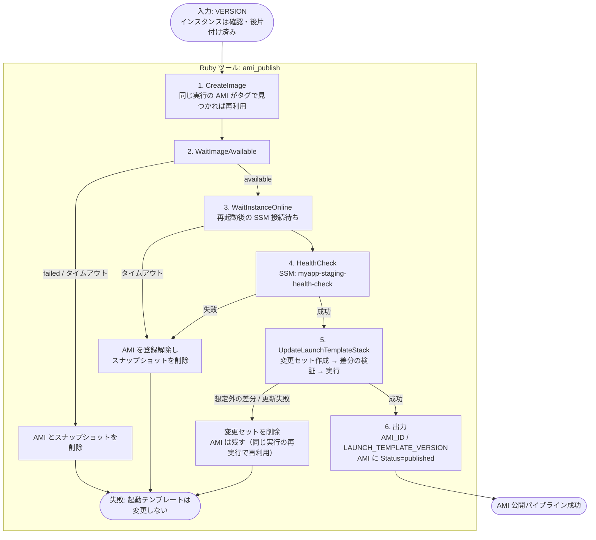
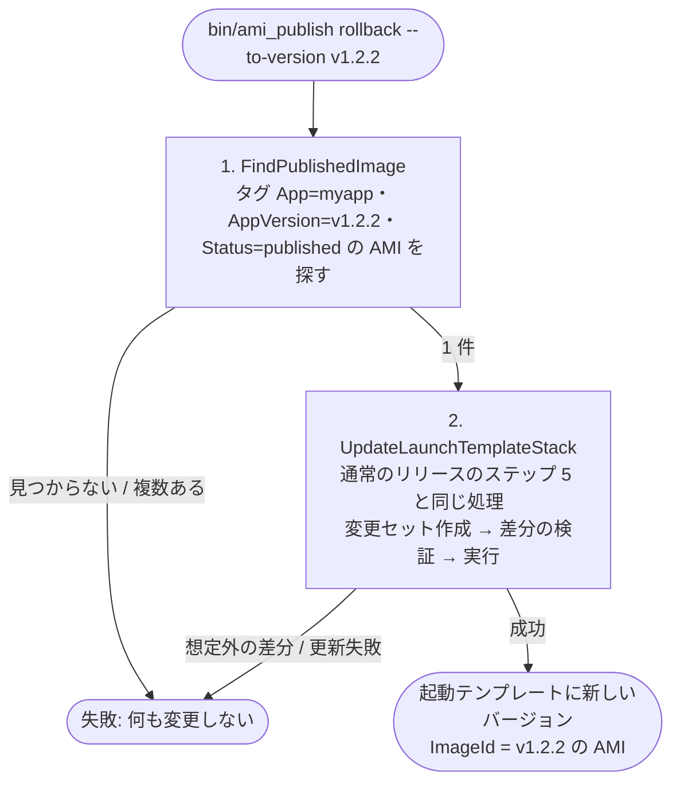
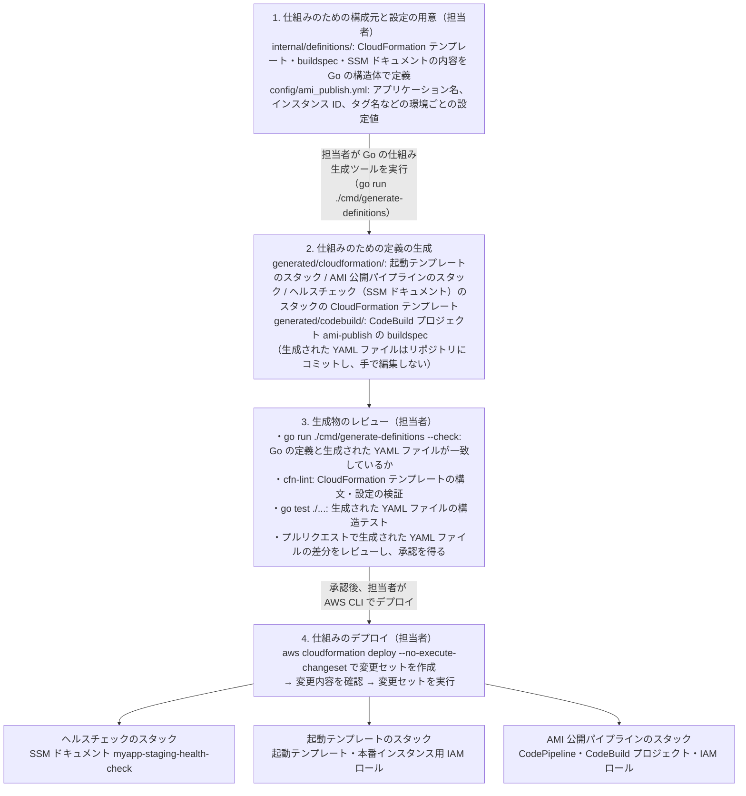
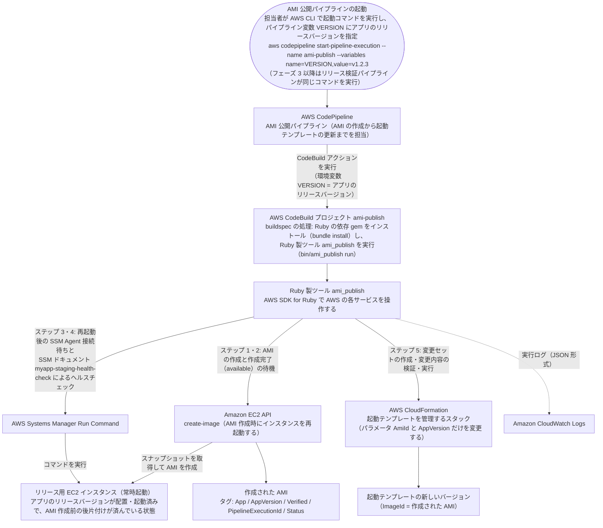
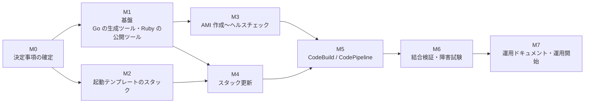

# 開発計画: AMI 作成以降（create-image → 起動テンプレート更新）

> スコープ: [リリース検証・AMI 化・起動テンプレート更新の自動化](./ami-build-pipeline.md) のうち、**`create-image`（インスタンス再起動）以降**の処理の開発計画。AMI 作成、`available` 待ち、再起動後の確認、起動テンプレートのスタック更新と、それを動かす CodeBuild / CodePipeline・CloudFormation 定義を対象とする
>
> スコープ外: `create-image` より前の処理（リリース検証、配置済みバージョンの確認、後片付け）、起動テンプレートを使った実際のインスタンスの構築・入れ替え（Auto Scaling グループを含む）、E2E（[メモ](./notes/release-verification/e2e-testing-on-codebuild-memo.md)）
>
> 前提: AMI 作成・起動テンプレート更新は、リリース検証とは**別の CodePipeline（以下「AMI 公開パイプライン」）**として先行して運用する

## 方針

### 実装言語

レビューのしやすさを優先し、シェルは最小限にする。言語は次のとおり**確定**している（[決定事項 D10](#決定事項)）。

| 対象 | 言語・形式 | 動くタイミング | 理由 |
|---|---|---|---|
| **仕組みの生成ツール**（CloudFormation テンプレート・buildspec・SSM ドキュメントの YAML ファイルを生成） | **Go** | パイプラインの作成時に担当者が実行 | 値の重複（名前、ARN、タグ）を 1 か所の設定にまとめられる。レビューは生成物の差分で行える |
| **AMI 公開ツール**（AMI 作成、待機、SSM、CloudFormation の操作） | **Ruby**（AWS SDK for Ruby） | パイプラインの実行時に CodeBuild 上で動く | 分岐・リトライ・エラー処理をメソッド単位で読める。単体テストでスタブできる |
| シェル | buildspec の数行のみ | パイプラインの実行時 | `bundle install` と Ruby の起動、出力変数の受け渡しだけ |

**AWS の操作は AWS SDK for Ruby で行う**（[決定事項 D1](#決定事項)）。AWS CLI をサブプロセスで呼ぶ方式に比べ、レスポンスが型付きで扱え、待機（waiter）の回数・間隔を細かく設定でき、`stub_responses` で AWS に接続せずにテストできる。レビュー用には、dry-run（`plan`）で実行予定の操作を出力する。

### 設計原則

| 原則 | 内容 |
|---|---|
| ステップ単位 | 処理を独立したステップ（クラス）に分け、各ステップは入力・出力・失敗時の挙動を明示する |
| 再実行可能 | 途中で失敗・中断しても、同じ入力で再実行すれば続きから進む（作成済みの AMI をタグで見つけて再利用する） |
| dry-run | すべての AWS への書き込みを行わず、実行予定の操作を出力するモードを持つ。レビューと初回導入時の確認に使う |
| 変更内容の事前確認 | 起動テンプレートのスタック更新は変更セット経由で行い、**起動テンプレート以外のリソースが変わる場合は中止**する |
| 失敗時に本番へ影響しない | どのステップで失敗しても、起動テンプレートは更新されない（更新は最後のステップ） |
| 生成物のずれ検出 | 生成した YAML がコミット済みのものと一致するかを、担当者がレビュー前に `go run ./cmd/generate-definitions --check` で確認する |

## 対象範囲の処理



| # | ステップ | 主な API | 失敗時 |
|---|---|---|---|
| 0 | CheckInstanceState（開始前の確認） | `ec2:DescribeInstances`。起動中か停止中かを記録し、起動処理中・停止処理中なら落ち着くまで待つ | そのまま失敗（何も変更しない） |
| 1 | CreateImage | `ec2:CreateImage`（タグ: `App`、`AppVersion`、`Verified`、`PipelineExecutionId`、`Status=creating`） | そのまま失敗 |
| 2 | WaitImageAvailable | `ec2:DescribeImages`（waiter） | `failed` またはタイムアウトなら AMI を登録解除し、スナップショットを削除 |
| 2a | StartInstanceIfStopped（開始時に停止中だった場合だけ） | `ec2:StartInstances`、`instance_running` の待機。起動したまま終わる（停止はパイプラインの外で行う） | AMI とスナップショットを削除 |
| 3 | WaitInstanceOnline | `ssm:DescribeInstanceInformation`（`PingStatus=Online` まで） | AMI を登録解除し、スナップショットを削除する（[D5](#決定事項)。原因調査は起動したままのリリース用インスタンスで行う） |
| 4 | HealthCheck | `ssm:SendCommand`（`myapp-staging-health-check`）、`ssm:GetCommandInvocation` | 同上 |
| 5 | UpdateLaunchTemplateStack | `cloudformation:CreateChangeSet` / `DescribeChangeSet` / `ExecuteChangeSet`、waiter | 想定外の差分なら変更セットを削除して中止。更新失敗（スタックがロールバック）でも中止。AMI 自体は正常なので残し、同じ実行を再実行したときに再利用する |
| 6 | 出力 | `ec2:CreateTags`（`Status=published`） | — |

- **起動テンプレートのスタックに含めるもの**: 起動テンプレートと、それが参照する IAM ロール・インスタンスプロファイルだけにする。Auto Scaling グループなど実際のインスタンスを構築するリソースは含めない（スコープ外）。AMI 公開パイプラインのスタック更新が本番のインスタンスに波及しないようにするため。
- **ステップ 5 の差分検証**: 変更セットの変更対象が `AWS::EC2::LaunchTemplate`（の `Modify`）だけであることを確認する。IAM ロールやセキュリティグループなど、想定外のリソースの変更・置換が含まれていたら実行しない（テンプレートを誤って変更した場合の安全装置）。
- **既存パラメータの引き継ぎ**: `DescribeStacks` で現在のパラメータを取得し、`AmiId` / `AppVersion` 以外はすべて `UsePreviousValue: true` にする。パラメータの追加に buildspec 側の修正が不要になる。
- **再実行時の扱い**: ステップ 1 は `PipelineExecutionId` タグで作成済みの AMI を探し、あれば再利用する。ステップ 5 で同じ AMI ID が既に適用済みなら、何もせず成功とする。

### ロールバック（サブコマンド `rollback`）

新しい AMI で問題が見つかったときに、起動テンプレートを前の AMI に戻すサブコマンド（[決定事項 D7](#決定事項)）。担当者（または CLI 経由でエージェント）が手元から実行する。



- 戻し先は、過去に公開済み（`Status=published`）の AMI に限る。パイプラインで旧バージョンを再実行しても、リリース用インスタンスは新しいバージョンの状態なので戻せない。
- 起動テンプレートを直接変更せず、スタックのパラメータ（`AmiId`、`AppVersion`）を戻す。差分の検証も通常のリリースと同じく行う。
- `plan`（dry-run）と同様に、`rollback --dry-run` で変更セットの差分だけを確認できるようにする。
- 本番インスタンスの入れ替えは、このサブコマンドの対象外。
- D8 により古い AMI はこのパイプラインでは削除しないため、戻し先は残っている（手作業で削除された場合を除く）。

## 構成

| | パイプラインの作成 | パイプラインの実行 |
|---|---|---|
| タイミング | 最初の構築時と、仕組みを変えるとき（頻度は低い） | アプリのリリースごと（頻度は高い） |
| 実施者 | **担当者**（または CLI 経由でエージェント）が各ツールを手で操作する | AMI 公開パイプライン（自動） |
| きっかけ | 担当者が仕組みの変更を始めるとき | 担当者（または CLI 経由でエージェント）がアプリのリリースバージョンを指定して起動コマンドを実行（フェーズ 3 以降はリリース検証パイプラインが実行） |
| 結果 | AMI 公開パイプライン・起動テンプレートのスタック・SSM ドキュメントが AWS 上に用意される | 新しい AMI と、それを指す起動テンプレートの新しいバージョンができる |

### パイプラインの作成

最初の構築時と、仕組み（処理内容・権限・起動テンプレートの設定など）を変えるときだけ行う。次の 4 段階で進め、**生成スクリプトの実行も含めて、すべてのツールは担当者（または CLI 経由でエージェント）が操作する**。CI などによる自動実行は行わない。

| # | 段階 | 担当者が行うこと | 使うもの | 対象のディレクトリ・ファイル |
|---|---|---|---|---|
| 1 | 仕組みのための構成元と設定の用意 | CloudFormation テンプレート・buildspec・SSM ドキュメントの内容を Go の定義として書く・直す。環境ごとの設定値を用意する | エディタ | `internal/definitions/`、`config/ami_publish.yml` |
| 2 | 仕組みのための定義の生成 | Go の仕組み生成ツールを実行し、CloudFormation テンプレートと buildspec を生成する | `go run ./cmd/generate-definitions` | 出力先: `generated/cloudformation/`、`generated/codebuild/` |
| 3 | 生成物のレビュー | 検証コマンドを実行したうえで、生成された YAML ファイルの差分をプルリクエストでレビューする | `go run ./cmd/generate-definitions --check`、`cfn-lint`、`go test ./...` | `generated/` の差分 |
| 4 | 仕組みのデプロイ | 生成された CloudFormation テンプレートを AWS CLI でデプロイする。変更セットで差分を確認してから実行する | AWS CLI（`aws cloudformation deploy` など） | `generated/cloudformation/*.yml` |



#### 仕組みのデプロイ（AWS CLI）

依存関係の順（ヘルスチェック（SSM ドキュメント）→ 起動テンプレート → AMI 公開パイプライン）にデプロイする。各スタックとも、変更セットを作って内容を確認してから実行する。

```bash
# 変更セットを作成（まだ反映しない）
aws cloudformation deploy \
  --stack-name myapp-ami-publish-pipeline \
  --template-file generated/cloudformation/ami-publish-pipeline-stack.yml \
  --capabilities CAPABILITY_NAMED_IAM \
  --no-execute-changeset

# 変更内容を確認
aws cloudformation describe-change-set \
  --stack-name myapp-ami-publish-pipeline \
  --change-set-name <前のコマンドが表示した変更セット名>

# 確認できたら反映
aws cloudformation execute-change-set \
  --stack-name myapp-ami-publish-pipeline \
  --change-set-name <変更セット名>
```

- 起動テンプレートのスタックでは、テンプレート本体の変更（インスタンスタイプ、セキュリティグループなど）だけをこの手順で反映する。パラメータ `AmiId` / `AppVersion` は AMI 公開パイプラインが更新するため、この手順では `--parameter-overrides` で上書きしない（`aws cloudformation deploy` は指定しないパラメータの現在値を引き継ぐ）。
- 実行する具体的なコマンド（スタック名・パラメータ・デプロイ順）は、M7 の運用ドキュメントに手順としてまとめる。

### パイプラインの実行

アプリのリリースごとに繰り返し実行する。「パイプラインの作成」で用意した AWS 上の仕組みを使って、AMI を作成し、起動テンプレートに新しいバージョンを追加する。起動テンプレートのスタックはパラメータ（`AmiId`、`AppVersion`）だけを変更し、テンプレート本体は変更しない。




### リポジトリのディレクトリ構成（案）

> **実装済み**: [`ami-publish/`](./ami-publish/README.md)（`docs/ec2/ami-publish/` に配置した独立したプロジェクト。別リポジトリへ切り出せる構成）。下の案からの変更点:
> - CloudFormation テンプレートは環境ごとに `generated/cloudformation/<環境>/` へ出力する（buildspec は全環境で共通のため `generated/codebuild/` 直下）
> - 出力順の固定は、構造体ではなく順序付きのマップ型（`internal/definitions/ordered_map.go`）で行う
> - Ruby 側に共通部品を追加: `errors.rb`、`poller.rb`（待機処理）、`image_cleanup.rb`（失敗した AMI の削除）、`run_context.rb`、`steps/base_step.rb`、`steps/find_published_image.rb`（rollback 用）
> - 起動テンプレートには UserData を指定しない
> - 起動テンプレートのスタックの更新に CloudFormation のサービスロールは使わず、CodeBuild のロールに対象の起動テンプレートの操作権限を直接与える（サービスロールを渡すとスタックがそのロールを覚え、担当者の再デプロイや削除までそのロールで実行されるうえ、パイプラインのスタックを先に削除すると起動テンプレートのスタックを削除できなくなるため）
> - スタック・パイプライン・ロググループ・SSM ドキュメントなどの名前は設定値に書かず、`application_name` と環境名から自動で決める（命名規則は `internal/definitions/naming.go` と `lib/ami_publish/configuration.rb` の両方に実装し、両方のテストで一致を確認する）


Go の仕組み生成ツールと Ruby の AMI 公開ツールを同じリポジトリに置き、設定値ファイル `config/ami_publish.yml` を両方から参照する。

```
ami-publish/                                  # AMI 公開パイプライン一式のリポジトリ（置き場所は決定事項 D2）
│
│  ── 共通 ──
├── config/
│   └── ami_publish.yml                       # 環境ごとの設定値: アプリケーション名、リリース用インスタンス ID、各待機処理のタイムアウトなど（リソースの名前はアプリケーション名と環境名から自動で決める）
│                                             #   Go の仕組み生成ツール（生成時）と Ruby の AMI 公開ツール（実行時）の両方が読み込む
├── generated/                                # Go の仕組み生成ツールが出力した YAML ファイル（コミットする。手で編集しない）
│   ├── cloudformation/
│   │   ├── launch-template-stack.yml                   # 起動テンプレートのスタックの CloudFormation テンプレート
│   │   ├── ami-publish-pipeline-stack.yml              # AMI 公開パイプライン（CodePipeline・CodeBuild・IAM）の CloudFormation テンプレート
│   │   ├── health-check-stack.yml                      # 再起動後のヘルスチェック（SSM ドキュメント myapp-staging-health-check）の CloudFormation テンプレート
│   │   └── release-instance-stack.yml                  # リリース用インスタンスの IAM ロール・インスタンスプロファイルの CloudFormation テンプレート（デプロイ用シェルスクリプトには含めない）
│   └── codebuild/
│       └── ami-publish-buildspec.yml                   # CodeBuild プロジェクト ami-publish の buildspec
│
│  ── 仕組み生成ツール（Go。パイプラインの作成時に担当者が実行する）──
├── go.mod                                    # Go モジュールの定義（使用するライブラリ: gopkg.in/yaml.v3 など）
├── go.sum                                    # Go ライブラリのバージョン固定
├── cmd/
│   └── generate-definitions/
│       └── main.go                           # 仕組み生成ツールの実行コマンド。--check = 生成結果がコミット済みのファイルと一致するかだけを確認
├── internal/
│   └── definitions/                          # 生成する YAML ファイルの内容を Go の構造体で定義する
│       ├── configuration.go                            # config/ami_publish.yml の読み込みと値の検証
│       ├── launch_template_stack.go                    # 起動テンプレートのスタックの CloudFormation テンプレート
│       ├── ami_publish_pipeline_stack.go               # AMI 公開パイプライン（CodePipeline・CodeBuild・IAM）の CloudFormation テンプレート
│       ├── health_check_stack.go                       # 再起動後のヘルスチェック（SSM ドキュメント myapp-staging-health-check）の CloudFormation テンプレート
│       ├── ami_publish_buildspec.go                    # CodeBuild プロジェクト ami-publish の buildspec
│       ├── yaml_writer.go                              # YAML への書き出しと、--check 時のコミット済みファイルとの比較
│       └── *_test.go                                   # 生成された YAML ファイルの構造テスト（go test。必須のリソースや設定値が含まれているか）
│
│  ── AMI 公開ツール（Ruby。AMI 公開パイプラインの CodeBuild 上で動く）──
├── Gemfile                                   # 使用する gem の定義（aws-sdk-ec2 / aws-sdk-ssm / aws-sdk-cloudformation / aws-sdk-iam / interactor / rspec / rubocop）
├── Gemfile.lock                              # gem のバージョン固定
├── .ruby-version                             # 手元で使う Ruby のバージョン（3.4 系の最新）。CodeBuild はイメージにある 3.4 系を rbenv local で使う
├── .rubocop.yml                              # Ruby のコード規約チェック（RuboCop）の設定
├── bin/
│   └── ami_publish                           # AMI 公開ツールの実行コマンド。run = 実行、plan = AWS に書き込まずに実行予定の操作を表示（dry-run）、rollback = 起動テンプレートを公開済みの前の AMI に戻す
├── lib/
│   └── ami_publish/                          # AMI 公開ツール本体
│       ├── command_line_interface.rb         # コマンドライン引数の解釈と終了コードの決定
│       ├── configuration.rb                  # config/ami_publish.yml と環境変数の読み込み・値の検証
│       ├── structured_logger.rb              # JSON 形式のログ出力（ステップ名、所要時間、対象リソース ID）
│       ├── aws_client_factory.rb             # AWS SDK for Ruby のクライアント生成（テストではスタブに差し替える）
│       ├── commands/                         # サブコマンドごとのステップの並び（interactor の Organizer）。ステップの実行と、失敗時の rollback の呼び出しは interactor（gem）が行う
│       │   ├── publish_command.rb                      # run / plan: ステップ 1〜6 を順に実行
│       │   └── rollback_command.rb                     # rollback: 戻し先の AMI を探し、ステップ 5 でスタックを更新
│       └── steps/                            # 各ステップの実装（1 ファイル 1 ステップ）
│           ├── find_published_image.rb                 # rollback 用: タグ（AppVersion・Status=published）から戻し先の AMI を探す
│           ├── create_image.rb                         # ステップ 1: AMI の作成（作成済みなら再利用）
│           ├── wait_image_available.rb                 # ステップ 2: AMI が使える状態（available）になるまで待機
│           ├── wait_instance_online.rb                 # ステップ 3: 再起動後に SSM Agent が接続するまで待機
│           ├── health_check.rb                         # ステップ 4: SSM ドキュメント myapp-staging-health-check でアプリの応答を確認
│           ├── update_launch_template_stack.rb         # ステップ 5: 変更セットで起動テンプレートのスタックを更新
│           └── publish_outputs.rb                      # ステップ 6: AMI ID と起動テンプレートのバージョンを出力し、AMI に Status=published を付与
└── spec/                                     # AMI 公開ツールの RSpec のテスト
    └── ami_publish/
        ├── steps/                            # 各ステップの単体テスト（AWS SDK の stub_responses で AWS に接続せずに実行）
        └── steps/release_instance_profile_spec.rb # 紐付け・解除と、失敗時の rollback・ステップのログのテスト
```

### YAML ファイルの生成方式（Go の仕組み生成ツール）

| 項目 | 方式 |
|---|---|
| 定義の書き方 | CloudFormation テンプレート・buildspec・SSM ドキュメントの内容を、Go の構造体で `internal/definitions/` に書く |
| YAML への変換 | `gopkg.in/yaml.v3` で出力する |
| 出力順の固定 | Go の map はキーの順序が不定（yaml.v3 は map のキーを並べ替えて出力する）ため、CloudFormation の `AWSTemplateFormatVersion` → `Parameters` → `Resources` → `Outputs` のように**順序が意味を持つ階層は構造体で定義**し、毎回同じ順序で出力する。生成し直しても差分が出ないことがレビューの前提になる |
| CloudFormation の組み込み関数 | 完全形（`Ref: ...`、`Fn::Sub: ...`）で出力する。yaml.v3 の Node を使えば短縮形（`!Ref`）も出力できるが、実装を単純にするため採らない |
| 共通の値 | リソース名・タグ名・ARN の組み立て方は `config/ami_publish.yml` と共通の定数から参照し、テンプレート間で値がずれないようにする。Ruby の AMI 公開ツールも同じ設定値ファイルを読むため、生成時と実行時で値がずれない |
| レビュー | 生成された YAML ファイルを `generated/` にコミットし、プルリクエストではその差分をレビューする |
| ずれの検出 | 担当者がレビュー前に `go run ./cmd/generate-definitions --check` を実行し、Go の定義を変えたのに YAML ファイルを再生成し忘れた状態を検出する |
| 構文検証 | 担当者が、生成された CloudFormation テンプレートに `cfn-lint` を実行する |

テンプレート（`text/template`）で YAML の見た目のまま埋め込みで書く方式は、値の参照や繰り返しが文字列の組み立てになってレビューしにくいため採らない。

### CodeBuild の buildspec（generated/codebuild/ami-publish-buildspec.yml の生成イメージ）

シェルで書くのは、Ruby の選択（rbenv）、Ruby の依存 gem のインストール、Ruby 製ツールの実行、ツールの出力値の受け渡しだけにする。Ruby は `runtime-versions` ではなく、CodeBuild 標準イメージに入っている rbenv で、イメージにある 3.4 系を選ぶ（Ruby のビルドはしない）。

```yaml
version: 0.2
env:
  exported-variables:          # 後続のパイプラインアクションから参照できるようにする出力値
    - AMI_ID                   # 作成された AMI の ID
    - LAUNCH_TEMPLATE_VERSION  # 作成された起動テンプレートのバージョン番号
phases:
  install:
    commands:
      - if command -v rbenv >/dev/null 2>&1; then rbenv local 3.4.10; fi   # イメージにある 3.4 系を選ぶ
      - ruby --version
      - echo 'Entered install phase.'
      - aws --version
      - bundle config set --local deployment true && bundle install
  build:
    commands:
      - bundle exec bin/ami_publish run --version "$VERSION" --output-env-file ami_publish_outputs.env
      - set -a && . ./ami_publish_outputs.env && set +a
```

Ruby のプロセスからは、buildspec を実行しているシェルの環境変数を設定できない。そこで Ruby 製ツールが出力値（`AMI_ID`、`LAUNCH_TEMPLATE_VERSION`）をファイル `ami_publish_outputs.env` に書き出し、最後の 1 行でシェルに読み込んで、`exported-variables` として後続に公開する。

## 開発フェーズ

ここでの M0〜M8 は、フェーズ 1（中段: AMI と起動テンプレートの用意）の中の作業の段取りである。リリース全体のフェーズ（フェーズ 1 = 中段、フェーズ 2 = 後段、フェーズ 3 = 前段）とは別物（[全体像](./README.md#全体像)）。



規模の目安は S（1〜2 日）/ M（3〜5 日）/ L（1 週間以上）。

### M0: 決定事項の確定（S）

[決定事項](#決定事項)がすべて決定済みであることを確認する（D1〜D3・D5〜D10 は決定済み。D4 はスコープ外のため欠番）。

**完了条件**: 決定事項がこのドキュメントに記録されている。

### M1: 基盤（Go の仕組み生成ツール・Ruby の AMI 公開ツール）（M）

| タスク | 内容 |
|---|---|
| Go の仕組み生成ツール | `go.mod`、`cmd/generate-definitions`、設定値ファイルの読み込み、YAML の書き出しと `--check`、`go test`・`go vet` |
| Ruby のプロジェクト作成 | Gemfile（`aws-sdk-ec2`、`aws-sdk-ssm`、`aws-sdk-cloudformation`、`rspec`、`rubocop`）、`.ruby-version`（3.4 系の最新） |
| 設定読み込み | `config/ami_publish.yml` + 環境変数での上書き、必須項目と形式（`VERSION` の正規表現など）の検証 |
| 実行基盤 | ステップの順次実行、dry-run、JSON 構造化ログ（ステップ名、所要時間、対象リソース ID） |
| CLI | `bin/ami_publish run` / `plan`（dry-run）、終了コードの定義（成功 0、確認 NG、AWS エラー等を区別） |
| テスト基盤 | `Aws.config[:stub_responses]` によるスタブ、担当者がローカルで実行する `rspec` と `rubocop` |

**完了条件**: Go の仕組み生成ツールが空の定義から YAML ファイルを出力でき、`--check` と `go test` が通る。Ruby の AMI 公開ツールは空のステップで `plan` / `run` が動き、rspec・rubocop が通る。

### M2: 起動テンプレートのスタック（M）

| タスク | 内容 |
|---|---|
| 定義 | `internal/definitions/launch_template_stack.go`（[テンプレート例](./ami-build-pipeline.md#テンプレート例)を Go の定義に移す） |
| 生成・検証 | `go run ./cmd/generate-definitions`、`--check`、`go test`、`cfn-lint` |
| 更新の権限 | 起動テンプレートのスタックの更新は CodeBuild の権限で行う（CloudFormation のサービスロールは使わない。M5 の CodeBuild のロールに、対象の起動テンプレートの操作権限を含める） |
| 初回デプロイ | 開発アカウントで、AMI を指定せずに（`AmiId` は空）AWS CLI でスタックを作成（[仕組みのデプロイ](#仕組みのデプロイaws-cli)の手順） |

**完了条件**: 開発アカウントに起動テンプレートのスタックがあり、手動で `AmiId` を変えて更新すると新しいバージョンができる。

### M3: AMI 作成〜ヘルスチェック（M）

| タスク | 内容 |
|---|---|
| CreateImage | タグ付きで作成、`PipelineExecutionId` による再利用 |
| WaitImageAvailable | waiter（回数・間隔を設定値に）、失敗時の登録解除とスナップショット削除 |
| WaitInstanceOnline | `PingStatus=Online` の待機 |
| HealthCheck | `myapp-staging-health-check` の実行と結果取得 |
| 失敗時の削除 | ステップ 3・4 の失敗時に AMI の登録解除とスナップショット削除 |
| SSM ドキュメント | `myapp-staging-health-check` の定義（`internal/definitions/health_check_stack.go` → `generated/cloudformation/<環境>/health-check-stack.yml`） |
| 単体テスト | 正常系、`failed`、タイムアウト、再実行（作成済み AMI の再利用） |

**完了条件**: 開発アカウントのリリース用インスタンスに対してローカルから `run` を実行し、AMI 作成とヘルスチェックまで通る。失敗系は単体テストで網羅されている。

### M4: スタック更新（M）

| タスク | 内容 |
|---|---|
| 変更セット | `CreateChangeSet`（`UsePreviousTemplate`、既存パラメータの引き継ぎ）、作成完了の待機 |
| 差分検証 | 変更対象が `AWS::EC2::LaunchTemplate` のみであることの確認、違えば変更セットを削除して中止 |
| 実行・待機 | `ExecuteChangeSet`、`stack_update_complete` の待機、ロールバック時の扱い |
| 冪等性 | 同じ AMI ID が適用済み（変更なし）の場合は成功扱い |
| ロールバック | `rollback` サブコマンド（`FindPublishedImage` + ステップ 5 の流用）、`--dry-run`、単体テスト（戻し先なし・複数・正常系） |
| 出力 | `LaunchTemplateVersion` の取得、`Status=published` の付与、`--output-env-file` への書き出し |
| 単体テスト | 正常系、想定外の差分、更新失敗、変更なし |

**完了条件**: M3 と合わせて、ローカルからの `run` で起動テンプレートの新バージョンまで作成できる。`plan` で変更セットの差分が確認できる。`rollback` で公開済みの前の AMI に戻せる。

### M5: CodeBuild / CodePipeline（M）

| タスク | 内容 |
|---|---|
| buildspec の定義 | `internal/definitions/ami_publish_buildspec.go`（Ruby はイメージにある 3.4 系を `rbenv local` で選ぶ） |
| ビルド環境 | CodeBuild 標準イメージに入っている Ruby 3.4 系のバージョンを確認し、buildspec の `rbenv local` に指定する |
| パイプラインのスタック | CodeBuild プロジェクト（同時実行数 1、タイムアウト）、AMI 公開パイプライン（V2、パイプライン変数 `VERSION`、実行モード `QUEUED`）の定義。ソースはインフラ用リポジトリの `main` ブランチで、push による自動起動は無効にする |
| IAM | CodeBuild サービスロール（[権限一覧](./ami-build-pipeline.md#iam-権限)の AMI 作成側）。起動テンプレートの操作権限は、対象の起動テンプレート（Export の ID）だけに限定。IAM ロールの作成・変更の権限はパイプライン全体に持たせない |
| ログ | CodeBuild のログを CloudWatch Logs に保存、SSM コマンドの出力も同じロググループへ |
| 通知 | パイプラインの失敗を SNS 等に通知 |

**完了条件**: 開発アカウントでパイプラインを起動し、AMI 作成から起動テンプレート更新まで完走する。

### M6: 結合検証・障害試験（M）

| 試験 | 方法 | 期待結果 |
|---|---|---|
| 正常系 | パイプラインを実行 | 起動テンプレートに新バージョン、AMI に `Status=published` |
| ヘルスチェック失敗 | リリース用インスタンスでアプリの自動起動を無効化して実行 | AMI とスナップショットが削除され、起動テンプレートは変更なし |
| AMI 作成のタイムアウト | タイムアウト値を極端に短くして実行 | AMI とスナップショットが削除され、失敗で終了 |
| 想定外の差分 | 起動テンプレートのスタックのテンプレートを変更した状態で実行 | 変更セットを削除して中止 |
| 再実行 | ステップ 4 で強制終了させてから同じ実行 ID で再実行 | 作成済み AMI を再利用し、続きから完走 |
| ロールバック | 2 回公開した後、`rollback --to-version <1 回目のバージョン>` を実行 | 起動テンプレートに 1 回目の AMI を指す新しいバージョンができる。差分は起動テンプレートのみ |
| 同時実行 | パイプラインを連続で 2 回起動 | 実行モード `QUEUED` により 2 回目は 1 回目の完了を待ってから実行され、重ならない |
| 権限 | CodeBuild のロールから権限を 1 つずつ外す | 該当ステップで明確なエラーメッセージで失敗 |

**完了条件**: 上記がすべて期待どおり。結果を記録している。

### M7: 運用ドキュメント・運用開始（S）

| 成果物 | 内容 |
|---|---|
| 仕組みのデプロイ手順 | パイプラインの作成の 4 段階（構成元と設定の用意 → 定義の生成 → 生成物のレビュー → 仕組みのデプロイ）で担当者が実行するコマンド、スタックのデプロイ順とパラメータ |
| 実行手順 | 起動コマンド（`aws codepipeline start-pipeline-execution --variables name=VERSION,value=...`）、結果の確認方法（AMI のタグ、起動テンプレートのバージョン） |
| 失敗時の切り分け | ステップ別の症状と対処（ログのどこを見るか、削除された AMI の失敗理由の確認方法） |
| ローカル検証手順 | `plan` / `run` をローカルから実行する手順 |
| ロールバック手順 | `bin/ami_publish rollback` の実行手順（戻し先の確認、`--dry-run` での差分確認、実行後の確認） |

**完了条件**: 本番アカウントで初回の AMI 公開を行い、手順書どおりに確認できた。

### M8: 古い AMI の整理（対象外）

このパイプラインでは AMI の保持数を管理しない（[決定事項 D8](#決定事項)）。古い AMI・スナップショットの整理は本計画の対象外とする。ただし、作成に失敗した AMI（ステップ 2）の削除は、失敗時の後始末としてこのパイプラインで行う。

## テスト方針

| レベル | 方法 | 対象 |
|---|---|---|
| 単体 | RSpec + `stub_responses`（AWS に接続しない） | 各ステップの正常系・失敗系・再実行、設定の検証、終了コード |
| 生成物 | `go test` で生成された YAML ファイルの構造を検証、`go run ./cmd/generate-definitions --check`、`cfn-lint` | Go の仕組み生成ツールが出力するテンプレート・buildspec・SSM ドキュメント |
| 結合（ローカル） | 開発アカウントに対して `plan` → `run` | AWS の実挙動（waiter の時間、変更セットの差分形式） |
| 結合（パイプライン） | 開発アカウントでパイプラインを実行 | IAM、ログ、出力変数、同時実行制御 |
| 障害試験 | M6 の試験表 | 失敗時に起動テンプレートが変わらないこと |

## 決定事項

| # | 論点 | 選択肢 | 推奨 | 状態 |
|---|---|---|---|---|
| D1 | AWS の操作方法 | AWS SDK for Ruby / Ruby から AWS CLI を呼ぶ | — | **決定: AWS SDK for Ruby** |
| D2 | コードの置き場所 | アプリのリポジトリ内（例: `ops/ami-publish/`） / インフラ用の別リポジトリ | — | **決定: インフラ用の別リポジトリ** |
| D3 | AMI 公開パイプラインの起動方法 | S3 の manifest 更新 / 手動実行（パイプライン変数で `VERSION`） | — | **決定: 起動する人がパイプライン変数 `VERSION` を指定して起動コマンドを実行**。実行モードは `QUEUED`。フェーズ 3 ではリリース検証パイプラインの最後のアクションが同じコマンドを実行する |
| D4 | （欠番）Auto Scaling グループの配置 | — | — | **スコープ外**。起動テンプレートを使った実際のインスタンス構築は本計画の対象外。起動テンプレートのスタックには本番のリソースを含めない（ステップ 5 の差分検証で担保） |
| D5 | 再起動後の確認に失敗した AMI | タグを付けて残す / すぐ削除 | — | **決定: すぐ削除する**（原因調査は起動したままのリリース用インスタンスで行う） |
| D6 | Ruby のバージョン | CodeBuild の標準イメージが提供するバージョン / カスタムイメージ | — | **決定: 手元は `.ruby-version` の 3.4 系の最新（3.4.11）。CodeBuild は標準イメージに入っている rbenv で、イメージにある 3.4 系（3.4.10）を `rbenv local` で選ぶ**（`runtime-versions` は使わず、Ruby のビルドもしない） |
| D7 | ロールバックをツールに含めるか | サブコマンドとして実装 / 手順書で CLI 操作 | — | **決定: AMI 公開ツールのサブコマンド `rollback` として実装** |
| D8 | AMI の保持数 | 世代数・期間 / 管理しない | — | **決定: このパイプラインでは保持数を管理しない**（古い AMI の整理は対象外） |
| D9 | 仕組み（パイプライン・起動テンプレートのスタック本体・SSM ドキュメント）のデプロイ方法 | 担当者が AWS CLI で実行 / デプロイ用 Ruby コマンド / インフラ用 CI パイプライン | — | **決定: 担当者（または CLI 経由でエージェント）が AWS CLI で実行**。生成スクリプトの実行を含め、ツールの操作はすべて人が行う |
| D10 | 実装言語 | — | — | **決定: クライアント PC で実行するクライアント・CLI ツールは Go、パイプラインの処理（CodeBuild 上）は Ruby、シェルスクリプトは最小限** |

## リスク

| リスク | 影響 | 対策 |
|---|---|---|
| `create-image` の再起動後にアプリが起動しない | その AMI は使えない | ステップ 3・4 で検出し、起動テンプレートは更新しない。リリース用インスタンス自体の復旧は手作業 |
| 再起動後に SSM Agent の再接続が遅い | ステップ 3 がタイムアウト | 待機時間を設定値にし、M6 で実測して決める |
| AMI 作成が長時間化（ボリュームが大きい、変更量が多い） | CodeBuild のタイムアウト | 待機時間とビルドタイムアウトを実測に基づいて設定。再実行で続きから進められる |
| 起動テンプレートのスタックが `UPDATE_ROLLBACK_FAILED` などの異常状態 | 以降の更新ができない | ステップ 5 の前にスタックの状態を確認して中止。復旧手順を M7 のドキュメントに記載 |
| スタックのテンプレートが別経路で変更される | 意図しないリソース変更 | ステップ 5 の差分検証で中止 |
| 権限の過不足 | 失敗、または過剰な権限 | M6 で権限を 1 つずつ外す試験を行い、最小権限を確認 |

## 関連

- [Rails アプリのリリース検証・AMI 化・起動テンプレート更新の自動化](./ami-build-pipeline.md)（全体設計。パイプライン分割の反映は作業中）
- [メモ: AMI 作成に EC2 Image Builder を使う案（未採用）](./notes/ami-publish/ami-build-image-builder-options-memo.md)
- [メモ: CodeBuild での E2E テストの構成](./notes/release-verification/e2e-testing-on-codebuild-memo.md)
