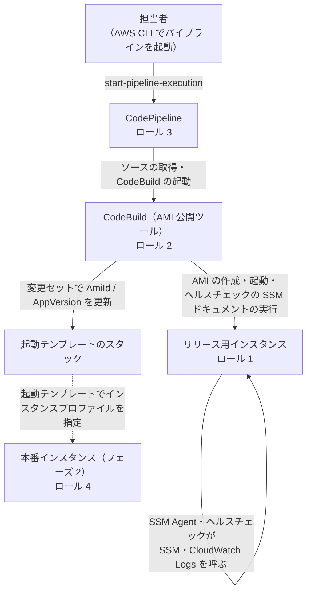

# AMI 公開パイプラインの IAM ロールと許可ポリシーの現状

> スコープ: AMI 公開パイプライン（[`ami-publish/`](./ami-publish/README.md)、フェーズ 1）に関わる IAM ロールと許可ポリシーの**現時点の構成**。生成されるスタックのテンプレート（`ami-publish/generated/cloudformation/<環境>/`）から書き出したもの
>
> 正本は生成ツールの定義（`ami-publish/internal/definitions/`）。定義を変えたら、このドキュメントも直す
>
> 関連: [リリース用インスタンスの IAM ロール（設定方法）](./ami-publish-release-instance-iam.md) / [開発計画](./ami-publish-development-plan.md) / [トラブルシューティング](./ami-publish-troubleshooting.md)

以下の例は、`application_name` が `myapp`、環境名が `staging` の場合。

## 全体像

IAM ロールは 4 つ。そのほかに、ロールではない IAM の管理ポリシーが 1 つある。

| # | ロール | 引き受けるサービス | 定義しているスタック | デプロイ用シェルスクリプト（`up` / `down`） |
|---|---|---|---|---|
| 1 | リリース用インスタンスのロール | EC2（リリース用インスタンス） | リリース用インスタンスの IAM ロールのスタック `myapp-staging-release-instance` | **含めない**（担当者が個別にデプロイする） |
| 2 | CodeBuild のサービスロール | CodeBuild（AMI 公開ツール） | AMI 公開パイプラインのスタック `myapp-staging-ami-publish-pipeline` | 含める |
| 3 | CodePipeline のサービスロール | CodePipeline | AMI 公開パイプラインのスタック `myapp-staging-ami-publish-pipeline` | 含める |
| 4 | 本番インスタンスのロール | EC2（起動テンプレートから起動するインスタンス） | 起動テンプレートのスタック `myapp-staging-launch-template` | 含める |
| ― | Basic 認証のパラメーターの読み取り用の管理ポリシー（ロールではない） | ― | ヘルスチェックのスタック `myapp-staging-health-check` | 含める |

CloudFormation のサービスロールは**使わない**。起動テンプレートのスタックは、CodeBuild のサービスロール（2）の権限で直接更新する（サービスロールを渡すとスタックがロールを覚え、削除や担当者の再デプロイまでそのロールで行われるため）。そのため、どのロールにも `iam:PassRole` はない。

## 1. リリース用インスタンスのロール

- **定義**: `internal/definitions/release_instance_stack.go`。生成物は `generated/cloudformation/<環境>/release-instance-stack.yml` で、リソースは `ReleaseInstanceRole` と `ReleaseInstanceProfile`
- **関連付け**: 既存のリリース用インスタンスへのインスタンスプロファイルの関連付けは CloudFormation ではできないので、AWS CLI（`aws ec2 associate-iam-instance-profile`）で行う。手順は [リリース用インスタンスの IAM ロール 2-1](./ami-publish-release-instance-iam.md#2-1-スタックで作る推奨)
- **使うのは誰か**: インスタンス上の SSM Agent と、ヘルスチェックの SSM ドキュメント（インスタンス上で動くシェル）が AWS を呼ぶときだけ。AMI の作成などは CodeBuild（2）が行うので、このロールには不要
- **AMI との関係**: AMI にロールは含まれないので、このロールの許可が本番インスタンスに引き継がれることはない

| 区分 | 許可 | 対象 | 何のためか | 付け方 |
|---|---|---|---|---|
| A | AWS 管理ポリシー `AmazonSSMManagedInstanceCore` | AWS 管理 | SSM の管理対象になり、SSM Run Command（ヘルスチェックの SSM ドキュメント）を受け取る | 管理ポリシーのアタッチ |
| B | `logs:CreateLogStream` / `logs:PutLogEvents` / `logs:DescribeLogStreams` | ロググループ `/myapp/staging/ami-publish` | ヘルスチェックの出力を CloudWatch Logs に送る（送るのは SSM Agent） | インラインポリシー `health-check` |
| B | `logs:DescribeLogGroups` | `*`（リソースで絞れない操作） | 同上 | インラインポリシー `health-check` |
| C | `ssm:GetParameter` | Basic 認証のパラメーター（例: `/myapp/staging/health-check/basic-auth`）だけ | ヘルスチェックが Basic 認証の「ユーザー名:パスワード」を取り出す | インラインポリシー `health-check`。`health_check.basic_auth_parameter_name` を設定したときだけ |

- C のパラメーターは、既定の `aws/ssm` キーで暗号化した SecureString にする前提。そのため `kms:Decrypt` は付けていない（カスタマー管理の KMS キーには対応しない）
- パイプラインは開始時（ステップ 0b）に、このロールの許可を IAM のポリシーシミュレーターで判定する。A・C の不足は失敗、B の不足は警告にとどめる

## 2. CodeBuild のサービスロール

- **定義**: `internal/definitions/ami_publish_pipeline_stack.go`。リソースは `CodeBuildServiceRole`、インラインポリシーは `publish-ami`
- **使うのは誰か**: CodeBuild 上で動く AMI 公開ツール（`bin/ami_publish run`）。パイプラインの処理の本体
- 他のスタックのリソース（起動テンプレートのスタック・起動テンプレート・ヘルスチェックの SSM ドキュメント）は、命名規則の文字列ではなく Export（`Fn::ImportValue`）で参照して対象を絞っている

| Sid | 許可 | 対象・制限 | 何のためか |
|---|---|---|---|
| `WriteBuildLogs` | `logs:CreateLogStream` / `logs:PutLogEvents` | パイプラインのロググループ | CodeBuild のログ |
| `ReadWritePipelineArtifacts` | `s3:GetObject` / `s3:GetObjectVersion` / `s3:PutObject` | アーティファクト用の S3 バケットの中身 | ソースの受け取り |
| `ReadInstanceState` | `ec2:DescribeInstances` | `*` | リリース用インスタンスの状態の確認 |
| `StartStoppedReleaseInstance` | `ec2:StartInstances` | リリース用インスタンスだけ | 開始時に停止中だった場合の起動。**`ec2:StopInstances` は持たない** |
| `CreateImage` | `ec2:CreateImage` | リリース用インスタンス、AMI、スナップショット | AMI の作成 |
| `TagImage` | `ec2:CreateTags` | AMI、スナップショット | AMI にタグ（`App`、`AppVersion`、`Status` など）を付ける |
| `DescribeImagesAndSnapshots` | `ec2:DescribeImages` / `ec2:DescribeSnapshots` | `*` | AMI の作成の待機、`rollback` での AMI の検索 |
| `DeleteFailedImage` | `ec2:DeregisterImage` / `ec2:DeleteSnapshot` | AMI、スナップショット。**タグ `App=myapp` が付いたものだけ** | 失敗時の AMI とスナップショットの削除（決定事項 D5） |
| `RunHealthCheck` | `ssm:SendCommand` | リリース用インスタンスと、ヘルスチェックの SSM ドキュメント（Export で参照）だけ | ヘルスチェックの実行。**`AWS-RunShellScript` などの任意のコマンドは送れない** |
| `ReadCommandAndInstanceStatus` | `ssm:GetCommandInvocation` / `ssm:DescribeInstanceInformation` | `*` | SSM の接続の確認と、ヘルスチェックの結果の取得 |
| `CheckReleaseInstanceRolePermissions` | `iam:GetInstanceProfile` / `iam:SimulatePrincipalPolicy` | アカウント内のインスタンスプロファイルとロール | ロール 1 の許可の判定（ステップ 0b）。読み取りと判定だけで、IAM を変更する権限はない |
| `FindBasicAuthParameterKey` | `ssm:DescribeParameters` | `*` | Basic 認証のパラメーターが既定のキーの SecureString であるかの確認（値は読まない） |
| `UpdateLaunchTemplateStack` | `cloudformation:DescribeStacks` / `CreateChangeSet` / `DescribeChangeSet` / `ExecuteChangeSet` / `DeleteChangeSet` | 起動テンプレートのスタックだけ（Export で参照） | 変更セットで `AmiId` / `AppVersion` を更新 |
| `UpdateLaunchTemplate` | `ec2:CreateLaunchTemplateVersion` / `ec2:ModifyLaunchTemplate` | 対象の起動テンプレートだけ（Export で参照） | 変更セットの実行時に CloudFormation がこのロールの権限で行う |
| `ReadLaunchTemplates` | `ec2:DescribeLaunchTemplates` / `ec2:DescribeLaunchTemplateVersions` | `*` | 同上・結果の確認 |
| `ReadOwnStackOutputs` | `cloudformation:DescribeStacks` | パイプラインのスタック自身 | 他のスタックの名前やロググループ名を、パイプラインのスタックの出力から引く |

持たせていない権限（Go のテストで確認している）:

- `ec2:StopInstances`
- `AWS-RunShellScript` の実行
- IAM ロールの作成・変更、`iam:PassRole`

## 3. CodePipeline のサービスロール

- **定義**: `internal/definitions/ami_publish_pipeline_stack.go`。リソースは `CodePipelineServiceRole`、インラインポリシーは `run-ami-publish-pipeline`

| Sid | 許可 | 対象 | 何のためか |
|---|---|---|---|
| `ReadWritePipelineArtifacts` | `s3:GetObject` / `s3:GetObjectVersion` / `s3:PutObject` | アーティファクト用の S3 バケットの中身 | ソースの受け渡し |
| `ReadArtifactBucket` | `s3:GetBucketVersioning` / `s3:GetBucketLocation` | アーティファクト用の S3 バケット | 同上 |
| `UseSourceConnection`（ソースが GitHub の場合） | `codeconnections:UseConnection` / `codestar-connections:UseConnection` | 設定値 `source_connection_arn` の接続だけ | GitHub からのソースの取得 |
| CodeCommit のソース（ソースが CodeCommit の場合。上の代わり） | `codecommit:GetBranch` / `GetCommit` / `GetRepository` / `UploadArchive` / `GetUploadArchiveStatus` / `CancelUploadArchive` | 設定値 `source_repository_name` のリポジトリだけ | CodeCommit からのソースの取得 |
| `RunCodeBuild` | `codebuild:StartBuild` / `codebuild:BatchGetBuilds` | AMI 公開の CodeBuild プロジェクトだけ | CodeBuild の起動と完了待ち |

## 4. 本番インスタンスのロール

- **定義**: `internal/definitions/launch_template_stack.go`。リソースは `InstanceRole` と `InstanceProfile`。起動テンプレートの `IamInstanceProfile` に指定している
- **許可**: AWS 管理ポリシー `AmazonSSMManagedInstanceCore` だけ
- 本番インスタンスの構築はフェーズ 2（[インスタンスの構築](./instance-provisioning/README.md)）の範囲。アプリが必要とする許可は、フェーズ 2 で見直す

## 5. Basic 認証のパラメーターの読み取り用の管理ポリシー

- **定義**: `internal/definitions/health_check_stack.go`。リソースは `BasicAuthParameterReadPolicy`（`AWS::IAM::ManagedPolicy`）。`health_check.basic_auth_parameter_name` を設定したときだけ作る
- **許可**: `ssm:GetParameter`（Basic 認証のパラメーターだけ）。ロール 1 の C と同じ
- **使い方**: 出力 `BasicAuthParameterReadPolicyArn` を、**既存の**リリース用インスタンスのロールにアタッチする。リリース用インスタンスの IAM ロールのスタックでロールを作った場合は、ロール 1 に C が含まれているので使わない

## 気になる点・今後の整理

| 項目 | 内容 |
|---|---|
| C が 2 か所にある | ロール 1 のインラインポリシーと、ヘルスチェックのスタックの管理ポリシー（5）。リリース用インスタンスの IAM ロールのスタックを正式に使うと決まれば、5 は削除できる |
| ロール 1 のスタックの置き場所 | フェーズ 3（リリース検証の自動化）で、インスタンスの更新の仕組み側に移す可能性がある。それまでは `up` / `down` に含めない |
| ロール 4 の許可 | フェーズ 2 で、本番インスタンスに必要な許可（アプリが使う S3 など）を決める |
| フェーズ 3 で増える許可 | リリース検証を自動化すると、ロール 1 にデプロイキーの読み取り（Secrets Manager）などが加わる見込み |
