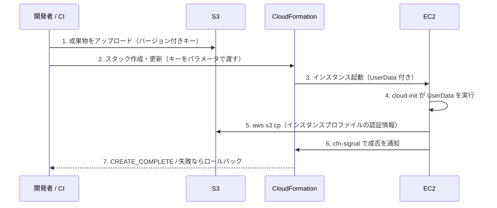

# EC2 へのファイル配備 — CloudFormation + S3 + UserData

> スコープ: CloudFormation で作成する EC2 インスタンスに対し、S3 上の設定ファイル・スクリプト・アプリケーション成果物を起動時に配備する設計
>
> スコープ外: AMI のビルドパイプライン（EC2 Image Builder / Packer）、CodeDeploy によるアプリケーションデプロイの詳細、コンテナ（ECS / EKS）

## 結論

「ファイルを S3 に置き、CloudFormation で作成した EC2 の UserData から取得して配置する」構成は標準的な設計であり、そのまま採用してよい。ただし次の 5 点を設計に含めないと、運用段階で問題になる。

| # | 論点 | 必要な対応 |
|---|---|---|
| 1 | 権限 | インスタンスプロファイルに対象プレフィックス限定の `s3:GetObject`（`sync` なら `s3:ListBucket`、SSE-KMS なら `kms:Decrypt` も） |
| 2 | 経路 | プライベートサブネットでは S3 ゲートウェイエンドポイント（または NAT）。cfn-signal / cfn-init を使うなら CloudFormation エンドポイントへの経路も |
| 3 | 完了判定 | `CreationPolicy` + `cfn-signal` で UserData の成否をスタックに返す。これがないとスクリプトが失敗しても `CREATE_COMPLETE` になる |
| 4 | 順序 | S3 のオブジェクトはスタック作成**前**に存在している必要がある。バケットは別スタックで管理する |
| 5 | 更新 | UserData は初回起動時にしか実行されない。更新方式（インスタンス置換 / cfn-hup / SSM）を最初に決める |

小さなテキスト設定ファイルだけなら、S3 を使わず `AWS::CloudFormation::Init`（cfn-init）でテンプレートに埋め込む方法も選択肢になる（[cfn-init との使い分け](#cfn-init-との使い分け)）。

## 前提知識

### 全体の流れ



### UserData の実行モデル

- UserData は cloud-init によって**インスタンスの初回起動時に 1 回だけ**、root 権限で実行される（`#!/bin/bash` で始まるシェルスクリプトの場合）。
- 再起動（reboot）や停止・起動（stop/start）では再実行されない。
- サイズ上限は Base64 エンコード前で **16 KB**。長い処理は S3 にスクリプトを置き、UserData からはそれを取得して実行するだけにする。
- 実行ログは `/var/log/cloud-init-output.log`、cloud-init 自体のログは `/var/log/cloud-init.log` に出る。失敗時の調査はまずここを見る。
- UserData はインスタンス属性として `DescribeInstanceAttribute` で誰でも（権限があれば）読める。**シークレットを書いてはいけない**。

### CloudFormation 上で UserData を変更したときの挙動

`AWS::EC2::Instance` の `UserData` プロパティを変更してスタック更新すると、EBS ボリュームを使うインスタンスでは**停止・起動**が行われる（Update requires: Some interruptions）。しかし上記のとおり cloud-init はインスタンス単位で 1 回しか UserData を実行しないため、**停止・起動されてもスクリプトは再実行されない**。「UserData を直したのに反映されない」という典型的な落とし穴である。

UserData の変更を確実に反映させたい場合は、インスタンスを置換させる必要がある（[更新戦略](#更新戦略)）。

## 設計

### 1. IAM ロール（インスタンスプロファイル）

EC2 上の AWS CLI は、IMDS（インスタンスメタデータサービス）経由でインスタンスプロファイルの一時認証情報を取得する。アクセスキーをインスタンスに置く必要はなく、置くべきでもない。

必要な権限は取得方法によって異なる。

| 操作 | 必要な権限 | リソース ARN |
|---|---|---|
| `aws s3 cp s3://bucket/key ...`（単一オブジェクト） | `s3:GetObject` | `arn:aws:s3:::bucket/prefix/*` |
| `aws s3 sync` / `aws s3 cp --recursive` / `aws s3 ls` | 上記 + `s3:ListBucket` | `arn:aws:s3:::bucket`（バケット ARN。`s3:prefix` 条件で絞れる） |
| SSE-KMS（カスタマー管理キー）で暗号化されたオブジェクト | 上記 + `kms:Decrypt` | KMS キーの ARN（キーポリシー側でも許可が必要） |

補足:

- `s3:ListBucket` がない状態で存在しないキーを取得すると、`404 Not Found` ではなく `403 Forbidden` が返る。キー名の誤りを権限エラーと誤認しやすいので注意する。
- 権限は `bucket/*` ではなく、用途のプレフィックス（例: `bucket/app-name/*`）に限定する。
- SSM Run Command / Session Manager を使う場合は、マネージドポリシー `AmazonSSMManagedInstanceCore` も付与する。
- IMDSv2 を必須（`HttpTokens: required`）にする。AWS CLI v2 は IMDSv2 に対応している。

### 2. ネットワーク経路

| インスタンスの配置 | S3 への経路 |
|---|---|
| パブリックサブネット（パブリック IP あり） | インターネットゲートウェイ経由でそのまま到達 |
| プライベートサブネット + NAT ゲートウェイ | NAT 経由で到達するが、データ処理料金がかかる |
| プライベートサブネット（外向き経路なし） | **S3 ゲートウェイエンドポイント**が必須 |

S3 ゲートウェイエンドポイントは無料で、ルートテーブルに S3 のプレフィックスリストへのルートを追加する。推奨は NAT の有無にかかわらずゲートウェイエンドポイントを作ること。

- ゲートウェイエンドポイントは**同一リージョン**の S3 にしか使えない。AWS CLI には `--region` を明示し、別リージョンのエンドポイントへ向かわないようにする。
- バケットポリシーで `aws:SourceVpce` 条件を使えば、特定の VPC エンドポイント経由以外のアクセスを拒否できる。
- `cfn-signal` / `cfn-init` / `cfn-hup` は CloudFormation の API エンドポイントと通信する。外向き経路のないサブネットでは、CloudFormation のインターフェイスエンドポイント（`com.amazonaws.<region>.cloudformation`）が必要になる。SSM を使う場合も同様に `ssm` / `ssmmessages` / `ec2messages` のエンドポイントが必要。

### 3. 起動処理の完了判定（CreationPolicy + cfn-signal）

CloudFormation は、EC2 インスタンスが「起動した」時点でリソース作成完了とみなす。UserData の中で `aws s3 cp` が失敗しても、スタックは `CREATE_COMPLETE` になる。これを防ぐため、次を組み合わせる。

- インスタンスリソースに `CreationPolicy.ResourceSignal` を設定し、シグナルを待たせる（例: `Timeout: PT15M`）。
- UserData の最後で `cfn-signal -e 0` を、失敗時には `cfn-signal -e 1` を送る。
- タイムアウトまでに成功シグナルがなければ、スタックは失敗してロールバックする。

UserData スクリプトは次の方針で書く。

- `set -euo pipefail` で、途中のコマンド失敗を握りつぶさない。
- `trap` で ERR 時に失敗シグナルを送る。
- インスタンスプロファイルの認証情報やネットワーク（ルート、DNS）が起動直後にまだ使えない場合があるため、S3 取得は**リトライ**する。
- 取得したファイルは可能ならチェックサム（SHA-256）を検証する。

### 4. S3 バケットと成果物の管理

#### バケットは別スタックで管理する

EC2 と同じスタックで S3 バケットを作ると、インスタンス起動時点でバケットは空であり、UserData の取得が必ず失敗する（鶏と卵の問題）。さらに、オブジェクトが残っているバケットは CloudFormation のスタック削除で消せない。

- バケットは長寿命の別スタック（または既存バケット）とし、EC2 スタックにはバケット名をパラメータまたは `Fn::ImportValue` で渡す。
- 成果物のアップロードは、EC2 スタックのデプロイ**前**に CI などで行う。

#### キーにバージョンを含める

`s3://bucket/app/config.conf` のように固定キーを上書きする運用は避ける。

- 問題 1: いつ起動したインスタンスがどの版を取得したか追えない。Auto Scaling でスケールアウトしたインスタンスだけ新しい版になる、といった不整合が起きる。
- 問題 2: キーが変わらないので、CloudFormation 側から「変更があった」ことを検知できない。

`s3://bucket/app/v1.4.2/app.zip` や `s3://bucket/app/<git-sha>/app.zip` のようにバージョンをキーに含め、そのバージョンを CloudFormation パラメータで渡す。パラメータ値が UserData に埋め込まれるため、版を上げると UserData が変わり、後述の置換戦略と組み合わせて確実に反映できる。

#### バケットの基本設定

| 項目 | 設定 |
|---|---|
| パブリックアクセスブロック | 4 項目すべて有効 |
| 暗号化 | SSE-S3（既定）または SSE-KMS。KMS の場合はインスタンスロールに `kms:Decrypt` |
| バージョニング | 有効（誤上書き・誤削除からの復旧） |
| バケットポリシー | `aws:SecureTransport = false` を Deny（TLS 強制）。必要に応じて `aws:SourceVpce` で経路を限定 |
| オブジェクト所有者 | `BucketOwnerEnforced`（ACL 無効） |
| ライフサイクル | 古いバージョンの成果物を一定期間後に削除 |

### 5. シークレットの扱い

パスワード、API キー、証明書の秘密鍵などは UserData にも S3 の平文ファイルにも置かない。

- **SSM Parameter Store（SecureString）** または **Secrets Manager** に保存し、起動時に `aws ssm get-parameter --with-decryption` / `aws secretsmanager get-secret-value` で取得する。
- インスタンスロールには対象パラメータ・シークレットに限定した読み取り権限を付与する。
- S3 上の設定ファイルはテンプレートとして置き、シークレット部分だけを起動時に埋め込む構成にするとよい。

### 6. AMI 側の前提

UserData のスクリプトが依存するツールが AMI に含まれているか確認する。

| ツール | Amazon Linux 2023 | Amazon Linux 2 | その他（Ubuntu 等） |
|---|---|---|---|
| AWS CLI v2 | 同梱 | v1 が同梱 | AMI により異なる。事前に確認し、必要ならインストール |
| cfn-signal / cfn-init（`aws-cfn-bootstrap`） | 未導入なら `dnf install -y aws-cfn-bootstrap` | `/opt/aws/bin/` に同梱 | pip 等で別途導入 |
| SSM Agent | 同梱 | 同梱 | AMI により異なる |

起動時のパッケージインストールは外部リポジトリへの到達性と起動時間に影響する。台数が多い、起動を速くしたい、外向き経路を持たないといった場合は、依存ツールを組み込んだカスタム AMI を作る方がよい。

## 実装例

S3 から成果物を取得して配置し、成否を CloudFormation に返す最小構成。起動テンプレートを使うのは、IMDSv2 の強制（`MetadataOptions`）と、UserData 変更時のインスタンス置換（後述）のため。

```yaml
AWSTemplateFormatVersion: "2010-09-09"
Description: EC2 provisioned from S3 artifacts via UserData

Parameters:
  ArtifactBucket:
    Type: String
  ArtifactPrefix:
    Type: String
    Default: myapp
  ArtifactVersion:
    Type: String
    Description: 例 v1.4.2 または git SHA。変更するとインスタンスが置換される
  ArtifactSha256:
    Type: String
  ImageId:
    Type: AWS::SSM::Parameter::Value<AWS::EC2::Image::Id>
    Default: /aws/service/ami-amazon-linux-latest/al2023-ami-kernel-default-x86_64
  SubnetId:
    Type: AWS::EC2::Subnet::Id

Resources:
  InstanceRole:
    Type: AWS::IAM::Role
    Properties:
      AssumeRolePolicyDocument:
        Version: "2012-10-17"
        Statement:
          - Effect: Allow
            Principal: { Service: ec2.amazonaws.com }
            Action: sts:AssumeRole
      ManagedPolicyArns:
        - arn:aws:iam::aws:policy/AmazonSSMManagedInstanceCore
      Policies:
        - PolicyName: read-artifacts
          PolicyDocument:
            Version: "2012-10-17"
            Statement:
              - Effect: Allow
                Action: s3:GetObject
                Resource: !Sub arn:aws:s3:::${ArtifactBucket}/${ArtifactPrefix}/*
              - Effect: Allow
                Action: s3:ListBucket
                Resource: !Sub arn:aws:s3:::${ArtifactBucket}
                Condition:
                  StringLike:
                    s3:prefix: !Sub ${ArtifactPrefix}/*

  InstanceProfile:
    Type: AWS::IAM::InstanceProfile
    Properties:
      Roles: [!Ref InstanceRole]

  LaunchTemplate:
    Type: AWS::EC2::LaunchTemplate
    Properties:
      LaunchTemplateData:
        ImageId: !Ref ImageId
        InstanceType: t3.micro
        IamInstanceProfile: { Arn: !GetAtt InstanceProfile.Arn }
        MetadataOptions:
          HttpTokens: required
          HttpPutResponseHopLimit: 1
        UserData:
          Fn::Base64: !Sub |
            #!/bin/bash
            set -euo pipefail

            REGION=${AWS::Region}
            SRC=s3://${ArtifactBucket}/${ArtifactPrefix}/${ArtifactVersion}/app.zip
            DEST=/opt/myapp

            signal() {
              /opt/aws/bin/cfn-signal -e "$1" --region "$REGION" \
                --stack ${AWS::StackName} --resource Instance || true
            }
            trap 'signal 1' ERR

            command -v /opt/aws/bin/cfn-signal >/dev/null || dnf install -y aws-cfn-bootstrap

            # 認証情報・ネットワークが起動直後に未準備の場合に備えてリトライする
            for i in $(seq 1 10); do
              aws s3 cp "$SRC" /tmp/app.zip --region "$REGION" && break
              [ "$i" -eq 10 ] && exit 1
              sleep $((i * 3))
            done

            echo "${ArtifactSha256}  /tmp/app.zip" | sha256sum -c -

            mkdir -p "$DEST"
            unzip -o /tmp/app.zip -d "$DEST"
            bash "$DEST/install.sh"

            signal 0

  Instance:
    Type: AWS::EC2::Instance
    CreationPolicy:
      ResourceSignal:
        Timeout: PT15M
    Properties:
      SubnetId: !Ref SubnetId
      LaunchTemplate:
        LaunchTemplateId: !Ref LaunchTemplate
        Version: !GetAtt LaunchTemplate.LatestVersionNumber
```

ポイント:

- `!Sub` の中では `${Name}` が CloudFormation の置換対象になる。シェル変数は `$REGION` のように波括弧なしで書くか、波括弧が必要な場合は `${!VAR}` とエスケープする。
- `ArtifactVersion` を変えると UserData が変わり、起動テンプレートの新バージョンが作られ、`Instance` の `LaunchTemplate.Version` が変わる。`AWS::EC2::Instance` の `LaunchTemplate` 変更は置換（Replacement）扱いのため、新しいインスタンスが作られて新しい UserData が実行される。
- `ArtifactSha256` は CI でアップロード時に計算して渡す。

## 既存 AMI から作成する（起動テンプレートを使わない構成）

### 結論

可能である。起動テンプレートは必須ではなく、`AWS::EC2::Instance` の `ImageId` に既存の AMI ID を直接指定すればインスタンスを作成できる。UserData、IAM インスタンスプロファイル、`CreationPolicy` + `cfn-signal` もそのまま使える。

なお、「起動テンプレート」と「AMI」は二者択一ではない。起動テンプレートは起動設定（AMI、インスタンスタイプ、UserData、メタデータオプション等）をまとめる入れ物で、その中でも AMI は必ず指定する。問題は **AMI をどこに指定するか**（起動テンプレート内か、インスタンスリソースに直接か）である。

### 指定できる AMI

| AMI の種類 | 指定方法・条件 |
|---|---|
| 自アカウントで作成したカスタム AMI（ゴールデン AMI） | AMI ID をそのまま指定。AMI は**リージョン単位**なので、リージョンごとに ID が異なる |
| 他アカウントから共有された AMI | 共有元で起動許可（launch permission）の付与が必要。EBS スナップショットがカスタマー管理 KMS キーで暗号化されている場合は、そのキーの使用許可も必要（AWS マネージドキーで暗号化された AMI は共有できない） |
| AWS 提供の公開 AMI（Amazon Linux 等） | SSM パブリックパラメータ（例: `/aws/service/ami-amazon-linux-latest/al2023-ami-kernel-default-x86_64`）で最新 ID を解決できる |
| AWS Marketplace の AMI | 事前にサブスクリプション（利用規約への同意）が必要 |

AMI ID をテンプレートに直書きすると、リージョン展開や AMI 更新のたびにテンプレート修正が必要になる。次のいずれかで外出しする。

- **パラメータ**で渡す（`Type: AWS::EC2::Image::Id`）。
- **SSM パラメータ**に AMI ID を保存し、`Type: AWS::SSM::Parameter::Value<AWS::EC2::Image::Id>` で参照する。自前の AMI パイプライン（EC2 Image Builder 等）が最新 AMI ID を SSM パラメータに書き込む運用にすると、スタック更新時に自動で最新 AMI が使われる。

### 実装例

```yaml
Parameters:
  ImageId:
    Type: AWS::SSM::Parameter::Value<AWS::EC2::Image::Id>
    Default: /myorg/ami/myapp-base/latest   # 自前の AMI ID を格納した SSM パラメータ

Resources:
  Instance:
    Type: AWS::EC2::Instance
    CreationPolicy:
      ResourceSignal:
        Timeout: PT15M
    Properties:
      ImageId: !Ref ImageId
      InstanceType: t3.micro
      SubnetId: !Ref SubnetId
      IamInstanceProfile: !Ref InstanceProfile
      UserData:
        Fn::Base64: !Sub |
          #!/bin/bash
          set -euo pipefail
          # 以降は実装例と同じ（S3 取得、検証、配置、cfn-signal）
```

### 起動テンプレートを使う場合との違い

| 観点 | `ImageId` を直接指定 | 起動テンプレート経由 |
|---|---|---|
| 記述量 | 少ない | 起動テンプレートリソースが増える |
| IMDSv2 の強制 | テンプレート側では指定しにくい。AMI の `ImdsSupport: v2.0` 属性、またはアカウント単位の IMDS デフォルト設定で強制する | `MetadataOptions.HttpTokens: required` で明示できる |
| 成果物バージョン変更時の置換 | `UserData` の変更は停止・起動になるだけで**スクリプトは再実行されない**。置換されるのは `ImageId` など置換扱いのプロパティを変えたときのみ | 起動テンプレートのバージョン変更でインスタンスが置換され、新しい UserData が実行される |
| Auto Scaling への移行 | 設定を作り直す必要がある | 同じ起動テンプレートを ASG でそのまま使える |

`ImageId` 直接指定の構成で成果物を更新するには、次のいずれかをとる。

- **AMI ごと更新する**: 成果物を AMI に焼き込み、新しい AMI ID を指定する。`ImageId` の変更は置換扱いなので、新しいインスタンスで UserData も再実行される（イミュータブルな運用）。
- **稼働中インスタンスに反映する**: SSM Run Command / State Manager、または cfn-hup で更新する（[更新戦略](#更新戦略)）。

単体インスタンスで、AMI 自体をバージョン管理の単位にするなら `ImageId` 直接指定で十分である。UserData で成果物のバージョンを切り替えたい、または将来 ASG にする可能性があるなら起動テンプレートを推奨する。

### 既存 AMI を使うときの注意点

- **UserData が実行されるか**: AMI に cloud-init（Windows は EC2Launch v2）が入っていて有効になっている必要がある。AWS 提供 AMI や、それを元に作ったカスタム AMI なら通常は問題ない。独自にビルドした AMI や、cloud-init を無効化した AMI では UserData が無視される。
- **稼働中のインスタンスから作った AMI でも UserData は再実行される**: cloud-init はインスタンス ID が変わったことを検知して、初回起動処理（UserData を含む）を新しいインスタンスで改めて実行する。ただし、元インスタンスの状態（ログ、一時ファイル、SSH ホストキー、アプリのキャッシュや固有 ID）が AMI に残るため、AMI 作成前に掃除しておく。
- **AMI の廃止・削除**: 参照中の AMI の登録を解除（deregister）すると、既存インスタンスは動き続けるが、同じ AMI ID での再作成・置換・スタックのロールバックが失敗する。スタックが参照している AMI は削除しない。
- **ルートボリューム**: `BlockDeviceMappings` でサイズやボリュームタイプを上書きできる。ただし AMI のスナップショットサイズより小さくはできない。

### AMI に焼き込むものと起動時に取得するもの

| 置き場所 | 向いているもの |
|---|---|
| AMI に焼き込む | OS パッケージ、ミドルウェア、AWS CLI・`aws-cfn-bootstrap`・SSM Agent などのツール、変更頻度の低い成果物 |
| 起動時に S3 から取得 | 変更頻度の高いアプリ成果物、環境ごとに異なる設定ファイル |
| 起動時に Parameter Store / Secrets Manager から取得 | シークレット（AMI には絶対に焼き込まない） |

焼き込むほど起動は速くなり外部依存も減るが、変更のたびに AMI の再作成が必要になる。

## cfn-init との使い分け

### cfn-init とは

`AWS::CloudFormation::Init` は、リソースの `Metadata` に「配置するファイル」「インストールするパッケージ」「実行するコマンド」「起動するサービス」を宣言的に書く仕組みである。インスタンス上で `cfn-init` ヘルパーがこのメタデータを取得して適用する。UserData には `cfn-init` を呼び出す数行だけを書く。

| キー | 内容 |
|---|---|
| `packages` | yum / dnf / apt / rpm / python 等のパッケージ |
| `groups` / `users` | OS のグループ・ユーザー |
| `sources` | アーカイブ（zip / tar.gz）を URL（S3 も可）から取得して展開 |
| `files` | ファイルの内容（`content`）または取得元（`source`）、`mode` / `owner` / `group` |
| `commands` | 任意のコマンド（キー名のアルファベット順に実行） |
| `services` | sysvinit / systemd サービスの有効化・起動、ファイル変更時の再起動 |

`configSets` で複数の `config` の適用順序を定義できる。

### cfn-init で S3 のファイルも取得できる

`files` の `source` や `sources` に S3 の URL を書き、`AWS::CloudFormation::Authentication`（`type: S3`、`roleName` にインスタンスロール名）を設定すると、cfn-init がインスタンスロールの認証情報で S3 から取得する。つまり「S3 か cfn-init か」は二者択一ではなく、**cfn-init を宣言的な配置エンジンとして使い、大きな成果物だけ S3 から取らせる**併用が可能である。

### 使い分けの基準

| 観点 | S3 + UserData スクリプト | cfn-init（インライン） |
|---|---|---|
| 向いているファイル | 大きいもの、バイナリ、アプリ成果物（zip、jar 等） | 小さいテキスト設定（`httpd.conf`、`/etc/environment`、systemd unit 等） |
| ライフサイクル | アプリ開発者が独立して更新できる | インフラコードと同じリポジトリ・同じレビューで管理できる |
| テンプレートサイズ | 影響しない | テンプレート本体を直接渡す場合 51,200 バイト、S3 経由で 1 MB が上限 |
| 記述スタイル | 命令的（シェルスクリプト） | 宣言的（ファイル・パッケージ・サービスの状態を書く） |
| 稼働中インスタンスへの反映 | 別途仕組みが必要 | `cfn-hup` を常駐させればスタック更新時に自動で再適用できる |
| 学習コスト・デバッグ | シェルの知識で完結 | cfn-init 固有の仕様（実行順序など）を理解する必要がある。ログは `/var/log/cfn-init.log` |
| 他ツールへの移植性 | 高い（Terraform 等でも同じスクリプトを使える） | CloudFormation 専用 |

判断の目安:

- **アプリ成果物**は S3（または CodeDeploy）で配る。
- **OS・ミドルウェアの設定ファイル**はインフラ側の関心事なので、cfn-init でテンプレートに書くと変更履歴がまとまる。
- 設定が増えてテンプレートが読みにくくなってきたら、Ansible（SSM の `AWS-ApplyAnsiblePlaybooks`）などの構成管理ツールや、カスタム AMI への焼き込みを検討する。

### cfn-init + cfn-hup の例

```yaml
  Instance:
    Type: AWS::EC2::Instance
    CreationPolicy:
      ResourceSignal:
        Timeout: PT15M
    Metadata:
      AWS::CloudFormation::Authentication:
        S3Access:
          type: S3
          roleName: !Ref InstanceRole
          buckets: [!Ref ArtifactBucket]
      AWS::CloudFormation::Init:
        configSets:
          default: [config]
        config:
          packages:
            dnf:
              httpd: []
          files:
            /etc/httpd/conf.d/app.conf:
              content: |
                <VirtualHost *:80>
                  DocumentRoot /var/www/app
                </VirtualHost>
              mode: "000644"
              owner: root
              group: root
            /etc/cfn/cfn-hup.conf:
              content: !Sub |
                [main]
                stack=${AWS::StackId}
                region=${AWS::Region}
                interval=5
              mode: "000400"
              owner: root
              group: root
            /etc/cfn/hooks.d/cfn-auto-reloader.conf:
              content: !Sub |
                [cfn-auto-reloader-hook]
                triggers=post.update
                path=Resources.Instance.Metadata.AWS::CloudFormation::Init
                action=/opt/aws/bin/cfn-init -v --stack ${AWS::StackName} --resource Instance --region ${AWS::Region}
                runas=root
          sources:
            /var/www/app: !Sub https://${ArtifactBucket}.s3.${AWS::Region}.amazonaws.com/${ArtifactPrefix}/${ArtifactVersion}/site.zip
          services:
            systemd:
              httpd:
                enabled: true
                ensureRunning: true
                files: [/etc/httpd/conf.d/app.conf]
              cfn-hup:
                enabled: true
                ensureRunning: true
                files:
                  - /etc/cfn/cfn-hup.conf
                  - /etc/cfn/hooks.d/cfn-auto-reloader.conf
    Properties:
      # ImageId, SubnetId, IamInstanceProfile 等は省略
      UserData:
        Fn::Base64: !Sub |
          #!/bin/bash
          command -v /opt/aws/bin/cfn-init >/dev/null || dnf install -y aws-cfn-bootstrap
          /opt/aws/bin/cfn-init -v --stack ${AWS::StackName} --resource Instance --region ${AWS::Region}
          /opt/aws/bin/cfn-signal -e $? --stack ${AWS::StackName} --resource Instance --region ${AWS::Region}
```

- `services.systemd.httpd.files` に列挙したファイルが cfn-init によって変更されると、httpd が再起動される。
- cfn-hup は `interval`（分、既定 15）ごとにメタデータの変更をポーリングし、変更があれば `action` を実行する。スタック更新から反映まで最大でこの間隔だけ遅れる。
- cfn-hup による再適用は**インスタンスを置換しない**ため、差分適用で問題が起きるとインスタンスが中途半端な状態になり得る。確実性を優先するなら置換戦略を選ぶ。

## 更新戦略

UserData は初回起動時にしか実行されないため、S3 のファイルやテンプレートを更新しても稼働中のインスタンスには反映されない。次のいずれかの方式を、**構築時点で**決めておく。

| 方式 | 仕組み | 向いているケース | 注意点 |
|---|---|---|---|
| A. インスタンス置換（単体） | 上記実装例のとおり、バージョンを UserData に埋め込み、起動テンプレートの変更で `AWS::EC2::Instance` を置換させる | 単体インスタンス、ダウンタイム許容 | 置換中は停止する。インスタンス ID・プライベート IP が変わる（EIP、DNS、ターゲットグループ登録の付け替えが必要）。インスタンスストアやルートボリューム上のデータは消える |
| B. Auto Scaling グループのローリング置換 | 起動テンプレートを ASG で使い、`UpdatePolicy: AutoScalingRollingUpdate`（または `AutoScalingReplacingUpdate`）で順次入れ替える。`WaitOnResourceSignals: true` で新インスタンスの cfn-signal を待つ | 本番、複数台、ロードバランサー配下 | インスタンスを使い捨て（イミュータブル）にする設計が前提。状態は EBS ではなく RDS / S3 / EFS 等に置く |
| C. cfn-hup | cfn-init のメタデータ変更を検知して再適用 | 設定ファイルの軽微な変更を停止なしで反映したい | 差分適用なので、手作業の変更や前回の残骸とぶつかる可能性がある |
| D. SSM Run Command / State Manager | `AWS-RunShellScript` 等で `aws s3 cp` と再起動を実行。State Manager の関連付けなら定期的に再適用して状態を収束させられる | 台数が多い、CloudFormation 外のタイミングで更新したい | CloudFormation のスタック状態と実機の状態が乖離する。実行履歴を追える運用が必要 |
| E. CodeDeploy | アプリ成果物（S3 の zip + `appspec.yml`）をインプレースまたは Blue/Green で配備 | アプリのリリース頻度が高い | エージェント導入とデプロイグループ等の追加構成が必要 |

補足:

- cloud-init の `per-boot` スクリプト（`/var/lib/cloud/scripts/per-boot/`）に S3 取得処理を置けば、再起動のたびに最新を取得させることもできる。ただし「再起動しないと反映されない」「いつ反映されたか分からない」ため、主たる更新手段にはしない。
- 推奨は **B（ASG + ローリング置換）を基本とし、アプリの頻繁なリリースには E または D を併用**する形。単体構成なら A。
- どの方式でも、S3 のキーにバージョンを含めておけばロールバック（前のバージョンを指定して再デプロイ）が容易になる。

## トラブルシューティング

| 症状 | 確認箇所・原因 |
|---|---|
| スタックが `CREATE_COMPLETE` なのにアプリが動いていない | `CreationPolicy` + `cfn-signal` を設定していない。`/var/log/cloud-init-output.log` を確認 |
| cfn-signal のタイムアウトでロールバックされる | `/var/log/cloud-init-output.log` でスクリプトの失敗箇所を確認。CloudFormation エンドポイントへの経路（プライベートサブネットならインターフェイスエンドポイント）を確認。ロールバックでインスタンスが消えて調べられない場合は、スタック作成時に「失敗時にロールバックしない」を指定して再現する |
| `aws s3 cp` が `403 Forbidden` | ロールのリソース ARN・プレフィックスの誤り、`s3:ListBucket` なしでの存在しないキー参照、KMS キーの権限不足、バケットポリシーの `aws:SourceVpce` 条件 |
| `aws s3 cp` が応答せずタイムアウト | S3 ゲートウェイエンドポイントまたは NAT がない、ルートテーブルへの関連付け漏れ、`--region` 未指定で別リージョンに向かっている |
| `Unable to locate credentials` | インスタンスプロファイル未設定。IMDSv2 必須かつ古い CLI / SDK。コンテナ内から実行している場合は `HttpPutResponseHopLimit` が 1 で届かない |
| UserData を変更したのに反映されない | cloud-init は初回起動時のみ実行する。停止・起動では再実行されない（[更新戦略](#更新戦略)） |
| cfn-init がエラーになる | `/var/log/cfn-init.log`、`/var/log/cfn-init-cmd.log` を確認。`commands` はキー名のアルファベット順に実行される点に注意 |

## チェックリスト

- [ ] インスタンスロールに、対象プレフィックス限定の `s3:GetObject`（必要に応じて `s3:ListBucket`、`kms:Decrypt`）を付与した
- [ ] IMDSv2 を必須にした
- [ ] プライベートサブネットの場合、S3 ゲートウェイエンドポイント（と必要なインターフェイスエンドポイント）を用意した
- [ ] S3 バケットは EC2 とは別スタックで管理し、パブリックアクセスブロック・暗号化・バージョニング・TLS 強制を設定した
- [ ] 成果物のキーにバージョンを含め、CloudFormation パラメータで指定している
- [ ] `CreationPolicy` + `cfn-signal` で UserData の成否をスタックに返している
- [ ] UserData スクリプトは `set -euo pipefail`、リトライ、チェックサム検証を行っている
- [ ] シークレットを UserData・S3 平文に置いていない（Parameter Store / Secrets Manager を使用）
- [ ] 更新方式（置換 / ASG ローリング / cfn-hup / SSM / CodeDeploy）を決めた
- [ ] UserData が 16 KB 以内、テンプレートがサイズ上限以内に収まっている

## 参考

- [Run commands when you launch an EC2 instance with user data input](https://docs.aws.amazon.com/AWSEC2/latest/UserGuide/user-data.html)
- [AWS::EC2::Instance](https://docs.aws.amazon.com/AWSCloudFormation/latest/UserGuide/aws-resource-ec2-instance.html)
- [Share an AMI with specific AWS accounts](https://docs.aws.amazon.com/AWSEC2/latest/UserGuide/sharingamis-explicit.html)
- [Configure the instance metadata options for new instances（AMI / アカウント単位の IMDSv2 設定）](https://docs.aws.amazon.com/AWSEC2/latest/UserGuide/configuring-IMDS-new-instances.html)
- [IAM roles for Amazon EC2](https://docs.aws.amazon.com/AWSEC2/latest/UserGuide/iam-roles-for-amazon-ec2.html)
- [Gateway endpoints for Amazon S3](https://docs.aws.amazon.com/vpc/latest/privatelink/vpc-endpoints-s3.html)
- [CreationPolicy attribute](https://docs.aws.amazon.com/AWSCloudFormation/latest/UserGuide/aws-attribute-creationpolicy.html)
- [UpdatePolicy attribute](https://docs.aws.amazon.com/AWSCloudFormation/latest/UserGuide/aws-attribute-updatepolicy.html)
- [AWS::CloudFormation::Init](https://docs.aws.amazon.com/AWSCloudFormation/latest/UserGuide/aws-resource-init.html)
- [AWS::CloudFormation::Authentication](https://docs.aws.amazon.com/AWSCloudFormation/latest/UserGuide/aws-resource-authentication.html)
- [CloudFormation helper scripts reference（cfn-init / cfn-signal / cfn-hup）](https://docs.aws.amazon.com/AWSCloudFormation/latest/UserGuide/cfn-helper-scripts-reference.html)
- [CloudFormation quotas](https://docs.aws.amazon.com/AWSCloudFormation/latest/UserGuide/cloudformation-limits.html)
