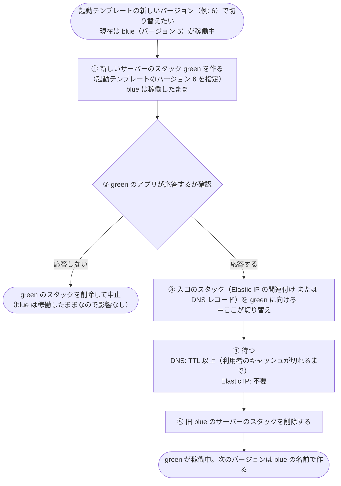

# 候補: ブルーグリーンによる無停止の切り替え（フェーズ 2）

> 位置付け: **候補（未決定）**。現状の運用と照らし合わせて確認するための資料。採用が決まったら [設計: フェーズ 2](./design.md) の構成案と決定事項（P1〜P3、P7）に反映する。
>
> 前提: 外部からアクセスできるインスタンスを、起動テンプレートの新しいバージョンのインスタンスに**無停止で**切り替えたい

## 結論

- **DNS なら無停止で切り替えられる。** Elastic IP は、切り替えの瞬間に数秒の中断と既存の接続の切断が起きるため、厳密な無停止にはならない（数秒の中断を許容するなら使える）
- どちらの場合も、「1 つのスタックで起動テンプレートのバージョンを変えて置き換える」方法では無停止にならない。**新旧のインスタンスを並べて、担当者が切り替える（ブルーグリーン）** 形にする必要がある

## 1 つのスタックでの置き換えでは停止が起きる理由

CloudFormation でインスタンスを置き換えると、次の順番で自動的に進む。

1. 新しいインスタンスを作る
2. 新しいインスタンスが `running` になった時点で、Elastic IP の関連付けや DNS のレコードを新しいインスタンスに向け直す
3. 古いインスタンスを**すぐに**削除する

| 問題 | 内容 |
|---|---|
| アプリの準備ができる前に切り替わる | `running` は OS の起動状態で、アプリが応答できるかは見ていない |
| 古いインスタンスがすぐ消える | DNS をキャッシュしている利用者は、TTL が切れるまで古い IP に接続し続けるが、その先のインスタンスはもうない |

回避策（AMI の起動処理から準備完了を CloudFormation に通知する仕組み、古いインスタンスを残す `UpdateReplacePolicy: Retain`）はあるが、仕組みが複雑になり、切り替えのタイミングも担当者が握れないため採らない。

## ブルーグリーンの手順

| 手順 | 担当者が行うこと | 問題があったとき |
|---|---|---|
| ① | 空いている色（blue / green）のサーバーのスタックを、新しい起動テンプレートのバージョンを指定して作る | 作成に失敗しても、稼働中の色には影響しない |
| ② | 新しい色のインスタンスで、アプリが応答することを確認する | 新しい色のスタックを削除して中止する |
| ③ | 入口のスタックのパラメーターを新しい色に変えてデプロイする | 入口のスタックを元の色に戻す（旧インスタンスはまだ稼働している） |
| ④ | DNS の場合は TTL 以上待つ | この間も旧インスタンスは稼働しているので、③を戻せる |
| ⑤ | 旧い色のサーバーのスタックを削除する | 削除後は、戻すには旧バージョンで作り直す必要がある |

②の確認と④の待機は、Go のクライアントツールで手順化することもできる（実装言語の方針: クライアント PC で動くツールは Go）。

## スタックの分け方

| スタック | 中身 | 変わるタイミング |
|---|---|---|
| サーバーのスタック（例: `myapp-staging-server-web-01-blue` / `myapp-staging-server-web-01-green`） | インスタンスだけ。起動テンプレートのバージョンをパラメーターで指定し、インスタンス ID を Export する | バージョンを上げるたびに、空いている色で作り直す |
| 入口のスタック（例: `myapp-staging-entry-web-01`） | Elastic IP の関連付け、または Route 53 のレコード。どの色に向けるかをパラメーターで指定する | 切り替えのときだけ |

- 入口のスタックは、向けている色のサーバーのスタックの Export（インスタンス ID）を `Fn::ImportValue` で参照する
- CloudFormation の仕様で、**参照されている間はそのサーバーのスタックを削除できない**。稼働中の色を切り替え前に誤って削除する事故を防げる
- 起動テンプレートの ID は、フェーズ 1 の起動テンプレートのスタックの Export を参照する（バージョンは Export しない。[設計: 注意 1](./design.md#注意-1-export-するのは起動テンプレートの-id-だけにする)）

## 切り替えの方式の比較

| | DNS（Route 53） | Elastic IP |
|---|---|---|
| 切り替えの速さ | 利用者のキャッシュが切れるまで（TTL。事前に 60 秒程度に下げておく） | 数秒 |
| 切り替え中のリクエスト | TTL の間は新旧の両方に届く。両方が動いていれば**取りこぼしなし** | 付け替えの数秒間は届かない |
| 既存の接続 | 旧インスタンスを TTL 以上残せば、そのまま完了する | **付け替えの瞬間に切れる** |
| 無停止か | **無停止にできる**（④で TTL 以上待ってから旧を削除する） | 数秒の中断を許容するなら可 |
| 向いているケース | 利用者が DNS 名で接続している | 利用者が IP アドレスで直接接続している |
| 注意点 | TTL を守らない利用者（長時間キャッシュするクライアント）がいると、旧を削除した後にエラーになる | 付け替えの瞬間の中断は避けられない |

### 組み合わせ

利用者は DNS 名で接続し、DNS は各色の Elastic IP を指す形もできる。各色に Elastic IP を 1 つずつ持たせ、切り替えは DNS だけで行う。

- 利点: 各色の IP アドレスが固定になり、許可リスト（相手側のファイアウォールなど）に登録しておける
- 注意: Elastic IP が 2 つ必要になる（未使用の Elastic IP にも料金がかかる）

## 補足: 切り替え時の取りこぼしを完全になくしたい場合

ロードバランサー（ALB）を前に置くのが標準的な方法。

| 項目 | 内容 |
|---|---|
| 切り替え | 新しいインスタンスのヘルスチェックが通ってから振り分けを始める |
| 旧インスタンス | 処理中のリクエストを終えるまで待ってから外す（接続のドレイニング） |
| DNS のキャッシュ | 利用者は ALB に接続するため、TTL を守らない利用者の影響を受けない |
| 代償 | ALB の料金（月に数千円程度から）と構成が増える |

## 現状の運用と照らして確認すること

| # | 確認すること | 判断に使う |
|---|---|---|
| 1 | 利用者は DNS 名で接続しているか、IP アドレスで直接接続しているか | DNS / Elastic IP / 組み合わせの選択 |
| 2 | 相手側で IP アドレスの許可リストに登録しているか | Elastic IP（固定 IP）が必要か |
| 3 | 数秒の中断（切り替えの瞬間の接続切断）を許容できるか | Elastic IP だけで足りるか |
| 4 | DNS の TTL を下げられるか（現在の TTL はいくつか） | DNS での切り替えにかかる時間 |
| 5 | 長時間 DNS をキャッシュする利用者（古い SDK、組み込み機器など）がいるか | DNS だけで無停止にできるか、ALB が必要か |
| 6 | 切り替え中に新旧 2 台が同時に動いても問題ないか（定期実行ジョブの二重実行、ローカルに保存しているデータなど） | ブルーグリーンが取れるか |
| 7 | ALB の追加（料金・構成）を許容できるか | 取りこぼしを完全になくす必要がある場合 |
