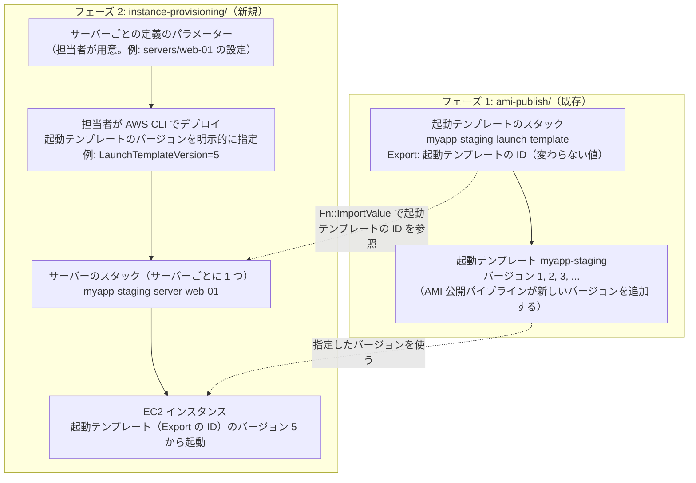

# 設計: フェーズ 2 — 起動テンプレートを使ったインスタンスの構築

> 状態: **設計中（未実装）**。全体の中での位置付けは [全体像](../README.md#全体像)、このフォルダの概要は [README](./README.md)。
>
> スコープ: フェーズ 1（[`ami-publish/`](../ami-publish/README.md)）が用意した起動テンプレートの、**バージョンを明示的に指定して**、インスタンスを構築する・既存インスタンスを新しいバージョンにする仕組み
>
> スコープ外: Auto Scaling グループ（[メモ](../launch-template-auto-scaling-readiness-memo.md)）、アプリのリリース検証（フェーズ 3）

## 実現したいこと

| # | 要件 |
|---|---|
| 1 | **AMI と起動テンプレートの公開（フェーズ 1）とは連動しない**。新しい起動テンプレートのバージョンができても、インスタンスは自動では変わらない。担当者が明示的に実行したときだけ構築・更新する |
| 2 | 担当者が**サーバーごとに定義のパラメーター**（サーバー名、サブネット、インスタンスタイプなど）を用意する |
| 3 | 構成は **CloudFormation** で管理する |
| 4 | 使う起動テンプレートは、フェーズ 1 の起動テンプレートのスタックが **Export** したものを参照し、**バージョンは担当者が CloudFormation のデプロイコマンドで明示的に指定する** |
| 5 | バージョンを指定した起動テンプレートから、**インスタンスを新しく構築**する |
| 6 | 既存のインスタンスを、バージョンを指定した起動テンプレートのインスタンスに**アップグレード、または置き換え**る |

## 構成案



- **サーバーのスタック**: サーバー 1 台につき 1 つの CloudFormation スタック（例: `myapp-staging-server-web-01`）。中身は EC2 インスタンスと、サーバー固有のリソース（必要に応じて DNS レコード、Elastic IP の関連付けなど）。
- **起動テンプレートの参照**: 起動テンプレートの ID は、フェーズ 1 のスタックの Export を `Fn::ImportValue` で参照する。バージョンはスタックのパラメーター（例: `LaunchTemplateVersion`）で、担当者がデプロイ時に指定する。
- **フェーズ 1 とは連動しない**: AMI 公開パイプラインが起動テンプレートに新しいバージョンを追加しても、サーバーのスタックのパラメーターは変わらない。インスタンスが変わるのは、担当者がバージョンを指定してデプロイしたときだけ。
- **パラメーターの用意と生成**: 実装言語の方針（クライアント PC で動くツールは Go）に合わせ、フェーズ 1 と同じく、サーバーごとの定義を設定値ファイルに書き、Go のツールでテンプレートやパラメーターのファイルを生成して、レビューしてから AWS CLI でデプロイする形を想定する（[決定事項](#決定が必要なこと) P5）。

## 注意 1: Export するのは「起動テンプレートの ID」だけにする

要件 4 の「Export のバージョン」を、起動テンプレートの**バージョン番号そのもの**の Export と解釈すると、フェーズ 1 のパイプラインが動かなくなる。

- CloudFormation では、**他のスタックが `Fn::ImportValue` で参照している Export の値は変更できない**（参照しているスタックがある間、Export 元のスタックの更新がエラーになる）。
- 起動テンプレートの最新バージョン番号は、AMI 公開パイプラインが AMI を公開するたびに変わる。これを Export してサーバーのスタックが参照すると、**次の AMI 公開で起動テンプレートのスタックの更新が失敗する**。

そこで、次のように分ける。

| 値 | 扱い |
|---|---|
| 起動テンプレートの ID | フェーズ 1 のスタックから **Export する**（作成後に変わらないので、参照されていても問題ない） |
| 起動テンプレートのバージョン | Export しない。**担当者がサーバーのスタックのパラメーターとして明示的に指定する**（要件 1・4 の「明示的に指定」「連動しない」にもこの形が合う） |

どのバージョンがどの AMI・アプリのバージョンかは、起動テンプレートのバージョンの説明（例: `myapp v1.2.3`）や、AMI 公開パイプラインの出力（`LAUNCH_TEMPLATE_VERSION`）で確認する。

**フェーズ 1 への影響**: 起動テンプレートのスタックに、起動テンプレートの ID の Export を追加する（`internal/definitions/launch_template_stack.go` の `Outputs`）。Export の追加は出力の変更で、リソースの変更ではないため、AMI 公開パイプラインの差分の検証（起動テンプレートの変更だけを許可）には影響しない。追加後に担当者が起動テンプレートのスタックを再デプロイする。

## 注意 2: バージョンを変えると、インスタンスは「置き換え」になる

CloudFormation の `AWS::EC2::Instance` で、起動テンプレート（ID またはバージョン）を変えてスタックを更新すると、**インスタンスの置き換え（Replacement）** になる。既存のインスタンスの中身を新しい AMI に入れ替える「アップグレード」にはならない。

置き換えで起きること:

| 項目 | 置き換え後 |
|---|---|
| インスタンス ID | 変わる |
| プライベート IP アドレス | 変わる（固定したい場合は下記） |
| ルートボリュームのデータ | 新しい AMI の内容になり、古いインスタンスのデータは失われる |
| 順番 | CloudFormation は**新しいインスタンスを作ってから古いインスタンスを削除する** |

このため、サーバーの「同一性」をどう保つかを決める必要がある（[決定事項](#決定が必要なこと) P2）。無停止で切り替えたい場合の方式は [候補: ブルーグリーンによる無停止の切り替え](./blue-green-switching-candidate.md) にまとめた（未決定）。

| 保ちたいもの | 方法 | 注意 |
|---|---|---|
| 接続先の名前 | サーバーのスタックに Route 53 のレコードを含め、新しいインスタンスの IP を指す | 最も素直。利用側は IP ではなく名前で接続する |
| 公開 IP | Elastic IP をスタックの外で確保し、関連付け（`AWS::EC2::EIPAssociation`）をスタックに含める | 置き換え時に新しいインスタンスへ付け替わる |
| プライベート IP | 固定のネットワークインターフェイスを使う | 「新しいインスタンスを作ってから古いものを削除する」順番のため、**同じネットワークインターフェイスや IP を同時に 2 台に付けられず、置き換えが失敗する**。固定は避けるのが望ましい |
| データ | データはインスタンスの外（RDS、S3、EFS）に置く | ルートボリュームやインスタンスに付けた EBS に置くと、置き換えで失われるか、付け替えの工夫が必要 |

## 要件 6 の「アップグレード」と「置き換え」

| 方法 | 内容 | CloudFormation との関係 | 評価 |
|---|---|---|---|
| **A. 置き換え（推奨）** | サーバーのスタックの `LaunchTemplateVersion` を変えてデプロイ。新しいインスタンスが作られ、古いインスタンスが削除される | スタックの定義と実際の状態が一致する | 要件 3・4 の形そのもの。インスタンス ID と IP が変わる前提にできれば最も単純 |
| B. ルートボリュームの入れ替え（アップグレード） | EC2 の「ルートボリュームの置き換え」機能で、既存インスタンスのルートボリュームを新しい AMI から作り直す。インスタンス ID・IP・ネットワークインターフェイスは変わらない（再起動は発生する） | CloudFormation の外の操作になる。スタックの `LaunchTemplateVersion` と実際の AMI がずれるため、ツールで両方を揃える工夫が必要 | 同一性を保てるが、仕組みが複雑になる。起動テンプレートの AMI 以外の設定（インスタンスタイプなど）は反映されない |
| C. 既存のインスタンスをスタックに取り込む | CloudFormation の管理下にない既存インスタンスを、リソースのインポートでサーバーのスタックに取り込み、以降は A で置き換える | 取り込み後は A と同じ | 手作業で作った既存インスタンスを移行するときの手順 |

「アップグレード」がインスタンス ID や IP を変えずに中身を新しくすることを指すなら B が必要になり、置き換え（新しいインスタンス）で問題なければ A だけで要件を満たせる（[決定事項](#決定が必要なこと) P1）。

## 操作の流れ（A を採る場合）

**インスタンスを新しく構築する（要件 5）**

```bash
aws cloudformation deploy --stack-name myapp-staging-server-web-01 \
  --template-file generated/cloudformation/staging/server-stack.yml \
  --parameter-overrides ServerName=web-01 SubnetId=subnet-xxxx LaunchTemplateVersion=5 \
  --no-execute-changeset
# 変更セットを確認して実行
```

**既存インスタンスを新しいバージョンに置き換える（要件 6）**

```bash
aws cloudformation deploy --stack-name myapp-staging-server-web-01 \
  --template-file generated/cloudformation/staging/server-stack.yml \
  --parameter-overrides LaunchTemplateVersion=6 \
  --no-execute-changeset
# 変更セットで「AWS::EC2::Instance が Replacement: True」になっていることを確認してから実行
```

- パラメーターのファイル（`--parameter-overrides file://...` 相当）をサーバーごとに用意し、コマンドに直接値を書かない形にすると、指定したバージョンがレビューと履歴に残る（P5）。
- 変更セットで置き換えの有無を必ず確認する。サーバー固有のパラメーターの変更でも置き換えが起きることがある。

## 決定が必要なこと

| # | 論点 | 選択肢 | 推奨 |
|---|---|---|---|
| P1 | 要件 6 の「アップグレード」の意味 | 置き換え（新しいインスタンス）で足りる / インスタンス ID・IP を保つ必要がある | 置き換え（A）で足りるなら、B は作らない |
| P2 | 置き換え後の同一性の保ち方 | DNS（Route 53）/ Elastic IP / 保たない | DNS。プライベート IP の固定は避ける |
| P3 | サーバーのスタックに含めるもの | インスタンスだけ / DNS レコード・Elastic IP の関連付けも | P2 に合わせて最小限 |
| P4 | サーバーごとのパラメーター | サブネット、インスタンスタイプ（起動テンプレートの上書き）、名前のタグ、追加の EBS など | 起動テンプレートと重複する設定は、上書きが必要なものだけにする |
| P5 | パラメーターの持ち方と生成 | フェーズ 1 と同じく設定値ファイル + Go の生成ツール / パラメーターのファイルを手で書く | 設定値ファイル + Go の生成ツール（フェーズ 1 と揃え、レビューしやすくする） |
| P6 | 既存インスタンスの扱い | スタックに取り込む（C）/ 新しく構築して移行し、古いものは手で削除 | 台数と、既存インスタンスに残すべきデータの有無で決める |
| P7 | 置き換え時の停止時間 | 許容する / 新旧を並べて切り替える | 単体構成では、新しいインスタンスの起動からヘルスチェックまでの間、切り替えのタイミングを担当者が管理する |

## フェーズ 1 側で必要になる変更

| 変更 | 内容 |
|---|---|
| 起動テンプレートの ID の Export | 起動テンプレートのスタックの `Outputs` に `Export` を追加（例: `myapp-staging-launch-template-id`）。命名規則は Go と Ruby の両方に実装する |
| 起動テンプレートのスタックの再デプロイ | Export を追加したテンプレートを担当者がデプロイする |

起動テンプレートの**バージョンは Export しない**（注意 1）。
