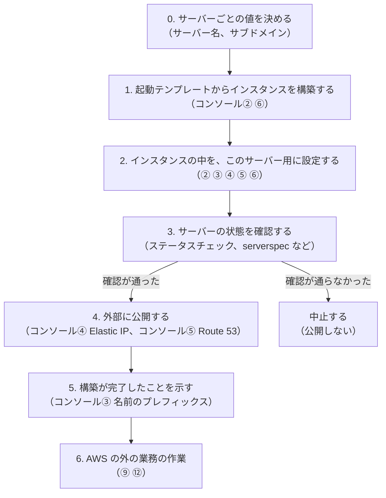

# 現状の手作業によるインスタンスの構築手順の整理（フェーズ 2）

> 位置付け: フェーズ 2 の仕組み化に向けて、担当者が今手作業で行っているインスタンスの構築手順を、作業の性質ごとに並べ直した整理。採用済みの設計ではない。決まったことは [設計: フェーズ 2](./design.md) の構成案と決定事項（P1〜P7）に反映する。
>
> スコープ: AMI からインスタンスを起動し、サーバー固有の設定をして、Elastic IP と Route 53 のレコードで公開するまで
>
> スコープ外: Let's Encrypt の証明書の発行・Apache の SSL 設定・証明書の自動更新（どの段階で何をするかは [補足: 構築の流れの中で Let's Encrypt の証明書をいつ扱うか](../notes/instance-provisioning/letsencrypt-certificate-timing.md)。自動化そのものは [EC2 での Let's Encrypt 証明書発行・初期設定の自動化](../notes/ec2-operations/letsencrypt-automation.md)）

## 現状の手作業の手順

担当者から共有された手順をそのまま並べる（番号は元の手順のもの。以下の整理でもこの番号で参照する）。

**AWS コンソールでの作業**

| 番号 | 作業 | 内容 |
|---|---|---|
| コンソール① | AWS コンソールにログイン | IAM ユーザーでログインする |
| コンソール② | EC2 インスタンスの作成 | AMI `v1.X.X…_yyyymmdd` を選び「AMI からインスタンスを起動」。名前、インスタンスタイプ（t3a.medium）、キーペア、既存のセキュリティグループを指定する |
| コンソール⑥ | タグの追加 | EC2 インスタンスにタグを追加する |
| （起動後） | インスタンスの起動の確認 | ステータスチェックが「3/3 のチェックに合格しました」になるのを待つ |
| コンソール③ | インスタンスの名前の変更 | 名前の先頭の `t3a` を外す。このプレフィックスで「作成途中のインスタンス」かどうかを見分けている |
| コンソール④ | Elastic IP アドレスの割り当て | Amazon の IPv4 アドレスプールから確保し、Name をインスタンス名に揃え、インスタンスに関連付ける |
| コンソール⑤ | ドメインの設定 | Route 53 の指定のホストゾーンに、サブドメインのレコードを作る。レコード名はアプリ名を含めた規則に従い、値は Elastic IP |

**SSH でログインしてからの作業**

| 番号 | 作業 | この整理での扱い |
|---|---|---|
| ① | SSH でログイン | |
| ② | ホスト名の設定（`sudo hostnamectl`） | |
| ③ | Apache の VirtualHost の ServerName の設定 | |
| ④ | アプリ（SmapaWorktools）のメール設定のホスト名（アプリ内の config ファイル） | |
| ⑤ | centos ユーザーの `~/.bashrc` の設定 | |
| ⑥ | root ユーザーの `~/.bashrc` の設定 | |
| ⑦ | 証明書の発行（Let's Encrypt。`certbot certonly --webroot`） | **スコープ外** |
| ⑧ | Apache の設定（`rails.conf` の `SSLEngine on`） | **スコープ外** |
| ⑨ | WebUI の作成（接続の確認と、物件リスト管理シートへの物件としての追加） | |
| ⑩ | 証明書の自動更新の設定（`certbot renew ... --post-hook "systemctl reload httpd"`） | **スコープ外** |
| ⑪ | （欠番） | |
| ⑫ | WebUI へのグローバル IP の登録（サイトにログインし、サイトの機能から登録） | |

## 整理した流れ

元の手順の順番にはこだわらず、作業の性質ごとに 7 つの段階に並べ直す。



### 0. サーバーごとの値を決める

| 値 | 使う場所 |
|---|---|
| サーバー名 | インスタンスの Name タグ、Elastic IP の Name |
| サブドメイン（アプリ名を含む規則で決める） | Route 53 のレコード名、ホスト名、Apache の ServerName、メール設定のホスト名 |
| サービス名など、`.bashrc` のカスタマイズに使う値 | シェルのプロンプトなど |

インスタンスの中の設定（段階 2）は、ほとんどがこの数個の値から決まる。サブドメインは、サーバー名とアプリ名から規則で決まる見込み。

### 1. 起動テンプレートからインスタンスを構築する

| 手作業（番号） | 内容 | 今の起動テンプレート（フェーズ 1）での扱い |
|---|---|---|
| コンソール② | AMI | 入っている（AMI 公開パイプラインが更新する） |
| コンソール② | インスタンスタイプ（t3a.medium） | 入っている（設定値 `launch_template.instance_type`） |
| コンソール② | セキュリティグループ | 入っている（設定値 `launch_template.security_group_ids`） |
| コンソール② | キーペア | **入っていない**。サーバーごとに指定するか、起動テンプレートに足すか、SSM の Session Manager に移して不要にするかを決める |
| コンソール② | 名前 | 入っていない（サーバーごとの値） |
| コンソール⑥ | タグ | `App` と `AppVersion` だけ入っている。ほかのタグはサーバーごとに足す |

### 2. インスタンスの中を、このサーバー用に設定する

| 手作業（番号） | 内容 |
|---|---|
| ② | ホスト名 |
| ③ | Apache の VirtualHost の ServerName |
| ④ | アプリ（SmapaWorktools）のメール設定のホスト名 |
| ⑤ | centos ユーザーの `.bashrc` |
| ⑥ | root ユーザーの `.bashrc` |

- どれも段階 0 の値だけで設定でき、Elastic IP や DNS は必要ない。そのため、公開（段階 4）より前に置く。元の手順で SSH の作業が最後にあるのは、Elastic IP を使って接続するためと考えられる。SSM を使えば公開前でも設定できる
- AMI は作成元のリリース用インスタンスから作るため、ここで扱う値は**作成元の値のまま AMI に入っている**。この段階は「設定する」というより「サーバーの値で上書きする」作業になる

### 3. サーバーの状態を確認する

| 手作業（番号） | 内容 |
|---|---|
| （起動後） | ステータスチェックが「3/3 合格」になる |
| 新しく足したいもの | serverspec などで、段階 2 の設定が反映され、アプリが応答するかを確認する |

確認が通らなかったら、段階 4 以降には進まない（公開しない）。

### 4. 外部に公開する

| 手作業（番号） | 内容 |
|---|---|
| コンソール④ | Elastic IP を確保し、Name をインスタンス名に揃えて関連付ける |
| コンソール⑤ | Route 53 に、サブドメインのレコード（値は Elastic IP）を作る |

今の運用では、Elastic IP と DNS の**両方**を使っている。これは [設計: フェーズ 2](./design.md) の論点 P2（置き換え後の同一性の保ち方）と P3（サーバーのスタックに含めるもの）を決めるときの前提になる。

### 5. 構築が完了したことを示す

| 手作業（番号） | 内容 |
|---|---|
| コンソール③ | 名前の先頭の `t3a` を外す（作成途中かどうかの目印） |

仕組み化すれば、作成途中かどうかは CloudFormation のスタックの状態でわかる。この目印は不要になるか、タグなど別の形に置き換えられる。

### 6. AWS の外の業務の作業

| 手作業（番号） | 内容 | 前提 |
|---|---|---|
| ⑨ | WebUI の作成と接続の確認 | 段階 4 の後（HTTPS での確認なら、スコープ外にした証明書の作業にも依存する） |
| ⑨ | 物件リスト管理シートへの物件としての追加 | なし |
| ⑫ | WebUI へのグローバル IP の登録 | 段階 4 で Elastic IP が決まった後 |

CloudFormation の範囲外。手作業で続けるか、API などで別途自動化するかは未定。

## サーバーごとの値を 1 つのファイルにまとめる案

段階 2 の設定は同じ数個の値から決まる。そこで、**設定ファイルそのものはすべてのサーバーで共通にして AMI に入れておき、サーバーごとに違う値だけを 1 つの値のファイル（環境変数）で渡す**。こうすると、段階 2 の作業は「値のファイルを書き、ホスト名を設定する」だけになる。

```
AMI に入れておく（すべてのサーバーで共通）
  ├─ centos ユーザーと root の .bashrc
  │    例: PS1="[${SERVICE_NAME}] \u@\h:\w$ "
  │        （カスタマイズは環境変数を参照する形で書く）
  ├─ Apache の設定（ServerName を変数で参照する）
  └─ アプリのメール設定（ホスト名を環境変数で参照する）

構築のときに用意する（サーバーごと）
  └─ サーバーごとの値のファイル 1 つ（例: /etc/profile.d/server.sh）
       SERVICE_NAME=...
       SERVER_FQDN=...（サブドメイン）
       その他、今サーバーごとに手で入れているカスタマイズの値
```

| 手作業（番号） | 共通にした場合の形 |
|---|---|
| ② ホスト名 | 値のファイルの値で `hostnamectl` を実行する（起動時の処理の中の 1 行） |
| ③ Apache の ServerName | Apache の設定から変数を参照する（`Define` や、値を書いたファイルの `Include`） |
| ④ メール設定のホスト名 | Rails の設定から環境変数（`ENV`）を参照する |
| ⑤⑥ `.bashrc` | 共通の `.bashrc` が環境変数を参照する |

- `/etc/profile.d/` に置いたファイルは、CentOS 系では一般ユーザーにも root にも読み込まれる。centos 用と root 用にサーバーごとの設定を 2 回書く必要がなくなる
- `.bashrc` は、今はプロンプトにサービス名を入れるなど、サーバーごとに個別のカスタマイズが入っている。値の違いだけなら環境変数で吸収できる。処理そのものがサーバーごとに違う場合は、共通の `.bashrc` の中で変数を見て分岐させるか、例外として個別のファイルを足す。今のカスタマイズの具体的な内容は未確認で、分かった時点で一つずつ「環境変数で吸収できるか」を確認する
- ③④⑤⑥を変数で参照する形に書き換えるのは、AMI の作成元（リリース用インスタンス、またはアプリのリポジトリ）での一度だけの準備で、構築の流れの外の作業になる
- 段階 3 の確認（serverspec など）は、「値のファイルどおりにホスト名・ServerName・メール設定・プロンプトが反映されているか」を見ればよくなる

### 値の渡し方

| 方法 | 内容 | 評価 |
|---|---|---|
| **A. 構築時にファイルを書く（推奨）** | CloudFormation のパラメーター（サーバー名など）を UserData に渡し、起動時に値のファイルを 1 回だけ書く | 一度書けば以降は固定。ログインのたびに AWS に問い合わせない |
| B. インスタンスのタグから読む | ログインや起動のたびに、インスタンスメタデータでタグを読む | タグを変えれば反映されるが、インスタンスメタデータでのタグの参照を有効にする必要があり、ログインのたびに問い合わせが走る |

どちらの方法の実装例も [補足: bash プロンプト等のシェル環境カスタマイズの自動化](../notes/ec2-operations/shell-environment-customization.md)（「CloudFormation パラメータで渡す」「インスタンスのタグから取得する」）にある。

## CloudFormation で段階を踏めるか（見立て）

段階 1〜4 は、サーバーのスタック 1 つの中で、順番と「確認が通ったときだけ公開する」条件を表現できる。

| 段階 | CloudFormation での表し方 |
|---|---|
| 1 | `AWS::EC2::Instance`（起動テンプレートの ID は Export を参照し、バージョンはパラメーターで指定。[設計: フェーズ 2](./design.md)） |
| 2 | UserData（または cfn-init）で、サーバーごとの値のファイルを書き、ホスト名を設定する |
| 3 | インスタンスに `CreationPolicy` を付け、UserData の最後で serverspec などを実行し、結果を `cfn-signal` で返す（[起動処理の完了判定](../notes/ec2-operations/cfn-s3-userdata-provisioning.md#3-起動処理の完了判定creationpolicy--cfn-signal)） |
| 4 | `AWS::EC2::EIPAssociation` と `AWS::Route53::RecordSet` をインスタンスに依存させる（`DependsOn`、または値の参照による暗黙の依存） |

- 失敗のシグナルが返るか、タイムアウトすると、インスタンスの作成が失敗し、スタックはロールバックされる（インスタンスは削除される）。Elastic IP の関連付けと DNS のレコードは作られない
- Elastic IP の確保そのもの（`AWS::EC2::EIP`）をスタックの中に置くか外に置くかは、置き換え時に IP を保つかどうか（論点 P2）で決める。スタックの中で確保すると、スタックの削除で IP も解放される
- 段階 5 の目印は、スタックの状態（`CREATE_COMPLETE`）で置き換えられる
- 段階 6 は範囲外

## 確認したいこと

| # | 内容 | 影響する段階 |
|---|---|---|
| Q1 | `.bashrc` の今のカスタマイズの具体的な内容（環境変数で吸収できるか） | 2 |
| Q2 | ⑨の接続の確認は HTTPS で行うか（スコープ外にした証明書の作業に依存するか） | 6 |
| Q3 | ⑫の「グローバル IP」は段階 4 の Elastic IP のことか。何のために登録しているか | 6 |
| Q4 | SSH とキーペアを使い続けるか、SSM の Session Manager に移すか | 1 |
| Q5 | 名前のプレフィックス `t3a` は、インスタンスタイプとは関係なく、作成途中の目印としてだけ使っているか | 5 |
| Q6 | OS は CentOS 系か（既存の自動化のドキュメントの例は Amazon Linux 2023 前提） | 2 |
