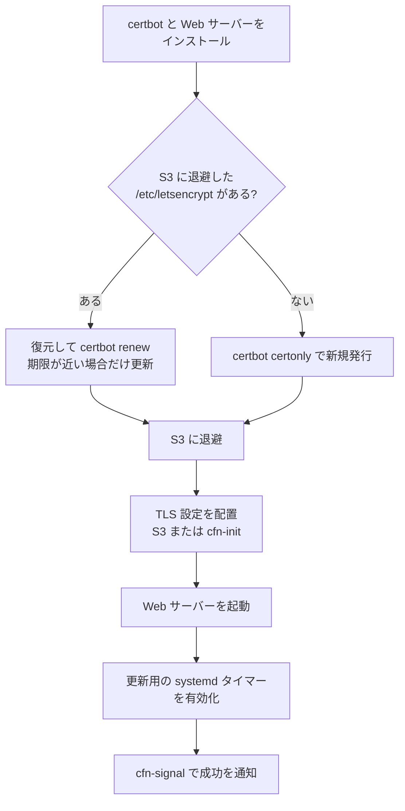

# EC2 での Let's Encrypt 証明書発行・初期設定の自動化

> スコープ: CloudFormation + UserData（または cfn-init）で作成する EC2 インスタンス上で、Let's Encrypt の証明書を発行し、Web サーバーの TLS 設定と自動更新までを無人で行う設計
>
> スコープ外: 有償の商用 CA、社内 CA（AWS Private CA）、Web サーバー自体のチューニング
>
> 関連: [EC2 へのファイル配備 — CloudFormation + S3 + UserData](./cfn-s3-userdata-provisioning.md)

## 結論

**自動化できる。** certbot などの ACME クライアントを UserData（または cfn-init）から非対話モードで実行すれば、証明書の発行、Web サーバーへの設定、定期更新までを人手を介さずに構築できる。

ただし、Let's Encrypt は「そのドメインを本当に管理しているか」をインターネット側から検証するため、EC2 単体で完結する処理ではない。次の点を設計に含める必要がある。

| # | 論点 | 必要な対応 |
|---|---|---|
| 1 | ドメイン検証方式 | **Route 53 を使っているなら DNS-01 を推奨**。HTTP-01 は DNS レコードとポート 80 の公開が発行前に揃っている必要があり、起動時の順序制御が難しい |
| 2 | レート制限 | インスタンスを置換するたびに発行し直すと、同一ドメインの発行上限（週 5 回）にすぐ達する。**証明書を S3 等に退避して再利用**する |
| 3 | 起動順序 | 証明書がないと TLS 設定の Web サーバーは起動できない。「発行 → 設定配置 → 起動」の順にする |
| 4 | 更新 | certbot の導入方法によっては更新タイマーが入らない。systemd タイマーを明示的に作り、更新後の reload もフックで行う |
| 5 | 期限監視 | Let's Encrypt は期限切れ通知メールを 2025 年に廃止している。自前で監視する |

また、**ロードバランサー（ALB / NLB）や CloudFront を前段に置く構成なら、Let's Encrypt ではなく ACM（AWS Certificate Manager）を使う方がよい**。ACM の公開証明書は無料で、更新も AWS が自動で行い、EC2 側に証明書を置く必要がない（[ACM との使い分け](#acm-との使い分け)）。

## 前提知識

### ACME と certbot

Let's Encrypt は ACME プロトコルで証明書を発行する。クライアントが証明書を要求すると、CA は「チャレンジ」を提示し、クライアントがそれに応えることでドメインの管理権限を証明する。

ACME クライアントは複数あるが、本ドキュメントでは最も一般的な **certbot** を前提とする（ほかに acme.sh、lego などがある）。certbot の主要なサブコマンドは次のとおり。

| コマンド | 用途 |
|---|---|
| `certbot certonly` | 証明書を取得するだけで、Web サーバーの設定は変更しない |
| `certbot --nginx` / `--apache` | 取得に加えて Web サーバーの設定ファイルを自動で書き換える |
| `certbot renew` | 期限が近い（既定では残り 30 日未満の）証明書をすべて更新する。期限に余裕があれば何もしない |

自動化では **`certonly` を使い、Web サーバーの設定ファイルは自分で管理する**ことを推奨する。`--nginx` プラグインによる書き換えは結果が環境に依存し、S3 や cfn-init で配る設定ファイルと競合するため、再現性が下がる。

### ドメイン検証方式（チャレンジ）

| 方式 | 仕組み | 必要な条件 | ワイルドカード | EC2 自動化での評価 |
|---|---|---|---|---|
| **HTTP-01** | CA が `http://<ドメイン>/.well-known/acme-challenge/<token>` にアクセスして確認 | ドメインの DNS がそのインスタンスを指している。インターネットからポート 80 に到達できる | 不可 | 発行前に DNS とセキュリティグループが揃っている必要があり、起動時の順序制御が難しい。複数台構成では検証リクエストが別のインスタンスに届いて失敗する |
| **DNS-01** | CA が `_acme-challenge.<ドメイン>` の TXT レコードを確認 | DNS の API を操作できる（Route 53 なら IAM 権限） | 可 | インバウンドの公開が不要で、プライベートサブネットでも発行できる。起動順序の問題が起きにくい。**推奨** |
| TLS-ALPN-01 | ポート 443 の TLS ハンドシェイクで確認 | インターネットからポート 443 に到達できる | 不可 | certbot は標準で対応していない。通常は使わない |

HTTP-01 の検証は Let's Encrypt の複数の拠点から行われるため、セキュリティグループでポート 80 の送信元を絞ることはできない（`0.0.0.0/0` を許可する必要がある）。

### 証明書の有効期間と Let's Encrypt の運用変更

- 証明書の有効期間は現在 **90 日**。Let's Encrypt はこれを段階的に短縮し、最終的に 45 日にする計画を公表している。いずれにしても、更新は手作業ではなく自動で行う前提にする。
- **期限切れ通知メールは 2025 年 6 月に廃止された。** 登録したメールアドレスに通知は来ないため、期限監視は自前で行う。
- 本番環境と別に**ステージング環境**がある。証明書はブラウザに信頼されないが、レート制限が大幅に緩い。自動化スクリプトの試験中は `--test-cert`（`--staging`）を付けて実行する。

### レート制限

Let's Encrypt には発行数などの上限がある。値は変更されることがあるため、正確な値は[公式ドキュメント](https://letsencrypt.org/docs/rate-limits/)で確認すること。EC2 の自動化で問題になるのは主に次の 2 つ。

| 制限 | 内容（執筆時点） | 影響 |
|---|---|---|
| 同一ドメイン集合の新規証明書 | まったく同じドメイン名の組み合わせに対して **7 日間で 5 枚** | 起動のたびに発行する設計では、置換やスタックの作り直しを繰り返すとすぐに達する |
| 登録ドメインあたりの新規証明書 | 登録ドメイン（例: `example.com`）あたり 7 日間で 50 枚 | サブドメインを大量に使う場合に影響する |

上限に達すると、しばらくの間その証明書は発行できない。**証明書は「起動のたびに発行する」のではなく「一度発行したものを保存して再利用し、期限が近いときだけ更新する」**ように設計する（[証明書の永続化](#4-証明書の永続化インスタンス置換への対応)）。

## 設計

### 1. 検証方式の選択

| 構成 | 推奨 |
|---|---|
| DNS が Route 53 で管理されている | **DNS-01**（`certbot-dns-route53` プラグイン） |
| DNS が Route 53 以外で、API がある（Cloudflare 等） | DNS-01（各 DNS 用のプラグイン。API トークンは Secrets Manager で管理） |
| DNS を API で操作できない、単体インスタンス、パブリックサブネット | HTTP-01（Elastic IP を事前に割り当て、DNS レコードを先に作る） |
| 複数台（Auto Scaling）で同じドメインを受ける | ACM + ロードバランサーを使う。どうしても EC2 に証明書を置くなら、DNS-01 で一か所から発行して各インスタンスに配布する |

### 2. IAM 権限

#### DNS-01（Route 53）

`certbot-dns-route53` には次の権限が必要である。`ChangeResourceRecordSets` は、条件キーで**対象レコード名と TXT タイプに限定**できる。インスタンスが乗っ取られてもホストゾーンの他のレコードを書き換えられないようにする。

```json
{
  "Version": "2012-10-17",
  "Statement": [
    {
      "Effect": "Allow",
      "Action": ["route53:ListHostedZones", "route53:GetChange"],
      "Resource": "*"
    },
    {
      "Effect": "Allow",
      "Action": "route53:ChangeResourceRecordSets",
      "Resource": "arn:aws:route53:::hostedzone/Z0123456789ABCDEFGHIJ",
      "Condition": {
        "ForAllValues:StringEquals": {
          "route53:ChangeResourceRecordSetsNormalizedRecordNames": ["_acme-challenge.app.example.com"],
          "route53:ChangeResourceRecordSetsRecordTypes": ["TXT"]
        }
      }
    }
  ]
}
```

#### 証明書の保存先

証明書を S3 に退避する場合は、その保存先キーに対する `s3:GetObject` / `s3:PutObject` と、SSE-KMS の場合は `kms:Decrypt` / `kms:GenerateDataKey` を付与する。

### 3. ネットワーク

- インスタンスから Let's Encrypt の API（`acme-v02.api.letsencrypt.org`）への**アウトバウンド HTTPS** が必要。これに使える VPC エンドポイントはないため、プライベートサブネットでは NAT ゲートウェイが必須になる。
- DNS-01 で Route 53 を使う場合は、Route 53 API へのアウトバウンド HTTPS も必要（通常は NAT 経由）。
- HTTP-01 の場合は、インターネットからポート 80 へのインバウンドが必要（前述のとおり送信元は絞れない）。発行後も更新のたびに必要になるので、発行後に閉じることもできない。

### 4. 証明書の永続化（インスタンス置換への対応）

certbot の状態は `/etc/letsencrypt/` 以下にすべて保存される。

| パス | 内容 |
|---|---|
| `accounts/` | ACME アカウントの秘密鍵 |
| `archive/<ドメイン>/` | 証明書・秘密鍵の実体（世代ごと） |
| `live/<ドメイン>/` | 最新世代へのシンボリックリンク（Web サーバーはここを参照） |
| `renewal/<ドメイン>.conf` | 更新時の設定（検証方式、フックなど） |

インスタンスを置換するとこれが消え、再発行が必要になり、レート制限に達する原因になる。次のいずれかで永続化する。

| 方式 | 内容 | 評価 |
|---|---|---|
| **S3 に退避・復元** | 発行・更新後に `/etc/letsencrypt` を tar で固めて S3（SSE-KMS）に保存する。起動時に復元し、`certbot renew` で期限が近いときだけ更新する | 単体インスタンスでは最もシンプル。**推奨** |
| EFS をマウント | `/etc/letsencrypt` を EFS に置く | 複数台で共有できるが、構成が重くなる |
| 集中発行 | Lambda（EventBridge Scheduler で定期実行）などで DNS-01 により発行し、Secrets Manager / S3 に保存。各インスタンスは取得するだけ | 複数台・複数環境向け。インスタンスに Route 53 権限が不要になる |

`/etc/letsencrypt` には秘密鍵が含まれるため、保存先のバケットは[関連ドキュメント](./cfn-s3-userdata-provisioning.md#バケットの基本設定)と同様にパブリックアクセスブロック、暗号化、TLS 強制を設定し、アクセスできるロールを限定する。成果物の配布用バケットとは分けるのが望ましい。

### 5. 起動時の処理順序

TLS の設定を含む Web サーバーは、証明書ファイルがないと起動に失敗する。UserData では次の順序で処理する。



HTTP-01 の場合、Web サーバー起動前はポート 80 が空いているため `--standalone`（certbot が一時的にポート 80 で待ち受ける）を使える。ただし更新時には Web サーバーがポート 80 を使っているため、更新は `--webroot` にする必要がある。初回から「HTTP のみの設定で Web サーバーを起動 → `--webroot` で発行 → TLS 設定を追加して reload」とすると、発行と更新の方式が揃う。DNS-01 ならこの問題は起きない。

### 6. 自動更新

- `certbot renew` を **1 日 2 回**実行する（certbot の推奨）。期限に余裕があれば何もしないので、頻繁に実行しても問題ない。
- certbot を snap や OS パッケージで入れると更新用の systemd タイマーが同梱されることが多いが、**pip で入れた場合は含まれない**ので自分で作る。
- 更新後の Web サーバーの reload は `--deploy-hook` で指定する。発行時に指定したフックは `renewal/<ドメイン>.conf` に保存され、以降の `renew` でも実行される。deploy hook は**実際に更新されたときだけ**実行される。
- 永続化している場合は、deploy hook の中で S3 への退避も行う。

### 7. 期限監視

Let's Encrypt からの期限通知メールはないため、自動更新が失敗し続けても気付けない。次のいずれかで監視する。

- 外形監視（Route 53 ヘルスチェックや外部の監視サービス）で証明書の残り日数を確認する。
- インスタンス上で残り日数を計算し、CloudWatch のカスタムメトリクスとして送信してアラームを設定する（例: 残り 20 日未満で通知。更新は残り 30 日で始まるため、20 日を切っているなら更新が 10 日間失敗し続けている）。
- certbot の更新用サービスの失敗を CloudWatch Logs などで検知する。

### 8. AMI 側の前提

| 環境 | certbot の導入方法 |
|---|---|
| Amazon Linux 2023 | EPEL が使えず snap もないため、**Python の venv に pip で導入**するのが確実（certbot 公式の pip 手順）。dnf で提供されているかは AL2023 のバージョンにより異なるので確認する |
| Ubuntu | snap（certbot 公式推奨）または apt |

インストールは起動時間と外部リポジトリへの到達性に影響する。起動を速くしたい場合は certbot をカスタム AMI に焼き込む（証明書そのものは焼き込まない）。

## 実装例（Amazon Linux 2023 + nginx + DNS-01 / Route 53）

IAM ロール、インスタンスプロファイル、`CreationPolicy` など共通部分は[関連ドキュメントの実装例](./cfn-s3-userdata-provisioning.md#実装例)を前提とし、ここでは UserData の中身だけを示す。

```bash
#!/bin/bash
set -euo pipefail

REGION=ap-northeast-1
DOMAIN=app.example.com
EMAIL=ops@example.com
BACKUP=s3://my-cert-bucket/letsencrypt/${DOMAIN}.tar.gz
CERTBOT_OPTS=""   # 試験中は "--test-cert" にする（ステージング環境）

# --- 1. インストール ---
dnf install -y nginx python3 augeas-libs
python3 -m venv /opt/certbot
/opt/certbot/bin/pip install --upgrade pip
/opt/certbot/bin/pip install certbot certbot-dns-route53
ln -sf /opt/certbot/bin/certbot /usr/bin/certbot

# --- 2. S3 への退避処理（deploy hook からも呼ぶ） ---
cat > /usr/local/bin/letsencrypt-backup <<EOF
#!/bin/bash
set -euo pipefail
tar -czf /tmp/letsencrypt.tar.gz -C /etc letsencrypt
aws s3 cp /tmp/letsencrypt.tar.gz ${BACKUP} --region ${REGION} --sse aws:kms
rm -f /tmp/letsencrypt.tar.gz
EOF
chmod 700 /usr/local/bin/letsencrypt-backup

# --- 3. 復元 or 新規発行 ---
if aws s3 cp "$BACKUP" /tmp/letsencrypt.tar.gz --region "$REGION" 2>/dev/null; then
  tar -xzf /tmp/letsencrypt.tar.gz -C /etc
  rm -f /tmp/letsencrypt.tar.gz
  certbot renew --non-interactive --no-random-sleep-on-renew
else
  certbot certonly $CERTBOT_OPTS \
    --dns-route53 -d "$DOMAIN" \
    --non-interactive --agree-tos -m "$EMAIL" \
    --deploy-hook "/usr/local/bin/letsencrypt-backup; systemctl reload nginx || true"
fi
/usr/local/bin/letsencrypt-backup

# --- 4. TLS 設定を配置して起動 ---
# 設定ファイルは S3 や cfn-init で配る方がよい。ここでは例として直接書く
cat > /etc/nginx/conf.d/app.conf <<EOF
server {
    listen 443 ssl;
    server_name ${DOMAIN};
    ssl_certificate     /etc/letsencrypt/live/${DOMAIN}/fullchain.pem;
    ssl_certificate_key /etc/letsencrypt/live/${DOMAIN}/privkey.pem;
    root /usr/share/nginx/html;
}
server {
    listen 80;
    server_name ${DOMAIN};
    return 301 https://\$host\$request_uri;
}
EOF
nginx -t
systemctl enable --now nginx

# --- 5. 自動更新タイマー ---
cat > /etc/systemd/system/certbot-renew.service <<'EOF'
[Unit]
Description=Renew Let's Encrypt certificates

[Service]
Type=oneshot
ExecStart=/usr/bin/certbot renew --quiet
EOF
cat > /etc/systemd/system/certbot-renew.timer <<'EOF'
[Unit]
Description=Run certbot renew twice daily

[Timer]
OnCalendar=*-*-* 00,12:00:00
RandomizedDelaySec=1h
Persistent=true

[Install]
WantedBy=timers.target
EOF
systemctl daemon-reload
systemctl enable --now certbot-renew.timer
```

ポイント:

- この UserData を CloudFormation の `!Sub` に入れる場合、シェルの `${DOMAIN}` などは CloudFormation の置換対象になる。CloudFormation のパラメータとして渡すか、`${!DOMAIN}` とエスケープする。nginx の `$host` のような波括弧なしの変数はそのままでよい。
- 復元した場合、`renewal/<ドメイン>.conf` に保存済みの deploy hook がそのまま使われる。
- 最初の発行を試すときは `CERTBOT_OPTS="--test-cert"` にしておき、動作を確認してから本番の CA に切り替える。ステージングの状態を退避した S3 オブジェクトは、切り替え前に削除する。
- `CreationPolicy` の `Timeout` は、パッケージのインストールと DNS-01 の検証（TXT レコードの反映待ちで 1 分程度かかる）を含めた時間に設定する。

## HTTP-01 を使う場合の追加考慮

DNS を API で操作できないなどの理由で HTTP-01 を使う場合、発行時点で次が揃っている必要がある。

1. **Elastic IP** を確保し、インスタンスに関連付け済みである。
2. **DNS の A レコード**がその Elastic IP を指しており、反映済みである。
3. セキュリティグループで**ポート 80 が `0.0.0.0/0` に開いている**。

CloudFormation では `AWS::EC2::EIP` の関連付けと Route 53 のレコード作成が、インスタンスの起動（UserData の実行開始）より後になることがある。UserData の中で「自分のパブリック IP（IMDS で取得）と、ドメインを名前解決した結果が一致するまで待つ」ループを入れてから certbot を実行する。

```bash
TOKEN=$(curl -sX PUT http://169.254.169.254/latest/api/token -H "X-aws-ec2-metadata-token-ttl-seconds: 300")
for i in $(seq 1 60); do
  MY_IP=$(curl -s -H "X-aws-ec2-metadata-token: $TOKEN" http://169.254.169.254/latest/meta-data/public-ipv4 || true)
  DNS_IP=$(dig +short "$DOMAIN" @8.8.8.8 | tail -n1)
  [ -n "$MY_IP" ] && [ "$MY_IP" = "$DNS_IP" ] && break
  [ "$i" -eq 60 ] && exit 1
  sleep 10
done
```

この待ちの間に失敗して再試行を繰り返すと、Let's Encrypt の検証失敗の上限（同一ホスト名で 1 時間あたりの失敗回数）に達することがある。DNS が揃う前に certbot を実行しないようにする。

## ACM との使い分け

| 観点 | ACM（公開証明書） | Let's Encrypt on EC2 |
|---|---|---|
| 費用 | 無料（エクスポートしない場合） | 無料 |
| 更新 | AWS が自動で実施 | certbot のタイマーで自前実施 |
| 期限監視 | AWS Health / EventBridge で通知される | 自前 |
| 使える場所 | ALB、NLB、CloudFront、API Gateway など AWS の統合サービス | EC2 上の任意のソフトウェア（nginx、Apache、メールサーバー、独自アプリ等） |
| 秘密鍵の管理 | AWS 管理。EC2 に置かない | EC2 上と退避先で自分で管理 |
| レート制限 | 実質的に問題にならない | 前述の制限あり |

判断の目安:

- **前段に ALB / NLB / CloudFront を置ける、または既に置いている → ACM を使う。** EC2 側は HTTP で受けるか、ロードバランサーとの間だけ自己署名証明書で暗号化すればよい。
- **EC2 に直接 TLS で接続させる必要がある**（単体構成でロードバランサーの費用を避けたい、TLS を終端するソフトウェアが EC2 上にしかない、等）→ Let's Encrypt。
- ACM にはエクスポート可能な公開証明書（有償）もあり、EC2 上で ACM の証明書を使うこともできる。費用と Let's Encrypt の運用負荷を比べて選ぶ。

## トラブルシューティング

| 症状 | 確認箇所・原因 |
|---|---|
| `too many certificates already issued for this exact set of identifiers` | 同一ドメインのレート制限。証明書の永続化ができていない、またはスタックの作り直しを繰り返している。上限が解除されるまで待つ。試験はステージング環境で行う |
| DNS-01 で `AccessDenied` | IAM の条件キーのレコード名が一致していない（ワイルドカードや末尾の扱い）、ホストゾーン ID の誤り |
| DNS-01 で `Incorrect TXT record` / タイムアウト | 同じ名前のパブリックホストゾーンが複数ある、プライベートホストゾーンにレコードが作られている |
| HTTP-01 で `Connection refused` / `Timeout during connect` | ポート 80 が開いていない、DNS がまだ古い IP を指している、IPv6（AAAA レコード）が別の場所を指している |
| nginx が起動しない | 証明書が発行される前に TLS 設定を置いている。`nginx -t` で確認 |
| 更新されていない | `systemctl list-timers certbot-renew.timer`、`journalctl -u certbot-renew.service`、`/var/log/letsencrypt/letsencrypt.log` を確認。`certbot renew --dry-run` で更新処理を試験できる |
| 更新されたのに古い証明書が返る | deploy hook で Web サーバーを reload していない |
| 詳細なログ | `/var/log/letsencrypt/letsencrypt.log`、`/var/log/cloud-init-output.log` |

## チェックリスト

- [ ] 前段に ALB / CloudFront を置ける場合は ACM を使う判断をした
- [ ] 検証方式を決めた（Route 53 なら DNS-01）
- [ ] DNS-01 の IAM 権限を対象レコード名・TXT タイプに限定した
- [ ] Let's Encrypt API へのアウトバウンド経路（プライベートサブネットなら NAT）がある
- [ ] `/etc/letsencrypt` を S3（SSE-KMS、専用の制限付きバケット）等に永続化し、起動時に復元している
- [ ] 試験はステージング環境（`--test-cert`）で行った
- [ ] `certonly` で発行し、Web サーバーの TLS 設定は自分で管理している
- [ ] 発行 → 設定配置 → Web サーバー起動の順になっている
- [ ] 更新用の systemd タイマーがあり、deploy hook で reload と退避をしている
- [ ] 証明書の期限を自前で監視している
- [ ] `CreationPolicy` のタイムアウトに発行時間を含めた

## 参考

- [Let's Encrypt: Challenge Types](https://letsencrypt.org/docs/challenge-types/)
- [Let's Encrypt: Rate Limits](https://letsencrypt.org/docs/rate-limits/)
- [Let's Encrypt: Staging Environment](https://letsencrypt.org/docs/staging-environment/)
- [Let's Encrypt: Ending Support for Expiration Notification Emails](https://letsencrypt.org/2025/01/22/ending-expiration-emails/)
- [Certbot documentation](https://eff-certbot.readthedocs.io/)
- [certbot-dns-route53 documentation](https://certbot-dns-route53.readthedocs.io/)
- [Using IAM policy conditions for fine-grained access control to Route 53](https://docs.aws.amazon.com/Route53/latest/DeveloperGuide/specifying-rrset-conditions.html)
- [AWS Certificate Manager](https://docs.aws.amazon.com/acm/latest/userguide/acm-overview.html)
