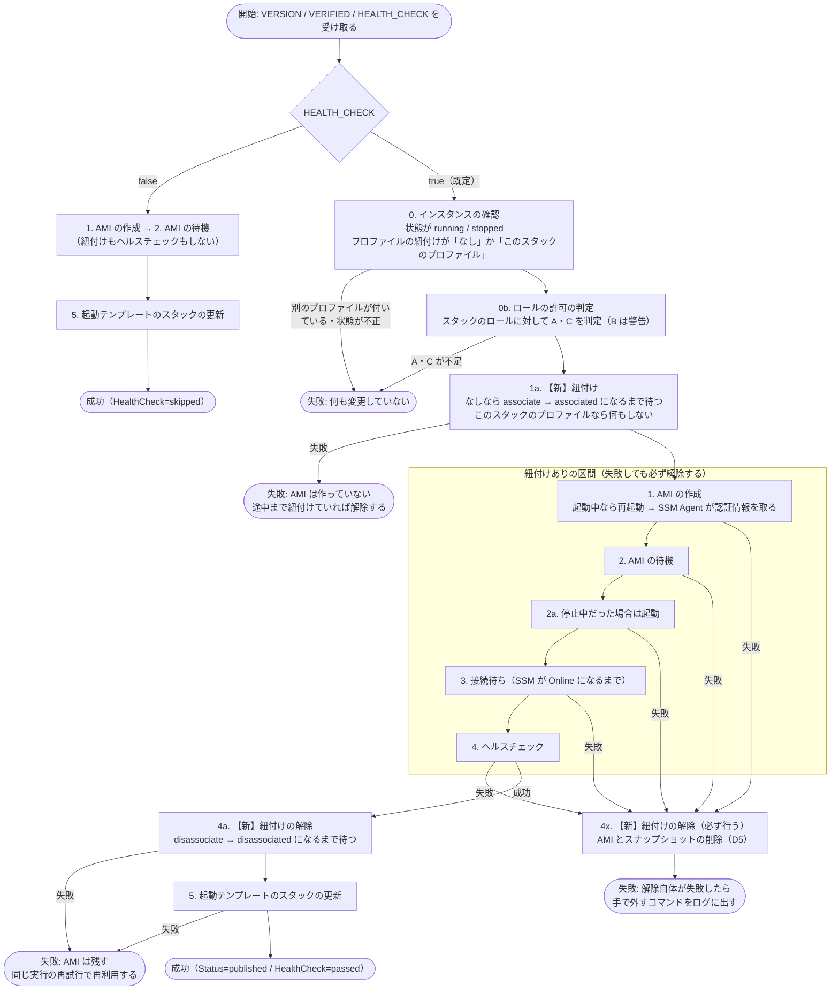

# ヘルスチェックの区間だけリリース用インスタンスにロールを紐付けるフロー

> 状態: **実装済み**（紐付けは `ami-publish/lib/ami_publish/steps/attach_release_instance_profile.rb`、解除は `detach_release_instance_profile.rb`。失敗時の解除は、interactor（gem）が紐付けのステップの `rollback` を呼んで行う。ステップの並びは `lib/ami_publish/commands/publish_command.rb`）。実機での確認はまだ行っていない
>
> スコープ: AMI 公開パイプライン（[`ami-publish/`](../../ami-publish/README.md)、フェーズ 1）で、リリース用インスタンスへのインスタンスプロファイルの紐付けと解除を、パイプラインの CodeBuild のビルドの中で行うフロー。成功時・失敗時・異常終了時の扱いを含む
>
> 関連: [IAM ロールと許可ポリシーの現状](./ami-publish-iam-roles.md) / [トラブルシューティング](../../ami-publish-troubleshooting.md) / [開発計画](../../ami-publish-development-plan.md)

## 決めたこと

| # | 内容 |
|---|---|
| 1 | ロールとインスタンスプロファイルは、今までどおり**リリース用インスタンスの IAM ロールのスタック**（`<application_name>-<環境>-release-instance`）で作る。デプロイ用シェルスクリプトの `up` / `down` には含めない |
| 2 | インスタンスプロファイルとリリース用インスタンスの**紐付けは、パイプラインの CodeBuild のビルドの中**（AMI 公開ツール）で行い、ヘルスチェックが終わったら解除する。リリース用インスタンスがロールを持つのは、**ヘルスチェックのための区間だけ**にする |
| 3 | 紐付けは **AMI の作成の直前**に行う（理由は下記） |
| 4 | ヘルスチェックを省略する実行（`HEALTH_CHECK=false`）では、紐付けも解除も行わない |
| 5 | リリース用インスタンスに**別の**インスタンスプロファイルが付いていたら、入れ替えずに失敗させる |

### なぜ「AMI の作成の直前」に紐付けるか

- AMI の作成（`create-image`）では、起動中のインスタンスが再起動する。再起動より前に紐付けておけば、再起動後の SSM Agent が起動時にロールの認証情報を取り、SSM に登録される
- 再起動の後（ヘルスチェックの直前）に紐付けると、すでに動いている SSM Agent が認証情報に気づくまで時間がかかることがある。SSM Agent の再起動が必要になる場合もあるが、SSM が使えない状態なので、パイプラインからは再起動できない
- 停止中のインスタンスは、AMI の作成では再起動しない。この場合は、後の「停止中だった場合の起動」で SSM Agent が起動し、そのときに認証情報を取る
- 有効な期間は「AMI の作成からヘルスチェックの完了まで」で、パイプライン全体ではない

### この方式でよくなること

- スタックを削除しても紐付けが残らない。普段は紐付けがないため（パイプラインの実行中と、異常終了で残った場合を除く）
- 担当者が手で紐付ける（`associate-iam-instance-profile`）作業がなくなる
- リリース用インスタンスは、普段は AWS の権限を持たない

## フロー図



図の「紐付けありの区間」の解除は、2 か所で行う。成功時は解除のステップ（`DetachReleaseInstanceProfile`）が行う。区間の中で失敗したときは、ステップの並び（interactor の Organizer）が、実行済みのステップの `rollback` を逆順に呼ぶので、紐付けのステップ（`AttachReleaseInstanceProfile`）の `rollback` が解除する。区間の中で何が失敗しても（例外を含めて）解除が動く。

## ステップごとの説明

| ステップ | 処理 | 失敗したとき |
|---|---|---|
| 0. インスタンスの確認 | 状態が `running` / `stopped` であること。インスタンスのプロファイルの紐付けが「なし」か「このスタックのプロファイル」であること（後者は、前回の実行が異常終了して残ったもの）。**今の「SSM の管理対象か」の確認はやめる**（紐付け前は SSM に登録されていないため判定できない） | 失敗。何も変更していない |
| 0b. ロールの許可の判定 | リリース用インスタンスの IAM ロールのスタックのロールに対して、IAM のポリシーシミュレーターで A・C を判定する（B の不足は警告）。今はインスタンスの紐付けからロールを引いているが、紐付け前なのでスタックの出力から引く | 失敗。何も変更していない |
| 1a. 【新】紐付け | 紐付けがなければ `associate-iam-instance-profile` で紐付け、状態が `associated` になるまで待つ。このスタックのプロファイルがすでに付いていれば何もしない | 失敗。AMI は作っていない。途中まで紐付けが進んでいれば解除する |
| 1. AMI の作成 | 今と同じ。起動中ならここで再起動し、SSM Agent が認証情報を取って起動する | 4x へ |
| 2. AMI の待機 | 今と同じ | 4x へ |
| 2a. 停止中だった場合は起動 | 今と同じ。起動時に SSM Agent が認証情報を取る | 4x へ |
| 3. 接続待ち | 今と同じ（SSM が `Online` になるまで）。SSM Agent が入っていない・SSM への経路がない、といった問題は、ここで初めて分かる（0 で確認しなくなったため） | 4x へ |
| 4. ヘルスチェック | 今と同じ | 4x へ |
| 4a. 【新】紐付けの解除（成功時） | `disassociate-iam-instance-profile` で解除し、状態が `disassociated` になるまで待つ | 失敗。**AMI は残す**（ヘルスチェックは通っているため）。同じ実行を再試行すると、AMI を再利用し、紐付け → ヘルスチェック → 解除をやり直す |
| 4x. 【新】紐付けの解除（失敗時） | 1〜4 のどこかで失敗したら、紐付けを解除し、AMI とスナップショットを削除する（D5） | 解除自体が失敗したら、手で外すコマンドをログに出して失敗する |
| 5. 起動テンプレートのスタックの更新 | 今と同じ。紐付けはすでに解除済み | 失敗。AMI は残す（今と同じ） |
| 6. 出力 | 今と同じ（`Status=published` / `HealthCheck=passed`） | ― |

`HEALTH_CHECK=false` の実行では、0・0b・1a・2a・3・4・4a を行わない。AMI の作成・待機・起動テンプレートのスタックの更新だけを行い、AMI に `HealthCheck=skipped` を付ける（今と同じ）。

## チェックの失敗と異常終了の違い

| 区分 | 例 | AMI 公開ツールの処理 | 紐付けの解除 | AMI |
|---|---|---|---|---|
| **チェックの失敗**（ステップの失敗） | ヘルスチェックが 2xx を返さない、接続待ちのタイムアウト、AMI の作成の失敗、AWS の API のエラー | 続いている。ツールがエラーを受け取り、後始末をしてから終了する | **される**（4x） | 削除される（D5） |
| **異常終了** | CodeBuild のビルドのタイムアウト（`timeouts.codebuild_minutes`）、担当者がビルドやパイプラインの実行を止める、CodeBuild の環境の障害 | 続いていない。プロセスが外から止められ、後始末の処理（`ensure`）も動かない | **されない**（残る） | 残る（今の実装と同じ） |

異常終了で紐付けが残った場合:

- **次の実行**: ステップ 0 が「このスタックのプロファイルが付いている」と判断して先に進み、ヘルスチェックの後に解除する
- **手で外す場合**: 紐付けの ID を調べて解除する

  ```bash
  aws ec2 describe-iam-instance-profile-associations \
    --filters Name=instance-id,Values=<インスタンス ID> \
    --query 'IamInstanceProfileAssociations[].[AssociationId,State,IamInstanceProfile.Arn]' --output text
  aws ec2 disassociate-iam-instance-profile --association-id <紐付けの ID>
  ```

- **作りかけの AMI**: 異常終了では削除（D5）も行われない。同じ実行を再試行すると再利用される（今の実装と同じ）

## 実装で変わったこと

| 対象 | 変更 |
|---|---|
| CodeBuild のロールの許可 | 追加: `ec2:AssociateIamInstanceProfile` / `ec2:DisassociateIamInstanceProfile`（対象はリリース用インスタンスだけ）、`ec2:DescribeIamInstanceProfileAssociations`（`*`。リソースで絞れない操作）、**`iam:PassRole`**（対象はリリース用インスタンスのロールだけ。条件 `iam:PassedToService = ec2.amazonaws.com` で EC2 に渡す場合だけに限る）。今の「どのロールにも `iam:PassRole` を持たせない」方針の例外になる |
| スタック間の参照 | リリース用インスタンスの IAM ロールのスタックが、ロールの ARN とインスタンスプロファイルの ARN を Export し、パイプラインのスタックが参照する（許可の対象と、AMI 公開ツールが使う値）。このスタックは **`up` の前にデプロイしておく**必要がある（`up` / `down` には含めない方針は変えない） |
| AMI 公開ツールのステップ | 0（SSM の確認をやめ、紐付けの確認にする）、0b（ロールをスタックの出力から引く）を変更。1a（紐付け）、4a / 4x（解除）を追加 |
| リリース用インスタンスの IAM ロールのスタック | 中身は変えない。紐付けの手作業（`associate-iam-instance-profile`）を手順書から外す |
| 運用 | パイプラインの実行中以外は、リリース用インスタンスに SSM Session Manager で接続できなくなる |

## 未決の論点・注意点

| 論点 | 内容 |
|---|---|
| **待機時間の合計と CodeBuild のタイムアウト** | 待機時間の上限を、AMI の待機 10 分（`image_available_seconds: 600`）、接続待ち 10 分（`instance_online_seconds: 600`）に縮めた。主な 4 つの待機（AMI の待機 10 分＋接続待ち 10 分＋ヘルスチェック 5 分＋スタックの更新 30 分）の合計は 55 分で、CodeBuild のタイムアウト（60 分）に収まる。ただし、ほかの待機（開始時に状態が落ち着くまで最大 10 分、停止中だった場合の起動に最大 10 分、紐付け・解除の完了待ちにそれぞれ最大 5 分）がすべて上限まで重なると 60 分を超える（通常、紐付け・解除は数秒で終わる）。上限まで待って CodeBuild に止められると、異常終了になり紐付けが残る（次の実行で解除される）。両者の関係を設定値の検証（Go の生成ツール）に入れるかは未決 |
| 解除しても、すぐには権限が消えない | インスタンスがすでに取得した一時的な認証情報は、有効期限まで使える（通常は数時間以内）。「ヘルスチェックの区間だけ有効」は、新しく認証情報を取れる期間の話で、厳密に権限が消えるわけではない |
| 別のプロファイルが付いているインスタンス | アプリのために別のロールが付いているインスタンスでは、この方式は使えない（失敗する）。入れ替えて戻す処理は、失敗時に元に戻せなくなる危険があるので行わない |
| 紐付けと SSM の登録までの時間 | 再起動後に SSM Agent が認証情報を取って `Online` になるまでの時間は、実機で確かめる。今の接続待ち（`instance_online_seconds`）で足りるかを見る |
| フェーズ 3 との関係 | フェーズ 3（リリース検証の自動化）でも SSM 経由でインスタンスを操作するなら、紐付けの区間をリリース検証まで広げるか、フェーズ 3 で同じ紐付け・解除を行うかを決める |
