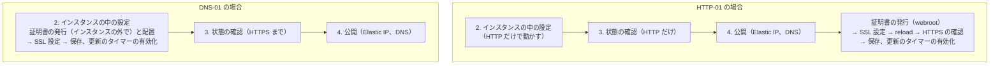

# 補足: インスタンスの構築の流れの中で Let's Encrypt の証明書をいつ扱うか（フェーズ 2）

> 位置付け: 調査の結果をまとめた補足。採用済みの設計ではない。決まったことは [設計: フェーズ 2](../../instance-provisioning/design.md) に反映する。
>
> 前提: [現状の手作業によるインスタンスの構築手順の整理](../../instance-provisioning/manual-procedure-analysis.md) の段階 0〜6。そこでスコープ外にした、証明書の発行（⑦）・Apache の SSL 設定（⑧）・証明書の自動更新（⑩）を、どの段階で何をするかを扱う
>
> 関連: 証明書の発行・更新の自動化そのものの設計（検証方式、IAM 権限、永続化、更新、期限監視）は [EC2 での Let's Encrypt 証明書発行・初期設定の自動化](../ec2-operations/letsencrypt-automation.md)
>
> 調査日: 2026-10-08（公式の文書の内容は変わることがあるため、採用時に出典で確認する）

## 結論

- 公式（Let's Encrypt と certbot）の文書は、構築の流れの**どの段階で行うかまでは決めていない**。示しているのは原則で、そこから流れへの当てはめが決まる
- 段階に関係なく決まること: **まず保存済みの証明書を使い、なければ発行する**、**発行したら保存する**、**更新は自動で行い、失敗は監視する**
- 発行の位置は検証方式で決まる
  - **HTTP-01（今の webroot のやり方）なら、段階 4（公開）の後**
  - **DNS-01 なら、段階 2（公開の前）**
- 「確認が通ってから公開する」流れを保つなら DNS-01 が合う。その場合も、Route 53 の権限をインスタンスに持たせない構成にする（公式の推奨）

## 公式の原則

| # | 原則 | 出典 |
|---|---|---|
| 1 | **新しいサーバーでは、まず永続的な保存場所にある証明書と秘密鍵を使う。有効なものがないときだけ発行する。** 起動のたびに発行すると、レート制限に達したり、Let's Encrypt の障害時にサービスが止まったりする。サーバーが多い場合は、発行を一か所（検証用のサーバー）に集める | Integration Guide |
| 2 | 検証方式は、迷ったら **HTTP-01**（クライアントの既定）。DNS-01 は、ワイルドカード、Web サーバーが外部に公開されていない場合、複数台の場合に向く。ただし、**DNS の API の認証情報を Web サーバーに置くのは危険**なので、権限を絞るか、検証を別のサーバーで行う | Challenge Types |
| 3 | HTTP-01（webroot・standalone）は、**ドメインの DNS が certbot を動かすサーバーを指している**ことが前提。DNS-01 は、対象の Web サーバー以外のマシンで certbot を動かせる | certbot の User Guide |
| 4 | 更新は ARI（ACME Renewal Information）を **1 日 2 回**確認する。ARI がなければ、**有効期間の残りが 1/3** になったら更新する。実行時刻はばらす（certbot の cron の例は、0 時と 12 時に最大 1 時間のランダムな待ちを入れる） | Integration Guide、certbot の User Guide |
| 5 | 更新の失敗を致命的なエラーとして扱わない。指数的に間隔を空けて再試行し（例: 1 分 → 10 分 → 100 分 → 1 日ごと。上限は 1 日 1 回）、担当者に通知する | Integration Guide |
| 6 | 更新後の Web サーバーの reload は `--deploy-hook` で行う（発行・更新が成功したときだけ実行される） | certbot の User Guide |

## 有効期間の短縮の予定

| 日付 | 既定（classic プロファイル）の有効期間 | 認可の再利用期間 |
|---|---|---|
| 現在（調査日時点） | 90 日 | 30 日 |
| 2027-02-10 | 64 日 | 10 日 |
| 2028-02-16 | 45 日 | 7 時間 |

- 2026-05-13 から、希望者向けの `tlsserver` プロファイルで 45 日の証明書を発行する予定と発表されていた（実施されたかは未確認）
- 「60 日ごとに更新」のような固定の間隔は使わず、ARI か「残り 1/3」の基準に任せる。certbot は「残り 1/3 未満で更新」の基準で動くため、有効期間が変わっても追従する
- 認可の再利用期間が 7 時間になると、過去の検証結果を使い回せなくなり、更新のたびに検証が必要になる。HTTP-01 ならポート 80 を、DNS-01 なら DNS の API を、更新のたびに使える状態を保つ

## 流れへの当てはめ

### AMI の作成元での一度だけの準備（構築の流れの外）

| 準備 | 内容 |
|---|---|
| certbot と更新の仕組み | certbot と、更新用のタイマー（原則 4）を入れておく。更新後の Apache の reload は `--deploy-hook`（原則 6） |
| Apache の SSL 設定 | 証明書のパスを、サーバーごとの値（サブドメイン）から参照する形にしておく（[サーバーごとの値を 1 つのファイルにまとめる案](../../instance-provisioning/manual-procedure-analysis.md#サーバーごとの値を-1-つのファイルにまとめる案)） |
| **作成元の証明書を持ち込まない** | 作成元のリリース用インスタンスの `/etc/letsencrypt`（作成元のドメインの証明書と、ACME のアカウントの秘密鍵）が AMI にそのまま入る。新しいサーバーで更新のタイマーが動くと、作成元のドメインの更新を試みて失敗し続ける。AMI に入れないか、構築時に消す |

### 構築の流れのどこで行うか

1 台ごとに別のサブドメインを使う今の運用では、新しいサーバーには保存済みの証明書がないため、毎回新しく発行する。既存のサーバーを置き換える場合（同じサブドメインを新しいインスタンスに移す場合）は、保存済みの証明書を復元できる（原則 1）。

| 段階 | HTTP-01 の場合（今の webroot のやり方） | DNS-01 の場合 |
|---|---|---|
| 2. インスタンスの中の設定 | 保存済みの証明書があれば復元する。なければ、ここでは HTTP だけで動かす | **ここで発行する**。保存済みの証明書があれば復元する |
| 3. 状態の確認 | HTTP だけを確認する（保存済みの証明書を復元した場合は HTTPS も確認できる） | **HTTPS まで確認できる** |
| 4. 公開（Elastic IP、DNS） | 公開する | 公開する |
| 4 の後 | **ここで初めて発行できる**（原則 3）→ Apache の SSL 設定 → reload → HTTPS を確認する | なし |
| 発行後 | 証明書を永続的な保存場所に退避する。更新のタイマーを有効にする | 同左 |

### HTTP-01 と DNS-01 の比べ方

| 観点 | HTTP-01 | DNS-01 |
|---|---|---|
| 公式の位置付け | 既定。迷ったらこれ | ワイルドカード、非公開、複数台の場合に向く |
| 今のやり方との差 | 今のまま（webroot） | certbot の DNS 用のプラグイン（`certbot-dns-route53`）と Route 53 の権限が必要 |
| 「確認が通ってから公開する」流れ | 崩れる。公開の前は HTTP しか確認できず、公開の直後はしばらく HTTP だけで応答する | 保てる。HTTPS まで確認してから公開できる |
| 必要な通信 | インターネットからポート 80 へのインバウンド（送信元は絞れない。更新のたびにも必要） | Let's Encrypt と Route 53 の API へのアウトバウンド |
| 権限の扱い | DNS の権限は不要 | Route 53 の権限を**インスタンスに持たせない**のが公式の推奨。発行はインスタンスの外（スタックを作る側や発行用の仕組み）で行い、インスタンスは証明書を受け取るだけにする。インスタンスで行う場合は、対象のレコード名と TXT に権限を絞る（[IAM 権限](../ec2-operations/letsencrypt-automation.md#dns-01route-53)） |
| 更新 | インスタンス上の certbot で更新できる | 発行をインスタンスの外で行う場合、更新もインスタンスの外で行い、インスタンスに配り直す仕組みが要る |

## 補足: DNS-PERSIST-01

Let's Encrypt は 2026 年 2 月に、新しい検証方式 DNS-PERSIST-01 を発表している。

- 発行のたびに TXT レコードを書き換えるのではなく、CA と ACME のアカウントを示す**固定の TXT レコードを一度だけ置いておく**。以降の発行と更新は、そのレコードで検証される
- 発表時点の予定は、ステージング環境が 2026 年の第 1 四半期の終わり、本番が第 2 四半期。**本番で使えるようになったかは調査日時点で確認できていない**
- 使えるようになっていれば、**インスタンスに Route 53 の権限を持たせずに、公開の前（段階 2）に発行できる**候補になる。固定の TXT レコードは、サーバーのスタック（段階 4 の DNS のレコードと同じ場所）で一度だけ作ればよい

## 決めること

| # | 論点 | 選択肢 |
|---|---|---|
| L1 | 検証方式 | HTTP-01（今のまま。公開の後に発行）/ DNS-01（公開の前に発行）/ DNS-PERSIST-01（使えるようになっていれば） |
| L2 | DNS-01 の場合の発行の場所 | インスタンスの外（推奨）/ インスタンス上（権限を絞る） |
| L3 | 証明書の保存場所 | S3（SSE-KMS）など。置き換えのときに復元できるようにする（[証明書の永続化](../ec2-operations/letsencrypt-automation.md#4-証明書の永続化インスタンス置換への対応)） |
| L4 | 作成元の `/etc/letsencrypt` の扱い | AMI に入れない / 構築時に消す |
| L5 | 期限の監視 | 外形監視 / CloudWatch のカスタムメトリクス（[期限監視](../ec2-operations/letsencrypt-automation.md#7-期限監視)） |

## 参考

- [Challenge Types - Let's Encrypt](https://letsencrypt.org/docs/challenge-types/)
- [Integration Guide - Let's Encrypt](https://letsencrypt.org/docs/integration-guide/)
- [User Guide - Certbot](https://eff-certbot.readthedocs.io/en/stable/using.html)
- [Decreasing Certificate Lifetimes to 45 Days - Let's Encrypt](https://letsencrypt.org/2025/12/02/from-90-to-45)
- [Certificate Lifetime Rationale and Plans - Let's Encrypt](https://letsencrypt.org/docs/cert-lifetimes/)
- [DNS-PERSIST-01 - Let's Encrypt](https://letsencrypt.org/2026/02/18/dns-persist-01)
