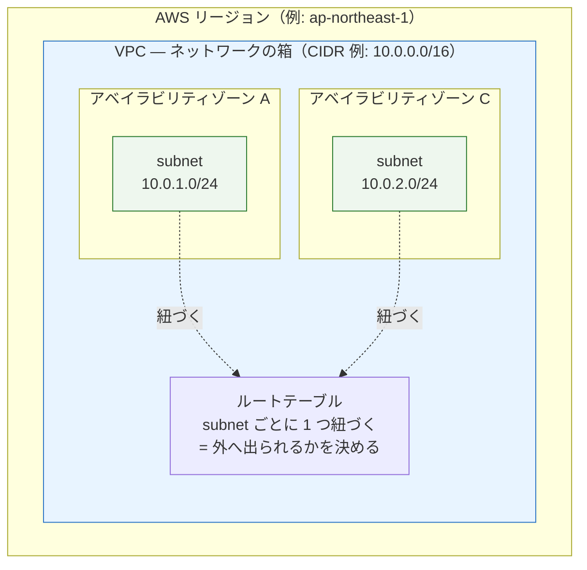
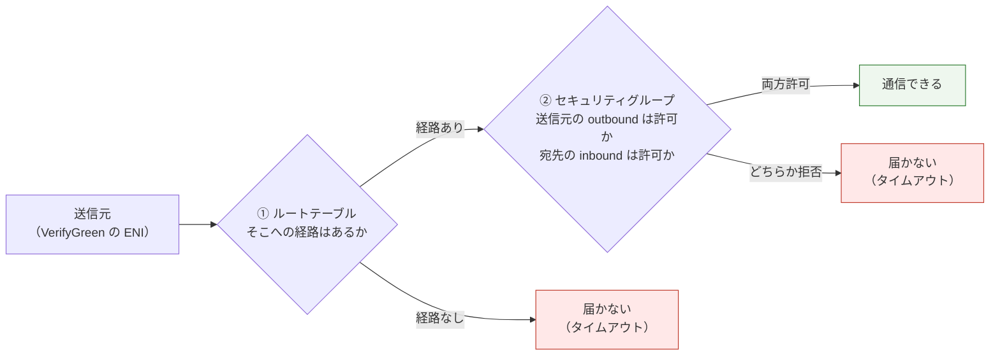
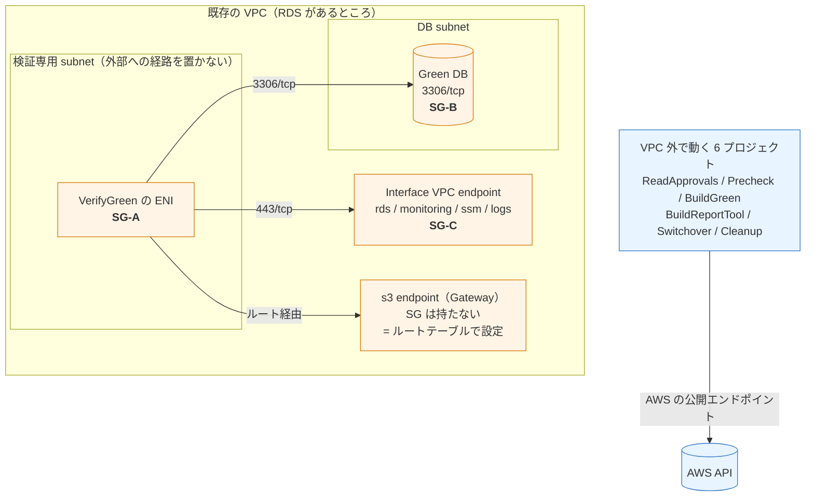

# VerifyGreen の VPC 設定 — 現状整理

> 位置づけ: **現時点の構成と制約の記録**である。「既存 VPC に載せるのか」「サーバーごとに設定できるのか」という問いに答えるためにまとめた。構成の理由と図は [ci/verify-green-vpc-architecture.md](../ci/verify-green-vpc-architecture.md)、セキュリティグループの作り方は [ci/verify-green-security-group-setup.md](../ci/verify-green-security-group-setup.md) にある。
>
> 調査日: 2026-09-18 ／ 対象: `examples/rds-blue-green-deployment/codepipeline-all-in-one.yml`

## 結論

| 問い | 答え |
|---|---|
| 既存 VPC に載せる機能か | **はい。**テンプレートは VPC・subnet・SG を一切作らず、既存リソースの ID を受け取るだけである |
| サーバー（DB）ごとに設定できるか | **いいえ。**`VpcConfig` は CodeBuild プロジェクトのプロパティで、**スタック（環境）単位**である |
| そもそも VPC は必須か | **いいえ。**既定は「VPC を使わない」で、その場合でも検証の結論は変わらない |

## 0. 前提知識 — VPC / subnet / セキュリティグループ

以降を読むための最小限の整理。**この 3 つは役割が違い、設定する場所も違う。**

### 入れ子の関係



| 概念 | 何を決めるか | 単位 |
|---|---|---|
| **VPC** | ネットワークの箱そのもの。この中でしか通信できない | リージョンごと |
| **subnet** | VPC を区切った区画。**1 つのアベイラビリティゾーンに属する** | AZ ごと |
| **ルートテーブル** | その subnet から**外へ出られるか**。NAT gateway や Internet gateway への経路を持つか | subnet ごと |
| **セキュリティグループ** | **誰と誰が通信してよいか**。ポート単位の許可リスト | リソース（正確には ENI）ごと |

**「public subnet」「private subnet」という属性は存在しない。**ルートテーブルに Internet gateway への経路があるものを慣習的に public、無いものを private と呼んでいるだけである。

### subnet（経路）とセキュリティグループ（許可）は別の関門

**両方を通らないと通信できない。**どちらか一方だけでは届かない。



**どちらの失敗もタイムアウトとして現れる**ため、切り分けには両方を確認する必要がある。

### セキュリティグループの指定は「相手の SG」で書く

CIDR ではなく**相手のセキュリティグループ ID**を指定できる。この方式を使う。

```
SG-B（RDS 側）の inbound:  3306/tcp ← SG-A     ← IP ではなく SG を指す
```

**CodeBuild の Elastic Network Interface は実行ごとに作り直され IP が変わる**ため、IP アドレスでは固定できない。SG 参照なら「SG-A が付いているものすべて」を意味するので、IP が変わっても効き続ける。

> **Elastic Network Interface（ENI）**は VPC 内のリソースに割り当てられる仮想ネットワークインターフェイスである。VPC 内で動く CodeBuild は、ビルドを実行するたびに指定した subnet へこれを作り、終了時に削除する。セキュリティグループは**この ENI に付く。**

### このプロジェクトでの配置



| SG | 付く先 | 必要な設定 |
|---|---|---|
| **SG-A** | VerifyGreen の ENI | outbound のみ。**新規 SG は outbound 全許可なので既定で足りる** |
| **SG-B** | Green DB | **inbound 3306/tcp ← SG-A を追加する（必須）** |
| **SG-C** | Interface endpoint | **inbound 443/tcp ← SG-A を追加する（必須。見落としやすい）** |

**テンプレートはこれらの SG を 1 つも作らない。**`VerifyGreenSecurityGroupIds` で SG-A の ID を受け取るだけで、SG-B と SG-C への inbound 追加は手作業である。作り方は [ci/verify-green-security-group-setup.md](../ci/verify-green-security-group-setup.md) にある。

### なぜ検証専用 subnet に外部への経路を置かないのか

**置く必要が無いためである。**VerifyGreen が通信する相手は Green DB と VPC endpoint だけで、インターネットへ出る用事が無い。

| 従来は外部が必要だった処理 | 現在 |
|---|---|
| Go module の取得（`proxy.golang.org`） | **VPC 外の `BuildReportTool` が担当。**成果物は artifact で渡す |
| MySQL クライアントの導入（apt リポジトリ） | **使わない。**実効値の収集は静的リンクの Go バイナリが行う |
| SecureString の復号（KMS） | **SSM 側で復号される。**呼び出し側は KMS を直接呼ばない |

この 3 つを取り除いた結果、**NAT gateway が不要**になっている。

## 1. パラメータの現状

```yaml
VpcId:                       Type: String              Default: ''
VerifyGreenSubnetIds:        Type: CommaDelimitedList  Default: ''
VerifyGreenSecurityGroupIds: Type: CommaDelimitedList  Default: ''
```

**3 つとも既定値は空**である。`VpcId` が空なら条件 `HasVpc` が偽になり、`VpcConfig` は展開されない。つまり**何も指定しなければ VPC 外で動く**。

このスタックが作成するリソース種別は次のとおりで、**EC2／VPC 系は 1 つも含まれない**。

```
AWS::S3::Bucket / AWS::S3::BucketPolicy
AWS::IAM::ManagedPolicy / AWS::IAM::Role
AWS::CodeBuild::Project / AWS::CodePipeline::Pipeline
```

subnet とセキュリティグループは**別途用意して ID を渡す**。

## 2. VPC 内で動くのは VerifyGreen だけ

| プロジェクト | `VpcConfig` |
|---|---|
| `ReadApprovalsProject` | なし |
| `PrecheckProject` | なし |
| `BuildGreenProject` | なし |
| `BuildReportToolProject` | なし |
| **`VerifyGreenProject`** | **あり**（`VpcId` 指定時のみ） |
| `SwitchoverProject` | なし |
| `CleanupProject` | なし |

VPC 内へ入れる必要があるのは **Green DB へ 3306/tcp で接続する VerifyGreen だけ**である。他は AWS の公開エンドポイントを叩くだけなので、VPC へ入れても Elastic Network Interface の作成権限と NAT gateway が要るようになるだけで、得るものが無い。

`VpcId` を指定すると `VerifyGreenRole` へ Elastic Network Interface の作成権限が条件付きで付く。

## 3. サーバーごとに設定できない理由

理由は 2 つある。

**① `VpcConfig` は CodeBuild プロジェクトのプロパティである。**パイプライン実行ごとには切り替えられず、**CloudFormation でスタックを作成／更新するときに決まる。**

**② パイプラインは環境ごとに 1 本で、サービスは実行時変数で切り替える設計である。**

```bash
aws codepipeline start-pipeline-execution --name rds-bg-staging \
  --variables name=ServiceName,value=example-service
```

`ServiceName` は実行ごとに変えられるが、`VpcConfig` はスタック単位なので、**同じパイプラインが扱う全サービスが同じ subnet・同じ SG を使う。**

### 設定の粒度

| 設定 | 粒度 |
|---|---|
| 対象サービス（DB） | **実行ごと**（パイプライン変数 `ServiceName`） |
| MySQL 接続情報（どのパラメータを読むか） | **サービスごと**（config の `mysql_verification`） |
| RDS 変更権限の対象 ARN | スタックごと（`ProtectedRdsResourceArns`。複数指定可） |
| **VPC / subnet / SG** | **スタック（環境）ごと** |

## 4. DB が別々の VPC にある場合

**スタックを分ける。**これ以外の方法は無い。

```bash
# VPC-A の DB 群
aws cloudformation deploy --stack-name rds-bg-staging-vpc-a \
  --parameter-overrides PipelineNamePrefix=rds-bg-a EnvironmentName=staging VpcId=vpc-aaaa ...

# VPC-B の DB 群
aws cloudformation deploy --stack-name rds-bg-staging-vpc-b \
  --parameter-overrides PipelineNamePrefix=rds-bg-b EnvironmentName=staging VpcId=vpc-bbbb ...
```

**`PipelineNamePrefix` を変える。**IAM ロール名も接頭辞込みで作られるため、同じにすると名前が衝突してスタック作成に失敗する。

### この構成の注意点

同一環境で 2 スタックにしても、**設定ファイル `config/blue-green/staging.deployment.yml` は 1 本を共有する。**どちらのパイプラインからも全サービスが見えるため、起動時の `ServiceName` 指定を誤ると「VPC-A のパイプラインで VPC-B の DB を対象にする」ことが起こりうる。

その場合、AWS API による検証までは通り、**MySQL 実効値の収集だけがネットワーク到達性で失敗する**（判定は AWS API の値で行うため、検証自体は成立してしまう）。運用で気をつける点である。

## 5. そもそも VPC が要るかどうか

**`mysql_verification.enabled: false`（既定）なら VPC は不要である。**

| 構成 | VPC | できること |
|---|---|---|
| `VpcId` 空（既定） | 不要 | AWS API による検証。**構成の突き合わせ・ドリフト検出・レプリカ遅延はすべて可能** |
| `VpcId` 指定 | 必要 | 上記に加えて Green DB の MySQL 実効値を収集 |

**MySQL 実効値は参考情報であり、判定には使わない。**判定は AWS API から取得した値で行うため、**VPC を用意しなくても検証の結論は変わらない**（レポートの「MySQL 実効値」列が `未収集` になるだけである）。

方針としても「本番 DB の認証情報を CI に常設しない。DB 接続を伴う確認はローカルから行う」を採択しているため、**VPC を用意しない運用が既定路線**である。

## 6. VPC を用意する場合に必要なもの

| 用意するもの | 要件 |
|---|---|
| private subnet（2 アベイラビリティゾーン以上を推奨） | **RDS へ到達できること。外部への経路は置かない** |
| セキュリティグループ | **テンプレートは作らない。**別途用意して ID を渡す |
| VPC endpoint | `s3`（Gateway）、`logs` / `rds` / `monitoring` / `ssm`（Interface） |

**`kms` の VPC endpoint は要らない。**SecureString の復号は SSM 側で行われ、ビルドコンテナが KMS を直接呼ぶことはない。

**NAT gateway も要らない。**Go のビルドは VPC 外の `BuildReportTool` が担い、MySQL クライアントも使わない（実効値の収集は静的リンクの Go バイナリが行う）ため、この subnet から外部へ出る必要が無い。

## 参考

- [ci/verify-green-vpc-architecture.md](../ci/verify-green-vpc-architecture.md) — 構成の理由と図
- [ci/verify-green-security-group-setup.md](../ci/verify-green-security-group-setup.md) — SG の作り方（SG-A / B / C）
- [ci/codepipeline-all-in-one-parameters.md](../ci/codepipeline-all-in-one-parameters.md) — 全パラメータ一覧
- [operations-environment-setup.md](../operations-environment-setup.md) — 環境構築の手順
