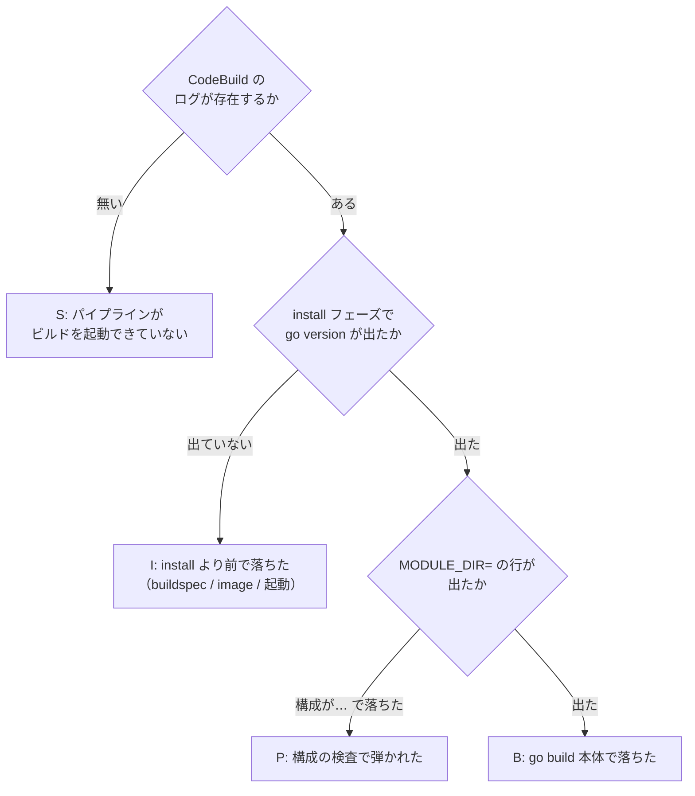
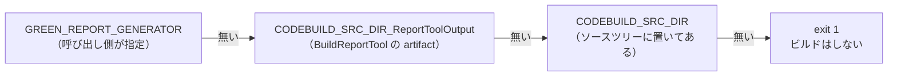

# BuildReportTool（Go ビルド）の失敗切り分け

`ci/codebuild/build-report-tool.yml` が失敗したときに、**ログのどこを見て、何が出ていたら何をするか**をまとめたもの。対象は Step 4 のレポート生成器（`scripts/generate_green_verification_report/main.go`）のビルドだけである。

VerifyGreen（検証の実行）へ進む前の段階を厚く扱う。構成の背景は [Step 4 の分離と VPC 配置](verify-green-vpc-architecture.md) にある。

## 0. 最初に見る 3 点

ログを上から読む前に、この 3 つで大きく場所が絞れる。



| 記号 | 位置 | 節 |
|---|---|---|
| **S** | CodeBuild が起動する前（CodePipeline 側） | [1](#1-s-ビルドが起動しない) |
| **I** | install フェーズ（コマンドが 1 つも走らない） | [2](#2-i-install-フェーズで落ちる) |
| **P** | pre_build フェーズ（構成の検査） | [3](#3-p-構成の検査で落ちる) |
| **B** | build フェーズ（`go build` 本体） | [4](#4-b-go-build-が失敗する) |
| **R** | ビルド成功後（artifact の受け渡し） | [5](#5-r-ビルドは成功したのに後段で失敗する) |

## 1. S: ビルドが起動しない

**CodeBuild のログが 1 行も無い場合**は CodeBuild まで到達していない。CodePipeline 側のアクション画面に理由が出る。

### S1: `AccessDenied` / `not authorized to perform: codebuild:StartBuild`

**意味**：CodePipeline の実行ロールに、このプロジェクトを起動する権限が無い。

**見る場所**：`CodePipelineRole` の `StartBuilds` ステートメントの `Resource`。**全プロジェクトを列挙する形なので、プロジェクトを足したときに書き忘れやすい。**

```yaml
- Sid: StartBuilds
  Effect: Allow
  Action: ['codebuild:StartBuild', 'codebuild:BatchGetBuilds', 'codebuild:StopBuild']
  Resource:
    - !GetAtt ReadApprovalsProject.Arn
    - !GetAtt PrecheckProject.Arn
    - !GetAtt BuildGreenProject.Arn
    - !GetAtt BuildReportToolProject.Arn   # ← これが無いと S1 になる
    - !GetAtt VerifyGreenProject.Arn
    - !GetAtt SwitchoverProject.Arn
```

**やること**：欠けている `!GetAtt <名前>Project.Arn` を足してスタックを更新する。

### S2: ステージにアクションが現れない / 順序が違う

**意味**：`Stages` の定義とアクションの `RunOrder` の問題で、`BuildReportTool` が実行されていない。

**やること**：`BuildReportTool` は `ReadApprovals` の直後に置く設計である（**AWS リソースに触る前にビルドを済ませる**ため。ビルドが失敗しても RDS には影響が無い）。`VerifyGreen` より前のステージにあることを確認する。

### S3: ソースアーティファクトが取れない

`Unable to access the artifact with Amazon S3 object key ...` など。

**やること**：Source ステージの成否、`ArtifactBucketName` のバケットが同一リージョンにあること、バージョニングが有効なことを確認する。これは全プロジェクト共通の問題なので、他のステージも同時に落ちているはずである。

## 2. I: install フェーズで落ちる

**`go version` の出力が無い場合**はここ。buildspec のコマンドが 1 つも実行されていない。

### I1: `Unknown runtime version named '1.25' of golang`

**意味**：`runtime-versions` に書いた Go のバージョンを、そのビルドイメージが持っていない。**イメージごとに選べるバージョンは決まっている。**

```yaml
# ci/codebuild/build-report-tool.yml
install:
  runtime-versions:
    golang: 1.25        # ← このイメージが対応していなければ即座に失敗する
```

現在の指定はこうなっている。

| 項目 | 値 |
|---|---|
| イメージ | `aws/codebuild/standard:7.0` |
| `runtime-versions: golang` | `1.25` |
| `go.mod` の `go` ディレクティブ | `1.25` |
| `GOTOOLCHAIN` | `auto` |

**やること**——選択肢は 2 つある。

| 対処 | 内容 | 外部到達 |
|---|---|---|
| **A: イメージを新しくする** | `Image` を `golang: 1.25` に対応したものへ変更する | 不要 |
| **B: `runtime-versions` を下げる** | イメージが持つ版（例 `1.21`）にし、`GOTOOLCHAIN=auto` に `go.mod` の 1.25 を満たさせる | **必要**（`proxy.golang.org` からツールチェーンを取得する） |

対応バージョンは AWS のドキュメント「CodeBuild に用意されているランタイム」で確認する。イメージは更新されるので、**このドキュメントに一覧を固定して書かない。**

> B を選ぶ場合、ビルドは外部到達が前提になる。`BuildReportTool` は VPC 外で動く設計なのでそれ自体は問題にならないが、組織のプロキシで `proxy.golang.org` が塞がれていると [B2](#b2-ツールチェーンを取得できない) になる。

### I2: `YAML_FILE_ERROR` / buildspec が見つからない

```
YAML_FILE_ERROR Message: stat /codebuild/output/src.../ci/codebuild/build-report-tool.yml: no such file or directory
```

**意味**：`BuildSpec` に書いたパスがソースの中に無い。**`BuildSpec` はソースルートからの相対パスである。**

```yaml
Source:
  Type: CODEPIPELINE
  BuildSpec: ci/codebuild/build-report-tool.yml
```

このプロジェクトがリポジトリのサブディレクトリに置かれている場合、`ci/...` ではなく `<サブディレクトリ>/ci/...` でなければならない。

> **ここから逆に分かること**：`go.mod` と `ci/` はこのプロジェクトの直下に並んでいる。つまり **buildspec が読めた（= `go version` が出た）なら、同じソースルートに `go.mod` もある。**したがって I2 を通過していれば「`go.mod` が無い」は起きにくい。それが出たなら、`go.mod` がリポジトリに入っていない可能性を先に疑う。

### I3: イメージを取得できない

`CLIENT_ERROR: Unable to pull customer's container image` など。

**やること**：テンプレートは全プロジェクトで `aws/codebuild/standard:7.0`（マネージドイメージ）を固定しており、**カスタムイメージを指定する経路は無い**。この症状が出るならイメージ名が書き換えられているので、テンプレートを確認する。

### I4: 起動時に Elastic Network Interface を作れない

```
CLIENT_ERROR: ... unable to create ENI ... / is not authorized to perform: ec2:CreateNetworkInterface
```

**意味**：VPC 内で動かそうとしているが、権限か subnet の空きが足りない。

**やること**：**`BuildReportToolProject` に `VpcConfig` を付けない。**このビルドは AWS API も RDS も呼ばず、Go module を取得するだけなので、VPC へ入れる理由が無い。入れると NAT gateway 経由の外向き経路と Elastic Network Interface の権限が必須になり、得るものが無い。

| プロジェクト | 配置 |
|---|---|
| `ReadApprovals` / `Precheck` / `BuildGreen` / **`BuildReportTool`** / `Switchover` | **VPC 外** |
| `VerifyGreen` | `VpcId` を指定したときだけ VPC 内（`VerifyGreenSubnetIds`） |

### I5: `shell: bash` が効かない

このファイルは `env.shell: bash` を指定しているが、**コマンド自体は POSIX シェル互換で書いてある**（`[[ ]]` / `<<<` / `-o pipefail` を使わない）。`/bin/sh` で動いても壊れない。新しくコマンドを足すときもこの方針を守る。

## 3. P: 構成の検査で落ちる

### 期待する構成

`pre_build` は**この形を期待し、外れていたら別のものをビルドせずに落とす。**

```
<モジュールルート>/go.mod        module rds-mysql-upgrade
<モジュールルート>/go.sum        依存は gopkg.in/yaml.v3 v3.0.1 だけ
<モジュールルート>/scripts/generate_green_verification_report/   package main
<モジュールルート>/scripts/collect_green_runtime_values/         package main
<モジュールルート>/tools/        人が実行するコマンド
```

**Go のモジュールはプロジェクト直下の 1 つだけである。**

### なぜ構成として落とすのか

Go の module モードには**相対 import が存在しない**。モジュール内の import はすべて `go.mod` の `module` 行を接頭辞に持つ。

```go
import "rds-mysql-upgrade/scripts/internal/cfn"
//      ^^^^^^^^^^^^^^^^^ go.mod の `module rds-mysql-upgrade` と一致していなければならない
```

そのため `go.mod` の位置がずれると、Go は `rds-mysql-upgrade/...` を「外部から取ってくるモジュール」と解釈して失敗する。**このときエラー文にモジュール名が出るので原因がモジュール名に見えるが、モジュール名は原因ではない。**`rds-mysql-upgrade` は正当なパスで、名前を変えても import を全部書き換えるだけで結果は変わらない。

だから `go build` に到達する前に構成として指摘する。**すべてのメッセージが `構成が` で始まる。**検査の実体は `scripts/resolve_go_module_root.sh` にあり、buildspec からもローカルからも同じものを実行できる。

```bash
bash scripts/resolve_go_module_root.sh          # 成功するとモジュールルートを 1 行返す
CODEBUILD_SRC_DIR=<パス> bash scripts/resolve_go_module_root.sh
```

### メッセージ別の対処

| メッセージ | 意味 | やること |
|---|---|---|
| `構成が古い: go.mod が scripts/ 配下にある。` | 旧レイアウトをビルドしている | **ビルド対象のブランチ／コミットを確認する。**`go.mod` と `go.sum` はプロジェクト直下へ移してある |
| `構成が期待と違う: module rds-mysql-upgrade の go.mod が無い。` | `go.mod` がソースに入っていない、または探索が届かない | `git ls-files go.mod go.sum` で追跡を確認する。5 階層以上深い配置なら `-maxdepth` を増やす |
| `構成が期待と違う: module rds-mysql-upgrade の go.mod が複数ある。` | 二重チェックアウト、または `scripts/go.mod` が残っている | 出力された一覧を見て、余分な方を取り除く |
| `構成が期待と違う: scripts/go.mod が残っている。` | 旧構成の残骸 | `scripts/go.mod` を削除する |
| `構成が期待と違う: scripts/generate_green_verification_report/main.go が無い。` | ビルド対象のソースが無い | モジュールルートの `ls` 出力が併せて出る。ソースの取得範囲を確認する |
| `構成が期待と違う: go.sum が無い。` | 依存が固定されていない | ローカルで `go mod tidy` し、`go.mod` と `go.sum` の両方を commit する |

**`scripts/go.mod` を名指しで拒否している理由**：この形だと `scripts/` から親の `internal/` が見えず、ビルド対象の指定も変わる。動いてしまうより落ちた方がよい。

> **`CODEBUILD_SRC_DIR` はシンボリックリンクである。**`/codebuild/output/srcNNN/src -> /codebuild/output/srcDownload/src` という構造で、これは AWS 上でも CodeBuild Local Agent でも同じである。**`find` は起点がシンボリックリンクのとき既定で辿らない**ため、探索の前に `pwd -P` で実体へ解決している。ここを外すと `go.mod` が 1 件も見つからず「`go.mod` が無い」で落ちる。実体ディレクトリを渡すローカル試験では再現しないので、**この行は消さないこと。**

### 検査を通過したときの出力

```
MODULE_DIR=/codebuild/output/src123456789/src/.../rds_mysql_upgrade
```

### 手で追加確認するとき

buildspec には診断用の出力を置いていない（検査は `resolve_go_module_root.sh` が行い、失敗すれば上のメッセージで止まる）。それでも原因が絞れないときは、同じソースのモジュールルートで次を手で実行する（ローカル、または一時的に buildspec へ足して）。

```bash
go env GO111MODULE GOFLAGS GOPATH GOMODCACHE GOTOOLCHAIN   # GO111MODULE=off なら GOPATH モード
go list -m                                                  # rds-mysql-upgrade であること
go list -f '{{.ImportPath}} ({{.Name}})' \
  ./scripts/collect_green_state ./scripts/collect_green_runtime_values ./scripts/generate_green_verification_report
                                                            # 3 本とも (main) であること
```

`go list -m` が `rds-mysql-upgrade` 以外を返したら、掴んでいる `go.mod` が想定と違う。

> このリポジトリには `go.mod` が 2 つある。`examples/mysql-timezone-replication/probe/go.mod` は `module tzprobe` なので、`module` 行の照合で除外される。

## 4. B: go build が失敗する

`MODULE_DIR=` が正しく出た後、`go build` で落ちた場合。

### B1: GOPATH モードになっている

```
cannot find package "rds-mysql-upgrade/scripts/internal/cfn" in any of:
	/usr/local/go/src/rds-mysql-upgrade/scripts/internal/cfn (from $GOROOT)
	/go/src/rds-mysql-upgrade/scripts/internal/cfn (from $GOPATH)
```

**意味**：`GO111MODULE=off` で module モードが無効。`go.mod` は完全に無視される。「手で追加確認するとき」の `go env` を実行すると、1 行目（`GO111MODULE`）が `off` になっているはずである。

**やること**：`off` を設定している場所を消す。候補は 3 つ。

1. CodeBuild プロジェクトの `Environment.EnvironmentVariables`
2. buildspec の `env.variables`（このファイルには入れていない）
3. CodePipeline のアクション `Configuration.EnvironmentVariables` による上書き

外部から `off` が入る環境なら、buildspec の `env.variables` に `GO111MODULE: "on"` を明示して打ち消す。

### B2: ツールチェーンを取得できない

```
go: downloading go1.25 (linux/amd64)
go: download go1.25: ... dial tcp: i/o timeout
```

**意味**：`GOTOOLCHAIN=auto` が `go.mod` の `go 1.25` を満たすためにツールチェーンを取りに行き、外部へ出られていない。

**取得が起きる条件**はこれだけである。

| `go.mod` の `go` | `runtime-versions: golang` | ツールチェーン取得 |
|---|---|---|
| 1.25 | 1.25 | **起きない** |
| 1.25 | 1.21 | **起きる**（外部到達が必要） |

**やること**：

1. `runtime-versions` を `go.mod` の `go` ディレクティブ以上にして、取得自体を起こさない（[I1](#i1-unknown-runtime-version-named-125-of-golang) の A）
2. どうしても取得が必要なら `proxy.golang.org` へ到達できるようにする。**`BuildReportToolProject` に `VpcConfig` が付いていないことを確認する**（VPC 外なら CodeBuild は既定で外へ出られる）
3. 組織のプロキシがある場合は `HTTPS_PROXY` を `env.variables` で渡す

### B3: module を取得できない

```
go: rds-mysql-upgrade/... : gopkg.in/yaml.v3@v3.0.1: ... connection refused
```

**意味**：依存モジュールがキャッシュに無く、`proxy.golang.org` へ取りに行って失敗した。対処は B2 と同じである。

依存は 1 つだけなので、キャッシュが効いていれば発生しない。

```
require gopkg.in/yaml.v3 v3.0.1
```

### B4: チェックサムの検証に失敗する

```
verifying gopkg.in/yaml.v3@v3.0.1: checksum mismatch
SECURITY ERROR
```

**意味**：`go.sum` の記録と取得物が一致しない。**握りつぶしてはいけない。**

**やること**：`GONOSUMDB` / `GOFLAGS` / `GOPROXY` を勝手に足して回避しない。組織のプロキシがモジュールを書き換えていないか、`go.sum` が壊れていないかを先に確認する。

### B5: `missing go.sum entry`

**意味**：`go.mod` の依存に対して `go.sum` が古い。

**やること**：ローカルで `go mod tidy` を実行し、`go.mod` と `go.sum` の両方を commit する。**CI 側で `go mod tidy` を走らせる対処はしない**——CI がリポジトリの内容を書き換えないという方針に反し、外部到達も増やす。

### B6: `GOFLAGS` で挙動が変わっている

`-mod=vendor` が入っていると `vendor/` を要求するが、このリポジトリは `vendor/` を持たない。「手で追加確認するとき」の `go env` の 2 行目（`GOFLAGS`）が**空でないなら疑う**。

### B7: コンパイルエラー

`undefined:`、`cannot use ... as ... value`、`syntax error` など。**CI の問題ではない。**

**やること**：ローカルで `go build ./... && go vet ./... && go test ./...` を通す。`scripts/internal/cfn` と `tools/internal/cfn` は**同一内容の複製**なので、片方だけ直していないか確認する（`tests/cfn_shorthand_test.sh` が一致を検査する）。

### B8: タイムアウト / リソース不足

`BUILD_GENERAL1_SMALL`（3 GB / 2 vCPU）で、依存 1 つの小さなプログラムをビルドするだけなので通常は起きない。起きるとすれば B2・B3 のダウンロード待ちがタイムアウトに達した場合で、**実際の原因はネットワークである。**

### B9: 成果物が見つからない（`UPLOAD_ARTIFACTS` で落ちる）

`no matching artifact paths found` のように、成果物の収集で失敗する。

**意味**：`go build` は成功したが、バイナリが `artifacts.files` の宣言（`CODEBUILD_SRC_DIR` 相対の `.tools/green-report/generate_green_verification_report`）とは違う場所に出ている。

buildspec は `-o` を**絶対パス**で渡してこれを防いでいる。`go.mod` がサブディレクトリにある場合、`cd` してから相対パスの `-o` を使うとここがずれる。

```sh
out_dir=${CODEBUILD_SRC_DIR:-$(pwd)}/.tools/green-report
```

**やること**：`-o` が絶対パスの形になっているか確認する。相対パスに書き換えられていたら戻す。

## 5. R: ビルドは成功したのに後段で失敗する

### 正常時のログ

この 3 点が揃っていれば `BuildReportTool` は成功している。

```
go version go1.25.x linux/amd64                                        ← ❶ install

MODULE_DIR=/codebuild/output/src123456789/src/.../rds_mysql_upgrade    ← ❷ pre_build

Phase complete: UPLOAD_ARTIFACTS State: SUCCEEDED                      ← ❸ artifacts
```

| # | 見るもの | 期待 |
|---|---|---|
| ❶ | `go version` | `go1.25` 以上 |
| ❷ | `MODULE_DIR=` | 1 行だけ。末尾がこのプロジェクトのディレクトリ（`scripts` で終わっていたら旧構成） |
| ❸ | `UPLOAD_ARTIFACTS` | `SUCCEEDED`。3 本のバイナリが artifact に入ったことを意味する（`go build` は失敗すれば build フェーズで止まる） |

中身まで確かめたいときは、artifact（`.tools/green-report/`）を取り出して `ls -l` で 3 本が数 MB ずつあること、引数なしで実行して usage が出ることを見る。

### R1: VerifyGreen が `Report generator is absent` で止まる

```
Report generator is absent. This project does not build it on purpose
(it must run without reaching the network outside the VPC).
Run ci/codebuild/build-report-tool.yml and pass its artifact,
or set GREEN_REPORT_GENERATOR to a prebuilt binary.
```

**VerifyGreen は意図的にビルドしない。**Go も外部到達も持ち込まない設計なので、ここで自動復旧はしない。探索順はこうなっている。



| 確認 | 期待 |
|---|---|
| VerifyGreen アクションの `InputArtifacts` | `ReportToolOutput` が 2 つ目として入っている |
| BuildReportTool アクションの `OutputArtifacts` の名前 | `ReportToolOutput`。**環境変数名 `CODEBUILD_SRC_DIR_ReportToolOutput` はこの名前から決まるので、改名したら buildspec 側も直す** |
| BuildReportTool の artifact 一覧 | `.tools/green-report/generate_green_verification_report` が入っている |

実行ビットは `verify-green.yml` が `chmod +x` で付け直すので、artifact で落ちても問題にならない。

### R2: artifact が空

`artifacts.files` のパスは `CODEBUILD_SRC_DIR` 相対である。[B9](#b9-成果物が見つからないls--l-で落ちる) と同じ原因なので、そちらを見る。

## 6. ローカルでの再現

Docker も AWS も要らない。buildspec からコマンドを抜き出してそのまま走らせられる。

```bash
# pre_build と build のコマンドを取り出す
ruby -ryaml -e '
  d = YAML.safe_load(File.read("ci/codebuild/build-report-tool.yml"))
  puts "set -e"
  puts %w[pre_build build].flat_map { |p| d["phases"][p]["commands"] }.join("\n")
' > /tmp/phase.sh

# ケース1: go.mod がサブディレクトリにある構成を模す
mkdir -p /tmp/srcroot && cp -R . /tmp/srcroot/project
cd /tmp && CODEBUILD_SRC_DIR=/tmp/srcroot bash /tmp/phase.sh

# ケース2: 該当 go.mod が無いときに exit 1 になることの確認
mkdir -p /tmp/empty && CODEBUILD_SRC_DIR=/tmp/empty bash /tmp/phase.sh; echo "exit=$?"
```

`MODULE_DIR` が正しく解決され、成果物が `$CODEBUILD_SRC_DIR/.tools/green-report/` に出ることを確認する。ケース 2 は `exit=1` が正常である。

**ただしローカルで再現できないもの**がある。これらは実行ログでしか分からない。

| 再現できないもの | 理由 |
|---|---|
| I1（`runtime-versions` の対応） | `runtime-versions` は CodeBuild のマネージドイメージが解釈する |
| I2・I3・I4（buildspec 探索・image 取得・起動） | CodeBuild のサービス側の処理である |
| S1〜S3（起動できない） | CodePipeline と IAM の問題である |
