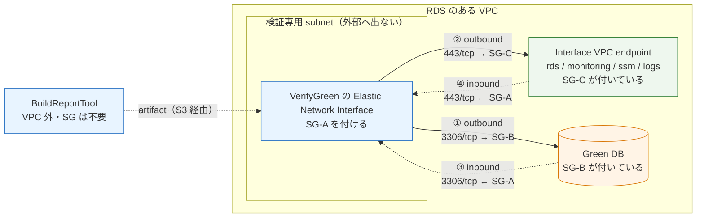
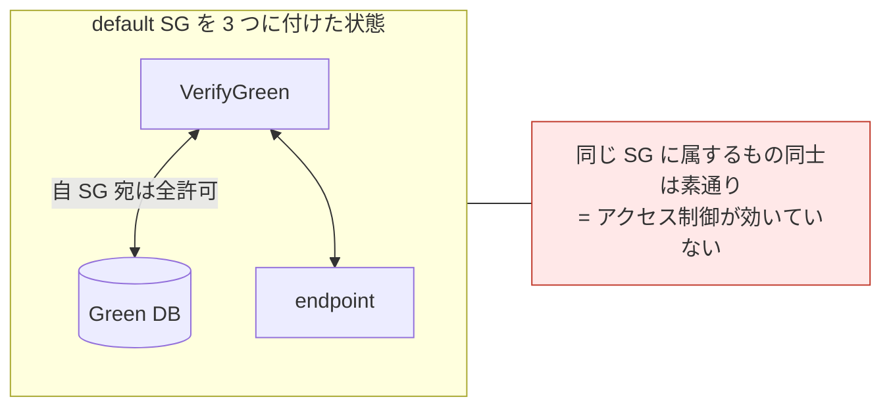

# VerifyGreen の セキュリティグループ設定

> 位置づけ: **設定手順**である。VerifyGreen を RDS のある VPC 内で実行するとき、セキュリティグループ（SG）に何をどう設定するかをまとめる。なぜこの構成なのかは [Step 4 の分離と VPC 配置](verify-green-vpc-architecture.md)、スタックのパラメータ指定は [CodeBuild / CodePipeline セットアップ手順](codebuild-codepipeline-setup.md) にある。

## 1. 前提: テンプレートは SG を作らない

`examples/rds-blue-green-deployment/*.yml` に `AWS::EC2::SecurityGroup` は **1 つも無い**。テンプレートは `VerifyGreenSecurityGroupIds` で**既存 SG の ID を受け取るだけ**である。したがって SG は別途用意する。

組織によって VPC・サブネット・SG の管理主体が違うため、意図的にこのテンプレートの外に置いている。

> **Elastic Network Interface** は VPC 内のリソースに割り当てられる仮想ネットワークインターフェイスである。VPC 内の CodeBuild は実行ごとにこれを作り直すため、**IP アドレスは毎回変わる**。だからセキュリティグループのルールは CIDR ではなくセキュリティグループの ID で書く。

## 2. 設定する箇所

**VPC 内に入れるのは `VerifyGreen` だけである。**`BuildReportTool` は VPC 外で動くので、**セキュリティグループも subnet も要らない**。したがってここで用意する SG は検証の実行にかかわるものだけになる。



| # | どの SG | 方向 | 内容 | 必須か |
|---|---|---|---|---|
| ① | **SG-A**（VerifyGreen 用） | outbound | 3306/tcp → SG-B | 新規 SG は outbound 全許可なので**既定で満たされる** |
| ② | **SG-A** | outbound | 443/tcp → SG-C | 同上 |
| ③ | **SG-B**（RDS 用） | inbound | 3306/tcp ← SG-A | **必ず追加する** |
| ④ | **SG-C**（endpoint 用） | inbound | 443/tcp ← SG-A | **必ず追加する。見落としやすい** |

**`BuildReportTool` 用の SG は作らない。**VPC 外で動くため Elastic Network Interface を持たず、SG を付ける先が無い。ビルドが必要とする外部到達（`proxy.golang.org`）は VPC の外なので、NAT gateway も不要である。

`s3` は Gateway endpoint なので SG を持たない（ルートテーブルの設定だけである）。

**送信元・宛先は CIDR ではなく SG の ID で指定する。** CodeBuild の Elastic Network Interface は実行ごとに作り直され IP が変わるためである。

## 3. 手順（専用 SG を作る場合・推奨）

### 3-1. SG-A（VerifyGreen 用）を作る

```bash
VPC_ID=vpc-xxxxxxxx

SG_A=$(aws ec2 create-security-group \
  --group-name rds-bg-verify-green \
  --description 'CodeBuild VerifyGreen Elastic Network Interface' \
  --vpc-id "$VPC_ID" \
  --query GroupId --output text)
echo "SG-A=$SG_A"
```

**inbound ルールは追加しない。** CodeBuild の Elastic Network Interface へ外から接続するものは無い。作成直後の SG は inbound が空・outbound が `0.0.0.0/0` 全許可なので、①② はこの時点で満たされている。

outbound を絞る方針なら、全許可を外してから必要分だけ開ける。

```bash
# 既定の全許可を外す
aws ec2 revoke-security-group-egress --group-id "$SG_A" \
  --ip-permissions 'IpProtocol=-1,IpRanges=[{CidrIp=0.0.0.0/0}]'

# ① Green DB へ
aws ec2 authorize-security-group-egress --group-id "$SG_A" \
  --ip-permissions "IpProtocol=tcp,FromPort=3306,ToPort=3306,UserIdGroupPairs=[{GroupId=$SG_B}]"

# ② Interface endpoint へ
aws ec2 authorize-security-group-egress --group-id "$SG_A" \
  --ip-permissions "IpProtocol=tcp,FromPort=443,ToPort=443,UserIdGroupPairs=[{GroupId=$SG_C}]"
```

### 3-2. SG-B（RDS 側）に inbound を足す ← 必須

```bash
# 移行元 Blue に付いている SG を調べる
SG_B=$(aws rds describe-db-instances \
  --db-instance-identifier example-service-production-mysql80 \
  --query 'DBInstances[0].VpcSecurityGroups[?Status==`active`].VpcSecurityGroupId' \
  --output text)
echo "SG-B=$SG_B"

aws ec2 authorize-security-group-ingress --group-id "$SG_B" \
  --ip-permissions "IpProtocol=tcp,FromPort=3306,ToPort=3306,UserIdGroupPairs=[{GroupId=$SG_A,Description=codebuild-verify-green}]"
```

### 3-3. SG-C（endpoint 側）に inbound を足す ← 必須

```bash
# 対象 endpoint に付いている SG を調べる
aws ec2 describe-vpc-endpoints \
  --filters "Name=vpc-id,Values=$VPC_ID" \
  --query 'VpcEndpoints[?VpcEndpointType==`Interface`].[ServiceName,Groups[0].GroupId]' \
  --output table

SG_C=sg-yyyyyyyy
aws ec2 authorize-security-group-ingress --group-id "$SG_C" \
  --ip-permissions "IpProtocol=tcp,FromPort=443,ToPort=443,UserIdGroupPairs=[{GroupId=$SG_A,Description=codebuild-verify-green}]"
```

endpoint ごとに SG が違う場合は、`rds` / `monitoring` / `ssm` / `logs` の 4 つすべてに入れる。

### 3-4. スタックへ渡す

```text
VpcId=vpc-xxxxxxxx
VerifyGreenSubnetIds=subnet-aaaa,subnet-bbbb
VerifyGreenSecurityGroupIds=<SG-A の ID>
```

## 4. CloudFormation で書く場合

SG の管理をコード化するなら、**別スタック**に置いて ID を出力し、パイプラインのスタックへ渡すのが扱いやすい。SG-B への ingress は `AWS::EC2::SecurityGroupIngress` を独立したリソースにして循環参照を避ける。

```yaml
Parameters:
  VpcId: { Type: AWS::EC2::VPC::Id }
  RdsSecurityGroupId: { Type: AWS::EC2::SecurityGroup::Id }   # SG-B
  EndpointSecurityGroupId: { Type: AWS::EC2::SecurityGroup::Id } # SG-C

Resources:
  # SG-A: CodeBuild の Elastic Network Interface に付ける。inbound は持たせない。
  VerifyGreenSecurityGroup:
    Type: AWS::EC2::SecurityGroup
    Properties:
      GroupDescription: CodeBuild VerifyGreen Elastic Network Interface
      VpcId: !Ref VpcId
      SecurityGroupEgress:
        - IpProtocol: tcp
          FromPort: 3306
          ToPort: 3306
          DestinationSecurityGroupId: !Ref RdsSecurityGroupId
        - IpProtocol: tcp
          FromPort: 443
          ToPort: 443
          DestinationSecurityGroupId: !Ref EndpointSecurityGroupId

  # ③ RDS 側 inbound。SG-B 自体は別管理なのでルールだけ足す。
  RdsIngressFromVerifyGreen:
    Type: AWS::EC2::SecurityGroupIngress
    Properties:
      GroupId: !Ref RdsSecurityGroupId
      IpProtocol: tcp
      FromPort: 3306
      ToPort: 3306
      SourceSecurityGroupId: !Ref VerifyGreenSecurityGroup
      Description: codebuild-verify-green

  # ④ endpoint 側 inbound。
  EndpointIngressFromVerifyGreen:
    Type: AWS::EC2::SecurityGroupIngress
    Properties:
      GroupId: !Ref EndpointSecurityGroupId
      IpProtocol: tcp
      FromPort: 443
      ToPort: 443
      SourceSecurityGroupId: !Ref VerifyGreenSecurityGroup
      Description: codebuild-verify-green

Outputs:
  VerifyGreenSecurityGroupId:
    Value: !Ref VerifyGreenSecurityGroup
```

## 5. default SG を流用する場合（動くが推奨しない）

VPC の default SG は「**同じ SG に属するリソース同士の全通信を許可**」する inbound ルールを持つ。そのため **CodeBuild・RDS・endpoint の 3 つすべてに default SG を付けていれば、追加設定なしで通る。**



ただし default SG は VPC 内の他のリソースにも広く付いていることが多く、**本番 DB へ到達できる範囲が意図せず広がる**。本リポジトリは本番データを扱うため（`docs/references/shared-instance-upgrade-verification.md` でも「緩いサブネット・セキュリティグループに置かない」としている）、専用 SG を作る 3 章の手順を勧める。

## 6. 設定後の確認

```bash
# SG-A に不要な inbound が無いこと、outbound が意図どおりであること
aws ec2 describe-security-groups --group-ids "$SG_A" \
  --query 'SecurityGroups[0].[IpPermissions,IpPermissionsEgress]'

# SG-B に SG-A からの 3306 が入っていること
aws ec2 describe-security-groups --group-ids "$SG_B" \
  --query 'SecurityGroups[0].IpPermissions[?FromPort==`3306`].UserIdGroupPairs'
```

**Green インスタンスに実際に付いた SG も確認する。** Blue/Green Deployment の Green は Blue の設定を引き継いで作られるため通常は同じ SG になるが、`verify_green.sh` が接続するのは Green のエンドポイントなので、実測しておく。

```bash
aws rds describe-db-instances \
  --db-instance-identifier <green の識別子> \
  --query 'DBInstances[0].VpcSecurityGroups'
```

疎通そのものは、`mysql_verification.enabled: true` にした VerifyGreen を 1 回動かすのが確実である。失敗した場合の切り分けは次章の表を使う。

## 7. よくある失敗

| 症状 | 原因 | 見るところ |
|---|---|---|
| MySQL 接続が**タイムアウト**する（認証エラーではない） | ③ が無い、または Green に別の SG が付いている | SG-B の inbound、Green の `VpcSecurityGroups` |
| `aws rds describe-*` や `cloudwatch get-metric-statistics` がタイムアウトする | ④ が無い、または endpoint 自体が無い | endpoint の SG、endpoint の有無 |
| `ssm get-parameter` だけ失敗する | `ssm` endpoint の SG に ④ が無い | `ssm` endpoint の SG |
| ビルドログが CloudWatch に出ない | `logs` endpoint の SG に ④ が無い | `logs` endpoint の SG |
| artifact の取得・保存で失敗する | `s3` Gateway endpoint が無い（SG は無関係） | ルートテーブル |
| 接続が**即座に拒否**される | SG ではなくポート違いや DB 側の設定 | `mysql_verification.port`、DB のユーザー権限 |
| `BuildReportTool` が Go module を取得できない | **SG の問題ではない。**VPC 外で動くはずのプロジェクトに `VpcConfig` が付いている | [BuildReportTool の失敗切り分け](build-report-tool-troubleshooting.md) を見る |

**タイムアウトは SG か endpoint、即時拒否はそれ以外**、という切り分けが目安になる。
