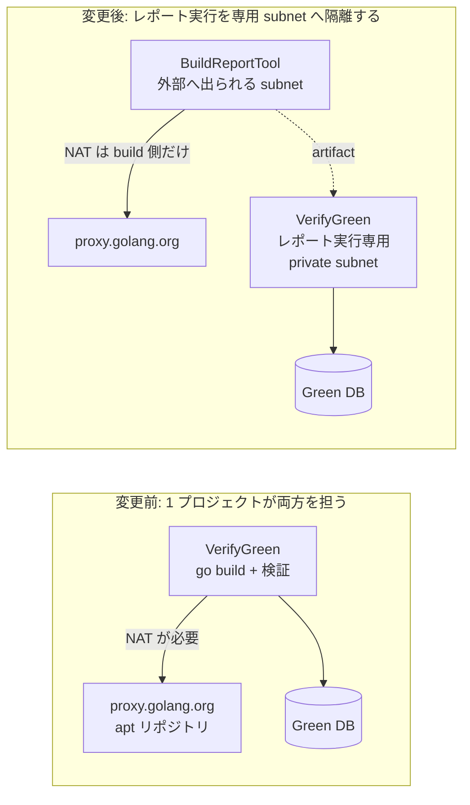
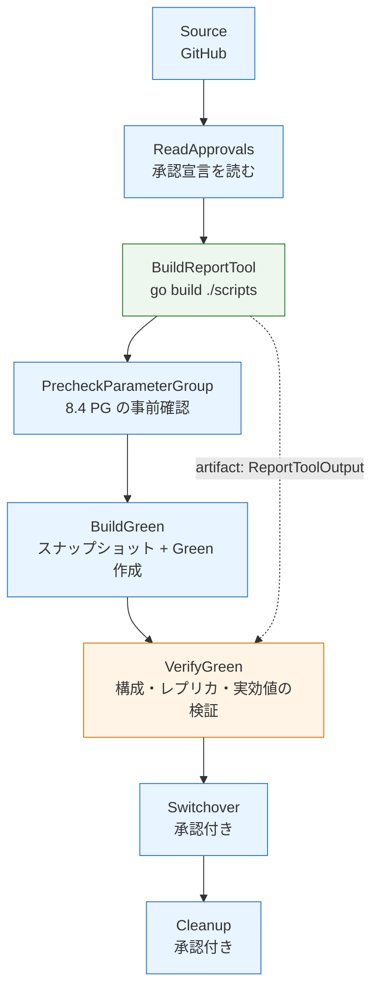
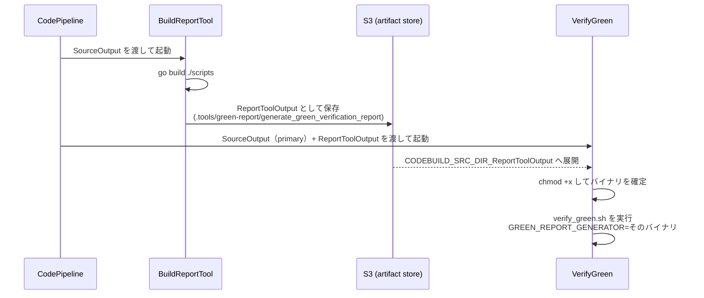
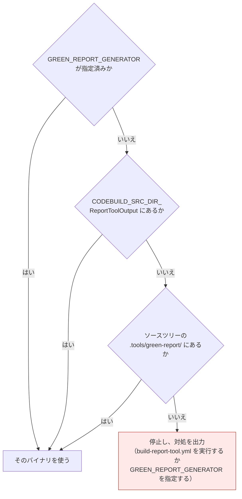
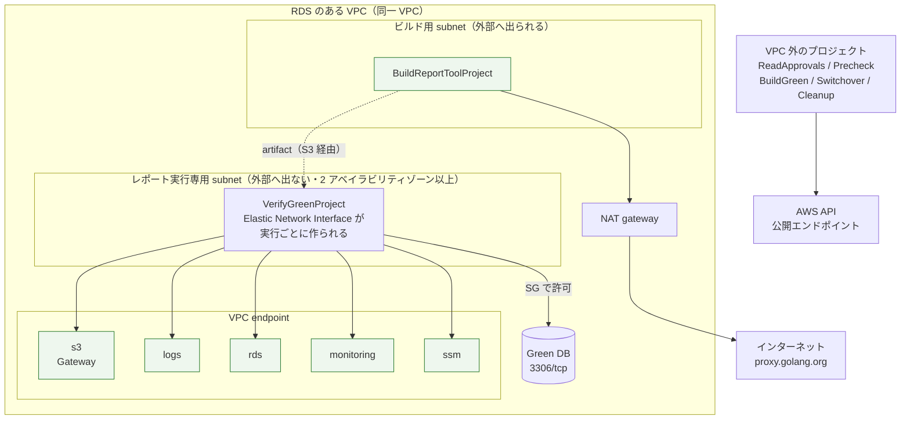
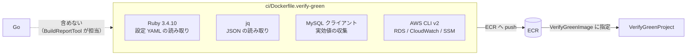
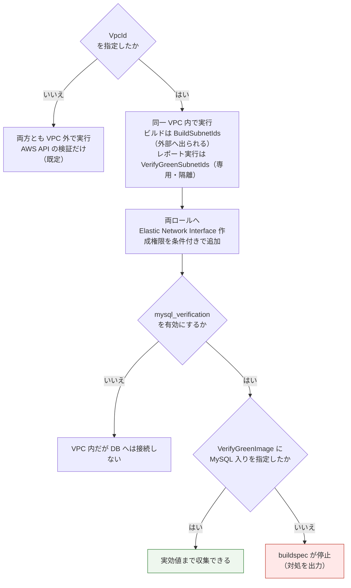

# Step 4 の分離と VPC 配置

> 位置づけ: **構成の説明**である。Step 4（VerifyGreen）を「Go のビルド」と「検証の実行」に分け、実行側だけを RDS のある VPC 内へ置く構成の理由と、必要な設定・ネットワーク要件をまとめる。設定手順そのものは [CodeBuild / CodePipeline セットアップ手順](codebuild-codepipeline-setup.md)、パイプライン全体の構成は [パイプライン構成図](codepipeline-structure.md) にある。

## 1. 何を解決したか

Step 4 は 2 つの性質が異なる仕事を持っている。

| 仕事 | 必要なもの | 触るもの |
|---|---|---|
| Go レポート生成器のビルド | Go、**外部ネットワーク**（`proxy.golang.org`） | 何も触らない |
| Green の検証 | AWS API（読み取り）、**Green DB への到達** | RDS を読む |

このうち **Green DB へ到達するには CodeBuild を VPC 内へ置く必要がある**。両方を 1 つのプロジェクトでやると、VPC 内から外部ネットワークへ出る経路（NAT gateway など）が必須になる。

**レポート実行を同一 VPC 内の専用 subnet へ隔離し、そこには外部経路を置かない。**ビルドは外部へ出られる subnet で行い、成果物は artifact で渡す。これで検証を行う subnet から外部依存が消える。



## 2. パイプライン上の配置



- 薄い青 … VPC 外（CodeBuild の既定）
- 薄い緑 … 同一 VPC の**ビルド用 subnet**（外部へ出られる。既存のものを流用してよい）
- 薄い橙 … 同一 VPC の**レポート実行専用 subnet**（外部へ出ない。RDS へ到達する）

VPC 配置は `VpcId` を指定したときだけ有効になる。未指定なら両方とも VPC 外で動く（AWS API の検証のみ）。

`BuildReportTool` を `ReadApprovals` の直後に置いているのは、**AWS リソースに触る前にビルドを済ませる**ためである。ビルドが失敗しても RDS には何の影響もない。

## 3. artifact の受け渡し

CodePipeline のアクションは複数の input artifact を取れる。2 つ目以降は `CODEBUILD_SRC_DIR_<artifact 名>` に展開される。



入力が複数になるため、アクションの `Configuration` に **`PrimarySource: SourceOutput`** を指定してどちらをソースとして展開するかを明示する。

`verify-green.yml` はバイナリを次の順で探し、**どれも無ければビルドせずに停止する**。外部へ出ないという前提を崩さないためである。



## 4. ネットワーク要件の分離



**要点は、レポート実行を専用 subnet へ隔離することである。**外部への経路（NAT gateway）はビルド用 subnet のルートテーブルにだけ置き、**レポート実行専用 subnet には置かない**。ビルド用は専用に用意する必要はなく、既に外部へ出られる subnet を流用してよい。

`VerifyGreen` が VPC 内から呼ぶ API と、対応する endpoint は次のとおりである。**NAT gateway を置かない場合はこれらが必要になる。**

| 呼び出し | endpoint | 種別 |
|---|---|---|
| artifact の入出力 | `com.amazonaws.<region>.s3` | Gateway |
| ビルドログ | `com.amazonaws.<region>.logs` | Interface |
| `rds describe-db-instances` / `describe-blue-green-deployments` / `describe-db-parameters` | `com.amazonaws.<region>.rds` | Interface |
| `cloudwatch get-metric-statistics`（ReplicaLag） | `com.amazonaws.<region>.monitoring` | Interface |
| `ssm get-parameter`（接続情報の SecureString） | `com.amazonaws.<region>.ssm` | Interface |

カスタマー管理キーで暗号化した SecureString を使う場合は `kms` も追加する。

**Interface endpoint にはそれぞれ SG が付く。**CodeBuild 側の SG からの 443/tcp を許可しないと、上の API 呼び出しはタイムアウトする。設定手順は [セキュリティグループ設定](verify-green-security-group-setup.md) にある。

**不要になったもの**: `proxy.golang.org`（ビルドを分離）、`PyPI`（設定 YAML の読み取りが Ruby 標準ライブラリ）、`apt リポジトリ`（MySQL クライアントをイメージへ同梱）。

## 5. MySQL クライアントをイメージへ同梱する理由

private subnet では apt リポジトリへ到達できない。そのため **buildspec から実行時導入（`apt-get install mysql-client`）を削除**し、イメージ側に含めることにした。



`mysql_verification.enabled: true` なのに MySQL クライアントが無い場合、buildspec は**理由と対処を出して停止**する。黙って検証項目を落とさない。

> **Elastic Network Interface** は VPC 内のリソースに割り当てられる仮想ネットワークインターフェイスである。VPC 内で動く CodeBuild は、ビルドを実行するたびに指定した subnet へこれを作り、終了時に削除する。そのため実行ロールに作成・削除の権限が必要で、送信元を IP アドレスで固定できない（実行ごとに変わる）。

## 6. 設定の切り替え

`VpcConfig` は **CodeBuild プロジェクトのプロパティ**である。パイプライン実行ごとには切り替えられず、**CloudFormation でスタックを作成／更新するときに決まる。**



| パラメータ | 未指定のとき | 指定したとき |
|---|---|---|
| `VpcId` | 両プロジェクトとも VPC 外（Green DB へは接続できない） | **同一 VPC 内で実行。両ロールに Elastic Network Interface 作成権限が自動で付く** |
| `BuildSubnetIds` | — | ビルドを置く subnet。**外部へ出られる経路（NAT）が必要**。専用に用意しなくてよい |
| `BuildSecurityGroupIds` | — | BuildReportTool 用 SG。外向き 443/tcp を許可する |
| `VerifyGreenSubnetIds` | — | **レポート実行専用の private subnet。**RDS へ到達できること。**外部経路は置かない** |
| `VerifyGreenSecurityGroupIds` | — | RDS 側 inbound で 3306/tcp を許可する SG。**テンプレートは SG を作らない**ので別途用意する（[セキュリティグループ設定](verify-green-security-group-setup.md)） |
| `VerifyGreenImage` | `aws/codebuild/standard:7.0` | **ECR のカスタムイメージ**。`ImagePullCredentialsType` が `SERVICE_ROLE` へ切り替わり、ECR 読み取り権限が自動で付く |
| `CollectMySqlRuntimeValues` | AWS API の検証だけ | Green DB へ接続して実効値も収集 |

## 7. どこで落ちるか

構成を誤ったときにどの段階で止まるかを整理しておく。**いずれも黙って検証項目が減ることはない。**

| 症状 | 原因 | 対処 |
|---|---|---|
| どちらかのプロジェクトが起動時に失敗する | Elastic Network Interface 作成権限が無い | `VpcId` を指定してテンプレートを更新する（両ロールへ条件付きで付く） |
| `Report generator is absent` で停止 | artifact を受け取れていない | `BuildReportTool` ステージの成否と `PrimarySource` の指定を確認する |
| `mysql_verification is enabled but the MySQL client is absent` | 既定イメージのまま実効値収集を有効にした | `VerifyGreenImage` に MySQL 入りイメージを指定する |
| AWS API 呼び出しがタイムアウトする | VPC endpoint が足りない | 上の表の 5 種（+ `kms`）を確認する |
| Green DB へ接続できない | SG / subnet のルーティング | [セキュリティグループ設定](verify-green-security-group-setup.md) の「よくある失敗」を見る |
| `BuildReportTool` が Go module を取得できない | ビルド用 subnet に外部経路が無い | その subnet のルートテーブルに NAT gateway があるか、`BuildSecurityGroupIds` が外向き 443 を許可しているかを見る |

## 8. ローカルでの確認

実 AWS へ接続せずに、buildspec のコマンド列だけを確かめられる。

```bash
# ビルド側（成果物が .tools/green-report/ に出ることを確認する）
# 実行側（artifact を受け取れない場合に停止することを確認する）
scripts/lib/cfn_shorthand_test.sh   # レポート生成器の 2 形態（実効値あり/なし）を固定している
```

Local Agent を使う場合の注意は [CodeBuild 各フローの単体ローカル検証](codebuild-local-verification.md) にある。**Local Agent のランナー image は `runtime-versions` を解決しない**ため、ホストで先にビルドしたバイナリを `GREEN_REPORT_GENERATOR` で渡す。
