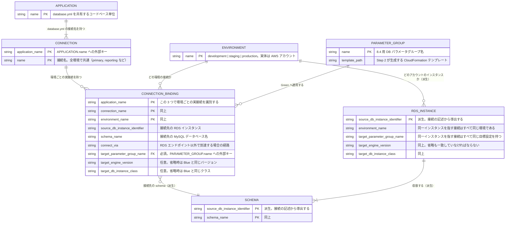

# 移行カタログの概念 ER 図

移行カタログは、アプリケーションの接続定義を 1 か所へ集約する。Blue/Green deployment の実行単位は schema ではなく RDS DB インスタンスであるため、**同じインスタンスを指す接続を集めたものが 1 つの deployment になる。**

あわせて、**現状ばらばらに定義されている接続設定（環境変数・設定ファイル直書きなど）をまとめた資料**としても使う。ただし実定義の所在は**フィールドではなく YAML のコメント**として書く。機械が使わないものをフィールドにすると、ツールが検証・利用する値だと誤解させるためである。

**認証情報は記載しない。** パスワードは管理対象外であり、どこで与えられるかをコメントに書き留めるだけにとどめる。

この文書は目標のカタログ構造である。既存の `config/migration-catalog.yml` と生成スクリプトをこの構造に変更する作業は、別途行う。

## ER 図



## 2 階層の意図

| 階層 | 実体 | 環境依存 | 何を表すか |
|---|---|---|---|
| 1 | `APPLICATION` | しない | `database.yml` を共有するコードベース |
| 2 | `CONNECTION` | **しない** | マルチ DB の接続名。コードの `connects_to` が参照する識別子 |
| 3 | `CONNECTION_BINDING` | **する** | その接続名が、各環境で実際にどこへ繋がっているか |

Rails では接続名が全環境で共通でなければコードが動かないため、2 を環境非依存に置く。一方 `database:` の値やホストの与えられ方は環境ごとに違うため、3 を分ける。

### 論理 DB という中間の名前は置かない

以前の版は、接続名（`primary`）と MySQL データベース名（`order_development`）のあいだに「論理 DB」（`orders`）という環境非依存の名前を置いていた。これを廃した。

**接続先の同一性は `(rds_instance, schema_name)` で判定できる。** 中間の名前は、環境をまたいだ同一性を辿るためにしか必要なく、Blue/Green の実行には使わない。

| 問い | 中間の名前が必要か |
|---|---|
| このインスタンスを切り替えると誰が影響を受けるか | 不要。`rds_instance` の一致で引ける |
| この schema に繋いでいるのは誰か | 不要。`(rds_instance, schema_name)` で引ける |
| 同じデータが各環境でどこにあるか | **必要**。そのため辿れない（後述の前提を参照） |

## YAML の構造

```yaml
# アプリケーションごとに、接続名と、各環境での実際の接続定義をまとめる。
applications:
  # database.yml を共有するコードベース単位。デプロイ単位ではない。
  order:
    connections:
      # 接続名は全環境で共通。コードの connects_to が参照する。
      primary:
        environments:
          development:
            # 実定義: config/database.yml に直書き
            rds_instance: shared-development-mysql80
            schema_name: order_development
            target:
              # db_parameter_group_name だけが必須。
              db_parameter_group_name: shared-development-mysql84-v1
              # 任意。省略すると Blue の実環境の値を踏襲する。
              # 8.0 → 8.4 の移行では engine_version の指定が必要
              # （省略すると Blue と同じバージョンのままでアップグレードされない）。
              # engine_version: "8.4.10"
              # db_instance_class: db.r6g.large
          staging:
            # 実定義: 環境変数 ORDER_DB_HOST / ORDER_DB_NAME
            rds_instance: order-staging-mysql80
            schema_name: order_staging
            target:
              # db_parameter_group_name だけが必須。
              db_parameter_group_name: order-staging-mysql84-v1
              # 任意。省略すると Blue の実環境の値を踏襲する。
              # 8.0 → 8.4 の移行では engine_version の指定が必要
              # （省略すると Blue と同じバージョンのままでアップグレードされない）。
              # engine_version: "8.4.10"
              # db_instance_class: db.r6g.large
          production:
            # 実定義: 環境変数 ORDER_DB_HOST / ORDER_DB_NAME
            rds_instance: order-production-mysql80
            schema_name: order_production
            # RDS エンドポイントへ直接ではなく CNAME 経由で到達する場合に記録する。
            connect_via: order-db.internal.example.com
            target:
              # db_parameter_group_name だけが必須。
              db_parameter_group_name: production-mysql84-v1
              # 任意。省略すると Blue の実環境の値を踏襲する。
              # 8.0 → 8.4 の移行では engine_version の指定が必要
              # （省略すると Blue と同じバージョンのままでアップグレードされない）。
              # engine_version: "8.4.10"
              # db_instance_class: db.r6g.large
      # 接続名は同じアプリ内で一意。マルチ DB の 2 本目。
      reporting:
        environments:
          # development / staging にはこの接続を配置していない。
          production:
            # production では payment のインスタンスに同居する。
            # 実定義: 環境変数 ANALYTICS_DB_URL
            rds_instance: payment-production-mysql80
            schema_name: analytics_production
            # 同じインスタンスを指す接続は同じ target を書く（生成器が検証する）。
            # 省略した項目も一致していなければならない。
            target:
              # db_parameter_group_name だけが必須。
              db_parameter_group_name: production-mysql84-v1
              # 任意。省略すると Blue の実環境の値を踏襲する。
              # 8.0 → 8.4 の移行では engine_version の指定が必要
              # （省略すると Blue と同じバージョンのままでアップグレードされない）。
              # engine_version: "8.4.10"
              # db_instance_class: db.r6g.large
  payment:
    connections:
      primary:
        environments:
          development:
            # development では order と同じインスタンスに同居する。
            # 実定義: config/database.yml に直書き
            rds_instance: shared-development-mysql80
            schema_name: payment_development
            target:
              # db_parameter_group_name だけが必須。
              db_parameter_group_name: shared-development-mysql84-v1
              # 任意。省略すると Blue の実環境の値を踏襲する。
              # 8.0 → 8.4 の移行では engine_version の指定が必要
              # （省略すると Blue と同じバージョンのままでアップグレードされない）。
              # engine_version: "8.4.10"
              # db_instance_class: db.r6g.large
          production:
            # 実定義: 環境変数 PAYMENT_DATABASE_URL
            rds_instance: payment-production-mysql80
            schema_name: payment_production
            target:
              # db_parameter_group_name だけが必須。
              db_parameter_group_name: production-mysql84-v1
              # 任意。省略すると Blue の実環境の値を踏襲する。
              # 8.0 → 8.4 の移行では engine_version の指定が必要
              # （省略すると Blue と同じバージョンのままでアップグレードされない）。
              # engine_version: "8.4.10"
              # db_instance_class: db.r6g.large
# DB を配置している環境の一覧。実体は AWS アカウントで、
# AWS CLI のプロファイルに一対一で対応するものとして扱う。
database_environments:
  - development
  - staging
  - production

# パラメータグループは複数インスタンスで共有しうるため、独立させる。
parameter_groups:
  shared-development-mysql84-v1:
    template_path: generated/parameter-groups/shared-development.yaml
  order-staging-mysql84-v1:
    template_path: generated/parameter-groups/order-staging.yaml
  # production の 2 インスタンスで共有する共通ベースライン。
  production-mysql84-v1:
    template_path: generated/parameter-groups/production.yaml
```

**トップレベルは `applications` / `database_environments` / `parameter_groups` の 3 つだけである。**

| YAML の階層 | ER の実体 |
|---|---|
| `applications.<app>` | `APPLICATION` |
| `applications.<app>.connections.<conn>` | `CONNECTION` |
| `applications.<app>.connections.<conn>.environments.<env>` | `CONNECTION_BINDING` |
| `database_environments` | `ENVIRONMENT` |
| `parameter_groups.<name>` | `PARAMETER_GROUP` |
| （導出） | `SCHEMA` / `RDS_INSTANCE` |

**接続定義はすべて `applications` 配下にある。** アプリを開けば、その接続が各環境で何に繋がっていて、どこへ移行するのかが 1 か所で読める。

### 環境は AWS アカウント、つまり AWS CLI のプロファイルに相当する

`development` / `staging` / `production` の 3 つで、実体は別々の AWS アカウントである。**`database_environments` に並ぶ環境名は、AWS CLI のプロファイルに一対一で対応するものとして扱う。**

したがってカタログはアカウント ID もリージョンも持たない。環境名からプロファイルを解決し、収集・実行コマンドの `--profile` / `--region` として渡す。プロファイル名が環境名と一致しない場合は、コマンド側で読み替える。

### `target` はパラメータグループ以外は任意

`db_parameter_group_name` だけが必須である。Step 2 で生成・適用した 8.4 用パラメータグループを指すもので、移行の目的そのものだからである。

残りは省略できる。**省略した項目は `create-blue-green-deployment` の対応するオプションを渡さないことで、Blue の実環境の値を踏襲する。**

| 項目 | 省略したときの挙動 |
|---|---|
| `db_parameter_group_name` | **省略できない** |
| `db_instance_class` | Blue と同じクラスで Green を作る。**通常はこれでよい** |
| `engine_version` | Blue と**同じバージョン**で Green を作る |

> **`engine_version` の省略には注意する。** AWS のドキュメントは「指定しない場合、Green の各データベースは Blue の対応するインスタンスと同じエンジンバージョンで作成される」と明記している。つまり **8.0 → 8.4 の移行では省略するとアップグレードされない。** 省略は「今回はバージョンを上げないインスタンス」を意味するため、生成スクリプトは省略時に警告を出す。

インスタンスクラスは Blue の実値を踏襲するのが既定の期待に合う。移行に合わせて上げる場合だけ書く。

### `SCHEMA` と `RDS_INSTANCE` は導出する

どちらも接続の記述から導出する。

- `SCHEMA` は `(rds_instance, schema_name)` の組を集めれば決まる
- `RDS_INSTANCE` の環境と目標設定は、そのインスタンスを指す接続を集めれば決まる

独立セクションを設けないため、**同じインスタンスを指す接続のあいだで `target` が重複する。** `payment-production-mysql80` を指す 2 つの接続（`payment.primary` と `order.reporting`）は同じ `target` を書くことになる。重複は許し、一致を検証で担保する。

## 一意性と参照整合性

生成スクリプトが検証すべき制約である。

| 制約 | 根拠 |
|---|---|
| `(application, connection_name, environment)` は一意 | 入れ子で保証される |
| 接続の環境は `database_environments` に含まれる | 存在しない環境への接続の検出 |
| `target.db_parameter_group_name` が指定されている | 必須。移行の目的そのものであるため省略できない |
| `db_parameter_group_name` は `parameter_groups` に存在する | 誤記の検出 |
| 各接続に `rds_instance` と `schema_name` がある | 接続先はここからしか得られないため省略できない |
| 同じ `rds_instance` を指す接続が、すべて同じ環境を書いている | **重複するため横断検査が要る** |
| 同じ `rds_instance` を指す接続が、すべて同じ `target` を書いている | **同上。食い違うと Blue/Green の設定が定まらない。指定の有無も一致していること** |

### 警告にとどめる検査

| 検査 | 理由 |
|---|---|
| ある環境にだけ接続が無い | その環境へ未デプロイという正常な状態がありうる |
| 同じ `(rds_instance, schema_name)` を複数アプリが指す | 共有は正常だが、切替の影響が複数アプリに及ぶため明示する |
| 1 インスタンスに複数の schema が載る | 同居は正常だが、切替の影響範囲が広がるため明示する |
| `target.engine_version` が省略されている | Blue と同じバージョンで Green を作ることになる。8.0 → 8.4 の移行では指定漏れの可能性が高い |

## 関係と責務

| 要素 | 管理すること | 管理しないこと |
|---|---|---|
| `applications.<app>.connections` | 接続名（環境共通） | ホスト名、ユーザー名、**パスワード** |
| `applications.<app>.connections.<conn>.environments.<env>` | 接続先インスタンス、MySQL データベース名、到達経路、Green 側の目標設定（パラメータグループ以外は任意） | リージョン、AWS アカウント ID、実定義の所在（コメントで書く） |
| `database_environments` | DB を配置している環境の一覧 | アカウント ID、リージョン、プロファイル名 |
| `parameter_groups` | 8.4 用パラメータグループの名前と生成元テンプレート | どのインスタンスへ適用するか |

## 生成単位

接続に現れる `rds_instance` の**インスタンスごと**に、一つの Blue/Green deployment を生成する。同じインスタンスを指す接続は 1 つの deployment にまとめる。

- 一つの RDS インスタンスに複数 schema がある場合は、複数の接続が同じ `rds_instance` を指す。
- 一つの schema を複数アプリが使う場合は、各アプリの接続が同じ `(rds_instance, schema_name)` を指す。
- 生成対象は環境で絞る。`--environment production` の指定時は、その環境の接続だけを取り出す。
- リージョンと AWS アカウント ID はカタログに持たない。環境名が AWS CLI のプロファイルに相当するため、収集・実行コマンドの `--profile` / `--region` で解決する。

## 切替の影響範囲を辿る

```
applications を走査し、同じ rds_instance を指す接続を集める
  → .schema_name   （そのインスタンスに載っている MySQL データベース名）
  → 属するアプリ    （影響を受けるコードベース）
  → コメントの「実定義」（書き換えが必要なとき見る場所）
```

## この構造が置いている前提

図に表れないため、明示しておく。

- **接続名は全環境で共通である。** Rails の `connects_to` がそれを要求する。環境によって接続名自体が変わる構成は表現しない。
- **`role`（writing / reading / replica）は持たない。** 移行では読み書きの区別を必要としない。レプリカを別接続名で持っている場合は、その名前を `CONNECTION` として並べれば足りる。
- **カタログが扱うのはプライマリインスタンスだけである。** リードレプリカは Blue/Green deployment が自動で複製するため管理しない。シャーディングのように 1 つのデータを複数インスタンスへ分割する構成も対象外である。
- **環境をまたいだデータの同一性は辿れない。** 中間の論理名を置かないため、`order_development` と `order_production` が同じデータであることをカタログは知らない。同じ接続名から辿れば人は判断できるが、機械的な突き合わせはできない。「同じ接続名が環境によって別のデータを指している」という誤りも検出できない。
- **どのアプリも接続していない schema は把握できない。** 接続の記述だけが情報源であるため、休眠 schema やカタログ外のアプリが使う schema は現れない。**それらも Blue/Green で一緒に移行される**ため、RDS インベントリと実 DB の `SHOW DATABASES` で別途確認する。
- **1 インスタンスに同居する schema は、切替の影響を同時に受ける。** `actions` の承認は生成単位＝インスタンス単位であり、schema ごとに分けられない。同居する schema の所有者が異なる場合、承認は所有者全員の合意を前提とする。
- **`target` で省略した項目は Blue の実値を踏襲する。** カタログに書かない値は RDS から取得した実環境の値がそのまま使われる。したがってカタログは「Blue と変える点」だけを宣言する差分の記述になる。
- **実定義との二重管理を許容する。** カタログは実定義の正本ではなく、所在を集約した資料である。ずれうるため、接続名の一覧は実際の `database.yml` と突き合わせて検証することが望ましい。
