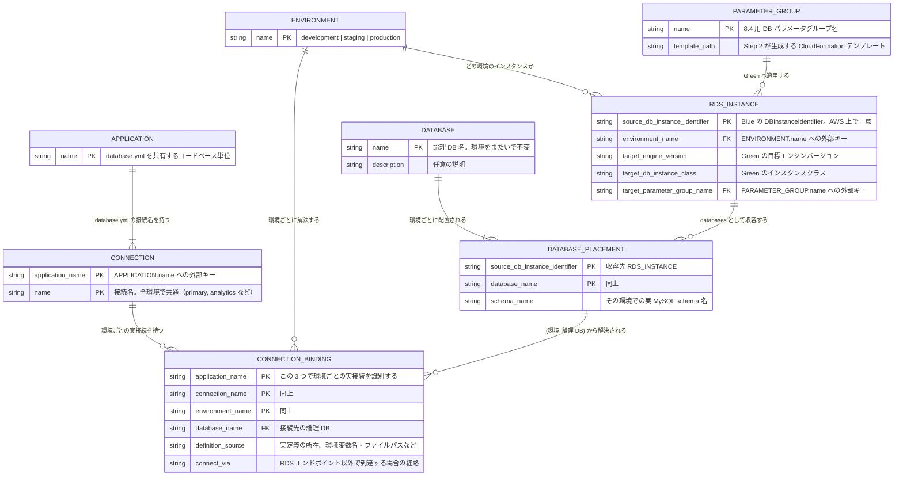

# 移行カタログの概念 ER 図

移行カタログは、アプリケーション・接続名・論理 DB・環境ごとの RDS 実構成を分離して管理する。Blue/Green deployment の実行単位は schema ではなく RDS DB インスタンスであるため、環境別の実設定は `rds_instances` に集約する。

あわせて、**現状ばらばらに定義されている接続設定（環境変数・設定ファイル直書きなど）を 1 か所へまとめた資料**としても使う。実定義との二重管理になるが、所在を辿れる価値を優先して許容する。

**認証情報は記載しない。** パスワードは管理対象外であり、どこで与えられるかを `definition_source` に記録するだけにとどめる。

この文書は目標のカタログ構造である。既存の `config/migration-catalog.yml` と生成スクリプトをこの構造に変更する作業は、別途行う。

## ER 図



## 3 階層の意図

| 階層 | 実体 | 環境依存 | 何を表すか |
|---|---|---|---|
| 1 | `APPLICATION` | しない | `database.yml` を共有するコードベース |
| 2 | `CONNECTION` | **しない** | マルチ DB の接続名。コードの `connects_to` が参照する識別子 |
| 3 | `CONNECTION_BINDING` | **する** | その接続名が、各環境で実際にどこへ繋がっているか |

Rails では接続名が全環境で共通でなければコードが動かないため、2 を環境非依存に置く。一方 `database:` の値やホストの与えられ方は環境ごとに違うため、3 を分ける。

**YAML はこの 3 階層をそのまま入れ子にする。** アプリを開けば接続名が並び、接続名を開けば環境ごとの実定義が並ぶ。移行の影響を確認するとき、アプリ単位で読めることを優先している。

**論理 DB 名と実 schema 名を分けている。** `order` という論理 DB が development では `order_development`、production では `order_production` という schema 名になる、という現実に対応する。実 schema 名は `DATABASE_PLACEMENT.schema_name` が持つ。

## 一意性と参照整合性

生成スクリプトが検証すべき制約である。

| 制約 | 根拠 |
|---|---|
| `rds_instances` のキーは一意 | Blue の DBInstanceIdentifier。YAML のマッピングとして保証される |
| `(application, connection_name, environment)` は一意 | 入れ子で保証される |
| `(environment, database_name)` は一意 | 同一環境内で 1 論理 DB が複数インスタンスに載ることはない。**入れ子では防げないため横断検査が要る** |
| 接続の `(環境, 論理 DB)` に配置が存在する | 接続先を解決できること。**同上** |
| `uses_database` は `databases` に存在する | 誤記の検出 |
| `rds_instances.<id>.databases` のキーは `databases` に存在する | 誤記の検出 |
| `target.db_parameter_group_name` は `parameter_groups` に存在する | 誤記の検出 |
| 各配置に `schema_name` がある | 実 schema 名は環境ごとに異なるため省略できない |

### 警告にとどめる検査

| 検査 | 理由 |
|---|---|
| 同じ接続名が環境によって別の論理 DB を指す | 設定誤りの可能性が高いが、**実態をそのまま記録できることを優先**する。エラーにせず警告する |
| ある環境にだけ `CONNECTION_BINDING` が無い | その環境へ未デプロイという正常な状態がありうる |
| どの接続からも参照されない `DATABASE_PLACEMENT` | カタログ外のアプリが使う schema、または移行対象に含まれる休眠 schema。**移行単位には含める必要がある**ため、除外しない |

## YAML の構造

```yaml
# アプリケーションごとに、接続名と、各環境での実定義の所在をまとめる。
applications:
  # database.yml を共有するコードベース単位。デプロイ単位ではない。
  order:
    connections:
      # 接続名は全環境で共通。コードの connects_to が参照する。
      primary:
        # 全環境で同じ論理 DB を指すため、接続レベルに 1 度だけ書く。
        uses_database: order
        environments:
          development: { definition_source: config/database.yml に直書き }
          staging:     { definition_source: 環境変数 ORDER_DB_HOST / ORDER_DB_NAME }
          production:
            definition_source: 環境変数 ORDER_DB_HOST / ORDER_DB_NAME
            # RDS エンドポイントへ直接ではなく CNAME 経由で到達する場合に記録する。
            connect_via: order-db.internal.example.com
      analytics:
        uses_database: analytics
        environments:
          # development / staging にはこの接続を配置していない。
          production: { definition_source: 環境変数 ANALYTICS_DB_URL }

  payment:
    connections:
      primary:
        uses_database: payment
        environments:
          development: { definition_source: config/database.yml に直書き }
          production:  { definition_source: 環境変数 PAYMENT_DATABASE_URL }

databases:
  order:
    description: 注文データ
  payment:
    description: 決済データ
  analytics:
    description: 集計データ

# パラメータグループは複数インスタンスで共有しうるため、インスタンスの外に置く。
parameter_groups:
  shared-development-mysql84-v1:
    template_path: generated/parameter-groups/shared-development.yaml
  order-staging-mysql84-v1:
    template_path: generated/parameter-groups/order-staging.yaml
  # production の 2 インスタンスで共有する共通ベースライン。
  production-mysql84-v1:
    template_path: generated/parameter-groups/production.yaml

# 環境はインスタンスの属性。environments セクションを設けず平坦に並べる。
# キーは Blue の DBInstanceIdentifier。AWS 上で一意なので論理名を別に持たない。
# 1 エントリ = 1 Blue/Green deployment の生成単位。
rds_instances:
  shared-development-mysql80:
    environment: development
    # development では 3 つの論理 DB が同居する。
    databases:
      order:     { schema_name: order_development }
      payment:   { schema_name: payment_development }
      analytics: { schema_name: analytics_development }
    target:
      engine_version: "8.4.10"
      db_instance_class: db.t4g.small
      db_parameter_group_name: shared-development-mysql84-v1

  order-staging-mysql80:
    environment: staging
    databases:
      order: { schema_name: order_staging }
    target:
      engine_version: "8.4.10"
      db_instance_class: db.t4g.medium
      db_parameter_group_name: order-staging-mysql84-v1

  order-production-mysql80:
    environment: production
    databases:
      order: { schema_name: order_production }
    target:
      engine_version: "8.4.10"
      db_instance_class: db.r6g.large
      db_parameter_group_name: production-mysql84-v1

  payment-production-mysql80:
    environment: production
    # production では payment と analytics が同居する。
    databases:
      payment:   { schema_name: payment_production }
      analytics: { schema_name: analytics_production }
    target:
      engine_version: "8.4.10"
      db_instance_class: db.r6g.large
      db_parameter_group_name: production-mysql84-v1
```

**`environments` セクションを廃し、環境をインスタンスの属性にした。** 環境という中間の入れ子が消え、インスタンスが平坦に並ぶ。`catalog_key` も不要になり、`source_db_instance_identifier` がそのままキーになる。

**アプリケーションは `applications` を軸に並べたままにする。** 「このアプリがどの接続を持ち、各環境でどこに定義されているか」を 1 か所で読めることを優先する。接続をインスタンス側へ寄せると、1 つのアプリの接続一覧が複数インスタンスへ散って読めなくなる。

入れ子が実体の関係を表す。

| YAML の階層 | ER の実体 |
|---|---|
| `applications.<app>` | `APPLICATION` |
| `applications.<app>.connections.<conn>` | `CONNECTION` |
| `applications.<app>.connections.<conn>.environments.<env>` | `CONNECTION_BINDING` |
| `rds_instances.<id>` | `RDS_INSTANCE` |
| `rds_instances.<id>.databases.<db>` | `DATABASE_PLACEMENT` |

接続が繋がる先のインスタンスは書かない。**`(環境, 論理 DB)` から配置を引いて解決する。** 接続側とインスタンス側の両方にインスタンス名を書くと食い違いうるため、片側だけに持たせている。

入れ子で表現できない制約は 2 つある。**どちらも生成スクリプトが横断的に検証する。**

- 1 論理 DB が同一環境の複数インスタンスに現れないこと
- 接続が参照する `(環境, 論理 DB)` に配置が存在すること

## 関係と責務

| 要素 | 管理すること | 管理しないこと |
|---|---|---|
| `applications.<app>.connections` | 接続名（環境共通）、接続先の論理 DB、環境ごとの実定義の所在 | 接続先インスタンス名、ホスト名、ユーザー名、**パスワード** |
| `databases` | 論理 DB の存在と説明 | 物理配置、実 schema 名 |
| `parameter_groups` | 8.4 用パラメータグループの名前と生成元テンプレート | どのインスタンスへ適用するか |
| `rds_instances.<id>` | 所属環境、収容する論理 DB と実 schema 名、Green 側の目標設定 | リージョン、アプリケーションの利用関係 |

## 生成単位

`rds_instances.<id>` の一要素が、一つの Blue/Green deployment の生成単位になる。**接続名を導入しても実行単位は変わらない。** 接続名は影響範囲を辿るための情報である。

- 一つの RDS インスタンスに複数 schema がある場合は、`databases` に複数の論理 DB を並べる。
- 一つの論理 DB を複数アプリが使う場合は、各アプリの `connections.<name>.uses_database` に同じ論理 DB 名を書く。
- 生成対象は `environment` 属性で絞る。`--environment production` の指定時は、その値を持つインスタンスだけを取り出す。
- リージョンはカタログに持たず、RDS インベントリ収集コマンドの `--region` を実行コンテキストとして使用する。

## 切替の影響範囲を辿る

この構造で、Blue/Green 切替時に確認すべき範囲を機械的に引ける。

```
rds_instances.<id>
  → .environment / .databases.<db>   （環境と、載っている論理 DB・実 schema 名）
  → applications を横断し、(環境, 論理 DB) が一致する接続を集める
    → .connections.<conn>            （コードが参照する接続名）
    → .environments.<env>            （実定義の所在。definition_source / connect_via）
```

インスタンス名は接続側に書かないため、突き合わせは `(環境, 論理 DB)` で行う。

`definition_source` まで辿れば、書き換えが必要になった場合にどこを見るかが分かる。

## この構造が置いている前提

図に表れないため、明示しておく。

- **接続名は全環境で共通である。** Rails の `connects_to` がそれを要求する。環境によって接続名自体が変わる構成は表現しない。
- **`role`（writing / reading / replica）は持たない。** 移行では読み書きの区別を必要としない。レプリカを別接続名で持っている場合は、その名前を `CONNECTION` として並べれば足りる。
- **カタログが扱うのはプライマリインスタンスだけである。** リードレプリカは Blue/Green deployment が自動で複製するため、配置として管理しない。シャーディングのように 1 論理 DB を複数インスタンスへ分割する構成も対象外である。
- **1 インスタンスに同居する schema は、切替の影響を同時に受ける。** `actions` の承認は生成単位＝インスタンス単位であり、schema ごとに分けられない。同居する schema の所有者が異なる場合、承認は所有者全員の合意を前提とする。
- **実定義との二重管理を許容する。** カタログは実定義の正本ではなく、所在を集約した資料である。ずれうるため、接続名の一覧は実際の `database.yml` と突き合わせて検証することが望ましい。
