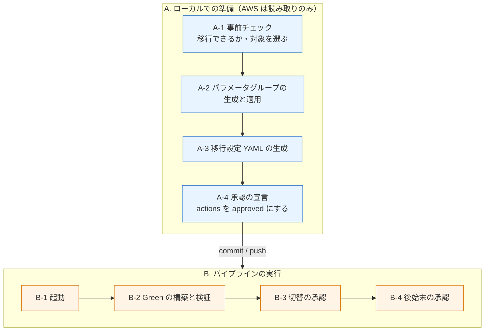
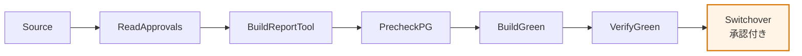

# オペレーション編 2／2: 移行の実行

[編 1 で作ったパイプライン](operations-environment-setup.md)を使って、実際に Blue/Green 移行を進める手順。**移行対象ごと・環境ごとに繰り返す。**

```text
【編 1】環境構築         →  【本書】移行の実行
  一度だけ                     移行対象ごとに繰り返す
```

## 1. 全体像

移行は **ローカルでの準備（A）→ パイプラインの実行（B）** の 2 段構えである。



**A はすべてローカルで完結し、AWS へは読み取りしか行わない。**実際に RDS を変更するのは B だけである。

### 判断は 3 回

移行はレポートを起点に 3 回判断する。**レポートは次のアクションを承認するための入力である。**

| ゲート | どこで | 何を決めるか | 材料 |
|---|---|---|---|
| ① | A-1 のあと | **移行できるか・どれを対象にするか** | 成立条件チェックとパラメータ変換のレポート |
| ② | A-3 のあと | **この移行設定でよいか** | 設定レビューレポート |
| ③ | B-2 のあと | **切り替えてよいか** | Green 検証レポート |

各レポートの中身と生成元は [report-generation-flows.md](report-generation-flows.md) にある。

## 2. A. ローカルでの準備

各ツールのオプション・出力・終了コードは [tools/README.md](tools/README.md) にまとめてある。

### A-1. 事前チェック — 移行できるか、どれを対象にするか

```bash
# 収集（AWS 読み取りのみ）
tools/collect_blue_green_prereqs.sh \
  --db-instance-id <blue-id> --region <region> --profile <profile>

# 判定 → ゲート①のレポート
ruby tools/evaluate_blue_green_prereqs.rb \
  --input-dir <収集先> \
  --output <収集先>/prereqs-evaluation-report.md
```

**`STOP` が 1 件でも残る間は先へ進まない**（終了コード 1）。`REVIEW` は自動判定では決められない項目なので、人が確認して可否を決める。

レポートには判定だけでなく**観測値と取得元**が載る。「なぜ移行可能と判断したか」を後から辿れる。

> チェック項目の詳細は [phase-0-precheck.md](docs/phase-0-precheck.md)。

### A-2. パラメータグループの生成と適用

```bash
# 収集（AWS 読み取りのみ）
tools/collect_mysql84_parameter_inputs.sh --source-parameter-group <8.0-pg-name>

# 生成 → CloudFormation テンプレート＋ゲート①のレポート
ruby tools/generate_mysql84_parameter_group.rb \
  --input-dir <dir> --output-dir <dir> --system <name> --environment <env>
```

出力は 2 つある。

| 出力 | 用途 |
|---|---|
| `mysql84-parameter-group.yaml` | **CloudFormation で適用する。**パラメータグループの変更経路はこれだけである |
| `mysql80-to-mysql84-parameter-report.md` | ゲート①の判断材料 |

**「要レビュー」が残ると終了コード 1 になる。**解消してから適用する。

生成したテンプレートを CloudFormation で適用し、8.4 のパラメータグループを作る。

> 変換ルールの正本は `config/mysql80-to-84-parameter-rules.yml` である。**パラメータの扱いを変えるときはスクリプトではなくこの YAML を編集する。**詳細は [phase-1-parameter-group-cloudformation.md](docs/phase-1-parameter-group-cloudformation.md)。

### A-3. 移行設定 YAML の生成

移行対象が決まったら、パイプラインが読む設定ファイルを作る。

```bash
# RDS インベントリの収集（AWS 読み取りのみ）
go run ./tools/collect_rds_instance_inventory \
  --region <region> --profile <profile> --output <dir>/rds-instance-inventory.json

# 設定 YAML の生成
go run ./tools/generate_blue_green_config \
  --catalog config/migration-catalog.yml \
  --inventory <dir>/rds-instance-inventory.json \
  --environment staging \
  --output config/blue-green/staging.deployment.yml

# ゲート②のレポート（別コマンド。設定ファイルは書き換えない）
go run ./tools/generate_blue_green_config_report \
  --catalog config/migration-catalog.yml \
  --inventory <dir>/rds-instance-inventory.json \
  --environment staging \
  --output <dir>/blue-green-config-review.md
```

**レポートを見て設定内容をレビューする。**アプリと接続先の対応、目標インスタンスクラス、パラメータグループの内容が並ぶ。このレポートは**可否を判定しない**——判断するのは人である。

手で書く場合も、`config/blue-green/<environment>.deployment.yml` の形が満たせていればよい。

> カタログの構造は [migration-catalog-er.md](docs/migration-catalog-er.md)、生成の設計は [config-blue-green-generation-design.md](docs/config-blue-green-generation-design.md)。

### A-4. 承認を宣言する

設定ファイルの `actions` が**唯一の実行許可**である。

```yaml
actions:
  build: pending          # Step 3: Green の構築
  switchover: pending     # Step 5: 切替
  switchover_timeout: 300
  cleanup: pending        # Step 7: 旧 Blue の削除
```

| 値 | 意味 |
|---|---|
| `pending` | **そのアクションは実行されない。**該当ステージは何もせず正常終了するか、ステージごとスキップされる |
| `approved` | 実行してよい |

**これは進捗の記録ではなく、人間の宣言である。**CI は毎回 AWS の実状態を読み、未適用なら適用し、適用済みなら何もしない。`approved` → `pending` に戻しても、適用済みのものは取り消されない。

**一度に全部を `approved` にしない。**段階ごとに宣言し、レポートを見てから次を開けるのが本来の使い方である。

```
A-4 の時点   build: approved / switchover: pending / cleanup: pending
ゲート③通過後  switchover: approved
観測期間のあと  cleanup: approved
```

変更したらリポジトリへ commit / push する。**パイプラインはリポジトリの内容を読む。**

## 3. B. パイプラインの実行

### B-1. 起動

**push では自動起動しない。**明示的に開始する。

```bash
aws codepipeline start-pipeline-execution \
  --name rds-bg-staging \
  --variables name=ServiceName,value=example-service
```

`--variables` で対象サービスを指定する。**環境ごとに 1 パイプラインで、複数サービスを共用できる。**

### B-2. 各ステージで何が起きるか



| ステージ | 何をするか | 承認の影響 |
|---|---|---|
| `Source` | リポジトリを取得 | — |
| `ReadApprovals` | `actions` を読み、後続ステージの条件に使う変数として公開 | — |
| `BuildReportTool` | Go のバイナリ 3 本（AWS 状態の収集・DB 実効値の収集・判定とレポート）をビルドし artifact で渡す。**AWS を呼ばない** | — |
| `PrecheckParameterGroup` | 8.4 パラメータグループの存在と family を確認（読み取りのみ） | — |
| `BuildGreen` | 保護スナップショット＋Blue/Green の作成 | `build: pending` なら**何もせず正常終了** |
| `VerifyGreen` | Green の構成・レプリカ遅延を検証し、**ゲート③のレポートを出す** | — |
| `Switchover` | 手動承認 → 切替 | `switchover: pending` なら**ステージごとスキップ**（承認ボタンも出ない） |

**`pending` のときステージごとスキップされるのは意図的である。**「承認しても何も起きない」クリックを発生させないためで、手動承認が表示された時点で実行される状態になっている。

`BuildReportTool` を早い位置に置いているのは、**AWS リソースに触る前にビルドを済ませる**ためである。ビルドが失敗しても RDS には影響しない。

### B-3. ゲート③ — 切り替えてよいか

`VerifyGreen` が出すレポートを確認する。artifact（`VerifyGreenOutput`）に `green-verification-report.md` が入る。

レポートの先頭「0. 検証結果」に突き合わせの結果が出る。**不適合があればステージ自体が失敗する**ので、成功していれば 5 項目とも適合している。

| 検査 | 内容 |
|---|---|
| エンジンバージョン | 設定の `target_engine_version` で始まること |
| インスタンスクラス | 設定の `target_db_instance_class` と一致すること |
| パラメータグループの関連付け | 設定の `target_db_parameter_group_name` が関連付いていること |
| 適用状態 | `in-sync` であること |
| レプリカ遅延 | 最大値が 0 秒であること |

その先は人が見る。

| 見るもの | 意味 |
|---|---|
| 宣言値 vs 適用値 | Step 2 のテンプレートどおりに適用されているか |
| MySQL 実効値 | 実際に採用されている値（**任意**。収集しない構成では `未収集`） |
| 比較不能 | 値が `!Ref` / `!Sub` の項目。実値が決まらないためドリフト判定に含めない |
| レプリカ遅延 | `ReplicaLag` が 0 であること |

**切替は不可逆に近い。**Blue は `-old1` へリネームされ、切り戻しは別作業になる。ここが最後の確認になる。

問題なければ `switchover: approved` に変えて push し、パイプラインを再実行する。手動承認が表示されるので承認する。

### B-4. 後始末（パイプラインの外・人が実行）

**後始末はパイプラインに含まれない。**旧 Blue の削除は不可逆で、切り戻しが不要だという判断や逆方向レプリケーションの確認と一体で行うべき作業のため、人がツールで実行する。

切替後は観測期間を置く。**逆方向レプリケーションが残っていないことをローカルから確認**してから `cleanup: approved` にし、ツールを実行する。

```bash
tools/cleanup.sh --config config/blue-green/staging.deployment.yml --service example-service
```

**実行には破壊的な権限が要る**（`rds:DeleteBlueGreenDeployment` / `DeleteDBInstance` / `ModifyDBInstance` / `CreateDBSnapshot` / `AddTagsToResource`）。パイプラインの実行ロールはこれを持たないので、作業者がこの権限を持つロールを引き受けて実行する。ツールも `actions.cleanup: approved` の宣言が無ければ何もせず終了する。

**旧 Blue の削除は不可逆である。**最終スナップショットは `final_snapshot_identifier` の固定名で作られる（固定名にすることで、途中失敗後の再実行でスナップショットが増殖しない）。

## 4. 再実行と冪等性

**どのステージも繰り返し実行してよい。**

判定は「操作を実行したか」ではなく「**望ましい終了状態に到達しているか**」で行う。

| 状態 | 結果 |
|---|---|
| 到達している | 何もせず正常終了（`0`） |
| 未到達で、自動では到達できない | 失敗（`1`） |

Deployment ID は設定ファイルに持たず、**毎回 AWS から引き当てる**。これにより再実行・リトライ・同時トリガーで二重作成・二重切替が起こらない。

切替時に Blue が `-old1` へリネームされるため、`source_db_instance_identifier` が指す実体は切替の前後で変わる。この判定は Deployment が cleanup で削除された後も機能する。

> 設計の背景は [decisions/idempotency-strategy.md](docs/decisions/idempotency-strategy.md)。

## 5. パイプラインを使わない実行

同じスクリプトをローカルから直接実行することもできる。**MySQL 接続を伴う確認をローカルで行いたい場合**（VPC 構成を用意しない運用）はこちらになる。

```bash
scripts/build_green.sh  --config config/blue-green/staging.deployment.yml --service example-service
scripts/verify_green.sh --config config/blue-green/staging.deployment.yml --service example-service
scripts/switchover.sh   --config config/blue-green/staging.deployment.yml --service example-service --approve
```

**承認の宣言（`actions`）は同じように効く。**設定が `pending` なら何もせず正常終了する。

手順の詳細は [direct-blue-green-execution.md](docs/direct-blue-green-execution.md)。

## 6. 補足リファレンス

本書はパイプラインでの実行に絞ってある。個々のチェックの中身や背景は次を参照する。

| 知りたいこと | ドキュメント |
|---|---|
| **レポートの中身と生成元** | [report-generation-flows.md](report-generation-flows.md) |
| Step 1 のチェック項目（0-1-01〜14） | [phase-0-precheck.md](docs/phase-0-precheck.md) |
| Step 2 のパラメータグループ管理 | [phase-1-parameter-group-cloudformation.md](docs/phase-1-parameter-group-cloudformation.md) |
| 設定 YAML の生成とカタログ | [config-blue-green-generation-design.md](docs/config-blue-green-generation-design.md) / [migration-catalog-er.md](docs/migration-catalog-er.md) |
| Step の分割と実装状況 | [upgrade-flow-steps.md](docs/upgrade-flow-steps.md) |
| 移行手順の詳細（Phase 0〜5） | [rds-mysql-84-migration-guide.md](docs/rds-mysql-84-migration-guide.md) |
| ローカル直接実行の手順 | [direct-blue-green-execution.md](docs/direct-blue-green-execution.md) |
| CI の構成・buildspec | [ci/README.md](ci/README.md) |
| 冪等性の設計 | [decisions/idempotency-strategy.md](docs/decisions/idempotency-strategy.md) |
