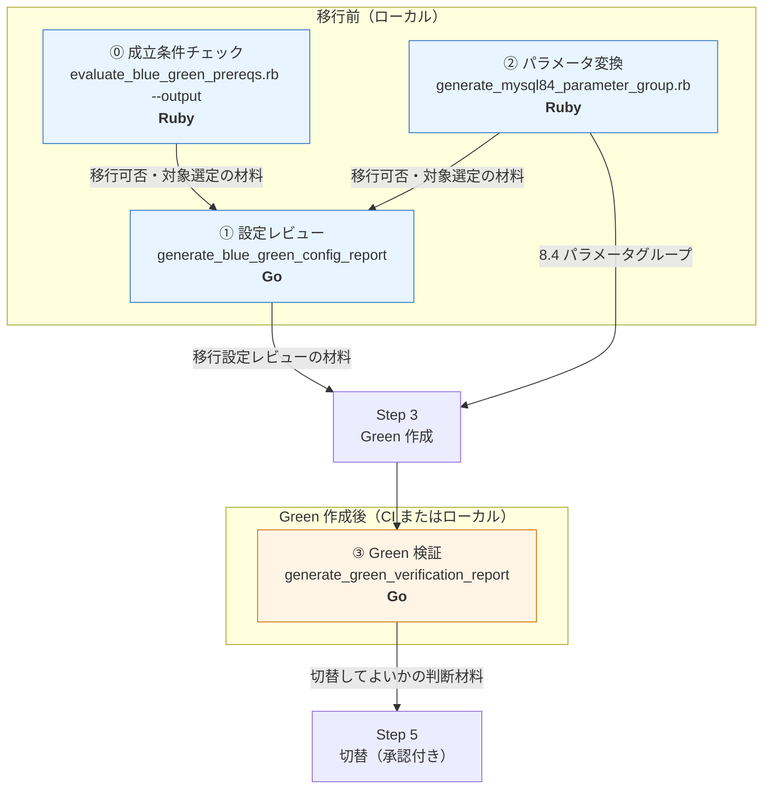
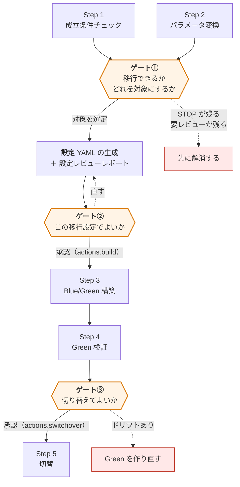
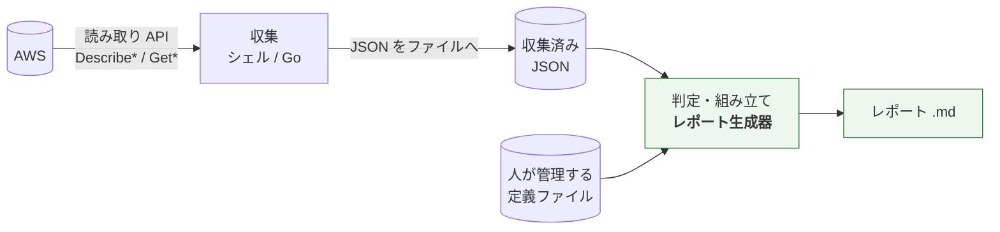
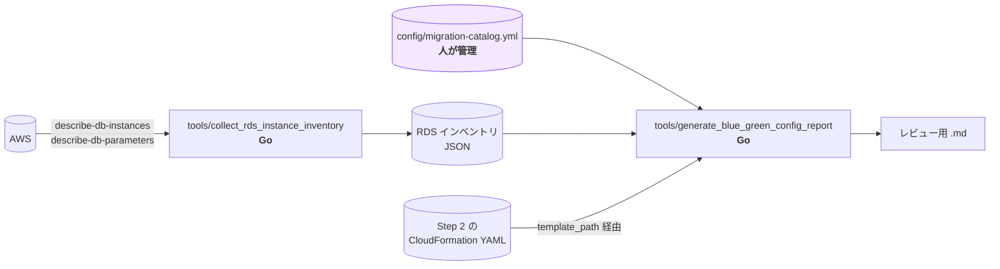
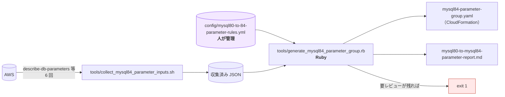
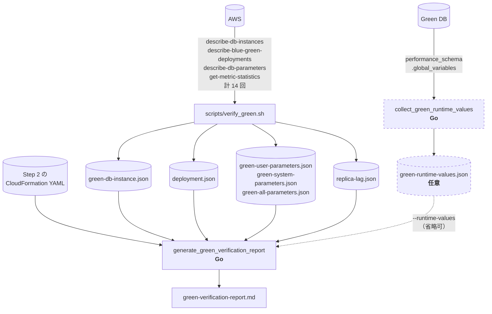
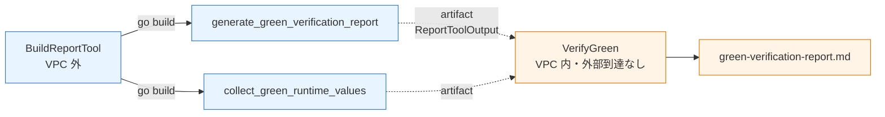
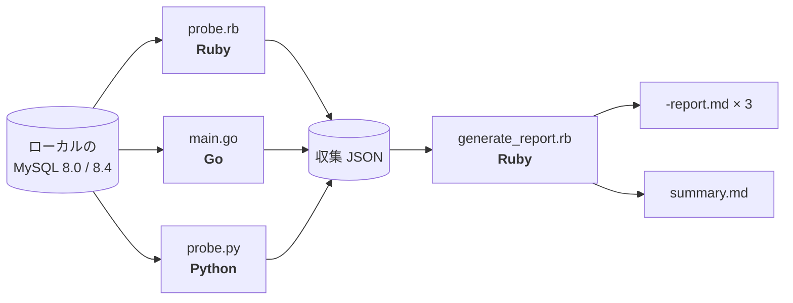

# レポート生成のフロー

このリポジトリには **Markdown レポートを生成する仕組みが 4 つ**ある（移行フロー外の検証用を含めると 5 つ）。どれも役割・入力・実行タイミングが違う。ここではその全体像をまとめる。

## 0. 全体像



| # | 生成器 | Step | 何を判断するため | 言語 | 判定するか |
|---|---|---|---|---|---|
| ⓪ | `tools/evaluate_blue_green_prereqs.rb --output` | **1** | **移行できるか・対象選定**（ゲート①） | **Ruby** | **する**（STOP が残れば exit 1） |
| ① | `tools/generate_blue_green_config_report/` | 3 の前準備 | **この移行設定でよいか**（ゲート②） | **Go** | **しない**（材料を並べるだけ） |
| ② | `tools/generate_mysql84_parameter_group.rb` | **2** | **移行できるか・対象選定**（ゲート①） | **Ruby** | **する**（要レビューが残れば exit 1） |
| ③ | `scripts/generate_green_verification_report/` | **4** | **切り替えてよいか**（ゲート③） | **Go** | **する**（ドリフトを検出） |

**番号は生成器の識別で、実行順ではない。**実行順は ⓪ → ② → ① → ③ である（下記）。ゲート①は ⓪ と ② の 2 本のレポートで判断する。

## 1. なぜ 3 つあるのか — レポートは「人が判断するゲート」である

**3 つのレポートは、それぞれ違う判断のために出す。**順番と、何を決めるためのものかが決まっている。



### ゲート① 移行できるか／どれを対象にするか

**既存インスタンスの状態を見て、そもそも移行可能かを判断し、対象を選定する。**

| 材料 | 出どころ | 形式 |
|---|---|---|
| 成立条件チェックの結果 | Step 1（`tools/evaluate_blue_green_prereqs.rb --output`） | `prereqs-evaluation-report.md` |
| パラメータ変換のレビュー報告 | Step 2（②の生成器） | `mysql80-to-mysql84-parameter-report.md` |

**ここを通らないと先へ進めない。**Step 1 に `STOP` が残る間は移行できず、Step 2 に「要レビュー」が残ると生成器が exit 1 を返す。

この段階の出力は**インスタンス単位**である。複数の DB を移行する場合、ここで「どれを今回の対象にするか」を決める。

### ゲート② この移行設定でよいか

**選定したインスタンスに対して設定 YAML を作り、同時に出る設定レビューレポートで内容を確認する。**

| 材料 | 出どころ |
|---|---|
| 設定レビューレポート | ①の生成器（`tools/generate_blue_green_config_report`） |

設定 YAML の生成（`tools/generate_blue_green_config`）と**レポート生成は別コマンドだが、同じ入力から同じロジックで作られる**。レポートはアプリと接続先の対応、目標インスタンスクラス、パラメータグループの内容を並べる。

**このレポートは可否を判定しない。**判断するのは人である。承認は設定ファイルの `actions.build` を `approved` にすることで表明する。

### ゲート③ 切り替えてよいか

**Blue/Green を構築したあと、Green が期待どおりかを確認してから切り替える。**

| 材料 | 出どころ |
|---|---|
| Green 検証レポート | ③の生成器（`scripts/generate_green_verification_report`） |

宣言値（Step 2 のテンプレート）・適用値（AWS API）・実効値（Green DB、任意）の 3 者を突き合わせる。**切替は不可逆に近い**（Blue は `-old1` へリネームされる）ため、ここが最後の確認になる。承認は `actions.switchover` を `approved` にすることで表明する。

### 通しで見ると

```text
Step 1 成立条件チェック ─┐
                          ├─► ゲート① 移行可否・対象選定
Step 2 パラメータ変換 ───┘        │
                                   ▼
                          設定 YAML ＋ 設定レビューレポートの生成
                                   │
                                   ▼
                          ゲート② 設定レビュー → actions.build: approved
                                   │
                                   ▼
                          Step 3 Blue/Green 構築
                                   │
                                   ▼
                          Step 4 Green 検証レポート
                                   │
                                   ▼
                          ゲート③ 切替レビュー → actions.switchover: approved
                                   │
                                   ▼
                          Step 5 切替
```

**レポートは「作って終わり」ではなく、次のアクションを承認するための入力である。**この対応関係が、設定ファイルが進捗ではなく**人間の宣言**（`pending` / `approved`）を持つ理由でもある。CI は毎回 AWS の実状態を読み、宣言が `approved` なら適用する。

Step 1 のレポートは **判定だけでなく観測値と取得元を残す。**「なぜ移行可能と判断したか」「なぜこの対象を選んだか」を後から辿れるようにするためである。

```
| 判定 | 項目 | 観測値 | 取得元 |
|---|---|---|---|
| PASS | 0-1-01 自動バックアップ | BackupRetentionPeriod=7 | `db-instance.json` |
| REVIEW | 0-1-02 binlog_format | MIXED（…） | `db-parameters.json` |
```

**`--output` は任意である。**省略すると従来どおり標準出力だけで、ファイルは作らない。終了コードの意味も変わらない（STOP が残れば 1）。

## 2. 共通する設計 — 収集と判定の分離

**3 つとも AWS を一切呼ばない。**これはこのリポジトリの中核ルールである。



**緑の部分が AWS 認証情報もネットワークも必要としない。**この構造から次が成り立つ。

- `examples/` の fixture で**回帰確認ができる**（golden file 方式）
- ロジックに**単体テストが書ける**
- Step 4 の実行を **VPC 内へ閉じ込められる**（レポート生成に外部到達が要らない）

AWS を実際に叩くのは収集側だけである。

| 収集するもの | AWS CLI の呼び出し回数 |
|---|---|
| `scripts/verify_green.sh` | 14 |
| `scripts/cleanup.sh` | 12 |
| `tools/collect_blue_green_prereqs.sh` | 12 |
| `scripts/build_green.sh` | 10 |
| `tools/collect_mysql84_parameter_inputs.sh` | 6 |
| `tools/internal/collect`（Go。`exec.Command("aws", ...)`） | インスタンス数に依存 |

## 3. ① 設定レビュー（Step 3 の前準備）

**Blue/Green 実行設定 YAML を人がレビューするためのレポート。**可否は判定せず、判断材料を並べる。



**3 種類の入力を突き合わせる**のが特徴である。

| 引数 | 入力 | 出どころ |
|---|---|---|
| `--catalog` | `config/migration-catalog.yml` | **人が管理する定義** |
| `--inventory` | RDS インベントリ JSON | AWS 由来（間接） |
| `--environment` | 対象環境名 | — |
| `--output` | 生成先 Markdown | — |
| （引数ではない） | CloudFormation テンプレート | カタログの `template_path` が指す。**Step 2 の生成物** |

**設定ファイルを書き換えない。**`.md` を 1 本出すだけである。同じ入力から設定 YAML を作るのは別コマンド（`tools/generate_blue_green_config`）で、判定の重複を避けるため両者は `tools/internal/generate` を共有する。

## 4. ② パラメータ変換（Step 2）

**8.0 のパラメータを 8.4 へ変換し、CloudFormation テンプレートとレビュー報告を同時に出す。**



**名前に反してレポートも出す。**`generate_mysql84_parameter_group` という名前だが、出力は 2 つである。

| 出力 | 内容 |
|---|---|
| `mysql84-parameter-group.yaml` | Step 2 で適用する CloudFormation テンプレート |
| `mysql80-to-mysql84-parameter-report.md` | 変換結果と要レビュー項目 |

**変換ルールの正本は YAML である。**`copy` / `force` / `omit` / `target_only` を `config/mysql80-to-84-parameter-rules.yml` が持ち、スクリプトはそれを解釈するだけである。**パラメータの扱いを変えるときはスクリプトではなくこの YAML を編集する。**

**3 つの中で唯一、生成物を入力に取らない。**AWS 由来 JSON とルール定義だけで完結する。

## 5. ③ Green 検証（Step 4）

**Green が期待どおりに作られたかを確認し、切替してよいかの判断材料を出す。**



**3 者を突き合わせる**のがこのレポートの役割である。

| 列 | 出どころ |
|---|---|
| 宣言値 | Step 2 の CloudFormation テンプレート |
| 適用値 | AWS API（`describe-db-parameters`） |
| MySQL 実効値 | Green DB（**任意**。無ければ `未収集`） |

**値が組み込み関数（`!Ref` / `!Sub`）の項目は「比較不能」として扱う。**CloudFormation のパラメータ解決なしには実値が決まらず、比較すると誤ったドリフトになるためである。短縮記法の読み取りは `scripts/internal/cfn` が担う。

### 2 つの実行形態を同じバイナリで賄う

MySQL 実効値の収集は Green DB への到達が必要で、リモートでは成立しない構成もありうる。

| 実行形態 | MySQL 接続 | 渡す引数 | 「MySQL 実効値」列 |
|---|---|---|---|
| リモート（CodeBuild／GitHub Actions） | しない | `--runtime-values` を渡さない | `未収集` |
| ローカル | する | `--runtime-values <JSON>` | 収集した実効値 |

**実効値の有無で変わるのはこの列だけで、判定は AWS API から取得した値で行う。**リモートでも判定内容は変わらない。この性質は `tests/cfn_shorthand_test.sh` が両形態を突き合わせて固定している。

### CI での受け渡し



**VerifyGreen はビルドしない。**Go も外部ネットワークも持たない前提なので、片方でも欠ければ理由を出して停止する。詳細は [Step 4 の分離と VPC 配置](ci/verify-green-vpc-architecture.md) にある。

## 6. 比較表

| | ① 設定レビュー | ② パラメータ変換 | ③ Green 検証 |
|---|---|---|---|
| Step | 3 の前準備 | 2 | 4 |
| 言語 | Go | Ruby | Go |
| 規模 | 70 行 + ライブラリ 411 行 | 307 行 | 295 行 |
| AWS を呼ぶ | **しない** | **しない** | **しない** |
| 人が管理する定義 | `migration-catalog.yml` | `mysql80-to-84-parameter-rules.yml` | — |
| 生成物を入力に取る | する（Step 2 の CFn） | **しない** | する（Step 2 の CFn） |
| DB へ接続した結果を使う | しない | しない | **任意で使う** |
| 判定 | しない | する（exit 1） | する |
| 実行場所 | ローカル | ローカル | CI／ローカル |
| 出力名 | `--output` で指定 | `mysql80-to-mysql84-parameter-report.md` | `green-verification-report.md` |

## 7. 移行フロー外 — ドライバ検証レポート

`examples/mysql-timezone-replication/probe/generate_report.rb`（**Ruby**、222 行）は、タイムゾーン差異のレプリケーション検証用の擬似環境で使う。



**移行手順ではなく技術検証用**である。Go / Ruby / Python の 3 ドライバで `time_zone` の扱いがどう違うかを示すのが目的で、**3 実装が並ぶこと自体が結論の根拠**になっている。そのためこの 3 本は Go への移行対象外である。

ここでも収集（probe）と判定（レポート生成）は分離されている。

## 8. Step 1 のレポート（任意出力）

`tools/evaluate_blue_green_prereqs.rb`（Step 1、Ruby）は **`--output` を指定したときだけ** `.md` を出す。省略時は標準出力へ表形式で出すだけである。いずれの場合も STOP が残れば exit 1 を返す。

```
STATUS   ITEM                           DETAIL
--------------------------------------------------------------------------------
結果: STOP=0, REVIEW=2
```

## 9. 言語の使い分け

**新しいプログラムは Go**（`decisions/implementation-language-policy.md`、採択済み）。②が Ruby なのは先にあったためで、**既存の Ruby を一律には移行しない**方針である。

ADR での評価は次のとおり。

| スクリプト | 行数 | 評価 | 理由 |
|---|---|---|---|
| `tools/generate_mysql84_parameter_group.rb` | 307 | **移行を検討する** | 判定ロジックが重く、「要レビューが残れば exit 1」の判定も持つ。**単体テストが無い**（ゴールデンファイル差分を人が見るだけ）。CloudFormation YAML を扱うので `tools/internal/cfn` と噛み合う |
| `tools/evaluate_blue_green_prereqs.rb` | 108 | **急がない** | JSON を読んで並べるだけで、Go 化して得られるのは単体テストだけ |

`.rb` を全廃しても Ruby ランタイムへの依存は消えない。**シェルからの設定 YAML 読み取り**（`scripts/lib/deployment_config.sh` の 1 行）が psych を使うためである。

## 関連ドキュメント

- [config-blue-green-generation-design.md](config-blue-green-generation-design.md) — ①の設計と、設定 YAML 生成との関係
- [phase-1-parameter-group-cloudformation.md](phase-1-parameter-group-cloudformation.md) — ②の詳細（Step 2）
- [ci/verify-green-vpc-architecture.md](ci/verify-green-vpc-architecture.md) — ③を CI で動かす構成
- [decisions/implementation-language-policy.md](decisions/implementation-language-policy.md) — 言語の使い分け（採択済み）
