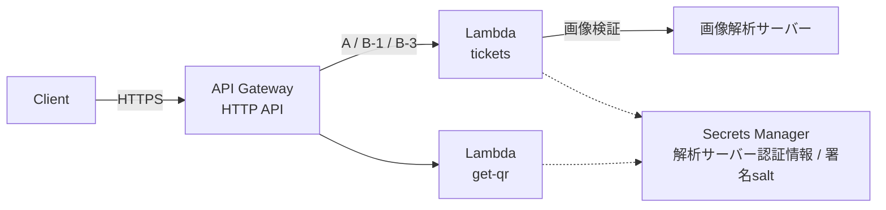
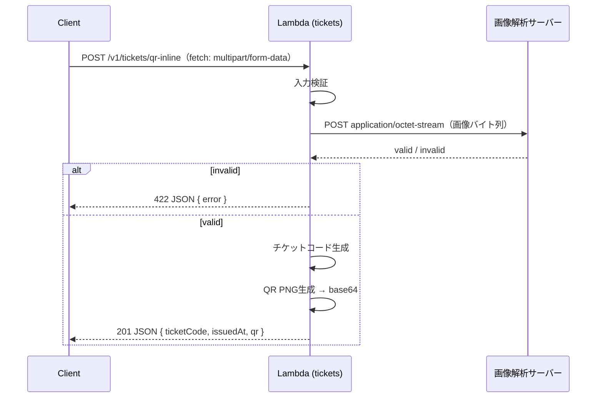
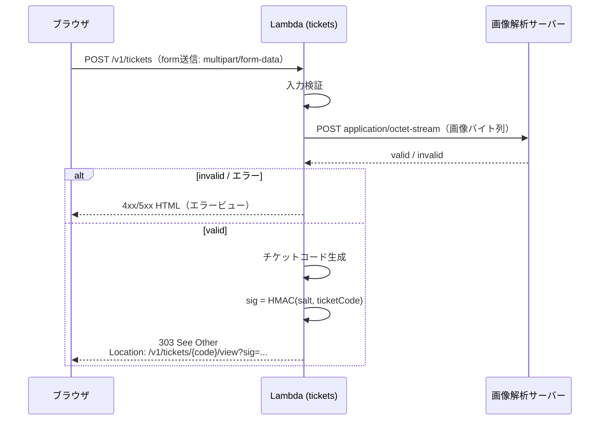
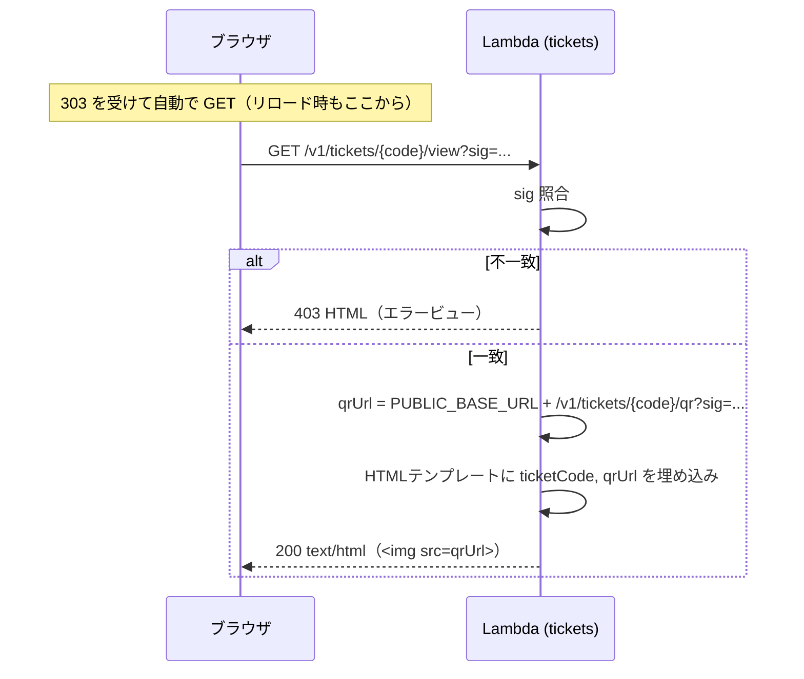
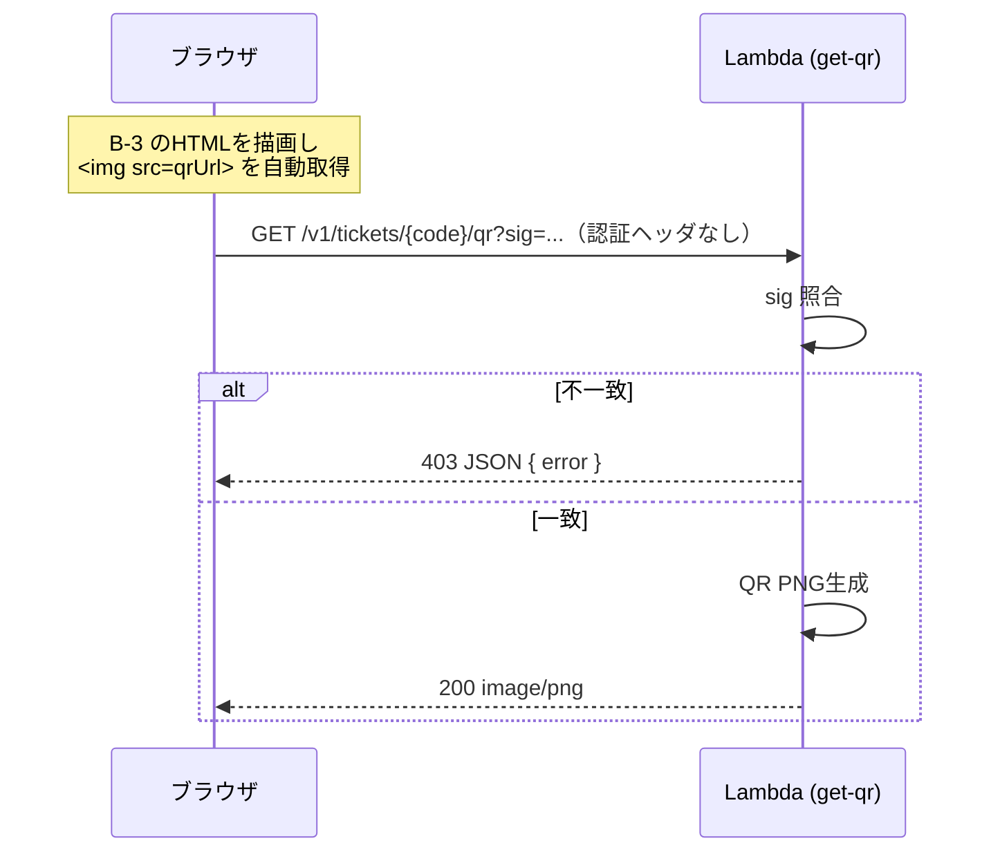

# チケットQR発行API 設計

## 1. 概要

クライアントから画像を受け取り、外部の画像解析サーバーで検証する。valid と判定された場合のみチケットコードを採番し、QRコード画像を生成して返す。

- 実行環境: AWS Lambda（API Gateway HTTP API 経由）
- 実装言語: **Go と Node.js（TypeScript）で同一仕様を実装**し、後で比較評価する
- QRの返却方式は2パターン
  - パターンA: base64エンコード済みQR画像を JSON で返す（1エンドポイント）
  - パターンB: QR生成URLを埋め込んだ HTML ビューを返す（発行・ビュー・QR生成の3エンドポイント）
    - 当初は発行＋QR取得の2エンドポイント想定だったが、リロード対策（6章 案1）を採用したためビュー表示用 GET を追加

### 前提

- チケット利用側は、**ルールに従って生成されたチケットコードをそのまま利用可能**とする（利用側への事前登録・連携は行わない）
- 採番したコードは **DynamoDB 等の外部ストアで管理しない**
- QR PNG も **S3 等に書き出さず、キャッシュもしない**。必要になるたびにチケットコードから生成する
- → API は**完全ステートレス**。永続化するのはログのみ

### エンドポイント一覧

| ID | メソッド / パス | リクエスト | 成功時レスポンス |
|---|---|---|---|
| A | `POST /v1/tickets/qr-inline` | `multipart/form-data`（画像ファイル） | `201` JSON（QR base64） |
| B-1 | `POST /v1/tickets` | `multipart/form-data`（画像ファイル） | `303 See Other` → B-3 |
| B-3 | `GET /v1/tickets/{ticketCode}/view?sig=...` | - | `200` HTML（``） |
| B-2 | `GET /v1/tickets/{ticketCode}/qr?sig=...` | - | `200` `image/png` |
| EX | `GET /v1/example/qr` | - | `200` `image/png`（`https://example.com` の QR。固定） |

EX はチケット機能とは独立した、固定の QR を返すだけのエンドポイント。デプロイパッケージ（`exampleqr.zip`）も実行ロールも、チケット系とは分ける。設定・シークレット・署名・画像解析は使わない。

## 2. 全体構成



| リソース | 用途 |
|---|---|
| API Gateway (HTTP API) | ルーティング、認証、スロットリング |
| Lambda × 2（チケット系） | `tickets`（A / B-1 / B-3: 画像解析・採番・ビュー）と `get-qr`（B-2: QR 画像の生成）。コードは**1つのパッケージを共有**し、イベントの `routeKey` で振り分ける（関数の分け方はインフラ設定だけで変えられる）。`get-qr` を分けるのは、`` から呼ばれる QR 生成を、画像解析の同時実行数の上限から切り離すため |
| Secrets Manager / SSM | 画像解析サーバーのAPIキー、署名用salt（発行側と検証側で共有） |
| CloudWatch Logs | 発行ログ（唯一の記録） |

データストア（DynamoDB / S3）は使わない。

### Go / Node の並行運用

同一のAPI契約を持つスタックを `impl=go` / `impl=node` のパラメータで2つデプロイする（ベースURLは別）。
同じ契約テスト・負荷テストを両方に流して比較する。

## 3. 処理フロー

### 共通処理（A / B-1）

画像データの受け渡し:

```
ブラウザ ──multipart/form-data（フィールド image）──▶ API ──application/octet-stream（画像バイト列そのまま）──▶ 画像解析サーバー
```

API が変えるのは**送り方（multipart → octet-stream）だけ**。画像の中身はパススルーで、圧縮・リサイズ・形式変換・メタデータ（EXIF など）の除去は行わない。

1. **入力検証**: Content-Type が `multipart/form-data` か、`image` フィールドがあるか、サイズ上限、マジックバイトで画像形式判定（JPEG/PNG 等）
2. **画像解析連携**: 検証済みの画像バイト列を `application/octet-stream` でそのまま送る（7章）。タイムアウト付きHTTP呼び出し。5xx/タイムアウトのみ限定リトライ（例: 最大1回）
3. **採番**: valid 時のみ実施。外部ストアを参照せずに生成する（4章）
4. 発行の記録は構造化ログにのみ残す

### パターンA: `POST /v1/tickets/qr-inline`（JSON で返す）



1リクエストで完結。QR画像はレスポンスJSONに含まれる。

### パターンB-1: `POST /v1/tickets`（発行 → リダイレクト）



POSTの結果はHTMLで直接返さず、ビューURLへリダイレクトする（PRG: Post/Redirect/Get）。

### パターンB-3: `GET /v1/tickets/{ticketCode}/view`（HTMLビュー）



- 画像解析・採番は行わない。何度リロードしても同じ HTML が返る

### パターンB-2: `GET /v1/tickets/{ticketCode}/qr`（QR画像）



- QRはチケットコードの決定的な関数なので、保存せずに毎回再生成すれば同じQRが得られる
- チケットコード自体の形式チェックは行わない。署名照合のみで「API が発行したURLか」を簡易的に判定する
- 画像解析サーバーは呼ばない

## 4. チケットコード仕様

### フォーマット（案）

```
{YYYYMMDDHHmmss}-{suffix}
例: 20261001194300-7K3QX9MZ（2026-10-01 19:43:00 JST に発行）
```

| 要素 | 内容 |
|---|---|
| 日時 | 発行日時（14桁、秒まで）。**タイムゾーンは JST 固定**（Lambda は UTC のため明示変換）。レスポンスの `issuedAt` と同じ時刻 |
| suffix | ルールに従いステートレスに生成（下記） |

全体で 23 文字（suffix 8文字）。

### ステートレス採番の方針

カウンタ等の共有状態を持たないため、**連番は採用できない**。一意性は suffix の乱数空間の大きさで確率的に担保する。

- suffix は暗号論的乱数（Go: `crypto/rand`、Node: `crypto.randomBytes`）から生成
- 表記は Crockford Base32（`0-9A-Z` から `I L O U` を除く。読み間違いに強い）を想定
- 衝突は**同じ秒に発行されたコード同士でしか起こらない**（日時が1秒でも違えば別コード）

1秒あたりの発行数 r、suffix のビット数 b のとき、ある1秒の中で衝突する確率 ≈ r² / 2^(b+1)。
#### 想定する発行量

| 項目 | 値 |
|---|---|
| ピーク | 1秒あたり 2件 |
| 1日あたり | 多くても数千件（計算では 5,000件/日） |

最悪ケースとして、1日 5,000件がすべて「同じ秒に2件ずつ」発行されたとする（同じ秒の組が 2,500組できる）。このとき、その日に1件以上衝突する確率 ≈ 2,500 / 2^b。
あわせて、API Gateway のスロットリング上限（`ThrottlingRateLimit` = 50件/秒）いっぱいの発行が1日中続いた場合（濫用時の上限）も示す。

| suffix 長 (Base32) | ビット数 | 想定（1日あたり） | 想定（1年あたり） | スロットリング上限が1日続いた場合 |
|---|---|---|---|---|
| 6文字 | 30 | 約 2.3×10⁻⁶ | 約 8.5×10⁻⁴ | 約 9.9% |
| 7文字 | 35 | 約 7.3×10⁻⁸ | 約 2.7×10⁻⁵ | 約 0.31% |
| **8文字（採用）** | 40 | 約 2.3×10⁻⁹ | 約 8.3×10⁻⁷ | 約 9.6×10⁻⁵ |
| 10文字 | 50 | 約 2.2×10⁻¹² | 約 8.1×10⁻¹⁰ | 約 9.4×10⁻⁸ |

→ **suffix は 8文字を採用**（環境変数 `TICKET_SUFFIX_LENGTH` の既定値）。想定の発行量では、1年間で衝突する確率がおよそ100万分の1。スロットリング上限いっぱいの濫用が丸1日続いても、約1万分の1に収まる。
発行量の想定が大きく変わる場合は、この表で桁数を見直す。

### ルールとの関係

- 生成ルールはチケット利用側と共有された仕様であり、APIはそれに**厳密に準拠したコードのみ**を生成する
- 採番ロジックは `TicketCodeGenerator` として分離し、ルール変更の影響をここに閉じ込める（コードの形式チェックはAPIでは行わない）
- 時刻と乱数源はインターフェース化し、テスト時は固定値を注入する。Go/Node の両実装に**同一のテストベクタ**（`testdata/ticketcode.json`。入力: 時刻・乱数バイト → 期待コード。UTC→JST の日付またぎも含む）を流す

> suffix の具体的なルールは **要確定**。ルールが連番など状態を必要とするものだった場合、本前提（外部ストアなし）と両立しないため再検討が必要。

## 5. API 仕様

共通事項:
- ベースパス: `/v1`
- 画像の受け取り: A・B-1 とも `multipart/form-data` の `image` フィールド（ブラウザの `<input type="file">` / `FormData` で送る形式に統一）
- 画像サイズ上限: **4MB**（Lambda 同期呼び出しのペイロード上限 6MB に対し、API Gateway → Lambda 間で base64 化され約1.33倍に膨らむため）
- 画像の形式判定はマジックバイトで行い、パートの `Content-Type` は信用しない（ブラウザによって `application/octet-stream` になる場合があるため）
- `Cache-Control: no-store`（全エンドポイント）

### 5.1 パターンA: `POST /v1/tickets/qr-inline`

ブラウザの `fetch` から呼ばれる想定。

Request `Content-Type: multipart/form-data`

| フィールド | 内容 |
|---|---|
| `image` | 画像ファイル（JPEG / PNG） |

```js
const body = new FormData();
body.append("image", fileInput.files[0]);
const res = await fetch(`${apiBaseUrl}/v1/tickets/qr-inline`, { method: "POST", body }); // Content-Type はブラウザが boundary 付きで設定する
```

Response `201 Created`, `Content-Type: application/json`
```json
{
  "ticketCode": "20261001194300-7K3QX9MZ",
  "issuedAt": "2026-10-01T19:43:00+09:00",
  "qr": {
    "mimeType": "image/png",
    "data": "<base64>"
  }
}
```

### 5.2 パターンB-1: `POST /v1/tickets`

ブラウザのフォーム送信で呼ばれる想定（6章 案1）。

Request `Content-Type: multipart/form-data`

| フィールド | 内容 |
|---|---|
| `image` | 画像ファイル（`<input type="file" name="image" accept="image/jpeg,image/png">`） |

Response（成功）
```
HTTP/1.1 303 See Other
Location: https://api.example.com/v1/tickets/20261001194300-7K3QX9MZ/view?sig=Xq3v9bJk2mPz8RtY1cWnHA
Cache-Control: no-store
```

- `Location` は `PUBLIC_BASE_URL` から組み立てた絶対URL（`Host` ヘッダは信用しない）
- エラー時はリダイレクトせず、HTMLエラービューを該当ステータスで直接返す

### 5.3 パターンB-3: `GET /v1/tickets/{ticketCode}/view`

`sig` を検証し、QR生成URLを埋め込んだHTMLを返す。

Response `200 OK`, `Content-Type: text/html; charset=utf-8`
```html
<!doctype html>
<html lang="ja">
<head>
  <meta charset="utf-8">
  <meta name="viewport" content="width=device-width, initial-scale=1">
  <title>チケット 20261001194300-7K3QX9MZ</title>
</head>
<body>
  <main data-ticket-code="20261001194300-7K3QX9MZ">
    <h1>チケット</h1>
    
    <p>20261001194300-7K3QX9MZ</p>
  </main>
</body>
</html>
```

#### HTMLビュー仕様

| 項目 | 方針 |
|---|---|
| テンプレート | 両実装で**同一のテンプレートファイル**（`templates/ticket.html`, `templates/error.html`）を共有し、ビルド時に同梱 |
| 埋め込みデータ | `ticketCode`, `qrUrl` のみ。発行日時は保存していないため別途は表示しない（日時はコードの先頭14桁に含まれる） |
| `qrUrl` | **絶対URL**。`PUBLIC_BASE_URL` から組み立てる |
| エスケープ | 自動エスケープ必須（Go: `html/template`、Node: エスケープ付きテンプレート関数 or 軽量ライブラリ）。属性値・本文とも |
| 機械可読性 | `data-*` 属性にコード等を載せ、HTMLをパースする利用側でも値を取り出せるようにする |
| 外部リソース | 使わない（CSS はインライン、JS なし） |
| セキュリティヘッダ | `Content-Security-Policy: default-src 'none'; img-src {PUBLIC_BASE_URL}; style-src 'unsafe-inline'`、`X-Content-Type-Options: nosniff`、`Referrer-Policy: no-referrer` |
| 出力一致性 | Go/Node で同一入力に対し同一HTMLを出すことを契約テストで確認（空白差は正規化して比較） |

> デザイン（文言・スタイル）は **要確定**。上記は最小構成の例。

### 5.4 パターンB-2: `GET /v1/tickets/{ticketCode}/qr`

- `sig` を検証し、一致した場合のみQR画像をその場で生成して返す
- `ticketCode` 自体の形式チェックは行わない
- Response `200 OK`, `Content-Type: image/png`, ボディはPNGバイナリ
  （Lambda からは `isBase64Encoded: true` で返却し、API Gateway がバイナリに変換）

### 5.5 署名（sig）仕様

目的は**ビュー / QR生成APIが無関係なアクセスで使われるのを防ぐ簡易チェック**。発行側（B-1）と検証側（B-3, B-2）で salt を共有し、ステートレスに検証する。

```
sig = base64url( HMAC-SHA256(salt, ticketCode) ) の先頭 22 文字（128bit）
```

| 項目 | 方針 |
|---|---|
| アルゴリズム | HMAC-SHA256。`SHA256(salt + code)` のような単純連結ではなくHMACを使う（実装コストは同等で、長さ拡張攻撃等の落とし穴がない） |
| 署名対象 | `ticketCode` のみ（UTF-8）。B-3 と B-2 で同じ `sig` を使う |
| 長さ | 128bit に切り詰め（URLを短く保ちつつ総当たりは非現実的） |
| エンコード | base64url、パディングなし |
| 比較 | 定数時間比較（Go: `hmac.Equal`、Node: `crypto.timingSafeEqual`） |
| salt 管理 | Secrets Manager / SSM SecureString。コールド起動時に取得しメモリに保持 |
| salt ローテーション | 検証側は「現行 + 旧」の2つの salt を受け入れる期間を設けて切り替える |
| 有効期限 | なし（簡易チェックのため）。必要になれば `exp` を署名対象に追加する拡張余地のみ残す |

- 同じ `ticketCode` からは常に同じ `sig` が得られる（ステートレス・保存不要）
- Go/Node で同一の署名が出ることを**共通テストベクタ**（salt, ticketCode → sig）で担保する
- パターンA はQRを直接返すため署名不要
- B-3 はブラウザのリダイレクト追従、B-2 は `` の自動取得で呼ばれ、いずれも認証ヘッダを付けられないため、**API Gateway の認証をかけず `sig` をアクセス制御とする**

### 5.6 エラーレスポンス

| エンドポイント | エラー形式 |
|---|---|
| A, B-2 | JSON `{ "error": { "code": "IMAGE_INVALID", "message": "..." } }` |
| B-1, B-3 | HTMLエラービュー（`<main data-error-code="IMAGE_INVALID">` に code を載せる） |

| HTTP | code | 条件 |
|---|---|---|
| 400 | `BAD_REQUEST` | multipart の形式不正、`image` フィールドなし |
| 403 | `FORBIDDEN` | `sig` 欠落・不一致（B-3, B-2） |
| 413 | `PAYLOAD_TOO_LARGE` | 画像サイズ上限超過 |
| 415 | `UNSUPPORTED_MEDIA_TYPE` | Content-Type が `multipart/form-data` でない、非対応の画像形式 |
| 422 | `IMAGE_INVALID` | 画像解析サーバーが invalid と判定 |
| 502 | `ANALYSIS_UPSTREAM_ERROR` | 解析サーバーが 5xx / 想定外レスポンス |
| 504 | `ANALYSIS_TIMEOUT` | 解析サーバーのタイムアウト |
| 500 | `INTERNAL_ERROR` | その他 |

## 6. パターンB の表示方式とリロード対策（案）

パターンBはHTMLを表示する方式のため、クライアントの作りによってリロード時の挙動が変わる。
APIはステートレスで「同じリクエストの再送か」を判定できないため、**POSTが再送されると別のチケットコードが発行され、利用側ではいずれも有効になる**。これを避ける方式として以下3案を挙げる。

| | 案1: PRG（採用） | 案2: fetch + DOM差し込み | 案3: WebView に HTML 直接ロード |
|---|---|---|---|
| クライアント | ブラウザのフォーム送信 | ページ内JSで `fetch` し、返ったHTMLをDOMに挿入 | ネイティブアプリが POST し、HTML文字列を WebView に `loadHTMLString` 等で表示 |
| B-1 のリクエスト | `multipart/form-data` | `multipart/form-data`（`FormData`） | `multipart/form-data` |
| B-1 のレスポンス | `303` → B-3 | `201` HTML | `201` HTML |
| エンドポイント数（B） | 3（B-1, B-3, B-2） | 2（B-1, B-2） | 2（B-1, B-2） |
| リロード時 | B-3 を再GET。同じHTMLが表示され、**再発行されない** | 元ページに戻り、チケット表示は消える。再発行はされないが**コードを失う** | 同じHTMLを再描画。再発行されない |
| 戻る / URL共有 | ビューURLをブックマーク・共有でき、後から再表示可能 | 不可（クライアントで保持しない限り） | 不可（アプリが保持しない限り） |
| 発行APIの認証 | ヘッダを付けられないため認証なし（レート制限のみ。10章） | ヘッダで API キー / JWT を付与可能 | ヘッダで API キー / JWT を付与可能 |
| 主な懸念 | エンドポイント増。ビューURL漏えいで第三者がQRを表示可能（期限なしの場合） | クライアント実装依存。リロードでチケットを見失う | アプリ前提。ブラウザ単体では使えない |

### 採用: 案1（PRG）

- ブラウザ単体で完結し、リロード・戻る操作でも二重発行が起きない
- ビュー / QR いずれも `sig` で保護され、ステートレスのまま再表示できる
- 5章の仕様は案1を前提に記載している。案2・案3に切り替える場合は B-1 を `201` HTML 返却に変え、B-3 を廃止する（リクエスト形式は変わらない）

### 共通の残課題: 同一画像の繰り返し送信

いずれの案でも、**クライアントが意図的に同じ画像を繰り返しPOSTすれば、その回数分チケットが発行される**（ステートレスのため判別不可）。防ぐ必要がある場合の選択肢:

- 画像解析サーバー側で同一画像の判定を行ってもらう
- 前提を緩め、画像ハッシュ等を短期TTL付きで記録する（DynamoDB TTL 等）
- API Gateway のスロットリング / WAF のレート制限で回数を抑える（完全防止ではない）

## 7. 画像解析サーバー連携

| 項目 | 方針 |
|---|---|
| 送信形式 | **確定**: `POST`、`Content-Type: application/octet-stream`、ボディは画像バイト列そのもの（multipart から取り出した `image` パートの中身。圧縮・リサイズ・形式変換・再エンコードはしないパススルー） |
| 送信先URL / メソッド以外のヘッダ | 要確認（画像形式を `X-Image-Type` 等で伝えるか、ファイル名などのメタデータを送るか） |
| レスポンス | 要確認。想定: `{ "valid": true/false, "reason": "..." }` |
| 認証 | APIキー等を Secrets Manager から取得し、コールド起動時にキャッシュ（メモリ内のみ） |
| タイムアウト | 接続 1s / 全体 5s 程度（解析時間の実測で調整）。API Gateway の 29s 上限内に収める |
| リトライ | 5xx・タイムアウトのみ 1回。4xx はリトライしない |
| ネットワーク | 解析サーバーがVPC内ならLambdaをVPC配置（NAT/エンドポイント設計が必要） |

ImageAnalyzer はインターフェースとして抽象化し、テスト時はスタブに差し替える。

> 実装状況: 送信形式は確定したが、送信先・認証・レスポンス形式が未確定のため、HTTP クライアントの実装は保留。現在は常に valid を返すモック（`ANALYZER_MODE=mock`）のみ。インターフェースが受け取るのは検証済みの画像バイト列で、HTTP クライアントはそれをそのまま `application/octet-stream` で送る。

## 8. 状態・データ

| 対象 | 扱い |
|---|---|
| 採番したチケットコード | 保存しない |
| QR PNG | 保存・キャッシュしない。都度生成 |
| アップロード画像 | 保存しない（解析サーバーへ転送のみ） |
| 発行ログ | 構造化ログに `ticketCode`, `issuedAt`, `endpoint`, 解析結果を出力。保持期間は CloudWatch Logs 側で設定 |

ステートレスであることの帰結:
- 冪等性キーによる再送時の二重発行防止はできない（案1のPRGでリロードによる再送は回避）
- 同一コードの重複発行は確率的にのみ防止（4章）
- 発行済みかの照会・取消はAPIではできない

## 9. 実装構成

両言語で同じレイヤ構成にし、比較しやすくする。

```
st/
├── DESIGN.md
├── go.mod                     # Go モジュールルート（templates/ を embed するため st/ 直下）
├── templates/                 # HTMLビュー / エラービュー（両実装共通）
├── testdata/                  # 両実装共通のテストベクタ（ticketcode.json, signature.json）
├── go/
│   ├── Makefile               # run / run-example / test / build（ticketqr.zip と exampleqr.zip）
│   ├── cmd/ticketqr/          # 唯一のエントリポイント。Lambda 上ならハンドラとして、それ以外ならローカル HTTP サーバーとして起動
│   │   ├── main.go            # AWS_LAMBDA_RUNTIME_API の有無で起動方法を切り替える
│   │   └── local.go           # ローカルモードの起動（アップロードフォーム付き）
│   ├── cmd/exampleqr/main.go  # example.com の QR エンドポイント（別パッケージ。Lambda / ローカル両対応）
│   └── internal/
│       ├── app/               # 依存関係の組み立て（ticketqr 用）
│       ├── exampleqr/         # example.com の QR を返すハンドラ
│       ├── localhttp/         # ローカル実行用 net/http → Lambda イベント変換（routeKey を付与。両パッケージで共有）
│       ├── handler/           # API Gateway イベント ⇔ ユースケース（JSON / multipart / HTML / PNG）、routeKey による振り分け
│       ├── usecase/           # 発行フロー（検証 → 解析 → 採番）
│       ├── ticketcode/        # 採番ルール（生成）
│       ├── qr/                # QR生成
│       ├── analyzer/          # 画像解析クライアント（現状は常に valid のモックのみ）
│       ├── imageinput/        # 画像サイズ・形式チェック
│       ├── signer/            # 署名（salt + HMAC）
│       ├── secret/            # salt 取得（Secrets Manager）
│       ├── config/            # 環境変数
│       └── view/              # HTMLレンダリング
├── node/                      # 詳細は NODE.md（ソース4ファイル: lib.ts / ticketqr.ts / exampleqr.ts / local.ts）
├── infra/                     # IaC（impl=go|node でパラメータ化）
└── tests/
    ├── contract/              # 両実装に同一ケースを流す
    └── load/                  # k6 シナリオ
```

ローカル開発では、Lambda エミュレータを使わずに `go/cmd/ticketqr` をそのまま起動する（ローカル HTTP サーバーとして動く）。ハンドラは Lambda と同じものを呼び出す。画像解析サーバーのプロトコルが決まるまでは、`ANALYZER_MODE=mock`（常に valid を返す）で動かす。

| 項目 | Go | Node.js |
|---|---|---|
| ランタイム | `provided.al2023`（arm64, `bootstrap`） | `nodejs24.x`（arm64、`index.handler`） |
| Lambda アダプタ | `aws-lambda-go` | Hono + `@hono/aws-lambda`（NODE.md 5.1） |
| AWS SDK | aws-sdk-go-v2（Secrets Manager のみ） | AWS SDK for JavaScript v3（同左） |
| QR ライブラリ | `github.com/skip2/go-qrcode` | `lean-qr`（NODE.md 3章） |
| multipart 解析 | 標準 `mime/multipart` | Hono の `c.req.formData()` + `content-type`（NODE.md 5.2） |
| HTMLテンプレート | `html/template` + `embed` | テンプレートをバンドルに同梱、エスケープ付きで描画 |
| ビルド | `GOOS=linux GOARCH=arm64 go build` | esbuild でバンドル（tree-shaking） |

QR 生成パラメータは両実装で揃える: 誤り訂正レベル M、256px、余白4モジュール、PNG。

## 10. 非機能・運用

- **認証**:
  - A: API Gateway で API キー / JWT（Cognito等）/ IAM のいずれか（**要確定**）
  - B-1: **認証なし（公開）**。ブラウザのフォーム送信ではヘッダ認証が使えないため、発行者の制限は行わず、レート制限で濫用を抑える
    - API Gateway のスロットリング（ルート単位のレート / バースト上限）
    - AWS WAF のレートベースルール（送信元IP単位）を HTTP API 前段の CloudFront 等に適用（WAF は HTTP API に直接関連付けできないため。採否は要確定）
    - Lambda 予約同時実行数で画像解析サーバーへの同時リクエスト数に上限を設ける
    - Cookie を使わないため CSRF 対策は不要
    - 将来制限が必要になった場合の拡張候補: フォームトークン（有効期限付き HMAC を hidden フィールドに埋め込む）/ Cookie ログイン + Lambda オーソライザ
  - B-3, B-2: 認証なし・`sig` 検証のみ
- **GET の負荷**: B-3/B-2 は呼ばれるたびにHTML/QRを生成する。署名照合を生成より前に行い、不正アクセスは生成処理に到達させない。加えてスロットリングで保護し、生成コストは評価項目で計測する
- **salt の扱い**: salt が漏れると誰でも有効な `sig` を作れるため、ログ・環境変数への平文出力は禁止。Lambda の実行ロールのみ読み取り可とする
- **ビューURLの扱い**: `sig` 付きURLを知っていれば誰でもチケットを表示できる（有効期限なし）。共有されて困る場合は `exp` 付き署名の導入を検討
- **偽造耐性**: 利用側がルール適合のみで受け入れる場合、ルールを知る者はAPIを通さずに有効なコードを作れる。偽造耐性が必要ならルール側に秘密鍵ベースの署名・チェックディジットを含めることを検討（利用側との合意事項）
- **ログ**: JSON 構造化ログ（requestId, ticketCode, 解析結果, レイテンシ）。画像データ・`sig` はログに出さない
- **トレース / メトリクス**: X-Ray、CloudWatch カスタムメトリクス（発行数、invalid率、解析サーバーレイテンシ）
- **スロットリング**: API Gateway のレート制限、Lambda 予約同時実行数（解析サーバー保護）

## 11. Go / Node 比較評価の観点

| 観点 | 計測方法 |
|---|---|
| コールドスタート | CloudWatch `Init Duration`（メモリ 256/512/1024MB で比較） |
| ウォームレイテンシ p50/p95/p99 | k6 で同一シナリオ（解析サーバーはスタブで固定遅延）。B は POST → 303 → view → qr の一連で計測 |
| QR / HTML 生成性能 | B-2, B-3 単体の負荷試験 + ベンチマーク（Go: `testing.B`、Node: tinybench 等） |
| メモリ使用量・コスト | `Max Memory Used`、GB秒換算 |
| デプロイサイズ | zip サイズ |
| 開発・保守性 | コード量、型安全性、テスト容易性、ライブラリの成熟度 |
| 出力一致性 | 同一コードに対するQRのデコード結果が一致すること（画像バイト一致は求めない）、HTMLが一致すること |

## 12. 要確定事項

1. suffix の具体的なルール（ステートレスに生成可能であること、桁数・文字種）
2. ピーク時の発行レート（件/秒）と許容衝突確率
3. 日時のタイムゾーン（JST 前提で良いか）と精度（秒で良いか。ミリ秒まで入れれば衝突はさらに減るがコードが3桁長くなる）
4. QR のペイロード（チケットコードのみ / URL / 署名付きデータ）
5. 画像解析サーバーのI/F（送信先URL、レスポンス形式、認証、配置場所。送信形式は `application/octet-stream` で確定）
6. 入力画像の対応形式とサイズ上限
7. A の認証方式（B-1 は認証なしで決定）、B-1 のレート制限値・WAF 導入有無
8. 同一画像の繰り返し送信を防ぐ必要があるか（6章 共通の残課題）
9. ビューURLに有効期限が必要か
10. IaC ツール（SAM / CDK / Terraform）
11. HTMLビューのデザイン・文言、`PUBLIC_BASE_URL`（カスタムドメイン有無）
