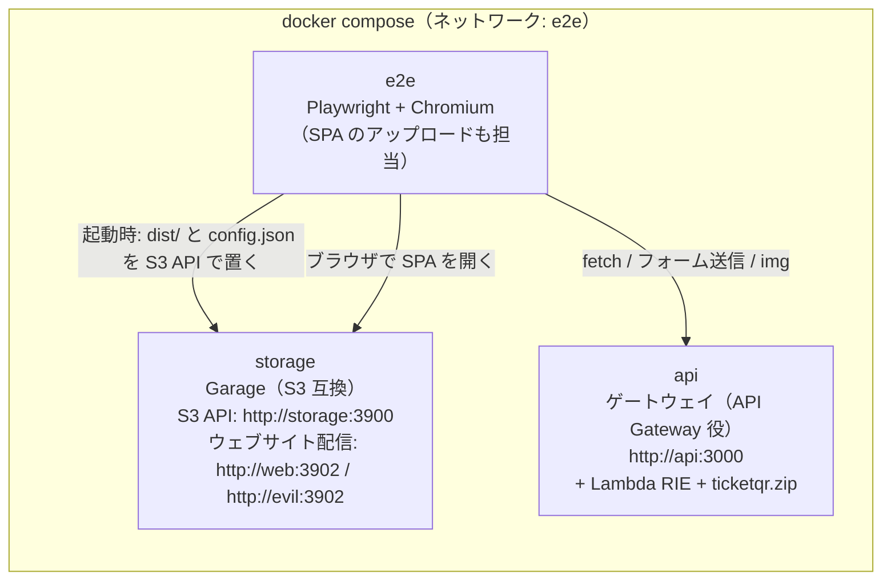

# E2E テスト環境 構成案

> **状態**: 3つのコンテナとケース1（画面遷移方式）を実装済み。Go 版・Node 版の両方で通過。ほかのケースは未実装（7章）。API の設計は [DESIGN.md](DESIGN.md)、エンドポイントと画面の名前は [PAGES.md](PAGES.md)、SPA は [web/DESIGN.md](web/DESIGN.md) を参照。

## 1. 目的とスコープ

- 本番に近い構成（**S3 に置いた SPA → API Gateway + Lambda**）で、ブラウザから実際に操作し、チケットの発行から QR の表示までを自動テストで確認する
- ローカルでは Docker Compose、リモートでは GitHub Actions 上で**同じ構成**を動かす
- SPA は事前にビルドした静的ファイルを、**S3 互換ストレージ**に置いて配信する（本番の S3 に相当）
- API は、**Lambda の公式イメージ（Runtime Interface Emulator）でデプロイ用の zip をそのまま動かし**、API Gateway の役目をする小さなゲートウェイを前に置く。難しい場合は、ローカルモード（`make -C go run` / `npm run dev` と同じ起動方法）に切り替える（2.3）
- SPA から API へオリジンをまたいで送信するため、ここで生じる CSRF と CORS の問題もあわせて解決する（4章）

| 対象 | 今回 | 保留 |
|---|---|---|
| SPA の3つの発行方式（画面遷移方式・その場表示方式・フォーム送信方式）の一連の動作 | ○ | |
| 取得した QR が PNG で、表示できること | ○ | |
| リロードで再発行されないこと | ○ | |
| デプロイ用の zip（Go・Node）が Lambda の実行環境で動くこと | ○（RIE） | |
| QR の中身（デコード結果がチケットコードと一致するか） | | ○（7章 フェーズ6） |
| 画像解析サーバーとの連携 | アプリ内のモック（`ANALYZER_MODE=mock`） | 解析サーバーのスタブ（analyzer-stub）のコンテナ化 |
| 本物の API Gateway・CloudFront の挙動 | | ○（8章） |

## 2. 構成

3つのコンテナを compose で管理する。



| コンテナ | イメージ | 役割 | 本番で対応するもの |
|---|---|---|---|
| `storage` | `docker/storage.Dockerfile`（Garage v2.4.1 の公式イメージのバイナリを Alpine に入れ、初期設定スクリプトを動かす。公式イメージはバイナリだけでシェルがないため） | S3 互換ストレージ。SPA の静的ファイルを置き、ウェブサイトとして配信する | S3（+ CloudFront） |
| `api` | `docker/api.Dockerfile`（Lambda の公式イメージ + ゲートウェイ + デプロイ用の zip。`IMPL=go|node` で切り替え） | API。Lambda の実行環境の模擬と、API Gateway 役のゲートウェイ | API Gateway HTTP API + Lambda |
| `e2e` | `docker/e2e.Dockerfile`（`mcr.microsoft.com/playwright:v1.63.0-noble`。バージョンは `@playwright/test` とそろえる） | テストの前に SPA をアップロードし（本番の `aws s3 sync` に相当）、ヘッドレス Chromium で操作する | デプロイ作業と、利用者のブラウザ |

アップロードだけを行う4つ目のコンテナは作らない。`e2e` の Playwright の `globalSetup` で行う（3.2）。

### 2.1 ホスト名とオリジン

ブラウザは `e2e` コンテナの中で動く。そのため、URL はすべて compose ネットワーク内のホスト名でそろえる。

| 用途 | URL |
|---|---|
| SPA（正規のオリジン） | `http://web:3902`（`storage` のネットワーク上の別名。バケット `web` を配信） |
| SPA（攻撃者を想定したオリジン。CSRF のテスト用） | `http://evil:3902`（`storage` の別名。バケット `evil` に同じ SPA を置く） |
| S3 API（アップロード用） | `http://storage:3900` |
| API（`PUBLIC_BASE_URL`） | `http://api:3000` |

- Garage のウェブサイト配信は、Host ヘッダーの名前でバケットを決める。そのため、ネットワーク上の別名を変えるだけで、`web` と `evil` が**別のオリジン**になる
- `api` の `ALLOWED_ORIGINS` とゲートウェイの CORS の許可オリジンは、どちらも `http://web:3902` だけにする

### 2.2 S3 互換ストレージ: Garage を使う理由

AWS は S3 のローカル用エミュレーターを公式には提供していない（公式のローカル用ツールは Lambda の RIE、SAM CLI、DynamoDB Local など）。そのため、S3 互換ストレージはサードパーティ製から選ぶ。

| 候補 | 評価 |
|---|---|
| **Garage**（採用） | 単一バイナリの S3 互換オブジェクトストレージ（Rust、AGPLv3。開発元は Deuxfleurs）。**ウェブサイト配信**があり、`/` で `index.html` を返す（S3 のウェブサイトエンドポイントや、CloudFront の既定のルートオブジェクトに近い）。バケットごとに別のオリジンで配信できるので、CSRF のテストが成り立つ |
| MinIO | 2025年10月にコミュニティ版の Docker イメージの公開を停止し、2026年9月には Docker Hub のリポジトリも削除された。ウェブサイト配信もなく、バケットがパスに入る（`/web/index.html`）ので、`web` と `evil` が同じオリジンになる |
| LocalStack | AWS の公式ではない。2026年3月から、起動に認証トークン（`LOCALSTACK_AUTH_TOKEN`）が必要になった。CI でトークンを管理する必要があり、S3 のためだけに使うには大きい |
| LocalEmu、MiniStack、Floci など | LocalStack の変更後に出てきたエミュレーター。新しく、実績はこれから |

- E2E での S3 の役目は「静的ファイルを置いて配信するだけ」なので、単機能で安定しているものを選ぶ
- 本番の推奨構成（CloudFront + 非公開の S3）のセキュリティヘッダーやキャッシュは、Garage では再現しない（8章）
- 採用するときに、バージョンとライセンスを確認する

### 2.3 API コンテナ: Lambda の模擬

Lambda の公式イメージ（`public.ecr.aws/lambda/provided:al2023`、`public.ecr.aws/lambda/nodejs:24`）には、Lambda のエミュレーター（RIE）が入っている。デプロイ用の zip がこの上で動くことは、Go・Node・Rust で確認済み。

ただし RIE は、Lambda のイベント（JSON）を受け取る呼び出し口（`POST /2015-03-31/functions/function/invocations`）しか持たない。そこで、API Gateway の役目をするゲートウェイを同じコンテナで動かす。

```
ブラウザ ──HTTP──▶ ゲートウェイ :3000 ──payload v2 イベント──▶ RIE :8080 ──▶ bootstrap（Go）/ index.handler（Node）
                   （ルート、CORS、                                  （ticketqr.zip。tickets と get-qr の
                    base64 の変換）                                     両方のルートを1つの zip で処理する）
```

| 部品 | 内容 |
|---|---|
| ゲートウェイ（新規 `go/cmd/apigw-local`。静的な Go バイナリ） | `:3000` で HTTP を受け、既存の `internal/localhttp` で payload v2 のイベント（`routeKey` 付き）を作って RIE を呼ぶ。応答の `statusCode`・`headers`・`isBase64Encoded` を HTTP に戻す。ルート表は CloudFormation と同じ4ルートで、それ以外は 404。**CORS（API Gateway の CORS 設定と同じ動き。プリフライトの `OPTIONS` と `Access-Control-Allow-Origin` の付与）もここで行う** |
| Lambda 部分 | RIE が、デプロイ用の zip の中身（Go: `/var/runtime/bootstrap`、Node: `/var/task/index.mjs`）を動かす |
| 起動 | `docker/api-entrypoint.sh` がゲートウェイを起動してから、イメージ本来のエントリポイント（RIE）を起動する |
| イベントの形 | `internal/localhttp` が作るイベントは、API Gateway と同じく `version: "2.0"`、`requestContext.domainName`・`stage`・`routeKey` などを持つ（Node の `@hono/aws-lambda` は `version` で v1 / v2 を見分けるため。Go のローカルモードも同じイベントになる） |
| 環境変数（Lambda 側） | `APP_ENV=local`、`SIGNING_SALT=e2e-salt`（平文の salt は `APP_ENV=local` のときだけ使える）、`ANALYZER_MODE=mock`、`PUBLIC_BASE_URL=http://api:3000`、`ALLOWED_ORIGINS=http://web:3902` |

ローカルモードで動かす方式と比べた利点:

- デプロイするものと同じ zip を検証できる
- Node 版も、ローカルサーバー（`@hono/node-server`）ではなく、Lambda のハンドラー（`@hono/aws-lambda`）を通る
- CORS が、本番と同じく「API Gateway（ゲートウェイ）の役目」になり、ハンドラーには CORS の処理が入らない

注意点:

- RIE は同時に1件ずつしか処理しない。Playwright は `workers: 1` で動かし、テストを並列にしない
- ゲートウェイは自作なので、API Gateway の細部（ペイロードの上限、エラー時の応答など）は再現しない（8章）

難しい場合の代わり: `api` コンテナを、ローカルモード（Go: `go/cmd/ticketqr`、Node: `node/src/local.ts`）を起動するイメージに差し替える。その場合、CORS はローカルモード側に実装する。ほかのコンテナとテストは変えない。

## 3. SPA の配置

### 3.1 ビルド

SPA（`web/`）は、compose を起動する前に、ホストか CI でビルドしておく（`npm ci && npm run build` → `web/dist/`）。`web/dist/` は `e2e` コンテナに読み取り専用でマウントする。

### 3.2 アップロード（Playwright の `globalSetup`）

`e2e/global-setup.ts` が、`@aws-sdk/client-s3` で `http://storage:3900` に接続し、本番のデプロイ手順（web/DESIGN.md 9章）と同じものを置く。

| バケット | 置くもの |
|---|---|
| `web` | `web/dist/` の全ファイルと、E2E 用の `config.json` |
| `evil` | 同じもの（攻撃者のサイトとして使う） |

```json
{ "apiBaseUrl": "http://api:3000", "modes": ["page", "inline", "form"] }
```

- オプションの方式もテストするため、`modes` は3つとも有効にする
- 各ファイルには拡張子から `Content-Type` を付ける（Garage はそのまま返すため）
- 接続に使うキーは、`storage` の初期設定スクリプトがテスト用の固定値で作る（テスト専用で、秘密の値ではない）

### 3.3 storage の初期設定

`docker/storage/init.sh` が、Garage を起動したあとに次を行う。

1. クラスターのレイアウトを設定する（1台構成）
2. テスト用のキーを固定値で取り込む
3. バケット `web` と `evil` を作り、キーに読み書きを許可する
4. 両方のバケットでウェブサイト配信を有効にする（インデックスは `index.html`）
5. `/tmp/ready` を作る（compose のヘルスチェックが見る）

Garage のデータは tmpfs に置く。コンテナを再起動しても、毎回空の状態から初期設定が走る。

ウェブサイト配信の応答には CSP などのヘッダーが付かない。本番では CloudFront の Response Headers Policy で付ける（web/DESIGN.md 9章）が、E2E では確認しない（8章）。

## 4. CSRF と CORS

### 4.1 何が問題か

- チケット発行 API と QR 同梱発行 API は、SPA のオリジン（`http://web:3902`）から API のオリジン（`http://api:3000`）へ、オリジンをまたいで呼ばれる
- **CORS では防げない**: `multipart/form-data` の送信は、フォームでも `fetch` でも「単純リクエスト」に当たり、プリフライトが発生しない。そのため、どのサイトからでもリクエストが API に届いてしまう（CORS で止められるのは、レスポンスを JS から読むことだけ）
- 発行の API は認証なしで、Cookie も使わない。したがって、「被害者の認証情報を悪用する」という古典的な CSRF は成立しない。ただし、**第三者のサイトから API にチケットを発行させる**（画像解析と採番を実行させる）ことはできてしまう。これを防ぐことを「CSRF の解決」と定義する

### 4.2 対策（採用）: 発行の API で Origin を許可リストと照合する

ブラウザは、オリジンをまたぐ POST には必ず `Origin` ヘッダーを付け、JS から書き換えることもできない。これを利用する。

| 条件 | 結果 |
|---|---|
| `Origin` が `ALLOWED_ORIGINS` に含まれる | 処理を続ける |
| `Origin` が含まれない、または `Origin` が無い | `403 FORBIDDEN`。画像解析も採番もしない。エラーの形式は各 API と同じ（チケット発行 API のフォーム送信なら HTML のエラーページ、それ以外は JSON） |

- 対象は、チケット発行 API と QR 同梱発行 API（どちらも発行する API）。チケット表示ページと QR 画像 API は署名で守るので対象外
- 照合は **Lambda のハンドラーの中**（Go・Node）で行う。API Gateway の CORS 設定は、リクエストそのものを止めないため
- `Sec-Fetch-Site` も参考情報としてログに出す（判定には使わない）
- 限界: curl などブラウザ以外のクライアントは `Origin` を自由に偽装できる。これはブラウザを踏み台にした発行を防ぐための対策で、ブラウザ以外からの乱用はレート制限で抑える（DESIGN.md 10章）

### 4.3 CORS

- SPA のメインの画面遷移方式（チケット発行 API を `fetch` で呼び、JSON を読む）と、その場表示方式（QR 同梱発行 API）は、**レスポンスを JS で読むために CORS が必要**。CORS がないと、E2E でメインの方式が通らない
- フォーム送信方式（画面の移動）と、`` による QR 画像 API の取得には、CORS は不要
- CORS は API Gateway の役目とし、ハンドラーには実装しない

| 環境 | CORS を行うもの |
|---|---|
| 本番 | API Gateway HTTP API の CORS 設定（`AllowOrigins = ALLOWED_ORIGINS`、`AllowMethods = POST`。単純リクエストなので `AllowHeaders` は不要）。CloudFormation のパラメータ `AllowedOrigins` で渡す |
| E2E | ゲートウェイ（`go/cmd/apigw-local`）が、同じ設定で同じ動きをする |
| ローカル開発 | Vite のプロキシで同じオリジンにするので不要（web/DESIGN.md 8章） |

### 4.4 検討して採用しなかった案

| 案 | 採用しなかった理由 |
|---|---|
| フォームトークン（隠しフィールドに HMAC を入れる） | 静的サイトはサーバー側でトークンを埋め込めない。トークンを配る API を追加すると、そのトークンの取得も CORS と Origin で守る必要があり、結局 Origin の照合に行き着く |
| Cookie と SameSite 属性 | Cookie を使わない設計のため、対象外 |
| `Referer` の照合 | `Referrer-Policy` の設定によっては送られず、`Origin` より信頼性が低い |

### 4.5 API 側で必要な変更

| 変更 | 実装する場所 |
|---|---|
| 環境変数 `ALLOWED_ORIGINS`（カンマ区切り。完全一致で照合し、ワイルドカードは使わない） | Go・Node の設定 |
| チケット発行 API と QR 同梱発行 API での Origin の照合と、そのテスト | Go の handler、Node の `app.ts` |
| ゲートウェイ（イベント変換、ルート、CORS） | 新規 `go/cmd/apigw-local` |
| HTTP API の CORS 設定と `AllowedOrigins` パラメータ | `infra/cloudformation/api.yaml`、DEPLOY.md |
| 仕様への反映 | DESIGN.md の 5.6、10章、12章 |

## 5. E2E テスト

### 5.1 フレームワーク: Playwright（TypeScript）

| 候補 | 評価 |
|---|---|
| **Playwright（TS）**（採用） | オリジンをまたぐ画面の移動（SPA → API のチケット表示ページ）を制約なしで扱える。待機処理が自動で入る。失敗したときのトレース・動画・スクリーンショットが標準で付く。公式の Docker イメージがある。SPA・Node 版とツールチェーン（TypeScript）を共有できる |
| playwright-go | Go に統一できるが、テストランナーとレポート機能は自前で作る必要があり、エコシステムも小さい |
| Cypress | オリジンをまたぐ移動に `cy.origin` が必要で、フォーム送信方式の流れと相性が悪い |
| chromedp（Go） | 低レベルな API で、テストの記述量が多い |

### 5.2 テストケース（初期）

| # | ケース | 確認内容 |
|---|---|---|
| 1 | 画面遷移方式（メイン） | `http://web:3902/` で写真を選んで「発行する」→ SPA のチケット画面（`#/tickets/{code}?sig=…`）に移る。QR 画像 API の応答が `200 image/png` で、`` の `naturalWidth > 0`。チケットコードが想定の形式に合う |
| 2 | SPA のチケット画面をリロード | ケース1のあとにリロードする → チケットコードが変わらず、発行の POST が出ない |
| 3 | その場表示方式（オプション） | 「その場で表示」→ `data:image/png` の QR とチケットコードが表示される |
| 4 | フォーム送信方式（オプション） | フォームから送信 → `http://api:3000/v1/tickets/{code}/view?sig=…`（チケット表示ページ）に移り、QR が表示される |
| 5 | チケット表示ページをリロード | ケース4のあとにリロードする → チケットコードが変わらない |
| 6 | 署名の改ざん | SPA のチケット画面の `sig` を書き換える →「無効なチケット URL です」。チケット表示ページの `sig` を書き換える → 403 のエラーページ |
| 7 | 画像でないファイル | SPA で送る → 415 の文言が出る。フォーム送信方式で送る → 415 のエラーページ |
| 8 | スマートフォンの写真の形式 | `testdata/images` の HEIC / AVIF / WebP を、画面遷移方式で発行できる |
| 9 | CSRF（Origin の照合の実装後） | `http://evil:3902/` の SPA から、画面遷移方式・その場表示方式・フォーム送信方式で発行する → いずれも API が 403 を返し、チケットコードが表示されない |

- QR の中身（デコード）は確認しない。PNG として表示できるかどうかまでを見る
- QR 画像 API の応答は、`page.waitForResponse` で捕まえて確認する
- 画面の要素は、SPA と API の HTML にある `data-testid` / `data-ticket-code` / `data-error-code` で選ぶ
- スマートフォン相当の画面幅（Playwright のデバイス設定）で動かす

### 5.3 ディレクトリ構成

```
st/
├── compose.e2e.yaml
├── docker/
│   ├── api.Dockerfile            # Lambda の公式イメージ + ゲートウェイ + デプロイ用のビルド（ターゲット api-go / api-node）
│   ├── api-entrypoint.sh         # ゲートウェイを起動してから RIE を起動する
│   ├── storage.Dockerfile        # Garage のバイナリ + 初期設定スクリプト
│   ├── storage/{garage.toml,init.sh}
│   └── e2e.Dockerfile            # Playwright のイメージ + npm ci
├── go/cmd/apigw-local/           # API Gateway 役のゲートウェイ（E2E 専用。デプロイしない）
├── web/dist/                     # 事前にビルドした SPA（compose の前に作る）
└── e2e/
    ├── package.json              # @playwright/test、@aws-sdk/client-s3 のバージョンを固定
    ├── playwright.config.ts      # baseURL=http://web:3902、workers: 1、globalSetup、trace: 'retain-on-failure'
    ├── global-setup.ts           # dist と config.json を web・evil バケットに置く
    ├── env.ts                    # compose ネットワーク内の URL とテスト用のキー（環境変数で上書きできる）
    └── tests/{page-mode,inline-mode,form-mode,errors,formats,csrf}.spec.ts   # 実装済みは page-mode（ケース1）
```

ルートの `.dockerignore` で、ホストの `node_modules` や `dist` をビルドコンテキストから外す（イメージの中で `npm ci` したものを上書きしないため）。

### 5.4 compose.e2e.yaml の骨子

```yaml
services:
  storage:
    build: { context: ., dockerfile: docker/storage.Dockerfile }
    tmpfs: [ /var/lib/garage ]
    networks: { default: { aliases: [ web, evil ] } }
    healthcheck: { test: ["CMD", "test", "-f", "/tmp/ready"], interval: 1s, retries: 30 }
  api:
    build:
      context: .
      dockerfile: docker/api.Dockerfile
      target: api-${API_IMPL:-go}        # ビルドのターゲットで Go / Node を切り替える
    environment:
      APP_ENV: local
      ANALYZER_MODE: mock
      SIGNING_SALT: e2e-salt
      PUBLIC_BASE_URL: http://api:3000
      ALLOWED_ORIGINS: http://web:3902
      CORS_ALLOW_ORIGINS: http://web:3902   # ゲートウェイの CORS（API Gateway の CORS 設定に相当）
  e2e:
    build: { context: ., dockerfile: docker/e2e.Dockerfile }
    depends_on: { storage: { condition: service_healthy }, api: { condition: service_started } }
    volumes:
      - ./web/dist:/web-dist:ro
      - ./testdata/images:/fixtures:ro
      - ./e2e/test-results:/e2e/test-results
      - ./e2e/playwright-report:/e2e/playwright-report
```

実行コマンド（ローカルでも CI でも同じ）:

```sh
(cd web && npm ci && npm run build)
docker compose -f compose.e2e.yaml up --build --abort-on-container-exit --exit-code-from e2e
API_IMPL=node docker compose -f compose.e2e.yaml up --build --abort-on-container-exit --exit-code-from e2e
```

- `api` の起動の完了は、`globalSetup` でゲートウェイに問い合わせて待つ（Lambda のイメージにはヘルスチェック用のコマンドがないため）
- 開発中にテストを書くときは、`storage` と `api` だけを起動し、ホスト側の `npx playwright test --ui` で操作することもできる（ホスト名を解決するため、ホストの `/etc/hosts` かポートフォワードの設定が必要）

## 6. GitHub Actions

ワークフローは、リポジトリルートの `.github/workflows/st-e2e.yml` に置く。

```yaml
on:
  pull_request: { paths: [ "docs/st/**" ] }
  push: { branches: [ master ], paths: [ "docs/st/**" ] }

jobs:
  unit:
    runs-on: ubuntu-latest
    defaults: { run: { working-directory: docs/st } }
    steps:
      - uses: actions/checkout@v4
      - uses: actions/setup-go@v5
        with: { go-version-file: docs/st/go/go.mod }
      - uses: actions/setup-node@v4
        with: { node-version: 24 }
      - run: make -C go test
      - run: cd node && npm ci && npm run typecheck && npm test
      - run: cd web && npm ci && npm test && npm run build
      - uses: actions/upload-artifact@v4
        with: { name: web-dist, path: docs/st/web/dist }

  e2e:
    needs: unit
    runs-on: ubuntu-latest
    strategy:
      matrix: { impl: [ go, node ] }
    defaults: { run: { working-directory: docs/st } }
    steps:
      - uses: actions/checkout@v4
      - uses: actions/download-artifact@v4
        with: { name: web-dist, path: docs/st/web/dist }
      - uses: docker/setup-buildx-action@v3
      - run: docker compose -f compose.e2e.yaml up --build --abort-on-container-exit --exit-code-from e2e
        env: { API_IMPL: "${{ matrix.impl }}" }
      - if: failure()
        run: docker compose -f compose.e2e.yaml logs storage api > compose-logs.txt
      - if: always()
        uses: actions/upload-artifact@v4
        with:
          name: e2e-${{ matrix.impl }}
          path: |
            docs/st/e2e/playwright-report
            docs/st/e2e/test-results
            docs/st/compose-logs.txt
```

- SPA は `unit` ジョブで1回だけビルドし、成果物として `e2e` ジョブに渡す（Go 版・Node 版で同じ SPA を使う）
- ビルドのキャッシュ: compose の `build.cache_from` / `cache_to` に `type=gha` を指定する（または `docker/bake-action` を使う）
- 失敗したときは、Playwright のトレース（`trace.zip`）を成果物から取り出し、`npx playwright show-trace` で再生する

## 7. 段階的な進め方

| フェーズ | 内容 |
|---|---|
| 1 | **済み**: ゲートウェイ（`go/cmd/apigw-local`。イベント変換・ルート・CORS）と、RIE の `api` コンテナ（Go 版） |
| 2 | **一部済み**: `storage`（Garage）と初期設定、`e2e` のアップロード（`globalSetup`）、ケース1。残りはケース2〜8 |
| 3 | **済み（ケース1）**: Node 版の `api` コンテナ（`API_IMPL=node`）で同じテストを通す |
| 4 | Origin の照合（Go・Node の `ALLOWED_ORIGINS`）とケース9 |
| 5 | GitHub Actions に組み込む（matrix で go / node） |
| 6 | QR の中身を確認する（テスト内で `jsQR` などを使ってデコードし、チケットコードと照合する） |
| 7 | 本番側: CloudFormation に HTTP API の CORS 設定と `AllowedOrigins` を入れる |
| 8 | 画像解析サーバーのプロトコルが決まったら、解析サーバーのスタブをコンテナとして追加し、`ANALYZER_MODE=http` で E2E を回す |

## 8. この構成で確認できないこと

| 対象 | 理由 |
|---|---|
| API Gateway のルーティング・CORS 設定・スロットリング・ペイロードの上限（6MB）・エラー時の応答 | ゲートウェイは自作で、API Gateway そのものではない |
| CloudFront のセキュリティヘッダー（CSP など）・キャッシュ・OAC | Garage のウェブサイト配信は、S3 のウェブサイトエンドポイントに近い動きをするだけ |
| Lambda のコールドスタート、Parameter Store からの salt と API キーの取得 | RIE では `APP_ENV=local` の平文の設定を使う |
| 本物の S3 との細かな違い | Garage は S3 互換で、S3 そのものではない |

これらは、検証用の AWS アカウントにデプロイし、同じ Playwright テストを `baseURL` と `config.json` だけ差し替えて流すことで確認する（`sam local start-api` も候補だが、中で Docker を起動するので、compose や CI では使いにくい）。

## 9. 決めておきたいこと

1. Origin が無い POST を拒否してよいか（推奨: 拒否。curl などで動作確認するときは `-H 'Origin: ...'` が必要になる）
2. CORS の実装を先に進めてよいか（E2E でメインの画面遷移方式を通すために必須。web/DESIGN.md 11章の未確定事項3）
3. CI のトリガー（PR ごとか、`docs/st/**` が変わったときだけか）
4. RIE + ゲートウェイの方式で進めて、難しければローカルモードに切り替える、という判断の基準（例: フェーズ1が想定より大きくなったら切り替える）
