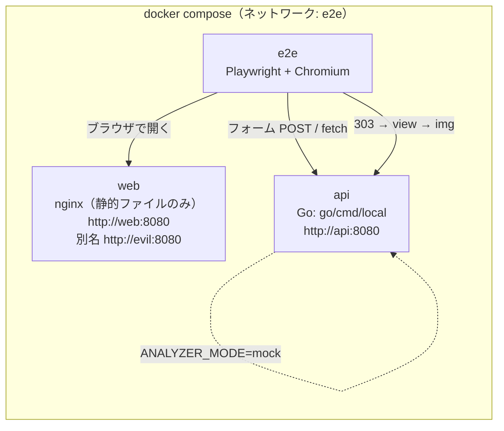

# E2E テスト環境 構成案

API の設計は [DESIGN.md](DESIGN.md) を参照。

## 1. 目的とスコープ

- 本番と同じ構成（**静的サイト → API**）で、ブラウザから実際に操作し、QR 画像が取得できることを自動テストで確認する
- ローカルでは Docker Compose、リモートでは GitHub Actions 上で**同じ構成**を動かす
- 静的サイトは本番では S3（+ CloudFront）に置くだけの想定。そのため、サーバー側のロジックを持たない純粋な静的ファイルとして作る
- 静的サイトから API へオリジンをまたいで POST するため、ここで生じる CSRF の問題もあわせて解決する

| 対象 | 今回 | 保留 |
|---|---|---|
| A / B-1 / B-3 / B-2 の一連の動作 | ○ | |
| 取得した画像が PNG で、表示できること | ○ | |
| QR の中身（デコード結果がチケットコードと一致するか） | | ○（6章 フェーズ5） |
| 画像解析サーバーとの連携 | アプリ内のモック（`ANALYZER_MODE=mock`） | プロトコルが決まり次第、スタブ用コンテナに置き換える |
| API Gateway 固有の挙動（CORS 設定、ペイロード上限など） | | ○（8章） |

## 2. 構成



| コンテナ | イメージ | 役割 | 本番で対応するもの |
|---|---|---|---|
| `api` | `docker/api-go.Dockerfile`（マルチステージビルド。distroless か scratch 上の `local` バイナリ） | API 本体。Lambda と同じハンドラを HTTP で公開する | API Gateway + Lambda |
| `web` | `nginx:alpine` + `web/` | 静的サイト。サーバーのロジックは持たない | S3（+ CloudFront） |
| `e2e` | `mcr.microsoft.com/playwright`（バージョンは `@playwright/test` と揃える） | テストランナー。ヘッドレス Chromium で `web` を操作する | - |

### ホスト名とオリジン

ブラウザは `e2e` コンテナの中で動く。そのため、URL はすべて compose ネットワーク内のホスト名でそろえる。

| 用途 | URL |
|---|---|
| 静的サイト（正規のオリジン） | `http://web:8080` |
| 静的サイト（攻撃者を想定したオリジン。CSRF テスト用） | `http://evil:8080`（`web` コンテナに付けたネットワーク上の別名） |
| API（`PUBLIC_BASE_URL`） | `http://api:8080` |

- `api` の `ALLOWED_ORIGINS=http://web:8080`
- `web` の `config.js` には `apiBaseUrl: "http://api:8080"` を書き込む（3.2）

## 3. 静的サイト（`web/`）

### 3.1 画面

`index.html` 1枚に、2つのパターンを並べる。

| パターン | 操作 | 動き |
|---|---|---|
| B（PRG） | `<form method="post" action="{apiBaseUrl}/v1/tickets" enctype="multipart/form-data">` でファイルを選んで送信 | ブラウザが API へ画面遷移する。303 を受けて B-3（API が返すビュー）へ移り、`` が B-2 から読み込まれる |
| A（inline） | ファイルを選んでボタンを押す。JS が base64 に変換し、`fetch` で `POST /v1/tickets/qr-inline` を呼ぶ | 返ってきた JSON の `qr.data` を `` で表示する |

- JS は `app.js` 1本で、フレームワークは使わない（S3 に置くだけで動かすため）
- `action` 属性は、ページを読み込んだときに `config.js` の `apiBaseUrl` を使って JS で書き換える
- テストで要素を選ぶための `data-testid` を、各要素に付ける

### 3.2 環境ごとの設定

```js
// web/config.js（環境ごとに差し替える）
window.APP_CONFIG = { apiBaseUrl: "http://api:8080" };
```

| 環境 | 作り方 |
|---|---|
| E2E（compose） | nginx イメージの `/docker-entrypoint.d/` スクリプトが、起動時に環境変数 `API_BASE_URL` から `config.js` を作る |
| 本番（S3） | デプロイ時に環境ごとの `config.js` を作ってアップロードする（`index.html` と `app.js` は全環境で同じ） |

### 3.3 静的サイトの CSP（S3 では CloudFront の Response Headers Policy で付ける。E2E では nginx で付ける）

```
default-src 'self';
connect-src {apiBaseUrl};
form-action {apiBaseUrl};
img-src 'self' data:;
```

## 4. CSRF 対策

### 4.1 何が問題か

- B-1 はオリジンをまたいだフォーム POST で呼ばれる（静的サイトのオリジンから API のオリジンへ）
- **CORS では防げない**: `multipart/form-data` のフォーム送信は「単純リクエスト」に当たり、プリフライトが発生しない。そのため、どのサイトからでも POST が届いてしまう（CORS で止められるのは、レスポンスを JS から読むことだけ）
- B-1 は認証なしで Cookie も使わない。したがって、「被害者の認証情報を悪用する」という古典的な CSRF は成立しない。ただし、**第三者のサイトに置いたフォームから API にチケットを発行させる**ことはできてしまう。これを防ぐことを「CSRF の解決」と定義する

### 4.2 対策（採用）: B-1 で Origin を許可リストと照合する

ブラウザは、オリジンをまたぐ POST には必ず `Origin` ヘッダを付け、JS から書き換えることもできない。これを利用する。

| 条件 | 結果 |
|---|---|
| `Origin` が `ALLOWED_ORIGINS` に含まれる | 処理を続ける |
| `Origin` が含まれない、または `Origin` が無い | `403 FORBIDDEN`（HTML のエラービュー）。画像解析も採番もしない |

- 照合は **Lambda ハンドラの中**で行う（API Gateway の CORS 設定は、フォーム POST を止めないため）
- `Sec-Fetch-Site` も参考情報としてログに出す（判定には使わない）
- 限界: curl などブラウザ以外のクライアントは `Origin` を自由に偽装できる。これはブラウザを踏み台にした発行を防ぐための対策であり、ブラウザ以外からの乱用はレート制限で抑える（DESIGN.md 10章）

### 4.3 パターン A（fetch）の CORS

- `application/json` で送る `fetch` はプリフライトが発生する。そのため API 側の CORS 設定が必要になる
- 本番: API Gateway HTTP API の CORS 設定（`AllowOrigins = ALLOWED_ORIGINS`、`AllowMethods = POST`、`AllowHeaders = content-type`）
- ローカル / E2E: プリフライトは API Gateway が Lambda の手前で処理するため、ハンドラには CORS を実装しない。**`go/cmd/local` のアダプタが、API Gateway の CORS 設定と同じ動きをする**ようにする（同じ `ALLOWED_ORIGINS` を読む）
- A にも Origin 照合を入れるかは、A の認証方式とあわせて決める（DESIGN.md 12章 7）

### 4.4 検討して採用しなかった案

| 案 | 採用しなかった理由 |
|---|---|
| フォームトークン（隠しフィールドに HMAC を入れる） | 静的サイトはサーバー側でトークンを埋め込めない。トークンを配る API を追加すると、そのトークン取得も CORS と Origin で守る必要があり、結局 Origin 照合に行き着く |
| Cookie と SameSite 属性 | Cookie を使わない設計のため、対象外 |
| `Referer` の照合 | `Referrer-Policy` の設定によっては送られず、`Origin` より信頼性が低い |

### 4.5 API 側で必要な変更

- 環境変数 `ALLOWED_ORIGINS` を追加する（カンマ区切り。完全一致で照合し、ワイルドカードは使わない）
- B-1（`Issue`）で Origin を照合する。テストを追加する
- `go/cmd/local` に CORS 処理を追加する（プリフライトの `OPTIONS` と、`Access-Control-Allow-Origin` の付与）
- DESIGN.md の 5.2、5.6、10章、12章に反映する

## 5. E2E テスト

### 5.1 フレームワーク: Playwright（TypeScript）を推奨

| 候補 | 評価 |
|---|---|
| **Playwright（TS）** | オリジンをまたぐ画面遷移（web → api）を制約なしで扱える。待機処理が自動で入る。失敗したときのトレース・動画・スクリーンショットが標準で付く。公式の Docker イメージがある。Node 版の実装とツールチェーンを共有できる |
| playwright-go | Go に統一できるが、テストランナーとレポート機能は自前で作る必要があり、エコシステムも小さい |
| Cypress | オリジンをまたぐ遷移に `cy.origin` が必要で、今回の PRG の流れと相性が悪い |
| chromedp（Go） | 低レベルな API で、テストの記述量が多い |

### 5.2 テストケース（初期）

| # | ケース | 確認内容 |
|---|---|---|
| 1 | B: フォームから発行 | `web` を開き、`fixtures/sample.jpg` を選んで送信する。→ URL が `http://api:8080/v1/tickets/{code}/view?sig=...` になる。`data-ticket-code` が想定の形式に合う。`` が読み込み済みで `naturalWidth > 0`。QR のレスポンスが `200 image/png` |
| 2 | B: ビューをリロード | ケース1のあとにリロードする。→ チケットコードが変わらない（再発行されない） |
| 3 | A: fetch で発行 | `web` で画像を選んでボタンを押す。→ コードが表示され、`data:image/png` の `` が `naturalWidth > 0` |
| 4 | CSRF: 他のオリジンからのフォーム送信 | `http://evil:8080/` の同じフォームから送信する。→ `403` のエラービューが出て、`Location` で転送されない |
| 5 | CSRF: 他のオリジンからの fetch | `http://evil:8080/` で A を実行する。→ CORS エラーになり、画面にコードが表示されない |
| 6 | 署名の改ざん | ビューの URL の `sig` を書き換えて開く。→ `403` |
| 7 | 画像でないファイル | テキストファイルを送信する。→ `415` のエラービュー |

- 画像の中身（QR のデコード）は確認しない。PNG として表示できるかどうかまでを見る
- ケース1で QR を取得するレスポンスは、`page.waitForResponse` で捕まえて確認する

### 5.3 ディレクトリ構成

```
st/
├── web/
│   ├── index.html
│   ├── app.js
│   ├── style.css
│   └── config.js              # ローカル用の既定値（E2E では起動時に上書き）
├── e2e/
│   ├── package.json           # @playwright/test のバージョンを固定
│   ├── playwright.config.ts   # baseURL=http://web:8080、trace: 'retain-on-failure'
│   ├── fixtures/{sample.jpg,not-image.txt}
│   └── tests/{pattern-b,pattern-a,csrf,errors}.spec.ts
├── docker/
│   ├── api-go.Dockerfile
│   ├── web/{nginx.conf,40-write-config.sh}
│   └── e2e.Dockerfile         # Playwright イメージ + npm ci
└── compose.e2e.yaml
```

### 5.4 compose.e2e.yaml の骨子

```yaml
services:
  api:
    build: { context: ., dockerfile: docker/api-go.Dockerfile }
    environment:
      APP_ENV: local
      ANALYZER_MODE: mock
      SIGNING_SALT: e2e-salt
      PUBLIC_BASE_URL: http://api:8080
      ALLOWED_ORIGINS: http://web:8080
    healthcheck: { test: ["CMD", "/local", "-healthcheck"], interval: 2s, retries: 15 }
  web:
    image: nginx:alpine
    volumes: [ "./web:/usr/share/nginx/html:ro", "./docker/web/nginx.conf:/etc/nginx/conf.d/default.conf:ro", ... ]
    environment: { API_BASE_URL: http://api:8080 }
    networks: { default: { aliases: [ evil ] } }
  e2e:
    build: { context: ., dockerfile: docker/e2e.Dockerfile }
    depends_on: { api: { condition: service_healthy }, web: { condition: service_started } }
    volumes: [ "./e2e/test-results:/e2e/test-results", "./e2e/playwright-report:/e2e/playwright-report" ]
    command: npx playwright test
```

実行コマンド（ローカルでも CI でも同じ）:

```sh
docker compose -f compose.e2e.yaml up --build --abort-on-container-exit --exit-code-from e2e
```

- `api` のイメージは distroless か scratch で、シェルや curl が無い。そのため、ヘルスチェック用のフラグ `-healthcheck` を `go/cmd/local` に追加する
- 開発中にテストを書くときは、`api` と `web` だけを起動し、ホスト側の `npx playwright test --ui` で操作することもできる（ホストの `/etc/hosts` か、ポートフォワードの設定が必要）

## 6. GitHub Actions

ワークフローは、リポジトリルートの `.github/workflows/st-e2e.yml` に置く。

```yaml
on:
  pull_request: { paths: [ "docs/st/**" ] }
  push: { branches: [ master ], paths: [ "docs/st/**" ] }

jobs:
  unit:
    runs-on: ubuntu-latest
    defaults: { run: { working-directory: docs/st } }
    steps:
      - uses: actions/checkout@v4
      - uses: actions/setup-go@v5
        with: { go-version-file: docs/st/go.mod }
      - run: go vet ./... && go test ./...

  e2e:
    needs: unit
    runs-on: ubuntu-latest
    strategy:
      matrix: { impl: [ go ] }   # Node 版ができたら node を追加
    defaults: { run: { working-directory: docs/st } }
    steps:
      - uses: actions/checkout@v4
      - uses: docker/setup-buildx-action@v3
      - run: docker compose -f compose.e2e.yaml up --build --abort-on-container-exit --exit-code-from e2e
        env: { API_IMPL: "${{ matrix.impl }}" }
      - if: failure()
        run: docker compose -f compose.e2e.yaml logs api web > compose-logs.txt
      - if: always()
        uses: actions/upload-artifact@v4
        with:
          name: e2e-${{ matrix.impl }}
          path: |
            docs/st/e2e/playwright-report
            docs/st/e2e/test-results
            docs/st/compose-logs.txt
```

- ビルドのキャッシュ: compose の `build.cache_from` / `cache_to` に `type=gha` を指定する（または `docker/bake-action` を使う）
- 失敗したときは、Playwright のトレース（`trace.zip`）を成果物（artifact）から取り出し、`npx playwright show-trace` で再生する
- Node 版の実装ができたら、`API_IMPL` で `api` のビルド対象（`docker/api-node.Dockerfile`）を切り替え、同じテストを流す

## 7. 段階的な進め方

| フェーズ | 内容 |
|---|---|
| 1 | API に `ALLOWED_ORIGINS`（Origin 照合と、ローカルでの CORS）と `-healthcheck` を追加する |
| 2 | `web/` の静的サイト、compose、Playwright のケース1〜7。ローカルで通す |
| 3 | GitHub Actions に組み込む |
| 4 | Node 版の実装を matrix に追加する |
| 5 | QR の中身を確認する（テスト内で `jsQR` などを使ってデコードし、チケットコードと照合する） |
| 6 | 画像解析サーバーのプロトコルが決まったら、スタブ用コンテナ（WireMock など）を追加し、`ANALYZER_MODE` を本物のクライアントに切り替えて E2E を回す |

## 8. この構成で確認できないこと

`api` コンテナは `go/cmd/local` のアダプタを使っており、API Gateway と Lambda の実行環境そのものではない。次の点は、この E2E では確認できない。

- API Gateway の CORS 設定、ルーティング、スロットリング
- ペイロードの上限（6MB）、base64 への変換、バイナリレスポンスの扱い
- Lambda のコールドスタート、Secrets Manager からの salt の取得

これらは、IaC が決まった段階で、**実際の AWS の検証用ステージにデプロイし、同じ Playwright テストを `baseURL` だけ差し替えて流す**ことで確認する（`sam local start-api` も候補だが、CI 上で docker-in-docker が必要になり、遅くなる）。

## 9. 決めておきたいこと

1. E2E のフレームワーク（推奨: Playwright TS）
2. Origin が無い POST を拒否してよいか（推奨: 拒否。curl などで動作確認するときは `-H 'Origin: ...'` が必要になる）
3. パターン A を静的サイトから呼ぶ場合の認証。API キーを静的サイトに埋め込むと公開されてしまうので、A も B-1 と同じく「認証なし + Origin 照合 + レート制限」にするか
4. CI のトリガー（PR ごとか、`docs/st/**` が変わったときだけか）
