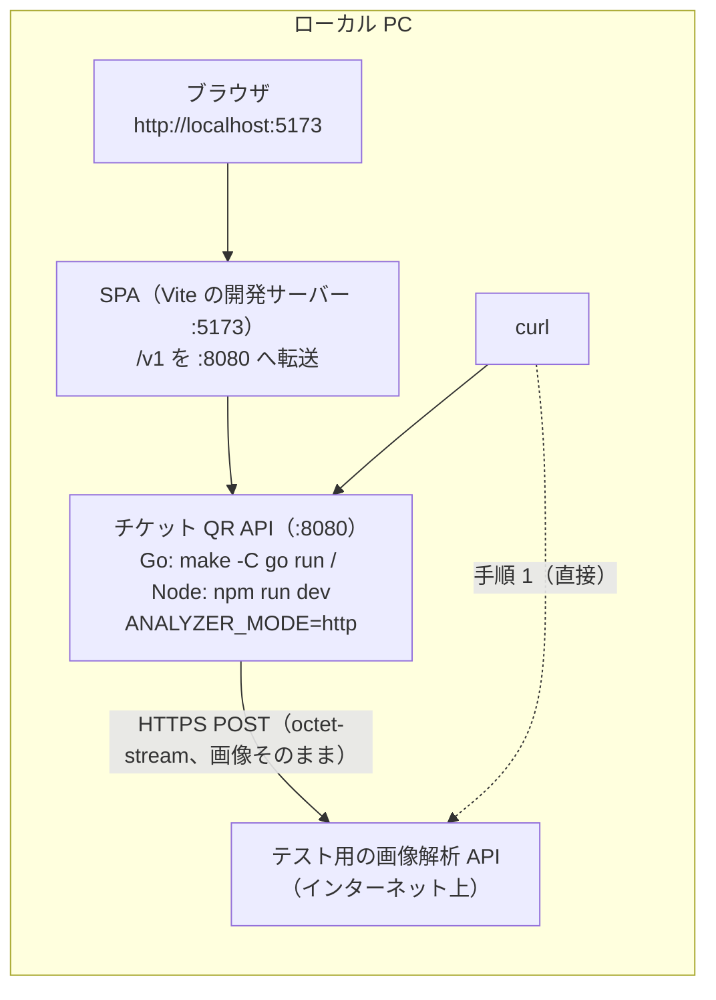

# ローカル PC からテスト用の解析 API につないで確かめる手順

ローカル PC で、チケット QR API（Go 版か Node 版）と SPA を動かし、**インターネット上にあるテスト用の画像解析 API** に実際に画像を送って確かめる。AWS にはデプロイしない。

関連: 解析 API との取り決めは [DESIGN.md](DESIGN.md) 7章、API のエラーコードは同 6章、画面の文言は [web/DESIGN.md](web/DESIGN.md) 4.4、ローカルでの API の動かし方は [go/README.md](go/README.md)・[NODE.md](NODE.md)、SPA の開発は [web/DESIGN.md](web/DESIGN.md) 8章。

## 1. 全体の構成



| 段階 | 確かめること |
|---|---|
| 手順 1: 解析 API を直接呼ぶ | PC から解析 API に届くか、応答の形式（`confidence`・`detected`・`reason`・`result`・`status`）、`PASS` / `REJECT` / `RETRY` がどの画像で返るか |
| 手順 2〜3: ローカルの API 経由 | API が `result` を正しく扱うか（`PASS` → 発行、`REJECT` → 422 `IMAGE_REJECTED`、`RETRY` → 422 `IMAGE_RETRY`）。応答の本文がそのままログに出るか |
| 手順 4: SPA から | 画面にコードが出るか、`REJECT` と `RETRY` で別々の文言が出るか |
| 手順 5（任意）: スマートフォンから | 実機で撮った写真（HEIC など）がそのまま届き、判定されるか |

確かめられないこと: AWS 上の構成（Lambda・API Gateway・VPC・Parameter Store）。それは DEPLOY.md・各実装の DEPLOY.md の手順で確かめる。

## 2. 前提

| 項目 | 内容 |
|---|---|
| テスト用の解析 API | URL（POST 先。例: `https://analyzer-test.example.com/v1/analyze`）と、認証の方式（API キーのヘッダーか、送信元 IP の許可か、なしか）を、解析側から受け取っておく。**今の API が付けられる認証は `x-api-key` ヘッダーだけ**（別の方式なら、実装を足す必要がある） |
| ネットワーク | PC から解析 API の URL に HTTPS で届くこと。送信元 IP で制限されている場合は、PC（またはオフィスのネットワーク）の IP を許可してもらう。社内のプロキシを通す場合は 9章 |
| ツール | Go（`go/go.mod` の版）か Node.js 24、`curl`。SPA で確かめる場合は Node.js 24 と `npm` |
| 画像 | 手順 1 で `PASS` / `REJECT` / `RETRY` になる画像を、それぞれ用意する（どの画像で何が返るかは、解析側に聞くか手順 1 で確かめる）。API が受け付けるのは JPEG / PNG / HEIC / HEIF / AVIF / WebP、4MB まで |
| 作業ディレクトリ | `docs/st` |

本物の証明書の画像（個人情報）を使う場合の注意:
- 画像はテスト用の解析 API（外部）に送られる。送ってよい画像か、解析側と社内のルールを確かめる
- API のログには、解析 API の応答の本文（`reason`・`detected` など）がそのまま出る（画像そのものは出ない）。ログの扱いに注意する
- 解析 API の URL と API キーは、リポジトリにコミットしない（下の手順では、シェルの変数で渡す）

## 3. 変数を用意する

```sh
cd docs/st

export TEST_ANALYZER_URL=https://analyzer-test.example.com/v1/analyze   # 受け取った POST 先
export TEST_ANALYZER_KEY=                                               # API キーがあれば（なければ空のまま）

# 画像（PASS / REJECT / RETRY になるもの）
export IMG_PASS=~/Pictures/certificate-ok.jpg
export IMG_REJECT=~/Pictures/not-a-certificate.jpg
export IMG_RETRY=~/Pictures/certificate-blurry.jpg
```

API キーを毎回入力したくない場合でも、ファイルに書いてコミットしない（`.env` などを使うなら `.gitignore` に入れる）。

## 4. 手順 1: 解析 API を直接呼ぶ

API を通さずに、PC から解析 API に画像を送る。API と同じ送り方（`POST`、`Content-Type: application/octet-stream`、本文は画像のバイト列そのもの）にする。

```sh
# API キーがある場合
curl -sS -i -X POST "$TEST_ANALYZER_URL" \
  -H 'Content-Type: application/octet-stream' \
  -H "x-api-key: $TEST_ANALYZER_KEY" \
  --data-binary @"$IMG_PASS" \
  -w '\n--- %{http_code} %{time_total}s\n'

# API キーがない場合（x-api-key の行を外す）
curl -sS -i -X POST "$TEST_ANALYZER_URL" \
  -H 'Content-Type: application/octet-stream' \
  --data-binary @"$IMG_PASS" \
  -w '\n--- %{http_code} %{time_total}s\n'
```

`$IMG_REJECT`・`$IMG_RETRY` でも同じように送る。確かめること:

| 項目 | 期待 |
|---|---|
| HTTP のステータス | 200（2xx）。401 / 403 なら認証か送信元 IP の許可、404 なら URL、`curl: (6)` / `(7)` / `(28)` ならネットワーク（9章） |
| 本文の形式 | `{"confidence": …, "detected": "…", "reason": "…", "result": "PASS" \| "REJECT" \| "RETRY", "status": …}` |
| `result` | 用意した画像ごとに、想定した値になる |
| かかった時間（`time_total`） | API のタイムアウト（1回 5 秒。`ANALYZER_TIMEOUT_MS`）より十分短い。長いときは、手順 2 で `ANALYZER_TIMEOUT_MS` を延ばす |

応答をそのまま保存しておくと、あとで API のログと比べられる（`-o analyzer-pass.json` など。保存した応答もコミットしない）。

## 5. 手順 2: ローカルの API を、テスト用の解析 API につないで起動する

Go 版か Node 版のどちらか（両方確かめる場合は、片方ずつ）。ローカルでは `APP_ENV=local` のときだけ、API キーを平文の環境変数（`ANALYZER_API_KEY`）で渡せる。

```sh
# Go 版（:8080）
APP_ENV=local \
ANALYZER_MODE=http \
ANALYZER_URL="$TEST_ANALYZER_URL" \
ANALYZER_API_KEY="$TEST_ANALYZER_KEY" \
ANALYZER_TIMEOUT_MS=5000 \
make -C go run

# Node 版（:8080）
npm --prefix node ci   # 初回だけ
APP_ENV=local \
ANALYZER_MODE=http \
ANALYZER_URL="$TEST_ANALYZER_URL" \
ANALYZER_API_KEY="$TEST_ANALYZER_KEY" \
ANALYZER_TIMEOUT_MS=5000 \
npm --prefix node run dev
```

- `ANALYZER_API_KEY` が空なら、`x-api-key` を付けずに送る
- `ANALYZER_TIMEOUT_MS` は1回あたりのタイムアウト（既定 5000）。手順 1 で解析に時間がかかった場合は延ばす（5xx・タイムアウト・通信エラーのときは1回だけリトライする）
- 署名の salt（`SIGNING_SALT`）と API の URL（`PUBLIC_BASE_URL=http://localhost:8080`）は、ローカルの既定値が入る
- ログは標準出力に1行ずつの JSON で出る。別の端末で手順 3 を進め、このログを見ながら確かめる

## 6. 手順 3: ローカルの API を curl で呼ぶ

別の端末で、`docs/st` で実行する（変数は 3章と同じものを設定しておく）。

```sh
export API_URL=http://localhost:8080

# QR 同梱付与 API（その場表示方式）
curl -sS -F image=@"$IMG_PASS"   $API_URL/v1/tickets/qr-inline -w '\n--- %{http_code}\n' | head -c 300; echo
curl -sS -F image=@"$IMG_REJECT" $API_URL/v1/tickets/qr-inline -w '\n--- %{http_code}\n'
curl -sS -F image=@"$IMG_RETRY"  $API_URL/v1/tickets/qr-inline -w '\n--- %{http_code}\n'

# チケット付与 API（JSON。画面遷移方式）
curl -sS -H 'Accept: application/json' -F image=@"$IMG_PASS" $API_URL/v1/tickets -w '\n--- %{http_code}\n'

# チケット付与 API（フォーム送信方式）→ 303 とチケット表示ページの URL
curl -sS -o /dev/null -w '%{http_code} %{redirect_url}\n' -F image=@"$IMG_PASS" $API_URL/v1/tickets
```

期待する結果:

| 画像（解析 API の `result`） | QR 同梱付与 API / チケット付与 API（JSON） | チケット付与 API（フォーム送信） |
|---|---|---|
| `PASS` | 201。`ticketCode`（と QR） | 303。チケット表示ページの URL |
| `REJECT` | 422 `{"error":{"code":"IMAGE_REJECTED","message":"image was rejected"}}` | 422 のエラーページ（`data-error-code="IMAGE_REJECTED"`） |
| `RETRY` | 422 `{"error":{"code":"IMAGE_RETRY","message":"image could not be verified; take it again"}}` | 422 のエラーページ（`data-error-code="IMAGE_RETRY"`） |
| 解析 API の失敗（5xx、`result` がない・想定外の値） | 502 `ANALYSIS_UPSTREAM_ERROR` | 502 のエラーページ |
| 解析 API のタイムアウト | 504 `ANALYSIS_TIMEOUT` | 504 のエラーページ |

API のログで確かめること（手順 2 の端末）:

- 解析 API を呼ぶたびに、`"msg":"analyzer response"` の行が出る。`status` は解析 API の HTTP のステータス、`body` は**応答の本文そのもの**（JSON として読まずに、文字列のまま）。2xx は `INFO`、それ以外は `WARN`
- `body` が、手順 1 で直接呼んだときの応答と同じ形になっている
- 続けて、`PASS` なら `"msg":"ticket issued"`、`REJECT` なら `"msg":"image rejected"`、`RETRY` なら `"msg":"image to be taken again"` の行が出る（`result` が入る）

```json
{"time":"…","level":"INFO","msg":"analyzer response","status":200,"body":"{\"confidence\":0.97,\"detected\":\"certificate\",\"reason\":\"…\",\"result\":\"PASS\",\"status\":200}"}
```

## 7. 手順 4: SPA から確かめる

手順 2 の API を動かしたまま、さらに別の端末で SPA を起動する。Vite の開発サーバーが `/v1` をローカルの API（`:8080`）に転送するので、CORS の設定は要らない。

```sh
npm --prefix web ci     # 初回だけ
npm --prefix web run dev
# → http://localhost:5173 をブラウザで開く
```

- `web/public/config.json` は、開発用に3つの方式（画面遷移方式・その場表示方式・フォーム送信方式）がすべて有効になっている
- 画面で、用意した画像をそれぞれ選んで「発行する」を押す

| 画像（`result`） | 画面に出るもの |
|---|---|
| `PASS` | SPA のチケット画面に移り、チケットのコードと QR が出る |
| `REJECT` | 「この証明書の画像ではチケットを発行できません」 |
| `RETRY` | 「画像をうまく確認できませんでした。明るい場所で、証明書全体が写るように撮り直してください」 |
| 解析 API の失敗・タイムアウト | 「ただいま混み合っています。時間をおいてお試しください」 |

- 「その場で表示」（その場表示方式）でも、同じ文言が出る
- フォーム送信方式（「API の画面で表示」）は、API のチケット表示ページか、API のエラーページ（英語のメッセージとエラーコード）に移る

## 8. 手順 5（任意）: スマートフォンから確かめる

スマートフォンで撮った写真（iPhone の HEIC など）を、そのまま送って確かめる。PC とスマートフォンを同じネットワーク（Wi-Fi）につなぐ。

```sh
# PC の LAN 内の IP を調べる（macOS の例）
ipconfig getifaddr en0          # 例: 192.168.1.20
export PC_IP=192.168.1.20

# API: QR 画像やリダイレクトの URL を、スマートフォンから開ける URL にする（SPA の開発サーバー経由）
# （手順 2 のコマンドに PUBLIC_BASE_URL を足して起動し直す。Go 版の例）
APP_ENV=local ANALYZER_MODE=http ANALYZER_URL="$TEST_ANALYZER_URL" ANALYZER_API_KEY="$TEST_ANALYZER_KEY" \
PUBLIC_BASE_URL=http://$PC_IP:5173 \
make -C go run

# SPA: LAN からの接続を受け付ける
npm --prefix web run dev -- --host
# → スマートフォンのブラウザで http://$PC_IP:5173 を開く
```

- `PUBLIC_BASE_URL` を SPA の開発サーバー（`:5173`）にすると、QR 画像やチケット表示ページの URL も Vite の転送を通るので、スマートフォンから開ける
- PC のファイアウォールで、5173 番への接続を許可する必要がある場合がある
- Android では「画像を選ぶ」と「カメラを起動」の2つのボタンが出る（web/DESIGN.md 3章）。カメラで撮った写真もそのまま送られる
- 本物の証明書を撮る場合は、2章の注意を守る

## 9. うまくいかないとき

| 症状 | 確かめること |
|---|---|
| 手順 1 で `curl: (6)`（名前解決できない）/ `(7)`（接続できない）/ `(28)`（タイムアウト） | URL の誤り、社内のネットワークからの外向きの制限、送信元 IP の許可。社内のプロキシが要る場合は、`curl` に `-x http://proxy.example.com:8080` を付ける |
| 手順 1 で 401 / 403 | API キーの値、ヘッダー名（今の API は `x-api-key` だけを付けられる）、送信元 IP の許可 |
| 手順 3 で 502 `ANALYSIS_UPSTREAM_ERROR` | API のログの `"analyzer response"` の行（解析 API のステータスと本文）と、`"image analysis failed"` の行（原因）。`result` がない・想定外の値（`pass` など大文字小文字の違いを含む）も 502 になる |
| 手順 3 で 504 `ANALYSIS_TIMEOUT` | 解析に時間がかかっている。`ANALYZER_TIMEOUT_MS` を延ばして API を起動し直す（手順 1 の `time_total` を目安に） |
| 手順 1 は通るのに、手順 3 で 502 / 504（接続できない） | API のプロセスがプロキシを通っていない。Go 版は `HTTPS_PROXY` の環境変数を使う（API の起動コマンドの前に付ける）。Node 版の `fetch` は、既定ではプロキシの環境変数を使わない（Node の版によっては `NODE_USE_ENV_PROXY=1` で使える。要確認） |
| 手順 3 で 413 / 415 | 画像が 4MB を超えている / 対応していない形式（API が先に弾くので、解析 API には送られない） |
| SPA で「発行できませんでした」 | ブラウザの開発者ツールのネットワークで、`/v1/tickets` の応答を見る。API が起動していない（Vite の転送先 `:8080` に届かない）ことが多い |

## 10. 結果の記録（例）

| 画像 | 解析 API の応答（手順 1。`result`・`status`・時間） | API の応答（手順 3） | API のログの `analyzer response` | 画面（手順 4） | 結果 |
|---|---|---|---|---|---|
| certificate-ok.jpg | `PASS`・200・0.8s | 201 | 手順 1 と同じ本文 | コードと QR | OK |
| not-a-certificate.jpg | `REJECT`・200・0.7s | 422 `IMAGE_REJECTED` | 同上 | 「この証明書の画像では…」 | OK |
| certificate-blurry.jpg | `RETRY`・200・0.9s | 422 `IMAGE_RETRY` | 同上 | 「画像をうまく確認できませんでした…」 | OK |

気づいた点（解析 API の応答の `status` の値、`RETRY` の意味、時間など）は、解析側への確認事項（DESIGN.md 7章）に反映する。
