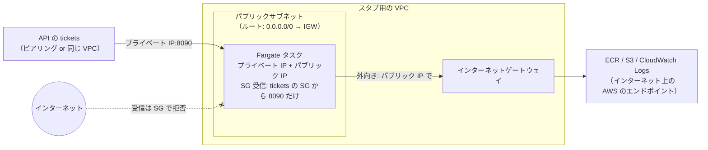
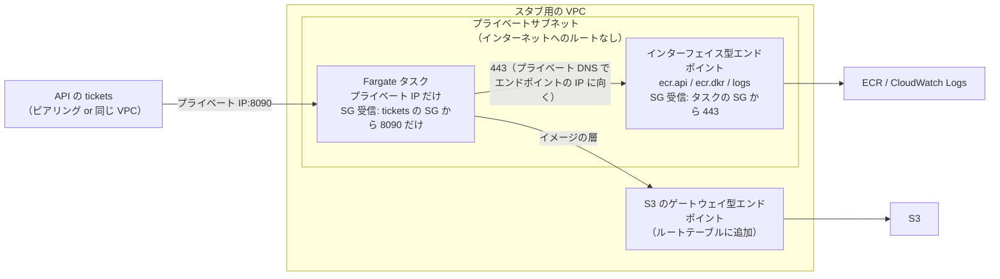

# 【試算】スタブを VPC から新しく作る場合の費用（スタブだけ）

> 一時ドキュメント（2026-10-07）。構成の検討は [analyzer-stub-vpc.md](analyzer-stub-vpc.md)。単価は東京リージョン（ap-northeast-1）の公開価格の目安で、確定値ではない。採用する構成が決まったら、AWS Pricing Calculator で確かめる。

## 1. 前提

| 項目 | 値 |
|---|---|
| 対象 | **スタブだけ**（API の `tickets`・API Gateway・利用側の VPC は含めない） |
| 作るもの | VPC から新しく作る（既存の資源に相乗りしない） |
| 利用量 | 月 1,000 リクエスト。画像は平均 1MB 弱（月 約 1GB） |
| 使い方 | 「確認のときだけ動かす（月 10 時間）」と「常時動かす（月 730 時間）」の2通り |
| 認証 | VPC 内のスタブは API キーを使わない（SG だけで許可）。そのため Parameter Store への経路は要らない |

どの構成でも無料のもの: VPC、サブネット、ルートテーブル、セキュリティグループ（SG）、インターネットゲートウェイ（IGW）、S3 のゲートウェイ型 VPC エンドポイント、CloudFormation、Parameter Store（標準）、同じ AZ の中のデータ転送。

## 2. パターン1: Lambda（内部向け ALB + Lambda）

Lambda は単体では VPC 内の受け口（IP と SG）を持てないので、内部向け ALB を前に置く。スタブの Lambda 自体は VPC に入れない（入れても受信の制限には効かず、AWS の API への経路が要るだけ）。

| 費用がかかるところ | 単価 | 月 10 時間 | 常時（730 時間） |
|---|---|---|---|
| ALB の時間課金 | 約 $0.0243/時間 | 約 $0.24 | 約 $17.7 |
| ALB の処理量（LCU） | 約 $0.008/LCU・時間 | 約 $0.02 | 約 $0.02 |
| Lambda（128MB、arm64、1回 50ms 程度） | リクエスト + 実行時間 | 約 $0（無料枠の範囲） | 約 $0 |
| CloudWatch Logs | 約 $0.76/GB（取り込み） | 約 $0 | 約 $0 |
| サブネット | ALB の条件で 2 AZ 以上 | 無料 | 無料 |
| **合計** | | **約 $0.3** | **約 $18** |

- **ALB から Lambda に渡せるボディは 1MB まで**。スマートフォンの写真（数 MB）での確認はできない
- 確認のときだけ ALB のスタックを作って消せば、月 10 時間で 30 セント程度

## 3. パターン2: Fargate（タスクを使うときだけ起動）

スタブをコンテナとして動かし、タスクの SG で受信を絞る。タスクの置き場所で 2-a と 2-b に分かれる（違いは 5章）。

### 3.1 パターン2-a: パブリックサブネット

| 費用がかかるところ | 単価 | 月 10 時間 | 常時（730 時間） |
|---|---|---|---|
| Fargate のタスク（0.25 vCPU / 0.5GB、arm64） | 約 $0.0123/時間 | 約 $0.12 | 約 $9.0 |
| パブリック IPv4（タスクに1つ） | 約 $0.005/時間 | 約 $0.05 | 約 $3.7 |
| ECR（イメージの保存。約 50MB） | 約 $0.10/GB・月 | 約 $0.01 | 約 $0.01 |
| CloudWatch Logs | 約 $0.76/GB（取り込み） | 約 $0 | 約 $0 |
| インターネットゲートウェイ | - | 無料 | 無料 |
| **合計** | | **約 $0.2** | **約 $13** |

### 3.2 パターン2-b: プライベートサブネット

タスクの費用（2-a と同じ。パブリック IPv4 はなし）に、イメージの取得とログの送信のための経路の費用が加わる。

| 費用がかかるところ | 単価 | 月 10 時間（経路も作って消す） | 常時（730 時間） |
|---|---|---|---|
| Fargate のタスク（0.25 vCPU / 0.5GB、arm64） | 約 $0.0123/時間 | 約 $0.12 | 約 $9.0 |
| VPC エンドポイント（`ecr.api`・`ecr.dkr`・`logs` の3つ、1 AZ） | 約 $0.014/時間 × 3 + 約 $0.01/GB | 約 $0.42 | 約 $31 |
| S3 のゲートウェイ型エンドポイント（イメージの層の取得） | - | 無料 | 無料 |
| ECR・CloudWatch Logs | 2-a と同じ | 約 $0.01 | 約 $0.01 |
| **合計（エンドポイントを使う場合）** | | **約 $0.55** | **約 $40** |
| （参考）エンドポイントの代わりに NAT ゲートウェイ | 約 $0.062/時間 + 約 $0.062/GB | 経路 約 $0.7、合計 約 $0.8 | 経路 約 $45、合計 約 $54 |

- エンドポイントを 2 AZ に置くと、エンドポイントの費用は倍（常時で 約 $62）になる
- エンドポイントや NAT を確認のときだけ作って消すと、作成・削除に数分かかる（エンドポイントのプライベート DNS の反映を含む）

## 4. まとめ

| 構成 | 月 10 時間 | 常時 | 画像の上限 | 費用の大半 |
|---|---|---|---|---|
| パターン1: 内部向け ALB + Lambda | 約 $0.3 | 約 $18 | **1MB** | ALB |
| **パターン2-a: Fargate（パブリックサブネット）** | **約 $0.2** | **約 $13** | 制限なし | タスク・パブリック IPv4 |
| パターン2-b: Fargate（プライベートサブネット + エンドポイント） | 約 $0.55 | 約 $40 | 制限なし | VPC エンドポイント |
| パターン2-b: Fargate（プライベートサブネット + NAT） | 約 $0.8 | 約 $54 | 制限なし | NAT ゲートウェイ |

- 確認のときだけ動かすなら、どの構成も月 1 ドル未満
- 常時動かすと、時間課金の受け口・経路（ALB、エンドポイント、NAT）の費用が大半を占める
- 費用と画像の上限の両方で、2-a が最も有利。2-b は、組織のルールでパブリック IP が使えない場合や、本番に近いネットワークの形で確かめたい場合に選ぶ（5章）

## 5. パターン2-a と 2-b の違い

どちらも「Fargate のタスクを VPC に置き、タスクの SG で、許可した送信元（API の `tickets` の SG）からの 8090 番だけを受け付ける」点は同じ。違うのは、**タスク自身が AWS のサービス（ECR・CloudWatch Logs）に届くための外向きの経路**。

### 5.1 なぜ外向きの経路が要るのか

Fargate のタスクは、起動するときと動いている間に、次の AWS のサービスに通信する。スタブの受信（API からの解析のリクエスト）とは別の、**タスクから外への通信**。

| 通信先 | 目的 | いつ |
|---|---|---|
| ECR の API（`ecr.api`） | イメージの取得の認証 | 起動時 |
| ECR のレジストリ（`ecr.dkr`） | イメージの情報の取得 | 起動時 |
| S3 | イメージの層（本体）の取得。ECR は層を S3 に置いている | 起動時 |
| CloudWatch Logs（`logs`） | スタブのログ（`bytes`・`sha256` など）の送信 | 動いている間 |

これらはインターネット上の AWS のエンドポイントにある。VPC の中から届かせる方法が、2-a（インターネットゲートウェイ経由）と 2-b（VPC エンドポイントか NAT 経由）の違いになる。

### 5.2 構成の図

パターン2-a（パブリックサブネット）:

パターン2-b（プライベートサブネット + VPC エンドポイント）:

（NAT を使う 2-b では、エンドポイントの代わりに「プライベートサブネット → パブリックサブネットの NAT ゲートウェイ → IGW」の経路になる。タスクにはパブリック IP が付かない。）

### 5.3 違いの一覧

| 観点 | 2-a: パブリックサブネット | 2-b: プライベートサブネット |
|---|---|---|
| タスクの IP | プライベート IP + **パブリック IP** | プライベート IP だけ |
| AWS のサービスへの経路 | タスクのパブリック IP → IGW → インターネット上の AWS のエンドポイント | VPC エンドポイント（AWS のネットワークの中で完結）か、NAT ゲートウェイ |
| 作るもの | VPC、パブリックサブネット、IGW、ルート | VPC、プライベートサブネット、エンドポイント 3つ + S3 のゲートウェイ型（またはパブリックサブネット + NAT + IGW）、エンドポイントの SG |
| 費用（常時） | 約 $13/月（パブリック IPv4 が 約 $3.7） | 約 $40/月（エンドポイント）/ 約 $54/月（NAT） |
| 費用（月 10 時間） | 約 $0.2 | 約 $0.55 / 約 $0.8（経路も作って消す場合） |
| インターネットからの受信 | **SG で拒否**（パブリック IP はあるが、SG が許可するのは `tickets` の SG だけ）。守りは SG の1枚 | そもそもインターネットからの経路がない（ルートも IP もない）。SG に加えてネットワークの形でも守られる |
| 外向きの通信 | SG の送信ルールの範囲で、インターネットのどこにでも出られる（既定の SG は送信をすべて許可） | エンドポイントの場合、届くのはエンドポイントのあるサービス（ECR・Logs・S3）だけ。それ以外のインターネットには出られない |
| 設定を誤ったときの影響 | SG の受信ルールを誤って広げると（例: `0.0.0.0/0`）、スタブがインターネットから呼べてしまう | SG を誤って広げても、インターネットからは届かない（VPC の中と、つながっている VPC からだけ） |
| 組織のルールとの相性 | 「プライベートな資源にパブリック IP を付けない」というルール（SCP、AWS Config のルール、Security Hub の検出項目など）がある組織では、使えないか、警告が出る | 一般的なルールに合う |
| 本番との近さ | 本番の解析サーバーは、おそらくパブリック IP を持たない。「VPC 間の経路と SG の参照で届くか」の確認には影響しないが、ネットワークの形は本番と違う | 本番に近い（プライベートサブネットに置き、外へはエンドポイントか NAT） |
| 名前解決 | 特に設定は要らない | エンドポイントのプライベート DNS を有効にするため、VPC の `enableDnsSupport`・`enableDnsHostnames` を有効にする |
| 起動の速さ | 速い（インターネット経由で直接取得） | ほぼ同じ。ただし、エンドポイントを確認のたびに作る場合は、その作成に数分かかる |
| 失敗しやすい点 | `assignPublicIp=ENABLED` を付け忘れると、イメージを取得できずタスクが起動しない（`CannotPullContainerError`） | エンドポイントのどれか（特に `ecr.dkr` や S3 のゲートウェイ型）を作り忘れる、エンドポイントの SG がタスクからの 443 を許可していない、などで起動しない |

### 5.4 どちらを選ぶか

| 状況 | 選ぶもの |
|---|---|
| テスト用で、費用と手間を最小にしたい。組織のルールでパブリック IP が使える | **2-a**（SG の受信ルールは `tickets` の SG だけにし、`0.0.0.0/0` を入れない） |
| 組織のルールでパブリック IP が使えない、またはネットワークの形も本番に近づけて確かめたい | **2-b（エンドポイント）**。費用を抑えるなら、エンドポイントは 1 AZ に置き、確認のときだけ作る |
| 同じ VPC に、ほかの用途で既に NAT ゲートウェイがある | **2-b（既存の NAT）**。追加の時間課金はない（データ量の課金だけ） |
