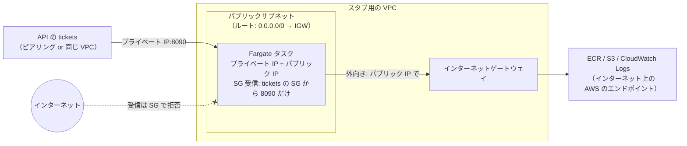
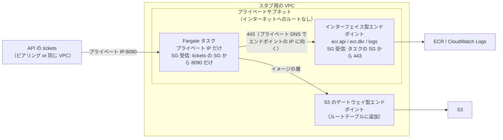

# 【試算】スタブを VPC から新しく作る場合の費用（スタブだけ）

> 一時ドキュメント（2026-10-07）。構成の検討は [analyzer-stub-vpc.md](analyzer-stub-vpc.md)。単価は東京リージョン（ap-northeast-1）の公開価格の目安で、確定値ではない。採用する構成が決まったら、AWS Pricing Calculator で確かめる。

## 1. 前提

| 項目 | 値 |
|---|---|
| 対象 | **スタブだけ**（API の `tickets`・API Gateway・利用側の VPC は含めない） |
| 作るもの | VPC から新しく作る（既存の資源に相乗りしない） |
| 利用量 | 月 1,000 リクエスト。画像は平均 1MB 弱（月 約 1GB） |
| 使い方 | 「確認のときだけ動かす（月 10 時間）」と「常時動かす（月 730 時間）」の2通り |
| 認証 | VPC 内のスタブは API キーを使わない（SG だけで許可）。そのため Parameter Store への経路は要らない |

どの構成でも無料のもの: VPC、サブネット、ルートテーブル、セキュリティグループ（SG）、インターネットゲートウェイ（IGW）、S3 のゲートウェイ型 VPC エンドポイント、CloudFormation、Parameter Store（標準）、同じ AZ の中のデータ転送。

## 2. パターン1: Lambda（内部向け ALB + Lambda）

Lambda は単体では VPC 内の受け口（IP と SG）を持てないので、内部向け ALB を前に置く。スタブの Lambda 自体は VPC に入れない（入れても受信の制限には効かず、AWS の API への経路が要るだけ）。

| 費用がかかるところ | 単価 | 月 10 時間 | 常時（730 時間） |
|---|---|---|---|
| ALB の時間課金 | 約 $0.0243/時間 | 約 $0.24 | 約 $17.7 |
| ALB の処理量（LCU） | 約 $0.008/LCU・時間 | 約 $0.02 | 約 $0.02 |
| Lambda（128MB、arm64、1回 50ms 程度） | リクエスト + 実行時間 | 約 $0（無料枠の範囲） | 約 $0 |
| CloudWatch Logs | 約 $0.76/GB（取り込み） | 約 $0 | 約 $0 |
| サブネット | ALB の条件で 2 AZ 以上 | 無料 | 無料 |
| **合計** | | **約 $0.3** | **約 $18** |

- **ALB から Lambda に渡せるボディは 1MB まで**。スマートフォンの写真（数 MB）での確認はできない
- 確認のときだけ ALB のスタックを作って消せば、月 10 時間で 30 セント程度

## 3. パターン2: Fargate（タスクを使うときだけ起動）

スタブをコンテナとして動かし、タスクの SG で受信を絞る。タスクの置き場所で 2-a と 2-b に分かれる（違いは 5章）。

### 3.1 パターン2-a: パブリックサブネット

| 費用がかかるところ | 単価 | 月 10 時間 | 常時（730 時間） |
|---|---|---|---|
| Fargate のタスク（0.25 vCPU / 0.5GB、arm64） | 約 $0.0123/時間 | 約 $0.12 | 約 $9.0 |
| パブリック IPv4（タスクに1つ） | 約 $0.005/時間 | 約 $0.05 | 約 $3.7 |
| ECR（イメージの保存。約 50MB） | 約 $0.10/GB・月 | 約 $0.01 | 約 $0.01 |
| CloudWatch Logs | 約 $0.76/GB（取り込み） | 約 $0 | 約 $0 |
| インターネットゲートウェイ | - | 無料 | 無料 |
| **合計** | | **約 $0.2** | **約 $13** |

### 3.2 パターン2-b: プライベートサブネット

タスクの費用（2-a と同じ。パブリック IPv4 はなし）に、イメージの取得とログの送信のための経路の費用が加わる。

| 費用がかかるところ | 単価 | 月 10 時間（経路も作って消す） | 常時（730 時間） |
|---|---|---|---|
| Fargate のタスク（0.25 vCPU / 0.5GB、arm64） | 約 $0.0123/時間 | 約 $0.12 | 約 $9.0 |
| VPC エンドポイント（`ecr.api`・`ecr.dkr`・`logs` の3つ、1 AZ） | 約 $0.014/時間 × 3 + 約 $0.01/GB | 約 $0.42 | 約 $31 |
| S3 のゲートウェイ型エンドポイント（イメージの層の取得） | - | 無料 | 無料 |
| ECR・CloudWatch Logs | 2-a と同じ | 約 $0.01 | 約 $0.01 |
| **合計（エンドポイントを使う場合）** | | **約 $0.55** | **約 $40** |
| （参考）エンドポイントの代わりに NAT ゲートウェイ | 約 $0.062/時間 + 約 $0.062/GB | 経路 約 $0.7、合計 約 $0.8 | 経路 約 $45、合計 約 $54 |

- エンドポイントを 2 AZ に置くと、エンドポイントの費用は倍（常時で 約 $62）になる
- エンドポイントや NAT を確認のときだけ作って消すと、作成・削除に数分かかる（エンドポイントのプライベート DNS の反映を含む）

## 4. まとめ

| 構成 | 月 10 時間 | 常時 | 画像の上限 | 費用の大半 |
|---|---|---|---|---|
| パターン1: 内部向け ALB + Lambda | 約 $0.3 | 約 $18 | **1MB** | ALB |
| **パターン2-a: Fargate（パブリックサブネット）** | **約 $0.2** | **約 $13** | 制限なし | タスク・パブリック IPv4 |
| パターン2-b: Fargate（プライベートサブネット + エンドポイント） | 約 $0.55 | 約 $40 | 制限なし | VPC エンドポイント |
| パターン2-b: Fargate（プライベートサブネット + NAT） | 約 $0.8 | 約 $54 | 制限なし | NAT ゲートウェイ |

- 確認のときだけ動かすなら、どの構成も月 1 ドル未満
- 常時動かすと、時間課金の受け口・経路（ALB、エンドポイント、NAT）の費用が大半を占める
- 費用と画像の上限の両方で、2-a が最も有利。**セキュリティでは 2-b（エンドポイント）が推奨**（5.4）。確認のときだけ作れば、2-b でも月 1 ドル未満

## 5. パターン2-a と 2-b の違い

どちらも「Fargate のタスクを VPC に置き、タスクの SG で、許可した送信元（API の `tickets` の SG）からの 8090 番だけを受け付ける」点は同じ。違うのは、**タスク自身が AWS のサービス（ECR・CloudWatch Logs）に届くための外向きの経路**。

### 5.1 なぜ外向きの経路が要るのか

Fargate のタスクは、起動するときと動いている間に、次の AWS のサービスに通信する。スタブの受信（API からの解析のリクエスト）とは別の、**タスクから外への通信**。

| 通信先 | 目的 | いつ |
|---|---|---|
| ECR の API（`ecr.api`） | イメージの取得の認証 | 起動時 |
| ECR のレジストリ（`ecr.dkr`） | イメージの情報の取得 | 起動時 |
| S3 | イメージの層（本体）の取得。ECR は層を S3 に置いている | 起動時 |
| CloudWatch Logs（`logs`） | スタブのログ（`bytes`・`sha256` など）の送信 | 動いている間 |

これらはインターネット上の AWS のエンドポイントにある。VPC の中から届かせる方法が、2-a（インターネットゲートウェイ経由）と 2-b（VPC エンドポイントか NAT 経由）の違いになる。

### 5.2 構成の図

パターン2-a（パブリックサブネット）:



パターン2-b（プライベートサブネット + VPC エンドポイント）:



（NAT を使う 2-b では、エンドポイントの代わりに「プライベートサブネット → パブリックサブネットの NAT ゲートウェイ → IGW」の経路になる。タスクにはパブリック IP が付かない。）

### 5.3 違いの一覧

| 観点 | 2-a: パブリックサブネット | 2-b: プライベートサブネット |
|---|---|---|
| タスクの IP | プライベート IP + **パブリック IP** | プライベート IP だけ |
| AWS のサービスへの経路 | タスクのパブリック IP → IGW → インターネット上の AWS のエンドポイント | VPC エンドポイント（AWS のネットワークの中で完結）か、NAT ゲートウェイ |
| 作るもの | VPC、パブリックサブネット、IGW、ルート | VPC、プライベートサブネット、エンドポイント 3つ + S3 のゲートウェイ型（またはパブリックサブネット + NAT + IGW）、エンドポイントの SG |
| 費用（常時） | 約 $13/月（パブリック IPv4 が 約 $3.7） | 約 $40/月（エンドポイント）/ 約 $54/月（NAT） |
| 費用（月 10 時間） | 約 $0.2 | 約 $0.55 / 約 $0.8（経路も作って消す場合） |
| インターネットからの受信 | **SG で拒否**（パブリック IP はあるが、SG が許可するのは `tickets` の SG だけ）。守りは SG の1枚 | そもそもインターネットからの経路がない（ルートも IP もない）。SG に加えてネットワークの形でも守られる |
| 外向きの通信 | SG の送信ルールの範囲で、インターネットのどこにでも出られる（既定の SG は送信をすべて許可） | エンドポイントの場合、届くのはエンドポイントのあるサービス（ECR・Logs・S3）だけ。それ以外のインターネットには出られない |
| 設定を誤ったときの影響 | SG の受信ルールを誤って広げると（例: `0.0.0.0/0`）、スタブがインターネットから呼べてしまう | SG を誤って広げても、インターネットからは届かない（VPC の中と、つながっている VPC からだけ） |
| 組織のルールとの相性 | 「プライベートな資源にパブリック IP を付けない」というルール（SCP、AWS Config のルール、Security Hub の検出項目など）がある組織では、使えないか、警告が出る | 一般的なルールに合う |
| 本番との近さ | 本番の解析サーバーは、おそらくパブリック IP を持たない。「VPC 間の経路と SG の参照で届くか」の確認には影響しないが、ネットワークの形は本番と違う | 本番に近い（プライベートサブネットに置き、外へはエンドポイントか NAT） |
| 名前解決 | 特に設定は要らない | エンドポイントのプライベート DNS を有効にするため、VPC の `enableDnsSupport`・`enableDnsHostnames` を有効にする |
| 起動の速さ | 速い（インターネット経由で直接取得） | ほぼ同じ。ただし、エンドポイントを確認のたびに作る場合は、その作成に数分かかる |
| 失敗しやすい点 | `assignPublicIp=ENABLED` を付け忘れると、イメージを取得できずタスクが起動しない（`CannotPullContainerError`） | エンドポイントのどれか（特に `ecr.dkr` や S3 のゲートウェイ型）を作り忘れる、エンドポイントの SG がタスクからの 443 を許可していない、などで起動しない |

### 5.4 どれを選ぶか（セキュリティの観点を含む）

セキュリティだけで並べると、**2-b（エンドポイント）＞ 2-b（NAT）＞ 2-a（パブリックサブネット）**。

| 観点 | 2-a: パブリックサブネット | 2-b: NAT ゲートウェイ | 2-b: VPC エンドポイント |
|---|---|---|---|
| インターネットからの受信 | パブリック IP があり、守りは SG だけ（設定を誤ると公開される） | 届かない（パブリック IP がなく、NAT は外向き専用） | 届かない（インターネットへの経路自体がない） |
| 外への送信（データの持ち出し） | インターネットのどこへでも出られる | インターネットのどこへでも出られる | ECR・CloudWatch Logs・S3 だけ。それ以外のインターネットには出られない |
| 送信先をさらに絞れるか | SG の送信ルールでポート・CIDR は絞れるが、AWS の IP の範囲は広く、サービス単位では絞れない | 2-a と同じ（NAT 自体には許可・拒否の設定がない） | **エンドポイントポリシー**で、自分のアカウントの ECR リポジトリ・ロググループ・S3 だけに絞れる |
| 設定を誤ったときの影響 | SG の受信ルールを広げると、すぐにインターネットに公開される | SG を広げても、インターネットからは届かない | 同左 |
| 組織のルール（パブリック IP の禁止など） | 違反として検出されやすい | 問題になりにくい | 問題になりにくい |
| 費用（常時 / 月 10 時間） | 約 $13 / 約 $0.2 | 約 $54 / 約 $0.8 | 約 $40 / 約 $0.55 |

エンドポイントを推奨する理由:
- インターネットからの受信も、インターネットへの送信も、ネットワークの形として存在しない。SG の1枚に頼らない
- 万一イメージに悪意のあるコードが混ざっていても、持ち出せる先が AWS の3つのサービスに限られる。エンドポイントポリシーを付ければ、自分のアカウントの資源にしか書き込めない

エンドポイントで残る注意:
- エンドポイントポリシーを付けないと、S3 や CloudWatch Logs を経由して、他人のアカウントの資源（S3 バケットなど）に送れてしまう。ポリシーで「自分のアカウントの資源だけ」に絞る
- ピアリングが双方向である問題（5.7）は、どのパターンでも同じ。ルートの範囲を絞る対策は、どれにも必要

選び方:

| 状況 | 選ぶもの |
|---|---|
| 本物の証明書の画像（個人情報）を扱う可能性がある、組織のルールが厳しい、またはネットワークの形も本番に近づけて確かめたい | **2-b（エンドポイント。推奨）**。エンドポイントポリシーを付ける。費用は、1 AZ に置き、確認のときだけ作れば月 1 ドル未満 |
| テスト用の画像だけで、費用と手間を最小にしたい。組織のルールでパブリック IP が使える | **2-a**。SG の受信ルールは `tickets` の SG の参照だけ、送信ルールは 443 番だけにし、確認のときだけ起動する |
| 同じ VPC に、ほかの用途で既に NAT ゲートウェイがある | 2-b（既存の NAT）。追加の時間課金はない。送信の自由度は 2-a と同じなので、セキュリティ上の利点は「パブリック IP がない」点だけ |

NAT ゲートウェイを新しく作ってまで 2-b にする理由は少ない（送信の自由度は 2-a と同じで、費用は最も高い）。

### 5.5 パブリックサブネットで何がインターネットに公開されるか（2-a）

パブリックサブネットとは「ルートテーブルに `0.0.0.0/0 → IGW` がある」という意味でしかなく、サブネットに置いただけでは何も公開されない。インターネットから届くのは、次の両方を満たすものだけ。

1. パブリック IP を持っている（2-a では Fargate のタスク1つ）
2. SG がインターネットからの受信を許可している（2-a では「8090 番を `tickets` の SG からだけ」なので、インターネットからは何も許可していない）

そのため、インターネットから見えるのは「タスクのパブリック IP アドレスが存在すること」だけ。ポートを探る通信が来ても SG が黙って捨てるので、応答は返らない。API からスタブへの通信は、パブリック IP ではなくプライベート IP（ピアリング、または同じ VPC）を使う。

### 5.6 2-a のセキュリティ上の課題と対策

| 課題 | 内容 | 対策 |
|---|---|---|
| 守りが SG の1枚 | SG の受信ルールを誤って広げる（`0.0.0.0/0` など）と、スタブがインターネットから呼べる。VPC 内のスタブは API キーを使わない想定なので、誰でも呼べる状態になる | 受信ルールは `tickets` の SG の参照だけにする（CIDR で書かない）。テンプレートで固定し、手で変更しない |
| 外向きに自由に出られる | 既定の SG は送信をすべて許可する。イメージに悪意のあるコードが混ざっていた場合、受け取った画像を外へ送れてしまう。**本物の証明書の画像（個人情報）を使うと特に問題** | SG の送信ルールを 443 番だけにする。イメージはダイジェストで固定する。確認には**テスト用の画像だけ**を使う |
| 公開されている時間 | タスクが動いている間は、パブリック IP が存在する | 確認のときだけ起動し、終わったら止める（止めればパブリック IP も消える） |
| 組織のルール | 「パブリック IP を付けない」というルールがある組織では、違反として検出される（AWS Security Hub の検出項目など） | 事前に確認する。使えなければ 2-b にする |
| 通信の記録 | 何が届いたかを、後から追えない | 必要なら VPC フローログを有効にする（少額の課金） |

### 5.7 スタブ用の VPC を新しく作ったときの、既存の VPC・サービスへの影響

**VPC を作るだけなら、既存への影響はない**（既存の VPC とは完全に切り離されている）。影響が出るのは、つなぐとき（analyzer-stub-vpc.md の P1 のピアリング）。

| 段階 | 既存への影響 |
|---|---|
| スタブ用の VPC・サブネット・IGW を作る | **なし**。ただし、リージョンごとの VPC の上限（既定 5）を1つ使う |
| VPC ピアリングを作って承認する | 作っただけでは通信は流れない |
| **既存の VPC のルートテーブルに、スタブ用の VPC へのルートを足す** | **既存の VPC を変更する**。ルートは宛先がスタブ用の VPC の CIDR の通信にしか効かないので、ほかの通信には影響しない。CIDR が重ならないことが条件 |
| **ピアリングは双方向** | スタブ用の VPC から既存の VPC へも、ネットワークとしては届くようになる。既存のサービスの SG が広い CIDR を許可していると（例: `10.0.0.0/8` から許可）、**インターネットに出られるスタブ用の VPC から、既存のサービスに届いてしまう** |

最後の点が一番の注意点（インターネットに面した VPC を、既存の VPC につなぐことになる）。次の対策を入れる。

- **ルートの範囲を絞る**: スタブ用の VPC 側のルートは、既存の VPC 全体ではなく、`tickets` を置くサブネットの CIDR だけにする。既存の VPC 側も、`tickets` のサブネットのルートテーブルにだけ足す
- **スタブの送信ルールを絞る**: スタブは応答を返すだけで、既存の VPC に自分から接続する必要はない。SG の送信ルールは 443 番だけにする（応答は SG が状態を覚えているので、送信ルールがなくても返せる）
- **既存の SG を確かめる**: 既存の VPC に、広い CIDR を許可している SG がないかを確かめる。対象は EC2 だけでなく、**RDS などのデータベース**（VPC 内に ENI を持ち、SG で接続を絞っている。例: `10.0.0.0/8` から 5432 番を許可していると、スタブ用の VPC から届いてしまう）、ElastiCache、内部向け ALB、VPC エンドポイントなど、ENI を持つものすべて。必要なら、既存のサブネットのネットワーク ACL で、スタブ用の VPC の CIDR からの受信を `tickets` の ENI 以外に対して拒否する
- 同じことは 2-b にも当てはまる（2-b はインターネットに出られない分、危険は小さいが、双方向に届く点は同じ）

### 5.8 SG・ネットワーク ACL・ルートテーブルの役割（VPC をまたぐ通信）

SG は ENI ごとの許可の設定で、VPC 間のルーティング（届くかどうか）は決めない。ただし、VPC をまたいで届いた通信を最後に許可するかどうかは SG が決める。VPC をまたぐ通信は、次の関門を順に通る（`tickets` → スタブの例）。

```
tickets の ENI
  ① SG（送信）              … tickets の ENI に付いたもの
  ② ネットワーク ACL（送信）  … tickets のサブネットに付いたもの
  ③ ルートテーブル           … 宛先がスタブ用の VPC の CIDR なら、ピアリングへ
  ④ VPC ピアリング           … 通り道。それ自体に許可・拒否の設定はない
  ⑤ ネットワーク ACL（受信）  … スタブのサブネットに付いたもの
  ⑥ SG（受信）              … スタブの ENI に付いたもの
スタブの ENI
```

| 仕組み | 付く場所 | 役割 | 性質 |
|---|---|---|---|
| ルートテーブル | サブネット | **届くかどうか**（どこへ送るか）を決める。ルートがなければ、SG で許可しても届かない | 許可・拒否ではなく、行き先の指定 |
| ネットワーク ACL | サブネット | サブネットの出入り口での許可・拒否 | 状態を持たない（戻りの通信も別に許可が要る）。拒否のルールが書ける |
| SG | ENI（EC2、Lambda の ENI、Fargate のタスク、ALB、VPC エンドポイントなど） | ENI ごとの許可 | 状態を持つ（許可した通信の戻りは自動で通る）。許可だけで、拒否は書けない |

SG と VPC 間の関係:

- **ルーティングは決めない**: ルートがない VPC 同士は、SG で許可しても通信できない。逆に、ルートがあっても SG が許可しなければ ENI には入れない
- **相手の VPC の SG を送信元に指定できる**: 同じリージョンの VPC ピアリングか、Transit Gateway（SG の参照を有効にした場合）でつながっていれば、相手の VPC の SG を送信元に書ける。本番の想定（解析側が「利用側の SG から許可」。analyzer-stub-vpc.md 2章）は、この使い方。それでも判定するのは受け側の ENI
- **VPC 間の境界を守る仕組みではない**: ピアリングには許可・拒否の設定がない。VPC の境界で絞るには、ルートの範囲、ネットワーク ACL、AWS Network Firewall などを使う

5.7 の「ピアリングは双方向なので、スタブ用の VPC から既存のサービスに届いてしまう」は、この性質による。ピアリングとルートでネットワークとしては双方向に届くようになり、実際に入れるかどうかは既存のサービスの ENI の SG 次第になる。既存の SG が広い CIDR を許可していると、それがそのまま通る。そのため、ルートの範囲を絞る（届かせない）か、ネットワーク ACL で拒否する（サブネットの出入り口で止める）対策を取る。
