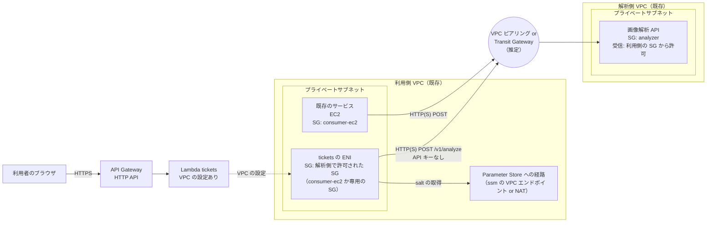
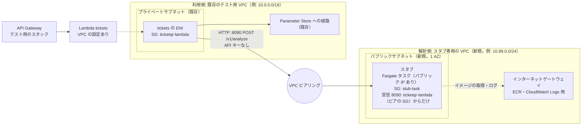
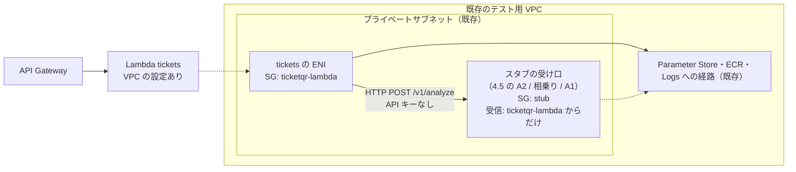

# 【検討】画像解析サーバーのスタブを VPC 内で、セキュリティグループで許可した送信元からだけ受け付ける

> 一時ドキュメント（2026-10-07）。**2026-10-08 の方針の変更: 本物の解析サーバーは AWS の外で、送信元の IP（NAT の固定 IP）で許可しているだけの可能性もあるため、スタブは「パブリックサブネットの Fargate に、許可した IP から外部経由で届く」構成だけにし、`tickets` からの経路（ピアリング、SG の参照など）は決めないことにした（../DEPLOY.md 3.4、../analyzer-stub/DESIGN.md 付録 B）。以下の SG の参照・ピアリングを前提にした検討は、経緯として残す。** **A2（Fargate のタスク）を3パターンで実装済み（2026-10-08）**: パブリックサブネット（テスト用に推奨。`analyzer-stub/network.yaml` でスタブ用の VPC を作る）、プライベートサブネット + VPC エンドポイント、プライベートサブネット + NAT。スタブは AWS CDK（Python。`analyzer-stub/cdk/`。イメージのビルドを含む）、手順 [../DEPLOY.md](../DEPLOY.md) 3.4、[../analyzer-stub/DESIGN.md](../analyzer-stub/DESIGN.md) 付録 B。AWS 上では未検証。案が決まったら、[../analyzer-stub/DESIGN.md](../analyzer-stub/DESIGN.md) とテンプレート・手順書に反映し、このファイルは削除する。関連: [lambda-vpc.md](lambda-vpc.md)（API の `tickets` を VPC に置く構成）、[analyzer-stub-cost.md](analyzer-stub-cost.md)（スタブを VPC から新しく作る場合の費用の試算と、パブリックサブネット / プライベートサブネットの違い）。

## 1. 目的と条件

- 本番の画像解析サーバーは、VPC 内で**特定のセキュリティグループ（SG）からのアクセスだけを許可し、API キーは使わない**想定（lambda-vpc.md）
- 本番の解析サーバーにつなぐ前に、同じ形（VPC 内、SG で許可した送信元だけ、API キーなし）をスタブで確かめられる**テスト環境**を用意したい
- 条件: スタブはテスト用なので、**時間課金をできるだけ避けたい**（リクエスト課金が望ましい）

今のスタブ（Lambda + Function URL + API キー）は、インターネットに公開されていて、SG では制限できない。また、VPC 内に置いた API の Lambda からは、NAT がなければ Function URL に届かない（lambda-vpc.md 7章）。

## 2. 本番の想定構成（確証のない推定）

本番の構成について確かな情報はまだない。今の推定は次のとおり。

- 画像解析 API は、専用の VPC（以下「解析側 VPC」）にある
- それを使う既存のサービス（EC2 のインスタンス）は、別の VPC（以下「利用側 VPC」）にある
- 2つの VPC の間に経路があり（VPC ピアリングか Transit Gateway と推定）、解析側の SG が、利用側の SG からのアクセスを許可している
- 今回のチケット発行の Lambda（`tickets`）は、利用側 VPC のサブネットに置き、解析側の SG で許可された SG を付ける（lambda-vpc.md）



本番について確かめたいこと（テスト環境の作り方に効くもの）:

| 項目 | テスト環境への影響 |
|---|---|
| VPC 間のつなぎ方（ピアリング / Transit Gateway / PrivateLink） | 再現する経路の種類。PrivateLink の場合、解析側から見える送信元が NLB になり、SG での許可の形が変わる |
| 同じアカウントか、別のアカウントか | SG の参照の書き方（別アカウントは `アカウント ID/sg-…`）、ピアリングの承認の手順 |
| 解析側の SG の許可の書き方（**SG の参照**か、**利用側の CIDR**か） | SG の参照なら、`tickets` に許可された SG を付ける必要がある。CIDR なら、同じサブネットに置けば SG に関係なく届く |
| 解析 API の接続先の名前（プライベートのホストゾーンか、IP か）と HTTP / HTTPS | 利用側 VPC で名前が引けるか（ホストゾーンの関連付け、ピアリングの DNS 解決の設定） |

## 3. SG で絞ることと課金の関係

- SG は ENI（VPC 内のネットワークの口）に付くもの。SG で受信を絞るには、VPC 内に受け口（ALB・NLB・VPC エンドポイント・VPC Lattice・コンテナや EC2 など）が必要で、これらはすべて**時間課金**
- スタブの Lambda を VPC に入れても、受信は絞れない。Lambda の VPC 設定は Lambda から外への通信のためのもので、Lambda を呼び出す側（Function URL・ALB など）の制限にはならない（Lambda を VPC に置くこと自体に ALB は要らない）
- Function URL・Lambda の呼び出し・API Gateway（HTTP API / REST API 本体）はリクエスト課金だが、いずれも SG では絞れない
- VPC・サブネット・ルートテーブル・SG・インターネットゲートウェイ・**VPC ピアリング**には時間課金がない（ピアリングは AZ をまたぐデータ転送だけ課金）。Transit Gateway は接続ごとの時間課金がある

そのため、時間課金は「スタブの受け口」だけに絞り、それを**確認するときだけ動かす**（数時間で数セント）か、**既存の受け口に相乗りする**（追加の時間課金なし）。

## 4. テスト環境のパターン

本番に近い順に並べる。どのパターンでも、API の `tickets` は lambda-vpc.md のとおり VPC に置き、`AnalyzerApiKeyParameterName` は空（API キーなし）にする（P4 を除く）。

### 4.1 比較

| パターン | 構成 | 確かめられること | 確かめられないこと | 時間課金 | 既存の環境への変更 |
|---|---|---|---|---|---|
| **P1: 2つの VPC + ピアリング（本番の再現）** | 利用側 = 既存のテスト用 VPC。解析側 = スタブ専用の VPC を新しく作り、ピアリングでつなぐ。スタブは解析側のコンテナ | `tickets` の VPC の設定、**VPC 間の経路**、**別の VPC の SG の参照での許可**、名前解決（設定すれば）、画像の大きさ（4MB まで） | Transit Gateway・PrivateLink 固有の動き（本番がそれらの場合） | スタブを動かしている間だけ 約 $0.015/時間（4.3） | 既存の VPC のルートテーブルに、解析側の CIDR へのルートを足す（持ち主の了承が要る） |
| P1b: 2つの VPC をどちらも新しく作る | P1 の利用側も新しく作る。既存の VPC に触らない | P1 と同じ | P1 と同じ | P1 に加え、利用側の Parameter Store への経路（`ssm` の VPC エンドポイント 約 $0.014/時間/AZ。または NAT 約 $0.06/時間）。確認のときだけ作って消す | なし |
| **P2: 1つの VPC に相乗り（妥協）** | 既存のテスト用 VPC の中に、スタブを置く（別のサブネットか同じサブネット）。SG で `tickets` の SG からだけ許可 | `tickets` の VPC の設定、**SG での許可**（同じ VPC 内の SG の参照）、Parameter Store への経路、画像の大きさ（受け口による） | VPC 間の経路、別の VPC の SG の参照、VPC 間の名前解決 | スタブの受け口による（4.4。相乗りなら 0、Fargate なら動かす間だけ 約 $0.01/時間） | 受け口の作り方による（SG の追加など） |
| P3: VPC なし（今の形） | `tickets` は VPC の外、スタブは Function URL + API キー | API の解析クライアントの動き（送信形式、リトライ、エラーの変換）、画像がそのまま届くこと | VPC・SG・経路に関わることすべて | なし（リクエスト課金だけ） | なし |
| P4: 解析側の検証用の環境につなぐ | 解析サーバーの持ち主が用意する検証用の口に、P1 の利用側（または本番の利用側と同じ形の VPC）からつなぐ | 本物の解析 API の仕様（レスポンスの形式・認証・判定）を含めてすべて | - | 解析側による | 解析側の協力が要る |

### 4.2 おすすめの進め方

1. **今すぐ**: P3 で、API の解析クライアントの動きを確かめる（実装済み。費用なし）
2. **`tickets` を VPC に置く確認**: P2 で、VPC の設定・SG での許可・Parameter Store への経路を確かめる（妥協案。既存の VPC に相乗りでき、変更が小さい）
3. **本番の前に**: 既存の VPC のルートテーブルを変えてよければ P1、変えられなければ P1b で、VPC 間の経路と SG の参照を確かめる。本番の VPC 間のつなぎ方（2章）が分かったら、それに合わせる（Transit Gateway なら、確認のときだけ Transit Gateway を作る案も足す）
4. 解析側が検証用の環境を用意できるなら、最後に P4 で本物の解析 API につなぐ

### 4.3 P1: 2つの VPC + ピアリング



| 要素 | 内容 | 費用 |
|---|---|---|
| スタブ専用の VPC | 新しく作る（スタブのスタック）。CIDR は利用側と重ならないもの | なし |
| パブリックサブネット + インターネットゲートウェイ | スタブのタスクがイメージの取得（ECR）とログ（CloudWatch Logs）に使う。NAT や VPC エンドポイントを作らずに済む | なし |
| スタブ（Fargate タスク） | パブリック IP を付けて起動する。**受信は SG で、利用側の `tickets` の SG からの 8090 だけを許可**するので、インターネットからは届かない | 動かしている間だけ。タスク 約 $0.01/時間 + パブリック IPv4 約 $0.005/時間 |
| VPC ピアリング | 同じリージョン・同じアカウント（本番が別アカウントなら、テストも別アカウントにするかを決める）。同じリージョンのピアリングでは、相手の VPC の SG を SG のルールで参照できる | なし（AZ をまたぐ転送だけ） |
| ルート | 解析側: 利用側の CIDR → ピアリング。利用側（既存）: `tickets` のサブネットのルートテーブルに、解析側の CIDR → ピアリング | なし |
| 名前解決（任意） | 本番が名前で接続するなら、解析側にプライベートのホストゾーン（月 約 $0.50）を作り、利用側 VPC に関連付ける。IP で十分なら作らない | 月額（任意） |

- スタブはパブリックサブネットに置くが、SG の受信は利用側の SG だけなので、インターネットからは呼べない。本番の解析サーバーはプライベートサブネットにあると思われるが、「VPC 間の経路と SG の参照で届くか」の確認には影響しない
- 解析側の VPC・サブネット・SG・ピアリング・ルートは置いておいても課金されない。タスクは確認のときだけ起動し、終わったら止める
- 既存の VPC のルートテーブルを変えられない場合は P1b（利用側も新しく作る。Parameter Store への経路の分だけ時間課金。確認のときだけ作る）

### 4.4 P2: 1つの VPC に相乗り（妥協案）



VPC 間の経路は確かめられないが、`tickets` の VPC の設定と SG での許可は、本番と同じ形で確かめられる。スタブの受け口は 4.5 から選ぶ。

### 4.5 スタブの受け口の選択肢（P1・P2 で使う）

費用は東京リージョンの目安（2026-10 時点。データ転送とログは除く）。

| 案 | VPC 内の受け口 | スタブの実行 | SG での制限 | 費用 | 画像の大きさの上限 | 使えるパターン |
|---|---|---|---|---|---|---|
| **A2: ECS（Fargate）のタスク（使うときだけ動かす）** | タスクの ENI（SG 付き） | コンテナ（スタブのローカル用サーバーをそのまま使う） | できる | 0.25 vCPU / 0.5GB（arm64）で 約 $0.01/時間。止めれば 0。イメージの保存（ECR）は月数セント | なし（API Gateway・Lambda の 6MB が先に効く） | P1・P2（**おすすめ**） |
| A4: EC2 のインスタンス（使うときだけ起動する） | インスタンスの ENI（SG 付き） | インスタンス上のプロセス（スタブのローカル用サーバー） | できる | t4g.nano で 約 $0.005/時間。止めている間もディスク（EBS 8GB で月 約 $0.8）がかかる | なし | P1・P2（4.6） |
| 相乗り: 既存の EC2 の ECS クラスター | タスクの ENI（SG 付き） | コンテナ（A2 と同じイメージ） | できる | 追加なし（インスタンスは既に課金されている） | なし | P2（クラスターがある VPC） |
| 相乗り: 既存の内部向け ALB | スタブ専用のリスナー（別ポート。例: 8090）+ Lambda のターゲットグループ | Lambda（今のスタブ） | できる（SG のルールはポート単位なので、8090 だけを `tickets` の SG から許可） | 追加なし（LCU の使用量だけ） | **1MB** | P2（ALB がある VPC） |
| A1: 内部向け ALB + Lambda（使うときだけ作る） | 内部向け ALB（SG 付き） | Lambda（今のスタブ） | できる | ALB 約 $0.024/時間 + LCU。作って消せば数セント/回 | **1MB** | P1・P2 |
| A3: VPC Lattice + Lambda | Lattice のサービス | Lambda（今のスタブ） | できる | サービスごとに 約 $0.025/時間 + リクエスト | 要確認 | P2（呼び出し先が Lattice のドメインになり、本番と形が違う） |
| B: プライベート REST API（既存の execute-api の VPC エンドポイント） | 既存の VPC エンドポイント | Lambda（今のスタブ） | **できない**（エンドポイント単位。そのエンドポイントに届く送信元はすべて通る） | 既存のエンドポイントがあればリクエスト課金だけ | 6MB | 目的に合わない |

- 1MB の上限は、ALB の Lambda ターゲットの仕様（リクエスト・レスポンスとも 1MB）。API は 4MB まで受け付けるので、スマートフォンの写真の確認には使えない（`testdata/images` の小さな画像なら問題ない）
- B は、エンドポイントのプライベート DNS を有効にすると、その VPC から公開の execute-api の URL を呼べなくなる影響もある
- NLB は Lambda をターゲットにできない
- 既存の資源（相乗りの候補）を確かめるコマンド:

```sh
aws elbv2 describe-load-balancers --query "LoadBalancers[?Scheme=='internal' && VpcId=='$VPC_ID'].[LoadBalancerName,Type,DNSName]"
aws ecs list-clusters
aws ecs list-container-instances --cluster <クラスター名>   # EC2 のインスタンスがあるか（Fargate だけのクラスターは相乗りしても時間課金）
aws ec2 describe-vpc-endpoints --filters Name=vpc-id,Values=$VPC_ID --query 'VpcEndpoints[].ServiceName'
```

### 4.6 Fargate（A2）と EC2（A4）の比較

どちらも VPC 内のアドレスと SG を持つので、受け口として使える（Lambda は単体では VPC 内のアドレスを持たない）。違いは、管理の手間・止めたときに残るもの・IP の扱い。

| | Fargate（A2） | EC2（A4） |
|---|---|---|
| OS の管理 | **要らない**（OS の更新・セキュリティは AWS 側） | 要る（OS の更新、AMI の選択、ログインの手段の管理） |
| スタブの配置 | **コンテナのイメージを渡すだけ**。ローカル・E2E と同じイメージを使える | インスタンスに Node.js などを入れ、スタブを置き、自動起動を設定する（ユーザーデータなどで作る） |
| ログ | **awslogs の設定だけで CloudWatch Logs に送れる** | CloudWatch エージェントの導入と設定が要る |
| 止めたときに残るもの | **何も残らない**（課金 0。タスク定義は無料） | EBS が残り、月額がかかる（8GB で月 約 $0.8） |
| 費用（動いている間） | 約 $0.01/時間（0.25 vCPU / 0.5GB、arm64） | **約 $0.005/時間**（t4g.nano） |
| IP アドレス | 起動のたびに変わる。そのたびに API の `AnalyzerUrl` を更新して再デプロイする | **止めて起動し直しても、VPC 内の IP は変わらない**。API の設定は1回で済む |
| 起動の速さ | 数十秒〜1分 | 数十秒〜1分（ほぼ同じ） |
| 本番との近さ | - | 本番の解析サーバーが EC2 なら、同じ形になる（本番の形は未確認。2章） |
| 作り直しやすさ | スタックとイメージだけで、いつでも同じものが作れる | ユーザーデータ・AMI の管理次第。手で触ると再現しにくくなる |

- **おすすめは Fargate**（テスト用のスタブなので、手入れが要らず、止めれば何も残らない方を優先する）。IP が変わる手間は、「タスクの起動 → IP の取り出し → API の更新」をまとめたスクリプトで減らす
- **EC2 が合う場合**: IP を固定して、API の再デプロイを毎回しなくて済ませたいとき（EBS の月額を許容できるとき）。本番の解析サーバーが EC2 だと分かったとき
- EC2 の場合、P2 のプライベートサブネットでは、パッケージの取得とログの送信に既存の NAT か VPC エンドポイントが要る（5.2 と同じ）。P1 ではパブリック IP とインターネットゲートウェイを使う

## 5. A2（Fargate のタスク）の詳細

| 要素 | 持ち主 | 内容 |
|---|---|---|
| ECS クラスター、タスク定義、タスクの実行ロール、ロググループ | スタブのスタック（AWS CDK、Python。`analyzer-stub/cdk/`） | 置いておいても課金されない |
| ECR のリポジトリとイメージ | スタブのスタック | スタブのコンテナ（Node 版なら `node:24-alpine` + `index.mjs` + `analyzer.mjs` + `local.mjs`。Rust 版ならローカル用サーバーのバイナリ） |
| タスクの SG（`stub-task`） | スタブのスタック | 受信: 8090 を、**パラメータで指定した送信元 SG（`tickets` の SG。P1 ではピアの SG）からだけ**許可する |
| ネットワーク | P1: スタブ専用の VPC（スタブのスタックで作る）。P2: 既存（指定） | P1 はパブリックサブネット + パブリック IP。P2 はプライベートサブネット（ECR・Logs への既存の経路を使う） |
| タスクの起動・停止 | 手順（コマンド） | `aws ecs run-task` で起動し、確認が終わったら `aws ecs stop-task` で止める。ECS のサービスは使わない（置きっぱなしで課金され続けるのを防ぐ） |

### 5.1 スタブ側の変更

| 対象 | 変更 |
|---|---|
| API キー | **任意にした（実装済み）**。VPC 内のタスクでは `STUB_AUTH=none` を指定し、確認しない（本番の想定に合わせる）。Function URL で公開する環境では、今までどおり必須 |
| 待ち受け | ローカル用サーバー（`local.mjs` / Rust 版）を、`0.0.0.0:8090` で待ち受けられるようにする（今の `local.mjs` はそのままで可） |
| ログ | 標準出力の1行 JSON のまま。awslogs で CloudWatch Logs に送る（`bytes`・`sha256` で、API が画像を加工せずに送ったことを確かめる手順は同じ） |
| ヘルスチェック | 使わない（ECS のサービスも ALB も使わないため） |

API キーを任意にする実装（2026-10-07 に Node・Python・Rust とも実装済み。analyzer-stub/DESIGN.md 3.3）: 環境変数 `STUB_AUTH=none` を明示したときだけ確認を省く。キーの設定漏れで、公開の Function URL のスタブが誰でも呼べる状態にならないようにするため、未設定を「確認なし」とはみなさない。`none` で起動すると WARN のログを1行出す。

### 5.2 タスクの起動に必要な経路（P2 の場合）

Fargate のタスクは、起動時にイメージを ECR から取り、ログを CloudWatch Logs に送る。P2（プライベートサブネット）では、次のどちらかの既存の経路が要る（P1 はインターネットゲートウェイを使う）。

| 経路 | 費用 | 備考 |
|---|---|---|
| 既存の NAT ゲートウェイ | 追加なし（データ量のみ） | lambda-vpc.md 4章で確かめた経路がそのまま使える |
| 既存の VPC エンドポイント（`ecr.api`・`ecr.dkr`・`s3`（ゲートウェイ型）・`logs`） | 追加なし | 既存の ECS が使っていれば、それを使う。エンドポイントの SG にタスクの SG からの 443 を足してもらう |

どちらもない場合は、P2 でもスタブだけパブリックサブネット（パブリック IP あり、受信は SG で `tickets` の SG だけ）に置けば、新しい時間課金の資源を作らずに済む（パブリック IPv4 の 約 $0.005/時間 は動かす間だけ）。

### 5.3 API 側の設定

- API の `tickets` は lambda-vpc.md のとおり VPC に置く（`VpcSubnetIds`・`VpcSecurityGroupIds`）
- `AnalyzerUrl=http://{タスクのプライベート IP}:8090/v1/analyze`、`AnalyzerApiKeyParameterName` は空（P1 でも、ピアリング越しはプライベート IP で届く）
- タスクのプライベート IP は起動のたびに変わる。起動後に IP を取り出し、API を再デプロイして `AnalyzerUrl` を更新する（手順で行う）
  - 名前で接続したい場合は、プライベートのホストゾーン（月 約 $0.50）に A レコードを作り、起動のたびに更新する。Cloud Map の名前空間を使う方法は ECS のサービスが必要になるので、スタブでは使わない

### 5.4 使い方（案）

```sh
# 初回: スタックを作る（クラスター、タスク定義、SG、ECR、ロール。P1 ならスタブ専用の VPC とピアリングも。置いておいても課金されない）
# イメージをビルドして ECR に置く

# 確認するとき（P1 はパブリックサブネットで assignPublicIp=ENABLED、P2 はプライベートサブネットで DISABLED）
aws ecs run-task --cluster ticketqr-analyzer-stub --task-definition ticketqr-analyzer-stub-$STUB_IMPL \
  --launch-type FARGATE \
  --network-configuration "awsvpcConfiguration={subnets=[$STUB_SUBNET],securityGroups=[$STUB_SG],assignPublicIp=ENABLED}"
# → タスクの ARN からプライベート IP を取り出す（aws ecs describe-tasks）
# → API を AnalyzerUrl=http://{IP}:8090/v1/analyze でデプロイする（go/node DEPLOY.md 4-A.4）
# → 発行して、スタブのログの sha256 を確かめる

# 終わったら
aws ecs stop-task --cluster ticketqr-analyzer-stub --task $TASK_ARN
```

### 5.5 プライベートサブネット + VPC エンドポイントで動かす条件

セキュリティの観点で推奨する置き方（[analyzer-stub-cost.md](analyzer-stub-cost.md) 5.4 の 2-b）。タスクはインターネットに出られず、ECR・CloudWatch Logs・S3 にだけエンドポイント経由で届く。そのため、**イメージがビルド済みで、動いている間に要るものがすべて入っていること**が条件になる。

イメージの置き場所と作り方:

| 条件 | 理由 |
|---|---|
| **自分のアカウントの ECR（同じリージョン）に置く** | タスクが取得できるのは、エンドポイント経由の自分の ECR だけ。Docker Hub や ECR Public から直接は取れない |
| **ビルドは別の場所で済ませる** | 手元か CI でビルドして ECR に push する。依存の取得（`npm ci` やパッケージの導入）はビルドのときだけで、起動時には行わない |
| **arm64 で作る** | タスク定義の CPU アーキテクチャ（`runtimePlatform`）と合わせる |
| （任意）ベースイメージを ECR に取り込む | ECR の pull through cache を使うと、Docker Hub などのイメージを自分の ECR 経由で取れる。上流からの取得は ECR が行うので、タスクにインターネットは要らない |

動いている間にインターネットや AWS の API を呼ばないこと（エンドポイントのないサービスには届かない）:

| 実装 | 動いている間の外部への通信 | 注意 |
|---|---|---|
| Node（`local.mjs`） | なし | そのまま動く |
| Python（`local.py`） | なし | そのまま動く。Parameter Store を読む場合は `boto3` が要るが、Python の公式イメージには入っていない |
| Rust（`examples/local.rs`） | なし | glibc を使うので、ベースイメージはビルド環境と同じ系統（Amazon Linux 2023 など）にする |

- VPC 内のスタブは、タスク定義の環境変数に `STUB_AUTH=none` を指定する（5.1。3つの実装とも対応済み）。API キーを読み込まないので、`ssm` のエンドポイント（Parameter Store への経路）は要らない。`STUB_AUTH` を指定しないと API キーが必須になり、Parameter Store から読むための `ssm` のエンドポイント（時間課金）が追加で要る

機能を足すと要るエンドポイント:

| 使う機能 | 追加で要るエンドポイント |
|---|---|
| タスク定義で Parameter Store / Secrets Manager の値を環境変数に入れる | `ssm` / `secretsmanager` |
| ECS Exec（動いているコンテナに入って調べる） | `ssmmessages` |
| ECR のイメージを独自の KMS キーで暗号化する | `kms`（既定の暗号化なら不要） |

運用: ビルド済みのイメージは自動では更新されない。OS やライブラリの修正を取り込むには、定期的にビルドし直して push する。ECR のイメージスキャンを有効にすると、古くなったことに気づける。

## 6. A1（内部向け ALB + Lambda）の詳細

| 要素 | 内容 |
|---|---|
| 内部向け ALB | プライベートサブネット（2 AZ 以上）に置く。リスナーは HTTP:80。SG は、パラメータで指定した送信元 SG（`tickets` の SG）からの 80 だけを許可 |
| ターゲットグループ | ターゲットの種類は Lambda。ALB に Lambda の呼び出し権限（`elasticloadbalancing.amazonaws.com`）を与える |
| スタブの Lambda | VPC に入れる必要はない（ALB は Lambda の API で呼び出す）。ALB のイベント形式（`httpMethod`・`path`・`isBase64Encoded`）に対応させる（Rust 版は `lambda_http` が対応済み。Node 版は対応が要る） |
| 作り方 | ALB を含む別のスタックにし、確認のときだけ作って、終わったら消す（作成・削除は数分） |
| 制限 | ALB から Lambda に渡せるボディは 1MB まで。スマートフォンの写真での確認はできない |

## 7. 決めること

1. 本番の構成の確認（2章の表）: VPC 間のつなぎ方、アカウント、解析側の SG の許可の書き方、接続先の名前と HTTP / HTTPS。分かる範囲で、解析側の担当に確認する
2. テスト環境のパターン（4.2 のおすすめの進め方でよいか）。P1 の場合、既存のテスト用 VPC のルートテーブルに、スタブ専用の VPC へのルートを足してよいか（だめなら P1b）
3. スタブの受け口（4.5・4.6）: A2（Fargate のタスク。おすすめ）か、A4（EC2。IP を固定したい場合）か、相乗りできる既存の資源があればそれか
4. VPC 内のスタブで API キーの確認を省くか（おすすめ: 省く。スタブ側は `STUB_AUTH=none` で対応済み。analyzer-stub/DESIGN.md 3.3）
5. A2 の場合、どちらの実装をコンテナにするか（Node 版はすぐ使える。Rust 版はローカル用サーバーを実装してから）
