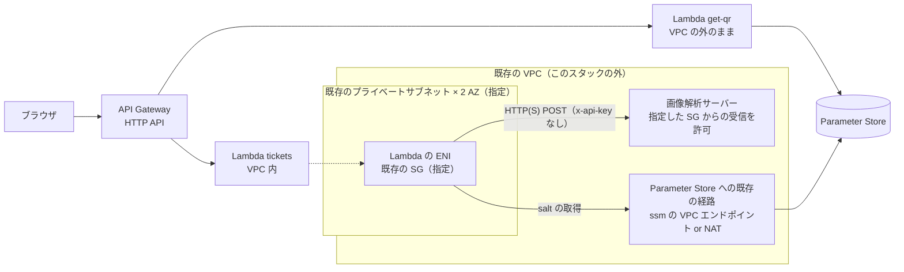
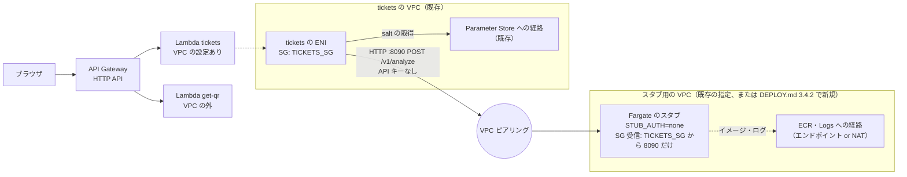

# 【構成案】Lambda を既存の VPC に置き、画像解析サーバーにセキュリティグループで接続する

> 2026-10-07。`api.yaml` に実装済み（パラメータ `VpcSubnetIds`・`VpcSecurityGroupIds`。同じテンプレートで、すべて VPC の外と、`tickets` だけ VPC 内の両方に対応）。デプロイ手順は [../go/DEPLOY.md](../go/DEPLOY.md)・[../node/DEPLOY.md](../node/DEPLOY.md) 4-A.4（手動は 4-B.4）。AWS 上では未検証。未確定事項（8章）が決まったら、内容を [../DESIGN.md](../DESIGN.md) 7章に移し、このファイルは削除する。

## 1. 前提

- 本番の画像解析サーバーは、AWS 上の既存の VPC にあり、**特定のセキュリティグループからのアクセスだけを許可する**
- その代わり、解析サーバーへの許可トークン（`x-api-key`）は使わない想定
- API 側は対応済み: API キーは任意になった。`ANALYZER_API_KEY_PARAMETER_NAME`（CloudFormation の `AnalyzerApiKeyParameterName`）が空なら、`x-api-key` を付けずに送る（Go・Node とも）
- **VPC・サブネット・セキュリティグループは既存のもので、このスタックでは持たない**
  - VPC 内の既存の EC2・ECS からは、解析サーバーへの経路が既に運用されている
  - Lambda を置くサブネットと、Lambda に付けるセキュリティグループは、利用者が用意し、**デプロイのコマンドで ID を指定する**
  - このリポジトリのテンプレートは、VPC・サブネット・ルートテーブル・セキュリティグループ・VPC エンドポイントを作らず、変更もしない
- 今の Lambda は VPC の外にあり、解析サーバーのスタブ（Lambda の Function URL。インターネットに公開。API キーで制限）を呼んでいる

## 2. 全体の構成



| 要素 | 持ち主 | 内容 |
|---|---|---|
| VPC に置く Lambda | このスタック | **`tickets` だけ**（`POST /v1/tickets`・`/v1/tickets/qr-inline`・`GET /v1/tickets/{code}/view`）。解析サーバーを呼ぶのはチケット付与だけ |
| VPC の外のままの Lambda | このスタック | `get-qr`（QR 画像 API）。解析サーバーを呼ばないので、VPC に入れる理由がない。初期化で解析クライアントを作るが、接続は呼び出し時だけなので影響しない |
| 実行ロール | このスタック | VPC に置くとき、マネージドポリシー `AWSLambdaVPCAccessExecutionRole` を足す（ENI の作成・削除の権限） |
| サブネット | 既存（指定） | 3.1 の条件を満たすもの |
| セキュリティグループ | 既存（指定） | 解析サーバーが受信を許可している SG（3.2） |
| 解析サーバーへの経路 | 既存 | 既存の EC2・ECS と同じ経路を使う |
| Parameter Store への経路 | 既存 | `ssm` の VPC エンドポイントか NAT ゲートウェイ（4章） |

VPC に入れても変わらないこと:
- API Gateway から Lambda の呼び出し（Lambda サービス経由。VPC は関係しない）
- CloudWatch Logs への出力（Lambda サービスが送る。エンドポイントは要らない）
- SecureString の復号（`GetParameter` の `WithDecryption` は SSM 側で KMS を呼ぶので、`kms` への経路は要らない）

## 3. 用意してもらうもの

### 3.1 サブネットの条件

| 条件 | 理由 |
|---|---|
| 解析サーバーに届くルートがある（既存の ECS のタスクと同じサブネットか、同じルートテーブル） | 経路は既存のものを使う |
| **プライベートサブネット** | Lambda の ENI にはパブリック IP が付かない。パブリックサブネット（インターネットゲートウェイへのルート）に置いても、インターネットにも AWS の API にも出られない |
| 2つ以上の AZ | 1つの AZ の障害で発行が止まらないように |
| IP アドレスの空きがある | ENI は「サブネット × SG」ごとに共有されるので、使うのは数個。ただし枯渇していると関数の作成に失敗する |
| Parameter Store に届く（4章） | 起動時に署名の salt を読むため |

### 3.2 セキュリティグループの条件

| 条件 | 理由 |
|---|---|
| 解析サーバーの SG が、この SG からの受信（解析ポート）を許可している | 解析サーバーは SG でだけ許可する |
| 送信: 解析サーバーの解析ポートと、Parameter Store への経路（VPC エンドポイントなら 443）を許可している | 既定の「送信はすべて許可」のままなら満たす |
| `ssm` の VPC エンドポイントを使う場合、エンドポイントの SG が、この SG からの 443 を許可している | salt の取得 |
| 受信のルールは要らない | Lambda は受信の接続を受けない |

- 既存の ECS のタスクの SG をそのまま使うこともできるが、その SG に許可されているほかの接続先（データベースなど）にも Lambda から届くようになる。できれば **Lambda 用の SG を（既存の管理の中で）用意し、解析サーバーの SG にその受信を足す**方がよい
- SG はこのスタックの外にあるので、API のスタックを作り直しても ID は変わらず、解析サーバー側のルールも切れない

## 4. Parameter Store（署名の salt）への経路

VPC 内の `tickets` は、起動時に署名の salt を Parameter Store から読む（`SIGNING_SALT_PARAMETER_NAME`）。VPC の中からは、`ssm` の VPC エンドポイントか NAT ゲートウェイがないと AWS の API に届かない。どちらも既存のものを使う前提（このスタックでは作らない）。

既存の EC2 で SSM エージェント（Session Manager など）を使っていたり、ECS のタスクで Parameter Store・Secrets Manager を使っていたりすれば、どちらかが既にある可能性が高い。確かめ方:

```sh
# 既存の ssm エンドポイント（あれば、その SG が Lambda の SG からの 443 を許可しているか確かめる）
aws ec2 describe-vpc-endpoints --filters Name=vpc-id,Values=$VPC_ID Name=service-name,Values=com.amazonaws.$AWS_REGION.ssm \
  --query 'VpcEndpoints[].{id:VpcEndpointId,sg:Groups[].GroupId,subnets:SubnetIds,privateDns:PrivateDnsEnabled}'
# 用意したサブネットのルートテーブルに NAT ゲートウェイへのルートがあるか
aws ec2 describe-route-tables --filters Name=association.subnet-id,Values=$SUBNET_A,$SUBNET_B \
  --query 'RouteTables[].Routes[?NatGatewayId].[DestinationCidrBlock,NatGatewayId]'
```

- どちらもなければ、VPC の管理者に `ssm` のインターフェイス型エンドポイント（プライベート DNS を有効。2 AZ で月 約 $20 + データ量）を作ってもらう
- salt を環境変数に入れる案は採らない（平文の秘密情報は `APP_ENV=local` のときだけという方針に反する）

## 5. `api.yaml` の変更（実装済み）

VPC の設定は任意にする。指定しなければ、今と同じく VPC の外（開発・スタブ用の環境はこれまでどおり）。

| パラメータ | 既定 | 内容 |
|---|---|---|
| `VpcSubnetIds` | 空 | `tickets` を置く既存のサブネットの ID（カンマ区切り）。空なら VPC の外 |
| `VpcSecurityGroupIds` | 空 | `tickets` に付ける既存の SG の ID（カンマ区切り。通常は1つ）。`VpcSubnetIds` を指定したときは必須（指定しないと、関数の更新で Lambda がエラーを返し、スタックがロールバックする） |

```yaml
Parameters:
  VpcSubnetIds:
    Type: CommaDelimitedList
    Default: ""
    Description: Optional. Existing private subnets for the tickets function (2+ AZs). Empty = outside any VPC.
  VpcSecurityGroupIds:
    Type: CommaDelimitedList
    Default: ""
    Description: Existing security groups for the tickets function (the analyzer admits them). Required with VpcSubnetIds.
Conditions:
  InVpc: !Not [!Equals [!Join ["", !Ref VpcSubnetIds], ""]]
Resources:
  FunctionRole:
    Properties:
      ManagedPolicyArns:
        - !Sub arn:${AWS::Partition}:iam::aws:policy/service-role/AWSLambdaBasicExecutionRole
        - !If [InVpc, !Sub "arn:${AWS::Partition}:iam::aws:policy/service-role/AWSLambdaVPCAccessExecutionRole", !Ref AWS::NoValue]
  TicketsFunction:
    Properties:
      VpcConfig: !If
        - InVpc
        - SubnetIds: !Ref VpcSubnetIds
          SecurityGroupIds: !Ref VpcSecurityGroupIds
        - !Ref AWS::NoValue
```

- `get-qr` は同じ実行ロールを使うので ENI の権限も付くが、`VpcConfig` がなければ使われない（気になるなら、ロールを分ける）
- 型を `List<AWS::EC2::Subnet::Id>` にすると存在の確認をしてくれるが、空を既定にできないので `CommaDelimitedList` にする

## 6. デプロイ

1. 確認・用意する
   - 解析サーバー側: 解析サーバーの接続先（既存の EC2・ECS が使っているものと同じ URL・ポート、HTTP / HTTPS）と、受信を許可している SG
   - 利用者: サブネット（3.1）、SG（3.2）、Parameter Store への経路（4章）
2. `api.yaml` を、サブネットと SG の ID を指定してデプロイする
3. 発行して確かめる。つながらないときは API が 502 / 504（`ANALYSIS_UPSTREAM_ERROR` / `ANALYSIS_TIMEOUT`）を返し、ログに原因が出る。salt が読めないときは、起動に失敗する（Lambda の初期化エラー。経路がないとタイムアウトになる）

```sh
SUBNET_A=subnet-aaaaaaaa               # 用意した既存のプライベートサブネット（AZ a）
SUBNET_B=subnet-bbbbbbbb               # 用意した既存のプライベートサブネット（AZ c）
LAMBDA_SG=sg-xxxxxxxx                  # 用意した既存の SG（解析サーバーが受信を許可しているもの）
ANALYZER_URL=https://analyzer.internal.example/v1/analyze   # 既存の EC2・ECS と同じ接続先

aws cloudformation deploy \
  --stack-name ticketqr-$IMPL \
  --template-file infra/cloudformation/api.yaml \
  --capabilities CAPABILITY_IAM \
  --parameter-overrides \
    Impl=$IMPL \
    ArtifactBucket=$ARTIFACT_BUCKET \
    ArtifactPrefix=$ARTIFACT_PREFIX \
    SigningSaltParameterName=$SALT_PARAM \
    AnalyzerMode=http \
    AnalyzerUrl=$ANALYZER_URL \
    VpcSubnetIds=$SUBNET_A,$SUBNET_B \
    VpcSecurityGroupIds=$LAMBDA_SG
```

- `AnalyzerApiKeyParameterName` は指定しない（既定の空 = API キーなし）
- `aws cloudformation deploy` は、指定しなかったパラメータを既定値に戻す。`VpcSubnetIds` を付け忘れると、`tickets` が VPC の外に戻り、解析サーバーに届かなくなる（502 / 504）。毎回指定する

## 6.5 Lambda・VPC・ALB の関係と、確認用の全体の構成

### 6.5.1 部品ごとの動かし方（2026-10-08 時点）

| 部品 | 動かし方 | VPC | 状態 |
|---|---|---|---|
| チケット API の `tickets` | Lambda | VPC 内（`VpcSubnetIds`・`VpcSecurityGroupIds` を指定したとき） | 実装済み（go/node DEPLOY.md 4-A.4 / 4-B.4） |
| チケット API の `get-qr` | Lambda | VPC の外のまま | 実装済み |
| スタブ（Function URL 版） | Lambda | VPC の外（インターネットに公開。API キーで制限） | 実装済み（../DEPLOY.md 3.1〜3.3） |
| スタブ（VPC 版） | ECS Fargate（コンテナ） | VPC 内（プライベートサブネット。VPC エンドポイントか NAT） | 実装済み（../DEPLOY.md 3.4、`analyzer-stub/vpc-template.yaml`） |
| スタブ（内部向け ALB + Lambda） | Lambda | ALB だけが VPC 内 | 実装しない（ALB から Lambda に渡せるボディが 1MB まで、ALB の時間課金。../notes/analyzer-stub-vpc.md） |

### 6.5.2 ALB が要るかどうか

ALB が要るかどうかは、**誰がどう呼ぶか**で決まる。Lambda を VPC に置くこと自体には、ALB は要らない。

| | `tickets`（チケット API） | VPC 版のスタブ |
|---|---|---|
| 呼び出す側 | API Gateway（利用者のブラウザから） | `tickets`（VPC 内から HTTP で） |
| 呼び出し方 | API Gateway が Lambda のサービスを通して呼ぶ。VPC のネットワークは通らない | VPC 内の IP とポート（`http://{IP}:8090`）に HTTP で送る |
| 受ける側に要るもの | なし（Lambda のままでよい） | VPC 内の IP と SG を持つ受け口（Fargate のタスク、または ALB + Lambda） |
| VPC に置く目的 | `tickets` から外への通信（解析サーバーへ）を VPC 経由にするため | 受信を SG で絞るため |

- Lambda の VPC の設定が変えるのは、**Lambda から外への通信だけ**。呼び出される側（API Gateway から）は変わらない
- Lambda は単体では VPC 内の受け口（IP と SG）を持てない。VPC 内から HTTP で呼ばれる側を Lambda にしたいときだけ、前に ALB（など）が要る
- 確認用の構成では、受ける側のスタブを Fargate にしたので、**ALB はどこにも要らない**

### 6.5.3 確認用の全体の構成

本番の想定（`tickets` の Lambda → VPC 内の解析サーバー。2章）を、「Lambda（`tickets`、既存の VPC）→ Fargate のスタブ（スタブ用の VPC）」で再現する。



| 要るもの | 置き場所 | 手順 |
|---|---|---|
| `tickets` を置くサブネット（Parameter Store に届く） | `tickets` の VPC（既存） | 3章・4章 |
| スタブ（Fargate）とその外向きの経路 | スタブ用の VPC | ../DEPLOY.md 3.4.2〜3.4.5 |
| ピアリングとルート（両方向とも、サブネットの CIDR だけ） | 両方の VPC | ../DEPLOY.md 3.4.2 の手順 4 |
| スタブの SG の送信元に `tickets` の SG | スタブのスタック | ../DEPLOY.md 3.4.3（`AllowedSourceSecurityGroupId`） |
| `tickets` の `AnalyzerUrl` をスタブの IP に | API のスタック | go/node DEPLOY.md 4-A.4（タスクを起動するたび） |

- スタブ用の VPC（3.4.2 で新規に作るもの）には Parameter Store への経路がないので、`tickets` はそこに置かない。`tickets` は Parameter Store に届く既存の VPC に置き、ピアリングでつなぐ

## 7. 注意すること

| 項目 | 内容 |
|---|---|
| コールドスタート | 今の Lambda の VPC 接続（Hyperplane ENI）では、呼び出しごとの遅れはほぼない。ENI は関数の作成・設定の変更のときに作られる |
| デプロイ・削除が遅くなる | 関数の作成・VPC 設定の変更のあと、ENI ができるまで関数が `Pending` になる（数十秒〜数分）。スタックの削除では、ENI の解放に時間がかかる（数十分かかることがある）。その間、指定したサブネット・SG は削除できない |
| 既存の SG の変更の影響 | SG はこのスタックの外にあるので、SG のルールの変更（解析サーバー側・VPC の管理者側）で、デプロイなしに発行が止まることがある。SG の持ち主と、変更の連絡の仕方を決めておく |
| スタブが使えなくなる | VPC 内の Lambda からは、インターネットに公開したスタブ（Function URL）に届かない（NAT がない場合）。開発・スタブ用の環境は、`VpcSubnetIds` を空にして VPC の外のまま使う |
| E2E | 影響しない（compose の模擬環境は `ANALYZER_MODE=mock`。VPC は再現しない）。AWS 上の E2E（CD_CI.md 0.5 の E2）で本物の解析サーバーにつなぐなら、その環境も VPC 内に置く |
| 防御の重ね方 | SG だけで許可するので、SG の設定ミスがそのまま穴になる。必要なら、API キーを残す（任意の設定なので、指定すれば今までどおり付く）か、VPC 内でも HTTPS にする |
| 予約済みの同時実行数（`GrantReservedConcurrency`） | 今までどおり、解析サーバーを守るために使う（VPC の有無に関係しない） |

## 8. 決めること

決まったこと:
- VPC・サブネット・SG は既存のものを使い、このスタックでは持たない。ID はデプロイのコマンドで指定する
- 解析サーバーへの経路は、既存の EC2・ECS で運用済みのものを使う
- 解析サーバーへの API キーは使わない（任意の設定として残す）

未確定:
1. 解析サーバーの接続先（URL・ポート・HTTP / HTTPS）
2. Lambda に付ける SG: Lambda 用に用意するか、既存の ECS の SG を使うか（3.2。Lambda 用を推奨）
3. Parameter Store への経路: 既存の `ssm` のエンドポイントか NAT ゲートウェイがあるか（4章）
4. `tickets` だけを VPC に入れるか（推奨）、`get-qr` も入れるか
