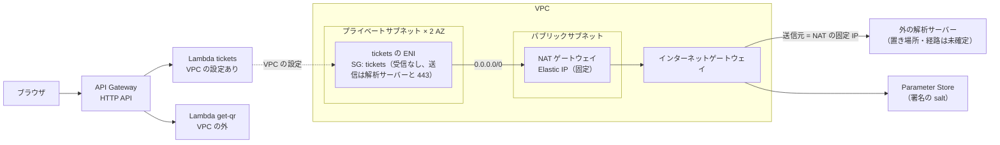
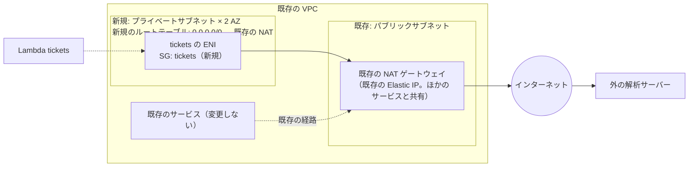
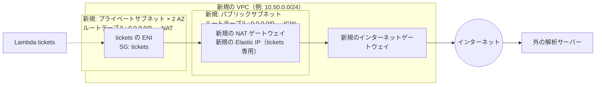

# 【構成案】チケット API の `tickets` をプライベートサブネットに置き、NAT ゲートウェイ経由で外の解析サーバーにつなぐ

> 一時ドキュメント（2026-10-08）。ネットワークの CloudFormation のテンプレートは 4.1（2パターン。未検証）。構成が決まったら、内容を [../DESIGN.md](../DESIGN.md) 7章と、テンプレート・手順書（SAM への移行と合わせて）に反映し、このファイルは削除する。それまでの検討（解析サーバーが VPC 内で SG の参照で許可する前提）は [lambda-vpc.md](lambda-vpc.md)。

## 1. 決まっていること・決まっていないこと

| 項目 | 状態 | 内容 |
|---|---|---|
| `tickets`（Lambda）の置き場所 | **確定** | VPC の**プライベートサブネット**に置く（VPC の設定を付ける） |
| 外への出口 | **確定** | プライベートサブネットのルートテーブルの `0.0.0.0/0` を **NAT ゲートウェイ**に向け、外の解析サーバーへは NAT を通して出る。解析サーバーから見える送信元は、NAT の**固定の IP（Elastic IP）** |
| 解析サーバーの置き場所と、そこまでのルーティング | **未確定** | インターネット上か、オンプレミス（VPN / Direct Connect の先）か、別の VPC（ピアリング / Transit Gateway）かなど。許可の方式（送信元の IP か、ほかか）も未確定 |
| VPC・サブネット・NAT を既存にするか新規にするか | 検討中 | 2パターン（3章） |
| `get-qr`（QR 画像 API）・API Gateway・Web | 変更なし | VPC の外のまま（解析サーバーを呼ばないため） |

- 解析サーバーへの経路が「インターネット経由（NAT の固定 IP で許可）」なら、この構成でそのままつながる。オンプレミスや別の VPC に**プライベートな経路**（VPN・Direct Connect・ピアリング・Transit Gateway）で届く場所なら、NAT ではなく、その経路へのルートをサブネットのルートテーブルに足すことになる（5章）
- スタブ（../DEPLOY.md 3.4）は、パブリックサブネットに置き、許可した IP からだけ受け付ける。`tickets` からスタブを呼ぶときは、スタブの `AllowedSourceCidr` に、この構成の NAT の固定 IP（`/32`）を指定する

## 2. 共通の構成



| 要素 | 内容 |
|---|---|
| `tickets` の VPC の設定 | `api.yaml` の既存のパラメータ `VpcSubnetIds`（プライベートサブネット）・`VpcSecurityGroupIds`（`tickets` の SG）で指定する（実装済み。go/node DEPLOY.md 4-A.4）。SAM に移すときも同じ設定を引き継ぐ |
| プライベートサブネット | **2つの AZ** に1つずつ（Lambda は、指定したサブネットの AZ に ENI を作る。1つの AZ だけだと、その AZ の障害で発行が止まる）。ルートテーブルの `0.0.0.0/0` を NAT ゲートウェイに向ける。IP の数は少なくてよい（Lambda の ENI は「サブネット × SG」ごとに共有される。例: `/26` で足りる） |
| `tickets` の SG | 受信: なし。送信: 解析サーバーのポート（未確定。HTTPS なら 443）と、Parameter Store への 443。宛先が決まるまでは `0.0.0.0/0` への 443（と解析サーバーのポート） |
| Parameter Store（署名の salt）への経路 | NAT 経由でそのまま届く（VPC エンドポイントは要らない）。NAT の通信量を減らしたい・インターネットに出したくない場合は、`ssm` のインターフェイス型エンドポイントを足す（時間課金） |
| CloudWatch Logs | Lambda サービスが送るので、VPC の経路は使わない |
| 実行ロール | `AWSLambdaVPCAccessExecutionRole`（ENI の作成・削除。`api.yaml` は VPC の設定があるときだけ付ける。実装済み） |
| 解析サーバーの許可 | 送信元の IP で許可する場合は、NAT の Elastic IP を解析サーバー側に登録してもらう |

## 3. 2つのパターン

### 3.1 比較

| 観点 | **N1: 既存の VPC + 新規のプライベートサブネット + 既存の NAT ゲートウェイ** | **N2: VPC・プライベートサブネット・NAT ゲートウェイをすべて新規** |
|---|---|---|
| 新しく作るもの | プライベートサブネット 2つ、ルートテーブル（`0.0.0.0/0` → 既存の NAT）、`tickets` の SG | VPC、プライベートサブネット 2つ、パブリックサブネット（NAT 用）、インターネットゲートウェイ、NAT ゲートウェイ、Elastic IP、ルートテーブル、`tickets` の SG |
| 既存の環境への変更 | 既存の VPC の中にサブネットとルートテーブルを足す（既存のサブネット・ルートテーブル・NAT の設定は変えない） | なし |
| 解析サーバーから見える送信元の IP | 既存の NAT の Elastic IP（**ほかのサービスと共有**。解析サーバー側で許可すると、同じ NAT を使うほかのサービスからも届く） | 新しい NAT の Elastic IP（**`tickets` 専用**。許可の範囲を `tickets` だけに絞れる） |
| 時間課金（東京の目安） | 追加なし（既存の NAT の通信量の課金だけ増える） | NAT 1つで 約 $0.062/時間（月 約 $45）+ Elastic IP 約 $0.005/時間（月 約 $3.6）。AZ ごとに NAT を置くと倍 |
| データ処理の課金 | 既存の NAT の通信量に加算（約 $0.062/GB） | 新しい NAT で 約 $0.062/GB |
| 可用性 | 既存の NAT の置き方による（1つの AZ にしかない場合、その AZ の障害で外に出られない。別の AZ のサブネットからの通信は AZ をまたぐ転送の課金がかかる） | NAT を 1つにするか、AZ ごとに置くかを選べる（費用とのトレードオフ） |
| 確認すること | VPC に空いている CIDR があるか、既存の NAT の ID と AZ、既存の NAT を使ってよいか（持ち主の了承）、NAT の Elastic IP を解析サーバー側に登録してよいか | VPC の CIDR（解析サーバーへの経路がプライベートになる場合に、相手と重ならないもの）、NAT の数（1つ / AZ ごと） |
| 向いている場合 | 納入先の VPC と NAT が既にあり、その固定 IP が解析サーバー側で既に許可されている（または登録できる） | 既存の環境に手を入れたくない、送信元の IP を `tickets` 専用にしたい、テスト用の環境を丸ごと作って消したい |

### 3.2 N1: 既存の VPC + 新規のプライベートサブネット + 既存の NAT ゲートウェイ



- 新しく作るルートテーブルは、新しいプライベートサブネットにだけ関連付ける（既存のルートテーブルは変えない）
- 既存の NAT が AZ ごとにあるなら、各サブネットのルートテーブルを同じ AZ の NAT に向ける（AZ をまたぐ転送の課金と、AZ の障害の影響を避ける）。1つしかないなら、両方のサブネットをその NAT に向ける
- 既存の NAT の Elastic IP が、解析サーバー側で既に許可されているなら、追加の登録は要らない

### 3.3 N2: VPC・プライベートサブネット・NAT ゲートウェイをすべて新規



- NAT は 1つ（費用を抑える）か、AZ ごとに 1つ（AZ の障害に強い）かを選ぶ。NAT が 1つのとき、もう一方の AZ のサブネットからの通信は AZ をまたぐ（転送の課金がかかり、NAT の AZ の障害で外に出られない）
- すべて新規なので、CloudFormation（または SAM / CDK）の1つのスタックで作って消せる。テスト用に、使うときだけ作る運用もできる（NAT の時間課金を抑える）
- 解析サーバーへの経路が将来プライベート（VPN・Transit Gateway など）になる場合に備えて、VPC の CIDR は相手のネットワークと重ならないものにしておく

## 4. どこで作るか（SAM への移行との関係）

| 対象 | N1 | N2 |
|---|---|---|
| ネットワーク（サブネット・ルートテーブル・SG、N2 は VPC・NAT なども） | ネットワーク用の小さなスタック（既存の VPC と NAT の ID をパラメータで受け取る） | ネットワーク用のスタック（すべて作る） |
| `tickets`（Lambda）の VPC の設定 | API のスタック（SAM。`infra/sam/{go,node}/template.yaml`、../infra/sam/README.md）に、ネットワークのスタックの出力（サブネット・SG の ID）を渡す | 同左 |

- ネットワークは API のスタックと分ける（API を作り直してもサブネット・SG・NAT の固定 IP が変わらないように。解析サーバー側に登録した IP が変わると、つながらなくなる）
- API 側の受け口（`VpcSubnetIds`・`VpcSecurityGroupIds`）は、今の `api.yaml` に実装済み。SAM に移すときも同じパラメータにする

### 4.1 テンプレート（CloudFormation。2026-10-08 作成、AWS 上では未検証）

ネットワークは事前に CloudFormation で作り、Lambda のビルドと登録だけを SAM で行う。ネットワークのスタックは1つ（Go 版・Node 版の API で共用できる）。

| パターン | テンプレート | 作るもの | 主なパラメータ | 出力（API のスタックに渡す） |
|---|---|---|---|---|
| N1 | `infra/cloudformation/tickets-network-existing-vpc.yaml` | プライベートサブネット 2つ、それぞれのルートテーブル（`0.0.0.0/0` → 既存の NAT）、`tickets` の SG | `VpcId`、`PrivateSubnetCidrA` / `B`、`AvailabilityZoneA` / `B`、`NatGatewayIdA`（`B` は任意。空なら A を共用）、`AnalyzerPort`・`AnalyzerCidr` | `PrivateSubnetIds`、`SecurityGroupId`、`NatGatewayIds` |
| N2 | `infra/cloudformation/tickets-network-new-vpc.yaml` | VPC、インターネットゲートウェイ、パブリックサブネット（NAT 用）、NAT ゲートウェイと Elastic IP、プライベートサブネット 2つとルートテーブル、`tickets` の SG | `VpcCidr` と各サブネットの CIDR（既定 `10.50.0.0/24` を分割）、`NatPerAz`（`false`: NAT 1つ / `true`: AZ ごと）、`AnalyzerPort`・`AnalyzerCidr` | `PrivateSubnetIds`、`SecurityGroupId`、`NatPublicIps`（解析サーバーに登録する固定 IP） |

共通:
- `tickets` の SG: 受信なし。送信は 443 を `0.0.0.0/0` へ（Parameter Store と、HTTPS の解析サーバー）。解析サーバーのポートが 443 でない場合は、`AnalyzerPort`（と、分かれば `AnalyzerCidr`）を指定すると、その送信ルールを足す
- 既存の VPC（N1）では、既存のサブネット・ルートテーブル・NAT は変えない（新しいサブネットに、新しいルートテーブルを関連付ける）

デプロイの例:

```sh
# N1: 既存の VPC + 新規のプライベートサブネット + 既存の NAT
aws cloudformation deploy --stack-name ticketqr-tickets-network \
  --template-file infra/cloudformation/tickets-network-existing-vpc.yaml \
  --parameter-overrides \
    VpcId=vpc-xxxxxxxx \
    PrivateSubnetCidrA=10.0.20.0/26 \
    PrivateSubnetCidrB=10.0.20.64/26 \
    AvailabilityZoneA=ap-northeast-1a \
    AvailabilityZoneB=ap-northeast-1c \
    NatGatewayIdA=nat-aaaaaaaa \
    NatGatewayIdB=nat-cccccccc

# N2: すべて新規（NAT は 1つ。AZ ごとにするなら NatPerAz=true）
aws cloudformation deploy --stack-name ticketqr-tickets-network \
  --template-file infra/cloudformation/tickets-network-new-vpc.yaml \
  --parameter-overrides NatPerAz=false

# 出力（API のスタックの VpcSubnetIds・VpcSecurityGroupIds に渡す）
aws cloudformation describe-stacks --stack-name ticketqr-tickets-network --query "Stacks[0].Outputs"
```

- N1 で、既存の NAT の固定 IP（解析サーバーに登録する送信元）を確かめる: `aws ec2 describe-nat-gateways --nat-gateway-ids nat-aaaaaaaa --query "NatGateways[].NatGatewayAddresses[].PublicIp"`
- N2 の NAT ゲートウェイと Elastic IP は、スタックがある間ずっと時間課金がかかる（NAT 1つで月 約 $45 + 約 $3.6）。テスト用に使うときだけ作る場合は、API のスタックの VPC の設定を外してから（または API のスタックを消してから）、このスタックを消す（Lambda の ENI が残っていると、サブネットと SG を消せない）
- 削除: `aws cloudformation delete-stack --stack-name ticketqr-tickets-network`

## 5. 解析サーバーの置き場所ごとの、追加で要るもの（未確定のため参考）

| 解析サーバーの置き場所 | 経路 | この構成への追加 |
|---|---|---|
| インターネット上（送信元の IP で許可） | NAT → インターネット | なし（NAT の固定 IP を登録してもらう） |
| 別の VPC（同じリージョン） | ピアリング / Transit Gateway | プライベートサブネットのルートテーブルに、相手の CIDR へのルートを足す（NAT は Parameter Store などのために残る）。CIDR の重なりに注意 |
| オンプレミス | Site-to-Site VPN / Direct Connect（仮想プライベートゲートウェイ / Transit Gateway） | 同上（相手の CIDR へのルート）。送信元は `tickets` の ENI のプライベート IP になる（NAT の固定 IP ではない） |
| PrivateLink で公開されている | インターフェイス型 VPC エンドポイント | エンドポイントを VPC に作る（時間課金）。接続先の名前はエンドポイントの DNS |

## 6. 決めること

1. N1 か N2 か
2. N1 の場合: 使う VPC、空いている CIDR、既存の NAT の ID と AZ、その NAT を使ってよいか、その Elastic IP を解析サーバー側に登録してよいか
3. N2 の場合: VPC の CIDR、NAT の数（1つ / AZ ごと）、常時置くか使うときだけ作るか
4. 解析サーバーの置き場所・経路・許可の方式（5章）、ポートと HTTP / HTTPS（`tickets` の SG の送信ルールに効く）
5. Parameter Store への経路を NAT のままにするか、`ssm` のエンドポイントを足すか
