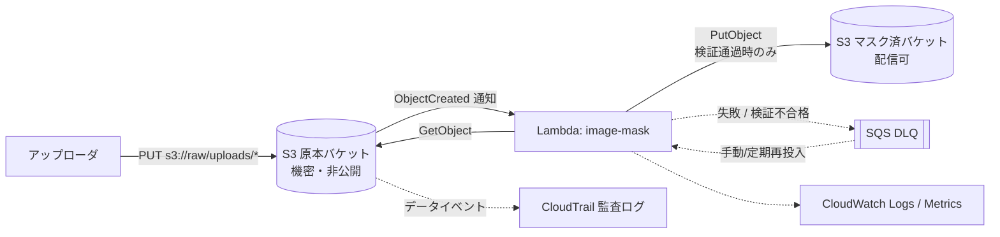

# S3 画像マスキング（ガウスぼかし）Lambda — 要件・設計書

- 版: 0.4 (draft)
- 更新日: 2026-09-10
- 確定事項: 用途は**マスキング** / 手段は**ガウスぼかし** / 対象は**画像上半分の固定矩形**（検出処理なし）/ IaC は **AWS SAM** / 実装言語は **Go**
- ステータス: 実装済み（§15 に実装状況、未実装項目を明記）。未決事項 §17

---

## 1. 目的とゴール

S3 に置かれた画像に対してぼかし処理を適用し、**元の情報が復元できない状態**にした画像を S3 に保存するサーバーレス処理を構築する。

用途はマスキング（個人情報・機密情報の不可視化）であり、単なる見た目の加工ではない。したがって本設計では以下を最優先の性質として扱う。

1. **復元困難性** — 出力画像から元情報が読み取れないこと。手段はガウスぼかしで確定しており、**半径を十分大きく取ること**で担保する（§12）
2. **fail-closed** — 処理に失敗したとき、未マスクの画像が出力側に絶対に現れないこと（§10.4）
3. **原本の隔離** — 原画像へのアクセスが最小権限かつ監査可能であること（§11）

処理性能・コストはこれらより優先度が低い。安全側に倒す判断を一貫して採る。

### ゴール
- サーバー運用なしで、投入量に応じて自動スケールする
- 1 枚あたりの処理を秒オーダーで完了する
- 失敗した入力を取りこぼさず、後追いで再処理できる
- マスク強度が要件を満たしていることを機械的に検証できる

---

## 2. スコープ

### In scope
- S3 オブジェクト作成イベントを起点とした非同期・単一画像処理
- **画像上半分の固定矩形**へのガウスぼかしによるマスキング（半径は画像寸法に対する比率で決定、§12）
- マスク領域の比率は設定で変更可能（既定 0.5 = 上半分、1.0 で全面）
- メタデータ（EXIF / GPS / 埋め込みサムネイル）の完全除去
- マスク強度の自己検証と fail-closed 制御
- 結果画像の S3 保存、監査ログ、エラー処理・再処理・監視、IaC

### Out of scope（今回作らない）
- 同期 API（API Gateway / Function URL 経由のオンデマンド変換）→ §16
- **検出処理**（Rekognition / OCR による顔・文字領域の自動検出）— 不要と確定。領域は固定矩形
- リサイズ・切り抜き等の一般的な画像加工
- 動画・アニメーション（APNG / animated GIF / animated WebP）
- WebP 形式（静止画も含め考慮外。JPEG / PNG のみ対応する）
- CDN 配信、署名付き URL 発行、認証認可を伴う画像配信

> マスク領域を固定にしたことで、検出漏れ（検出器が対象を見つけられず素通りする）という
> 最も危険な failure mode が原理的に発生しない。ただし「隠したいものが常に上半分にある」
> という入力側の前提に安全性が完全に依存する。この前提が崩れる入力が混ざると
> 何も検知されずに機密が露出するため、Q9 で運用上の担保を確認したい。

---

## 3. 前提・制約

| 項目 | 前提値 |
|---|---|
| 入力形式 | JPEG / PNG（静止画のみ。WebP は考慮外） |
| 入力サイズ上限 | 20 MB / 8000 × 8000 px（超過は明示的に失敗） |
| 想定流量 | 平常 1 req/s、ピーク 100 req/s のバースト |
| リージョン | 単一リージョン（東京 ap-northeast-1） |
| 遅延許容 | 非同期、投入から結果保存まで p95 10 秒以内 |
| 原画像の機密性 | **機密扱い**。アクセスは処理系のみ、監査対象 |

### 3.1 本設計が依存している想定

以下は「決めごと」ではなく「そうであるはず」という**想定**。崩れると設計が成立しない、
あるいは安全性が損なわれるため、実データで確認できていないものは印を付けて追跡する。

| # | 想定していること | 崩れた場合に起きること | 確認状況 |
|---|---|---|---|
| A1 | **隠したい情報は常に画像の上半分にある** | **無警告で機密が露出する**（検知手段がない） | **未確認（Q9）** |
| A2 | 入力は JPEG / PNG のみ | 非対応形式は全件 DLQ 行きになる | 確定（WebP は考慮外） |
| A3 | 1 枚 20 MB / 8000×8000 px 以内 | 上限超過は全件 DLQ 行き | 未確認（Q7） |
| A4 | ラプラシアン分散 5.0 が正常画像と異常画像を分離できる | 厳しすぎれば正常画像が DLQ に落ち、緩すぎれば弱いマスクが素通りする | **暫定値。要キャリブレーション（§14.1）**。合成画像では 0.05〜0.95 に収まっている |
| A5 | ぼかし半径 4%（短辺比）で内容が判別不能になる | マスクが不十分なまま出力される | 合成画像では確認済み。実データ未確認 |
| A6 | 原本バケットへの書き込みは信頼できる経路のみ | 悪意ある巨大画像・不正形式で処理系が消耗する | 未確認 |
| A7 | ピーク 100 req/s、月 10 万枚程度 | 予約同時実行 200 では捌けずスロットリング | 未確認（実測値なし） |
| A8 | 同一画像の再アップロードは稀 | 冪等スキップが効かず再処理コストが増える | 影響は軽微 |

A1 と A4 が実質的なリスク。**A1 は技術的な緩和策が存在しない**（固定矩形マスクの構造的な
限界であり、入力側の運用でしか担保できない）。A4 は §14.1 の手順で解消できる。

Lambda 側の物理制約（設計値の根拠）:
- タイムアウト上限 900 秒 / メモリ上限 10,240 MB / `/tmp` は 512 MB〜10,240 MB
- 非同期呼び出しのイベントペイロード上限 256 KB（画像本体は渡さず S3 キーのみ渡す）
- S3 イベント通知は **at-least-once**（重複配信あり得る → 冪等性が必須、§10.3）

---

## 4. 機能要件

| ID | 要件 | 受け入れ基準 |
|---|---|---|
| FR-1 | 入力バケットの指定プレフィックスに画像が PUT されたら自動で処理が開始される | PUT 後 10 秒以内に出力オブジェクトが存在する |
| FR-2 | **画像上半分の固定矩形**にガウスぼかしを適用する | 上半分がぼけ、下半分は 1 画素も変化しない（PNG 入力で画素完全一致を検証） |
| FR-2b | マスク領域の高さ比率を設定で変更できる | `MASK_HEIGHT_RATIO=0.25 / 1.0` で領域が変わり、境界直下が無変更である |
| FR-3 | マスク強度は**サーバー側ポリシーで決定**し、クライアントは弱められない | メタデータで小さい半径を指定しても、下限を下回らない |
| FR-4 | 出力キーは決定的な規約に従う | 同一入力・同一ポリシー版に対し常に同一の出力キーになる |
| FR-5 | 入力形式・寸法・サイズを検証し、不正な入力は加工せず失敗として記録する | 非対応形式の投入で DLQ に入り、理由が構造化ログに残る |
| FR-6 | EXIF Orientation を反映し、方向が正しい画像を出力する | 回転情報付き JPEG で見た目の向きが保たれる |
| FR-7 | 同一入力の重複配信・再実行で結果が壊れない（冪等） | 同じイベントを 2 回投げても出力が 1 つ、内容は同一 |
| FR-8 | 失敗した入力を後から再処理できる | DLQ からの再投入手順で処理が完了する |
| **FR-9** | **出力画像からすべてのメタデータを除去する** | 出力に EXIF / GPS / 埋め込みサムネイル / コメントが 1 バイトも残らない（`exiftool` で検証） |
| **FR-10** | **マスク強度を出力前に自己検証し、基準未達なら出力しない** | 検証不合格時に出力オブジェクトが作成されず、DLQ に入る |
| **FR-10b** | **強度検証はマスク領域のみを対象とする** | 鮮明な非マスク領域を含む正常画像が検証を通過する |
| **FR-11** | **原画像へのアクセスが監査ログに残る** | CloudTrail データイベントに `GetObject` が記録される |
| **FR-12** | **マスキングポリシーの版を出力に記録する** | 出力メタデータに `masking-policy-version` が入り、後から一括再処理の判断ができる |

---

## 5. 非機能要件

| 分類 | 要件 |
|---|---|
| **安全性** | **未マスク画像が出力バケットに出現しない（fail-closed）。違反はゼロ件であること** |
| **復元困難性** | **出力から元情報が読み取れない（§12.2 の脅威モデルに対して。残存リスクは §12.5 で受容）** |
| 性能 | 4000×3000 px JPEG を p95 3 秒以内で処理（メモリ 2048 MB 時） |
| スケール | 同時実行 100 まで即応。予約同時実行 200 を上限とする |
| 可用性 | Lambda / S3 のマネージド可用性に依拠。単一 AZ 障害で機能停止しない |
| 完全性 | 取りこぼしゼロ。3 回失敗した入力は必ず DLQ に残る |
| セキュリティ | 最小権限 IAM、SSE-KMS（CMK）、パブリックアクセス全面ブロック、監査ログ有効 |
| プライバシー | ログ・メトリクスに画像本体および画像内の個人情報を出力しない |
| コスト | 月 10 万枚で USD 15 以下（§13） |
| 可観測性 | 構造化 JSON ログ、カスタムメトリクス、失敗アラーム |
| 運用性 | すべて IaC（SAM）管理、再デプロイで環境再現可能 |

---

## 6. アーキテクチャ



### 6.1 構成要素

| 要素 | 内容 | 主な設定 |
|---|---|---|
| 原本バケット | 未マスクの原画像。**機密** | プレフィックス `uploads/`、バージョニング有効、SSE-KMS（専用 CMK）、パブリックアクセス全ブロック、CloudTrail データイベント有効、ライフサイクルで N 日後に削除（Q3） |
| マスク済バケット | 加工結果。**原本とは別バケット必須** | SSE-KMS、ライフサイクル（例: 90 日で IA） |
| Lambda | マスキング処理本体 | Python 3.13 / arm64 / メモリ 2048 MB / タイムアウト 60 秒 |
| DLQ | 失敗・検証不合格イベントの退避 | SQS 標準、保持 14 日、KMS 暗号化 |
| CloudWatch | ログ・メトリクス・アラーム | ログ保持 30 日 |
| CloudTrail | 原本バケットのデータイベント | 専用トレイル、ログ改変防止（Object Lock） |

**バケット分離は必須**（マスキング用途では特に）:
1. 原本と成果物で必要なアクセス権が真逆（原本は極小、成果物は配信）。同一バケットでは分離できない
2. 同一バケットだと出力の PUT が再度トリガして**再帰ループ**になる

同一バケット構成は採らない。加えてコード側でも「入力キーが出力プレフィックス配下なら即スキップ」のガードを置く（多重防御）。

### 6.2 起動方式の選択

S3 通知 → Lambda 直結（非同期呼び出し）を採用。

| 案 | 採否 | 理由 |
|---|---|---|
| S3 通知 → Lambda 直結 | ◯ 採用 | 最小構成。Lambda 標準の 2 回自動リトライ + DLQ で要件を満たす |
| S3 → SQS → Lambda | 将来検討 | 流量制御・バッチ処理が必要になった場合 |
| S3 → EventBridge → Lambda | 将来検討 | 複数コンシューマへのファンアウトが必要になった場合 |

---

## 7. 処理フロー（詳細）

1. イベント受信。`Records[]` をループ（通常 1 件だが複数前提で実装）
2. `bucket` / `key`（**URL デコード必須**、`+` はスペース）/ `eTag` / `size` を取得
3. **ループ防止ガード**: キーが出力プレフィックス配下 → スキップして正常終了
4. **検証(1)**: `size` が上限超過 → `ValidationError`
5. `HeadObject` でメタデータ取得（`Content-Type`、`eTag`）
6. **冪等性チェック**: 出力キーを `HeadObject`。存在し `source-etag` と `masking-policy-version` が一致 → スキップして正常終了
7. `GetObject`（`IfMatch=eTag` を付け、処理中の上書きと競合しないようにする）
8. **検証(2)**: Pillow でヘッダを開き実フォーマットと寸法を確認。`Image.MAX_IMAGE_PIXELS` で decompression bomb を防止
9. EXIF Orientation を適用（`ImageOps.exif_transpose`）
10. カラーモード正規化: `CMYK`/`P`/`LA` → `RGB` / `RGBA`（アルファは保持）
11. **マスキング適用**: 半径を `max(8, 短辺 × 0.04)` で算出。上半分の矩形 `(0,0,W,H×0.5)` を切り出してぼかし、元画像へ貼り戻す（§12.3）
12. **メタデータ除去**（FR-9）: 新規 `Image` オブジェクトに画素データのみコピー。EXIF / GPS / 埋め込みサムネイル / XMP / コメントを引き継がない。ICC profile も引き継がない（sRGB 前提で出力）
13. 元と同じ形式でエンコード（JPEG は quality 85 / progressive、PNG は optimize）
14. **マスク強度の自己検証**（§12.4、FR-10）。**不合格なら例外を投げてここで終了。PutObject は行わない**
15. `PutObject` でマスク済バケットへ出力。メタデータ付与（§8.3）
16. 構造化ログとカスタムメトリクスを出力して終了

すべてメモリ内（`BytesIO`）で処理し、`/tmp` は使わない。ディスクに原画像の痕跡を残さないためでもある。

---

## 8. インターフェース仕様

### 8.1 入力
- トリガ: `s3:ObjectCreated:*`、フィルタ `prefix=uploads/`
- 拡張子フィルタは通知側では 1 つしか指定できないため、**コード側で実フォーマットを判定**する（拡張子偽装対策）

### 8.2 出力キー規約（FR-4）

```
s3://<OUTPUT_BUCKET>/masked/<policy_version>/<入力キーからプレフィックスを除いた相対パス>
例) 入力: s3://raw/uploads/2026/09/doc.jpg   policy=v1
    出力: s3://masked/masked/v1/2026/09/doc.jpg
```

ポリシー版をキーに含めることで、マスキング強度を変更した際に古い成果物と衝突せず、新旧を並存させられる。

### 8.3 出力オブジェクトのメタデータ

| キー | 例 | 用途 |
|---|---|---|
| `x-amz-meta-source-bucket` | `raw-bucket` | 追跡 |
| `x-amz-meta-source-key` | `uploads/2026/09/doc.jpg` | 追跡 |
| `x-amz-meta-source-etag` | `d41d8c...` | 冪等性判定 |
| `x-amz-meta-masking-policy-version` | `v1` | 再処理判断（FR-12） |
| `x-amz-meta-blur-radius-px` | `120` | 実際に適用した半径（監査用） |
| `x-amz-meta-downscale-factor` | `1` | 実際に適用した縮小率（監査用、§12.3） |
| `x-amz-meta-strength-score` | `2.7` | 強度検証スコア（§12.4） |
| `x-amz-meta-mask-region` | `top 50% (0,0,4000,1500)` | 実際にマスクした領域（監査用） |

> 注: `source-key` にファイル名由来の個人情報が含まれる可能性がある。Q5 で扱いを確認する。

### 8.4 環境変数

| 名前 | 必須 | 既定 | 説明 |
|---|---|---|---|
| `OUTPUT_BUCKET` | ○ | — | 出力先バケット |
| `INPUT_PREFIX` | | `uploads/` | 入力プレフィックス |
| `OUTPUT_PREFIX` | | `masked/` | 出力プレフィックス |
| `MASKING_POLICY_VERSION` | | `v1` | ポリシー版（キーに反映） |
| `MASK_HEIGHT_RATIO` | | `0.5` | 上部からマスクする高さの比率。1.0 で全面（§12.3） |
| `MIN_BLUR_RATIO` | | `0.04` | ぼかし半径（短辺に対する比率、§12.1） |
| `MIN_BLUR_RADIUS_PX` | | `8` | ぼかし半径の絶対下限（小さい画像用） |
| `BLUR_PASSES` | | `2` | ボックスぼかしの重ね回数。2 未満は不可（§12.3） |
| `DOWNSCALE_FACTOR` | | `1` | 追加ハードニング用の縮小率。既定 1 = 無効（§12.3） |
| `MAX_ALLOWED_LAPLACIAN_VAR` | | `5.0` | 強度検証のラプラシアン分散上限（§12.4） |
| `MAX_INPUT_BYTES` | | `20971520` | 入力サイズ上限 |
| `MAX_INPUT_PIXELS` | | `64000000` | 総ピクセル数上限 |
| `JPEG_QUALITY` | | `85` | JPEG 出力品質 |
| `LOG_LEVEL` | | `INFO` | ログレベル |

---

## 9. 技術選定

| 項目 | 選定 | 理由 |
|---|---|---|
| ランタイム | **Go 1.24 / `provided.al2023`**（確定） | 単一バイナリで依存の同梱が不要。コールドスタートが小さい |
| 画像ライブラリ | **標準ライブラリのみ**（`image`, `image/jpeg`, `image/png`） | ぼかし・領域処理・EXIF 向き読み取りは自前実装（計 400 行程度）。信頼できない入力をパースするため、依存を増やさない方が脆弱性の管理面で有利 |
| ぼかしの実装 | **ボックスぼかし 3 回でガウス分布を近似** | 半径 120px 級では素朴な畳み込みが破綻する（4000×3000 で 10^10 オーダー）。近似なら半径によらず O(pixels) で、視覚的な差はない |
| アーキテクチャ | arm64 (Graviton2) | x86_64 比で概ね 20% 安く、画像処理でも性能同等以上 |
| パッケージング | 単一バイナリ（`bootstrap`）。Layer 不要 | `sam build`（`BuildMethod: go1.x`）でそのままビルドできる |
| **IaC** | **AWS SAM**（確定） | Lambda + S3 通知 + DLQ + IAM を最短で記述できる。バケットポリシー・IAM の差分がレビュー可能になる点がマスキング用途で重要 |

### 9.0 パッケージ構成

マスキング処理は `internal/masking` に閉じ込め、S3 / Lambda に依存させない。
Lambda ハンドラとローカル CLI が同じコードを呼ぶため、手元で確認した挙動が
そのまま本番の挙動になる。しきい値（§12.4）のキャリブレーションも CLI で行う。

```
cmd/mask          … Lambda エントリポイント
cmd/maskfile      … ローカル実行 CLI（S3 不要）
cmd/gensample     … 動作確認・性能計測用のサンプル画像を生成
internal/handler  … S3 イベント処理（検証・冪等性・fail-closed）
internal/masking  … マスキング処理そのもの。上 2 つが共有する
internal/imaging  … ぼかし・領域切り出し・EXIF 向き補正・強度測定
internal/config   … 環境変数
internal/metrics  … EMF によるメトリクス出力
```

### 9.1 SAM テンプレートの構成（実装時の骨格）

```
template.yaml
├── Globals              … Runtime: python3.13 / Architectures: [arm64] / Timeout: 60 / MemorySize: 2048
├── RawBucket            … 原本バケット（暗号化・パブリックブロック・バージョニング・ライフサイクル）
├── MaskedBucket         … マスク済バケット
├── RawKey / MaskedKey   … KMS CMK（原本用・出力用で分離）
├── MaskFunction         … AWS::Serverless::Function
│   ├── Events: S3 (Bucket: RawBucket, Filter: prefix=uploads/)
│   ├── Policies: 最小権限をインラインで記述（§11.1）
│   ├── EventInvokeConfig: MaximumRetryAttempts=2 / OnFailure→DLQ
│   └── Layers: [PillowLayer]
├── PillowLayer          … AWS::Serverless::LayerVersion（aarch64 wheel を同梱）
├── DLQ                  … AWS::SQS::Queue
├── Trail                … CloudTrail データイベント（RawBucket）
└── Alarms               … §13 のアラーム群
```

`sam build && sam deploy --guided` でデプロイ。環境（dev/prod）はパラメータで切り替える。

**副次的な利点**: Go の標準エンコーダは EXIF / XMP を一切書き出さないため、
再エンコードした時点で FR-9（メタデータ完全除去）が構造的に満たされる。
Pillow のように「メタデータを引き継がないよう気をつける」必要がない。

**制限**: 対応形式は **JPEG / PNG のみ**。WebP は今回考慮外とし、検証エラーとして DLQ へ送る
（Go 標準ライブラリに WebP エンコーダがないため、対応するなら別形式での出力か cgo 依存の導入が要る）。

---

## 10. エラー処理・信頼性

### 10.1 エラー分類

| 分類 | 例 | 挙動 |
|---|---|---|
| 検証エラー（恒久） | 非対応形式、サイズ超過、寸法超過 | リトライしても直らない。ERROR ログ + メトリクス。**例外を投げて DLQ へ**（取りこぼし禁止のため成功扱いにしない） |
| **強度検証不合格** | マスク領域に高周波成分が残る | **出力せず** DLQ へ。要調査（半径算出またはパラメータの問題） |
| 一時エラー | S3 / KMS スロットリング、タイムアウト | 例外送出 → Lambda が自動リトライ（最大 2 回、間隔 1 分 / 2 分） |
| スキップ | 出力プレフィックス配下、既に処理済み | 正常終了（INFO ログ） |

### 10.2 リトライと DLQ
- 非同期呼び出しの `MaximumRetryAttempts=2`、`MaximumEventAgeInSeconds=3600`
- 失敗後の宛先（`OnFailure`）に SQS DLQ を設定。元イベントと失敗理由が入る
- DLQ に 1 件でも入ったらアラーム（§13）
- 再処理: DLQ から取り出して同一 Lambda に再投入するスクリプトを用意（冪等なので安全）

### 10.3 冪等性（FR-7）
出力キーが「入力キー + ポリシー版」から決定的に決まり、書き込み前に `source-etag` 一致で早期リターンする。競合して二重に書いても内容は同一なので last-writer-wins で問題ない。

### 10.4 fail-closed 設計（NFR 安全性）

マスキング用途では「処理が中途半端に成功する」ことが最大の事故になる。以下で担保する。

1. **PutObject は処理の最終ステップ**。強度検証（§12.4）を通過するまで出力バケットに一切書かない
2. **マルチパートアップロードを使わない**（20 MB 上限なので単一 PUT で足りる）。部分的に書かれた未完成オブジェクトが公開されない
3. **原本バケットと出力バケットで KMS キーを分ける**。原本キーへの権限を持つ主体を最小化する
4. **Lambda は出力バケットに対して `s3:GetObject` 権限を持たない**（書くだけ）
5. 出力バケットは Lambda 以外の書き込みを**バケットポリシーで拒否**する。原本が誤って出力バケットにコピーされる経路を塞ぐ
6. 例外時に握りつぶさない。`try/except` で広く捕まえて成功終了する実装を禁止（コードレビュー観点として明記）

---

## 11. セキュリティ・プライバシー

### 11.1 IAM 最小権限
- 原本バケット: `s3:GetObject`, `s3:GetObjectVersion` を `arn:.../uploads/*` に限定。`ListBucket` は付与しない
- 出力バケット: `s3:PutObject` を `arn:.../masked/*` に限定。`GetObject` / `DeleteObject` は付与しない
- KMS: 原本キーに `Decrypt` のみ、出力キーに `GenerateDataKey` / `Encrypt` のみ
- DLQ: `sqs:SendMessage`

### 11.2 バケット設定
- 両バケットとも `BlockPublicAcls` 等 4 項目すべて有効
- `aws:SecureTransport=false` を拒否するバケットポリシー
- SSE-KMS（**カスタマー管理キー、原本用と出力用で別キー**）
- 原本バケット: バージョニング有効 + ライフサイクルで N 日後に完全削除（Q3）。保持期間を短くすることが最も効果的な漏洩対策
- 出力バケット: Lambda 実行ロール以外の `PutObject` を拒否

### 11.3 監査（FR-11）
- **CloudTrail データイベント**を原本バケットに対して有効化。誰がいつ原画像を取得したかを記録
- S3 サーバーアクセスログも有効化（別バケットへ）
- 監査ログ保管先は Object Lock で改変防止
- ログ保持期間はコンプライアンス要件に合わせる（Q4）

### 11.4 ログのプライバシー
- ログに画像本体（バイト列・base64）を出力しない
- ログに出す S3 キーはファイル名部分をハッシュ化する選択肢を用意（Q5）
- 例外のスタックトレースに画像データが混入しないよう、例外メッセージに生データを含めない

### 11.5 脆弱性管理
信頼できない入力をパースするため、Pillow のパーサ脆弱性が直接のリスクになる。
- Pillow を常に最新に追随（Dependabot 等）
- CI に依存脆弱性スキャンを組み込む
- Lambda 実行環境は VPC 外（S3 と KMS のみアクセス）。万一のコード実行でも到達範囲を絞る

---

## 12. マスキング強度の設計 ★

**本設計の核。マスキング用途において最も重要なセクション。**

マスキング手段は**ガウスぼかしで確定**（用途上の決定）。したがって本セクションの目的は「ぼかしという手段の中で、どうすれば実用上十分な強度を確保できるか」を定めることにある。

### 12.1 強度を決める唯一の変数は「特徴サイズに対する半径」

ガウスぼかしの安全性は、**隠したい特徴（文字の線幅、顔のパーツ）の大きさに対して半径がどれだけ大きいか**でほぼ決まる。半径を絶対値で固定すると事故になる。

| 画像 | 半径 8 px の場合 |
|---|---|
| 400 × 300 px | 内容が判別できない（十分） |
| 8000 × 6000 px | **文字が普通に読める（マスクされていない）** |

したがって半径は**画像の短辺に対する比率**で算出する。

```
radius = max(MIN_BLUR_RADIUS_PX, min(W, H) × MIN_BLUR_RATIO)
既定: MIN_BLUR_RATIO = 0.04（短辺の 4%）、MIN_BLUR_RADIUS_PX = 8
例) 4000 × 3000 → radius = 120 px
    800 × 600   → radius = 24 px
    200 × 150   → radius = 8 px（下限）
```

4% は「画像全面をぼかして内容を判別不能にする」用途としては十分に強い設定。実データでのキャリブレーション手順は §14 の OCR テストで定める。

### 12.2 脅威モデル

想定する攻撃者: **マスク済画像を入手でき、隠された情報の候補集合や文脈を知っている**者。計算資源は潤沢。原本バケットへのアクセスは持たない。

ガウスぼかしは線形な畳み込みであり、原理上は逆畳み込み（deconvolution）である程度の復元が可能。ただしそれが**実際に成功するかは半径の大きさに強く依存**する。

| 条件 | 復元リスク |
|---|---|
| 半径が特徴サイズと同程度（小さい） | **高い**。文字が読めるレベルまで復元されうる |
| 半径が特徴サイズの数倍以上（本設計の 4%） | 低い。JPEG 量子化と 8bit 丸めで情報が失われ、実用的な復元は困難 |

本設計は後者の領域で運用することを強度要件とし、それを §12.4 の自己検証で機械的に保証する。

### 12.3 採用アルゴリズム（ポリシー v1）

```
入力画像 (W × H)
  ↓ ① EXIF Orientation 適用・カラーモード正規化
  ↓ ② radius = max(8, min(W,H) × 0.04) を算出
  ↓ ③ マスク領域を決定: region = (0, 0, W, round(H × MASK_HEIGHT_RATIO))
       検出処理は行わない。常に上部の固定矩形
  ↓ ④ region を切り出して GaussianBlur(radius) を適用し、元画像へ貼り戻す
  ↓ ⑤ メタデータを一切引き継がず再エンコード（§7 step 12、FR-9）
  ↓ ⑥ 強度自己検証（§12.4）— region のみを対象。不合格なら出力しない
出力画像 (W × H)  … 上半分だけがぼけている
```

**領域を切り出してからぼかす**理由: 画像全体をぼかしてから合成すると、境界付近で
マスク対象の画素が非マスク領域へにじみ出す。切り出した矩形内だけで畳み込むことで、
マスクすべき情報が境界を越えないことを保証する。

**マスク領域外には一切手を加えない。** 縮小・拡大を含むすべての処理は切り出した矩形の
中だけで行い、画像全体の縮小は行わない。非マスク領域は再エンコードを除いて画素単位で
不変であり、これはテストで固定している（PNG 入力で完全一致比較）。

#### ぼかしの実装とパス数（`BLUR_PASSES`）

ガウス分布はボックスぼかし（移動平均）の重ね掛けで近似する。重ねる回数が多いほど
真のガウス分布に近づき仕上がりが滑らかになるが、時間はほぼ回数に比例する。

| 回数 | 実質的な窓形状 | 用途 |
|---|---|---|
| 1 | 矩形窓 | **使用しない**（下記） |
| **2**（既定） | 三角窓 | マスキングにはこれで十分 |
| 3 | ほぼガウス | 見た目重視。既定より約 12% 遅い |

マスキングに必要なのは「情報を落とすこと」であって滑らかさではないため、既定を 2 回とする。
§13.2 の実測では 3 回から 2 回にすることで end-to-end 約 12% 短縮でき、マスク強度
（ラプラシアン分散）は変わらない。

**1 回は許可しない**（`BLUR_PASSES` の下限を 2 とする）。矩形窓の周波数応答は sinc 状で
ゼロ点と副ローブを持つため、特定の空間周波数の成分が減衰しきらずに残る。2 回重ねれば
副ローブが二乗されて十分小さくなる。処理時間の差は 1 枚あたり数十 ms であり、
この性質を引き換えにする価値はない。

**半径は領域の高さではなく画像全体の短辺から決める**。隠したい特徴（文字の線幅など）の
大きさは領域サイズではなく画像の解像度に比例するため。

**領域を固定にしたことの安全上の意味**: 検出器を使う設計では「検出漏れ = 無警告で機密が
露出」という failure mode が残るが、固定矩形ならそれが原理的に起こらない。代わりに
「隠したいものが常に上半分にある」という入力側の前提に依存する（Q9）。

#### オプション: 縮小による追加ハードニング（既定は無効）

より強い保証が必要になった場合の逃げ道として、縮小 → ぼかし → 拡大の経路を実装しておき、環境変数で切り替えられるようにする。

```
DOWNSCALE_FACTOR = 1   … 既定。ぼかしのみ（今回の確定仕様）
DOWNSCALE_FACTOR = N>1 … マスク領域を 1/N に縮小 → ぼかし → 領域の寸法へ戻す
```

**縮小もマスク領域の中だけで行う。画像全体を縮小することはない**（非マスク領域は不変）。

縮小はダウンサンプリングであり情報を物理的に破棄するため逆畳み込みでは戻せず、しかも処理する
ピクセル数が 1/N² になるため**高速でもある**（§13.2 の実測では factor=4 で end-to-end 約 2.8 倍速）。
ただし拡大時に N 画素単位の階段状の境目が出るため、仕上がりはぼかしというよりモザイクに近づく。

**既定は 1（無効）**とし、§14 の復元耐性テストで懸念が出た場合や、Q6 で一般公開が確定した場合にのみ
有効化を検討する。実装だけ先に入れておくことで、後からコード変更なしに強度を上げられる。

### 12.4 強度の自己検証（FR-10）

出力前に、ぼかしが実際に効いていることを機械的に確認する。**パラメータ設定ミスやコード変更で「実質マスクされていない画像」が流出する事故を構造的に防ぐための仕組み。**

- **指標**: 出力画像のラプラシアン分散（エッジ量の代表値）。値が小さいほどぼけている
- **対象**: **マスク領域のみ**（FR-10b）。画像全体で測ると、鮮明なままの非マスク領域に引きずられて正常な入力がすべて不合格になる
- **判定**: `laplacian_variance(マスク領域) <= MAX_ALLOWED_LAPLACIAN_VAR`（既定 5.0）なら合格
- **副指標**: `laplacian_variance(入力)` も算出し、低減率をメトリクスに出す（傾向監視）
- **不合格時**: **PutObject を行わず**例外を投げて DLQ へ（fail-closed、§10.4）
- 閾値は実データでキャリブレーションする（§14）。厳しすぎると正常画像が DLQ に落ちるため、リリース前に実画像 1,000 枚程度で分布を確認して決める

### 12.5 受容する残存リスク

ガウスぼかしという手段を選んだ結果として、以下のリスクが残る。用途上の決定として**受容**する。

| リスク | 緩和策 | 残存度 |
|---|---|---|
| 逆畳み込みによる部分復元 | 半径を短辺の 4% 以上に強制（§12.1）+ 強度自己検証（§12.4） | 低 |
| 候補照合攻撃（有限の候補集合を同じ半径でぼかして照合） | 同上。半径が大きいほど候補間の差が消え成立しにくくなる | 低〜中 |
| 半径のパラメータ誤設定 | 寸法比で自動算出（絶対値指定を許さない）+ 自己検証 | 極低 |
| **隠したい対象が下半分に写っている** | **なし（領域固定の構造的な限界）**。入力側の運用で担保するほかない（Q9） | **要確認** |
| EXIF 埋め込みサムネイル経由の原画像露出 | メタデータ完全除去（FR-9）を必須化・テストでブロッカー化 | 極低 |

補足: 上表の緩和策のうち **FR-9（メタデータ除去）は特に効く**。JPEG の EXIF には未加工の縮小プレビューが埋め込まれていることがあり、これが残ると本体をどれだけぼかしても意味がなくなる。ぼかしの強度以前に必ず落とす。

将来より強い保証が必要になった場合の選択肢は §12.3 のオプション（縮小の有効化）と、領域指定の柔軟化（§16）。

## 13. 監視・運用・コスト

### カスタムメトリクス（EMF で出力）
- `ImagesMasked`（Count）
- `ProcessingDurationMs`（Milliseconds）
- `ValidationErrors`（Count、理由を dimension に）
- **`StrengthCheckFailures`（Count）** — 0 であるべき値
- **`StrengthScore`（None）** — 傾向監視。徐々に上がっていたら劣化の兆候
- `InputBytes` / `OutputBytes`

### アラーム
| 名前 | 条件 | 重要度 |
|---|---|---|
| **`MaskStrengthCheckFailed`** | `StrengthCheckFailures` >= 1 | **Critical** |
| `MaskLambdaErrors` | `Errors` >= 1（5 分） | High |
| `MaskDLQNotEmpty` | `ApproximateNumberOfMessagesVisible` >= 1 | High |
| `MaskLambdaThrottles` | `Throttles` >= 1（5 分） | Medium |
| `MaskLambdaDurationP95` | p95 > 10,000 ms（15 分） | Medium |

- 構造化 JSON ログ（`requestId`, `sourceBucket`, `keyHash`, `radiusPx`, `strengthScore`, `durationMs`, `result`）
- X-Ray 有効化
- ポリシー変更時の運用: `MASKING_POLICY_VERSION` を上げて再デプロイ → 過去分は S3 Batch Operations で一括再処理

### 13.1 DLQ からの再処理手順

処理は冪等なので、DLQ のメッセージをそのまま関数へ再投入して問題ない。

```bash
# 1. 何が落ちているかを確認する（理由は requestContext / responsePayload に入る）
aws sqs receive-message --queue-url "$DLQ_URL" --max-number-of-messages 10 \
  | jq -r '.Messages[].Body | fromjson | {reason: .requestContext.condition, payload: .responsePayload}'

# 2. 原因を直す（パラメータ修正・デプロイなど）

# 3. 元イベントを取り出して再投入する
aws sqs receive-message --queue-url "$DLQ_URL" --max-number-of-messages 10 \
  | jq -c '.Messages[].Body | fromjson | .requestPayload' \
  | while read -r ev; do
      aws lambda invoke --function-name "$FUNCTION_NAME" \
        --invocation-type Event --payload "$ev" /dev/null
    done

# 4. 成功を確認してからメッセージを削除する
```

> **未実装**: この手順をまとめたスクリプトは用意していない（§15）。件数がまとまって出るように
> なったら `scripts/reprocess_dlq.sh` として実装する。

### 13.2 性能の実測値

ローカル（Apple Silicon / arm64）での実測。Lambda（arm64 2048 MB）では概ね 1.5〜2 倍
かかると見込む。**実環境での計測は未実施。**

#### 設定別の end-to-end 時間（`testdata/big.jpg` 4000 × 3000、マスク対象は上半分 4000 × 1500、半径 120px）

デコード〜ぼかし〜エンコードまでを含む。再現手順は §14.1。

| 設定 | 時間 | マスク領域のラプラシアン分散 | 備考 |
|---|---|---|---|
| passes=3, factor=1 | 303 ms | 0.0495 | |
| **passes=2, factor=1** | **268 ms** | **0.0494** | **採用（既定）**。約 12% 短縮 |
| passes=2, factor=4 | 203 ms | 0.0442 | 縮小併用。既定では無効 |

しきい値 5.0 に対していずれも 2 桁の余裕があり、パス数を 3 から 2 に減らしても
マスク強度は変わらない（0.049 で一致）。最適化後はぼかしの比重が下がったため、
パス数による差も当初の 24% から 12% に縮んでいる。

#### 内訳（4000 × 3000、passes=2, factor=1、合計 268 ms）

| 工程 | 時間 | 備考 |
|---|---|---|
| JPEG デコード | 95 ms | **削減不可**。画像全体を復号する必要がある |
| RGBA 化 | 22 ms | |
| 切り出し | 2 ms | |
| **ぼかし** | **86 ms** | 最適化前は 354 ms（§13.4） |
| 貼り戻し | 1 ms | |
| 強度検証 | 12 ms | |
| JPEG エンコード | 84 ms | **削減不可**（§13.4 で確認） |

デコードとエンコードで 179 ms、全体の約 67% を占める。JPEG を扱う以上ここは動かせない。

#### 画像別（passes=2, factor=1）

| 画像 | サイズ | 半径 | end-to-end | スコア |
|---|---|---|---|---|
| `person.jpg` | 1200 × 900 | 36 px | 25 ms | 0.166 |
| `idcard.jpg` | 1200 × 900 | 36 px | 26 ms | 0.952 |
| `big.jpg` | 4000 × 3000 | 120 px | 268 ms | 0.049 |

4000 × 3000 で Lambda 上 0.4〜0.6 秒程度と見積もる。NFR の「p95 3 秒以内」は満たす見込み。

### 13.4 計算量の最適化と、測って棄却した案

初期実装は 4000 × 3000 で 529 ms かかっていた。内訳を測って処理の重い順に潰した結果、
**268 ms（約 2 倍速）** になっている。

#### 採用したもの

| 施策 | 効果 | 内容 |
|---|---|---|
| **ぼかしを整数の移動窓に** | ぼかし 354 → 86 ms | float32 に展開して行ごとに float64 の累積和を作っていたのをやめ、8bit のまま窓を 1 画素ずつ滑らせて加減算する。変換もメモリ帯域も要らない |
| **垂直方向を行走査に** | 上に含む | 列ごとに走査するとキャッシュミスだらけになるため、列の合計を保持したまま行を上から下へ舐める |
| **不透明ならアルファを畳み込まない** | ぼかし −25% | JPEG は常に不透明。処理チャンネルが 4 → 3 になる |
| **輝度計算の整数化** | 強度検証 23 → 12 ms | 固定小数で計算し、中間バッファの確保をなくす |
| ぼかしのパス数 3 → 2 | 約 12% | §12.3 |

> 整数化により各工程で丸め誤差が乗り、強度スコアの実測値は最適化前より
> 高めに出る（`idcard.jpg` で 0.41 → 0.95）。量子化ノイズは分散に加算される
> ため**必ず大きい方向**に動く。つまり「マスク不足を見逃す」方向には振れない。
> しきい値 5.0 に対しては依然 1 桁以上の余裕がある。

#### 測ったうえで棄却したもの

| 案 | 結果 | 棄却理由 |
|---|---|---|
| **YCbCr のまま符号化**（RGBA への変換を省く） | 110 ms → 109 ms | **効果なし**。Go の実装ではエンコード時間は色変換ではなく DCT と符号化が支配的だった |
| **強度検証の標本を間引く** | 12 ms → 1 ms | **危険**。周期的な模様（布地・網点）と標本格子が干渉し、分散を数分の 1 に見積もることがある。「マスク不足を見逃す」方向の誤差であり、10 ms のために負うリスクではない |
| **ゴルーチンによる並列化** | 効果は環境依存 | Lambda の vCPU はメモリに比例して割り当てられ、2048 MB では約 1.2 vCPU しかない。並列化しても伸びしろが小さい。デコードとエンコードは標準ライブラリが単スレッドで、そもそも並列化できない |

#### 残っている選択肢

| 案 | 見込み | 判断 |
|---|---|---|
| マスク領域の縮小併用（`DOWNSCALE_FACTOR=4`） | 268 → 203 ms | **実装済み・既定は無効**。マスク領域の外には影響しない（テストで固定済み）が、仕上がりがモザイク寄りになる |
| YCbCr 平面上で直接ぼかす | 60 ms 程度 | クロマが 1/4 に間引かれているため処理量が減る。ただしクロマの標本格子とマスク境界の整合を取る必要があり、**非マスク領域へにじむ危険**がある。20% のために負うリスクではないと判断 |
| `MemorySize` を 1769 MB へ | 速度そのまま、コスト −14% | Lambda は 1,769 MB で 1 vCPU。単スレッド処理なのでこれ以上増やしても速くならない。dev 環境で実測してから決める |

### 13.3 コスト試算（東京、月 10 万枚、arm64 / 2048 MB / 平均 1.5 秒）

上の実測を踏まえ、平均 1.5 秒として再計算した概算。

- Lambda: 100,000 × 1.5 s × 2 GB = 300,000 GB-s → 約 USD 4.0（リクエスト料は約 USD 0.02）
- S3: PUT 10 万 + GET 10 万 → 約 USD 0.6、ストレージ 50 GB → 約 USD 1.3
- CloudTrail データイベント: 20 万イベント → 約 USD 0.2
- KMS: 20 万リクエスト → 約 USD 0.6
- 合計 **概ね USD 7/月**（NFR のコスト要件を満たす）

---

## 14. テスト戦略

| レベル | 内容 |
|---|---|
| 単体 | 半径算出（画像寸法比）、キー生成、検証（サイズ / 寸法 / 形式）、URL デコード（日本語・スペース・`+` を含むキー） |
| **マスク強度** | **文字入り画像（フォントサイズ 8〜72px、複数の画像寸法）でぼかし後に OCR をかけ、1 文字も読めないことを確認**。ナンバープレート様画像で候補照合が失敗することを確認 |
| **マスク領域** | **上半分がぼけ、下半分が 1 画素も変化しないこと（PNG 入力で完全一致比較）。`MASK_HEIGHT_RATIO` 0.25 / 0.5 / 1.0 で境界が仕様どおりであること。高さが奇数でも破綻しないこと** |
| **強度検証の対象範囲** | **鮮明な非マスク領域を含む正常画像が検証を通過すること**（領域のみを測っていることの回帰テスト） |
| **半径算出** | **200px〜8000px の各寸法で半径が仕様どおり算出され、大きい画像でもマスクが成立すること**（絶対値固定による事故の回帰テスト） |
| **閾値キャリブレーション** | **実画像 1,000 枚程度でラプラシアン分散の分布を取り、`MAX_ALLOWED_LAPLACIAN_VAR` を決定。正常画像が DLQ に落ちない水準であることを確認**。`cmd/maskfile -report-only -json` で一括収集する |
| 目視確認 | `cmd/maskfile` で実画像を処理し、マスク領域と境界を目で確認する |
| **復元耐性** | **逆畳み込み（Wiener filter）を出力に適用し、元情報が読めないことを確認**。半径比 1%/2%/4%/8% で比較し、4% が十分であることの根拠を残す（§12.1 のキャリブレーション） |
| **メタデータ除去** | **出力を `exiftool` で検査し、EXIF / GPS / 埋め込みサムネイルが 0 件であること** |
| **fail-closed** | **強度検証を意図的に失敗させ、出力オブジェクトが作成されないことを確認** |
| 画像品質 | EXIF 回転、アルファ保持、CMYK JPEG、グレースケール PNG |
| 統合 | dev 環境に PUT → 出力の存在とメタデータを検証 |
| 冪等性 | 同一イベント 2 回投入 → 出力 1 つ、2 回目は skip ログ |
| 異常系 | 存在しないキー、0 バイト、拡張子偽装（.jpg 中身は PDF）、20 MB 超、巨大寸法（bomb） |
| ループ防止 | 出力プレフィックスへの PUT で即スキップされること |
| **権限** | **Lambda ロールで出力バケットの `GetObject`、原本バケットの `PutObject` が拒否されること** |
| 負荷 | 100 並列投入で throttle 0、p95 が SLO 内 |

強度・復元耐性・メタデータ除去・fail-closed の 4 つは**リリースブロッカー**として扱う。

### 14.1 ローカルでの実行・検証手順

AWS アカウントも Docker も SAM CLI も不要。必要なのは Go 1.24 以降だけ。
マスキング処理は `internal/masking` に閉じており Lambda ハンドラと共有しているため、
ここで確認した挙動はそのまま本番の挙動になる。

```bash
go test ./... -race       # ユニットテスト（画像処理・ハンドラ・冪等性・fail-closed）
go vet ./...
```

#### サンプル画像の生成

手元に試せる画像がない場合、および §13.2 の性能計測を再現する場合に使う。
実写真はリポジトリに置かない（機密画像を混入させないため）。

```bash
make sample     # = go run ./cmd/gensample -out-dir testdata
```

実写真ではなく、標準ライブラリだけで描いた合成画像を使う。それでも抽象的な縞模様ではなく
**人物と身分証のレイアウト**にしてあるのは、マスクの効き方が被写体の性質に左右されるため。
撮影ノイズも加えており、これがないとラプラシアン分散が現実より低く出てしきい値調整に使えない。

| ファイル | 用途 |
|---|---|
| `person.jpg` / `person.png` (1200×900) | 全身の人物を引きで捉えた構図（背丈が画面の約半分）。頭部が上半分に入るので「顔が判別不能」「脚と床は鮮明」を一目で確認できる |
| `idcard.jpg` (1200×900) | 身分証のレイアウト。顔写真・氏名・番号が上半分、署名とバーコードが下半分。**実際の用途に最も近い** |
| `big.jpg` (4000×3000) | 性能計測（§13.2 の数値はこれで取った） |
| `small.png` (120×90) | ぼかし半径が下限 8px に張り付くケース |
| `broken.jpg` | 画像でないファイル。検証エラーの確認用 |

> `idcard.jpg` をマスクすると、**境界のすぐ下にある行が読めるまま残る**のが見て取れる。
> `MASK_HEIGHT_RATIO` の既定 0.5 が妥当かという Q10 の判断材料になる。

生成物は `.gitignore` 済みで、いつでも再生成できる。

```bash
# §13.2 の設定別比較を再現する
for p in 3 2; do
  go run ./cmd/maskfile -blur-passes $p -report-only -json testdata/big.jpg
done
```

#### 画像 1 枚を処理して目で確認する

```bash
go run ./cmd/maskfile -out tmp/masked.jpg testdata/idcard.jpg
# make run IN=testdata/idcard.jpg でも同じ（出力先は既定で tmp/masked.jpg）
```

`-out` は `tmp/masked.jpg` のように掘った先を指定でき、途中のディレクトリは自動で作られる。
`tmp/` は `.gitignore` 済みで、確認用の出力はここへ置く。

```
photo.jpg  jpeg 1200x900  radius=36px  top 50% (0,0,1200,450)
           score=0.0508 (limit 5.0, ok)  111KB->28KB  87ms
           -> masked.jpg
```

確認すべき点は 3 つ。

1. **上半分の内容が判別できないこと**（隠したい情報が読めないか）
2. **下半分が変化していないこと**（にじみ・色ずれがないか）
3. **`score` が `limit` に対して十分小さいこと**（余裕がどれだけあるか）

#### しきい値（A4 / `MAX_ALLOWED_LAPLACIAN_VAR`）のキャリブレーション

**リリース前に必ず行う。** 既定値 5.0 は根拠のない暫定値であり、
厳しすぎれば正常画像が全件 DLQ に落ち、緩すぎれば弱いマスクが素通りする。

```bash
# 実データ 1,000 枚程度でスコアの分布を取る
go run ./cmd/maskfile -report-only -json ./samples/*.jpg > tmp/scores.jsonl

# 最大値・分位点を見る
jq -s 'map(.strengthScore) | {max: max, p99: (sort | .[(length*0.99|floor)])}' tmp/scores.jsonl
```

得られた最大値に数倍の余裕を持たせた値を `MAX_ALLOWED_LAPLACIAN_VAR` に設定する。
分布が広い（画像の性質によってスコアが大きく振れる）場合は、しきい値方式そのものの
見直しが必要になる可能性がある。

#### マスク領域・強度のパラメータを比較する

Q10（既定 0.5 で足りるか）や A5（半径 4% で十分か）の判断に使う。

```bash
for r in 0.4 0.5 0.6 0.7; do
  go run ./cmd/maskfile -mask-height-ratio $r -out "tmp/out_h$r.jpg" photo.jpg
done
for b in 0.02 0.04 0.06 0.08; do
  go run ./cmd/maskfile -blur-ratio $b -out "tmp/out_b$b.jpg" photo.jpg
done
```

#### 異常系の確認

本番で DLQ に入るのと同じ分類が表示され、終了コードが 1 になる。

```
broken.jpg  FAILED (validation) cannot decode image header: image: unknown format
photo.jpg   FAILED (strength) mask strength check failed: laplacian variance 10396.924 > 5.000
```

### 14.2 ローカルでは確認できないこと

`cmd/maskfile` で確認できるのは画像処理の部分だけ。以下は dev 環境へのデプロイが必要。

| 項目 | 確認方法 |
|---|---|
| S3 イベントの発火、プレフィックスフィルタ | dev 環境へ PUT して出力を確認 |
| IAM 最小権限（出力バケットを読めない、原本に書けない） | dev 環境で当該操作が拒否されることを確認 |
| リトライ回数と DLQ への到達 | 意図的に失敗させて DLQ の中身を確認 |
| KMS の暗号化・復号 | dev 環境で PUT / GET |
| CloudTrail データイベントの記録（FR-11） | 原本を GET してログに現れることを確認 |
| アラームの発火 | メトリクスを手動投入するか、意図的に失敗させる |
| 実環境での処理時間・スロットリング | 負荷試験（§14 の負荷テスト） |
| `template.yaml` の妥当性 | `make validate`（`sam validate --lint`） |

冪等性・fail-closed・領域・メタデータ除去はハンドラのユニットテストで代替済み。

---

## 15. 実装状況

### 15.1 要件のトレーサビリティ

| 要件 | 実装 | テスト |
|---|---|---|
| FR-1 S3 起点の自動処理 | `template.yaml` (S3 イベント), `internal/handler` | ローカル不可（§14.2） |
| FR-2 上半分へのぼかし | `internal/masking.Apply`, `internal/imaging.TopRegion` | `TestHandleMasksOnlyTopHalf`, `TestApplyMasksTopHalfOnly` |
| FR-2b 領域比率の設定 | `MASK_HEIGHT_RATIO` | `TestHandleMaskHeightRatio` |
| マスク領域外を変更しない | `masking.Apply`（領域を切り出して処理） | `TestDownscaleNeverTouchesAreaOutsideMask`, `TestBlurPassesDoNotAffectAreaOutsideMask` |
| FR-3 強度はサーバー側決定 | `internal/config`（メタデータから半径を読まない） | `TestBlurRadiusScalesWithImageSize` |
| FR-4 決定的な出力キー | `handler.outputKey` | `TestOutputKeyIsDeterministic` |
| FR-5 入力検証 | `masking.Apply`（形式・寸法・サイズ） | `TestHandleRejectsBadInput`, `TestApplyRejectsBadInput` |
| FR-6 EXIF Orientation | `imaging.JPEGOrientation`, `imaging.ApplyOrientation` | `TestApplyOrientationRotates90` |
| FR-7 冪等性 | `handler.alreadyProcessed` | `TestHandleIsIdempotent`, `TestHandleReprocessesWhenSourceChanged` |
| FR-8 DLQ からの再処理 | `template.yaml` (DLQ) | 手順のみ（§13.1）。**スクリプト未実装** |
| FR-9 メタデータ除去 | Go 標準エンコーダの性質（構造的に保証） | `TestHandleStripsAllMetadata` |
| FR-10 強度の自己検証 | `masking.Apply`, `imaging.LaplacianVariance` | `TestHandleFailsClosedOnWeakMask` |
| FR-10b 領域のみを検証 | `masking.Apply`（`part` を測る） | `TestHandleStrengthCheckIgnoresUnmaskedArea` |
| FR-11 監査ログ | `template.yaml` (CloudTrail) | ローカル不可（§14.2） |
| FR-12 ポリシー版の記録 | `handler.put` のメタデータ | `TestHandleMasksImageAndWritesMetadata` |

### 15.2 未実装・未検証

| 項目 | 状況 | 対応 |
|---|---|---|
| WebP 対応 | **対象外（確定）**。検証エラーとして DLQ 行き | 今回は考慮しない。必要になったら別形式での出力か cgo 依存の導入を検討 |
| **`MAX_ALLOWED_LAPLACIAN_VAR` の値** | 暫定値 5.0 のまま | §14.1 の手順でリリース前に決定する |
| **`template.yaml` の検証** | `sam validate` / デプロイとも未実施 | SAM CLI のある環境で `make validate` |
| **DLQ 再処理スクリプト** | 手順のみ（§13.1）。スクリプト未実装 | 運用開始後、必要になった時点で |
| CloudTrail ログバケットの Object Lock | 未設定（§11.3 では要求している） | コンプライアンス要件確定後（Q4） |
| アニメーション画像 | 非対応（静止画のみ） | スコープ外 |
| 負荷試験 | 未実施 | dev 環境で実施 |
| 実環境での処理時間 | 未計測（ローカル実測のみ、§13.2） | dev 環境で計測 |

### 15.3 コード構成

```
cmd/mask          … Lambda エントリポイント
cmd/maskfile      … ローカル実行 CLI（S3 不要）
cmd/gensample     … 動作確認・性能計測用のサンプル画像を生成
internal/handler  … S3 イベント処理（検証・冪等性・fail-closed）
internal/masking  … マスキング処理そのもの。上 2 つが共有する
internal/imaging  … ぼかし・領域切り出し・EXIF 向き補正・強度測定
internal/config   … 環境変数
internal/metrics  … EMF によるメトリクス出力
template.yaml     … バケット・KMS・Lambda・DLQ・CloudTrail・アラーム
```

外部依存は `aws-lambda-go` と `aws-sdk-go-v2` のみ。画像処理は標準ライブラリだけで実装している。

## 16. 将来拡張

- **領域指定の柔軟化**（オブジェクトメタデータやサイドカー JSON で矩形を渡す）— 上半分固定で足りなくなった場合
- **検出処理の追加**（Rekognition / OCR）— 現時点では不要と確定。検出漏れのリスクを負ってまで導入する必要が出た場合のみ
- **追加ハードニング**（`DOWNSCALE_FACTOR > 1` の有効化）— 実装は v1 に含め、必要時に環境変数のみで切り替え（§12.3）
- 同期変換 API（Function URL + CloudFront）
- 原本の自動削除（ライフサイクル）と削除証跡の記録
- S3 Batch Operations による過去分の一括再マスキング
- 大容量画像対応（メモリ増、タイル分割、または sharp への移行）

---

## 17. 未決事項

| # | 論点 | 影響 |
|---|---|---|
| **Q9** | **「隠したい情報が常に画像上半分にある」ことは入力側で担保されているか** | **最重要。固定矩形マスクの安全性はこの前提に完全に依存する。崩れると無警告で機密が露出する** |
| Q10 | `MASK_HEIGHT_RATIO` の既定値 0.5 は妥当か（余裕を持たせて 0.6 等にすべきか） | 上半分ぎりぎりに対象がある場合、境界付近が不十分になる |
| Q2 | マスク強度をクライアント（アップローダ）が指定する必要はあるか | 現設計はサーバー固定。「強める方向のみ許可」は追加可能 |
| Q3 | 原画像の保持期間 | ライフサイクル削除の日数。短いほど安全 |
| Q4 | 準拠すべき規程（個人情報保護法 / 業界規程 / 社内規程）と監査ログ保持期間 | 監査要件・暗号化要件・保持期間が変わる |
| Q5 | S3 キー（ファイル名）に個人情報が含まれ得るか | 含むならログのハッシュ化、出力メタデータへの `source-key` 記録の見直しが必要 |
| Q6 | マスク済画像の配信先・公開範囲（一般公開 / 社内限定） | 一般公開なら強度要件をさらに上げる |
| Q7 | 入力サイズ上限 20 MB・8000 px は実データに合っているか（想定 A3） | 実測データがあれば提示ください |

### 解決済み
| # | 論点 | 決定 |
|---|---|---|
| ~~Q0~~ | 用途 | **マスキング（機密情報の不可視化）で確定** |
| ~~Q8~~ | IaC | **AWS SAM で確定** |
| ~~Q1~~ | マスク対象領域 | **画像上半分の固定矩形で確定。検出処理（Rekognition / OCR）は不要** |
| ~~Q11~~ | WebP の扱い | **考慮外で確定。JPEG / PNG のみ対応する** |
| — | ぼかしの計算量 | **初期実装から約 2 倍速（529 → 268 ms）。内訳と棄却した案は §13.4。画像全体の縮小は行わない** |
| — | 実装言語 | **Go で確定**（標準ライブラリのみ、単一バイナリ） |
| — | マスキング手段 | **ガウスぼかしで確定（用途上の決定）。強度は §12.1 の寸法比方式と §12.4 の自己検証で担保し、残存リスクは §12.5 で受容** |
